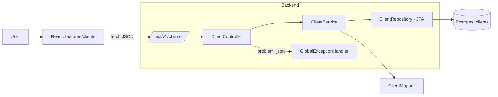
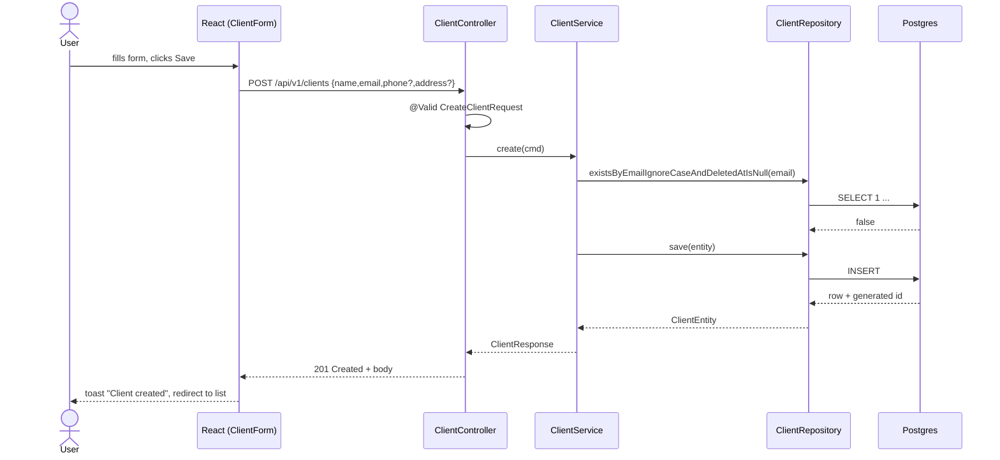
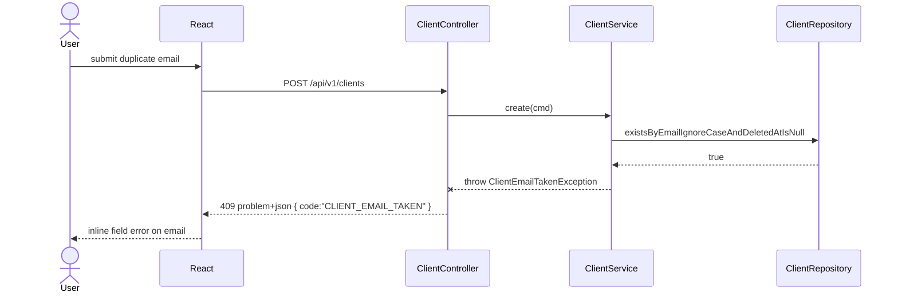

# Client management (CRUD)

## 1. Context & goal

Clients are the root billing entity in invoice-tracker — every future invoice will belong to one. This feature delivers full CRUD (create, list with search + pagination, get-by-id, update, soft-delete) over a `clients` table, exposed as `/api/v1/clients` and surfaced through a React feature slice at `frontend/src/features/clients/`. Success = an authenticated user can manage their client roster end-to-end via the UI and the API, with all quality gates green.

## 2. Acceptance criteria

- [ ] AC-1: `POST /api/v1/clients` with valid body returns `201` and a JSON body containing `id`, server-set `createdAt`, `updatedAt`.
- [ ] AC-2: `GET /api/v1/clients?query=<q>&page=<n>&size=<s>&sort=name,asc` returns a paginated list; `query` matches case-insensitive substrings of `name` or `email`.
- [ ] AC-3: `GET /api/v1/clients/{id}` returns `200` with the client, or `404` if not found / soft-deleted.
- [ ] AC-4: `PUT /api/v1/clients/{id}` updates all mutable fields and bumps `updatedAt`; returns `200`.
- [ ] AC-5: `DELETE /api/v1/clients/{id}` performs a soft delete (`deleted_at` set) and returns `204`; subsequent GET returns `404`.
- [ ] AC-6: Server validates: `name` required, 1–120 chars; `email` required, RFC-5322 shape, ≤ 254 chars; `phone` optional, ≤ 32 chars, digits/`+`/`-`/space/`(`,`)`; `address` optional, ≤ 500 chars.
- [ ] AC-7: Duplicate `email` (excluding soft-deleted rows) returns `409 Conflict` with problem-detail body `{type, title, status, detail, code: "CLIENT_EMAIL_TAKEN"}`.
- [ ] AC-8: All endpoints require authentication; unauthenticated calls return `401`.
- [ ] AC-9: React UI `/clients` page lists clients with search + pagination, has a "New client" button opening a modal form, supports edit and delete actions with confirmation, and shows toast on success/error.
- [ ] AC-10: Backend JaCoCo line + branch ≥ 95 %; frontend Vitest 95/95/95/90; Playwright happy-path spec green.
- [ ] AC-11: Postman collection contains all five client endpoints; OpenAPI spec at `/v3/api-docs` documents them with examples and error schemas.
- [ ] AC-12: Flyway migration `V1__create_clients.sql` is idempotent on a fresh DB; CI build with the `ci` profile applies it cleanly.

## 3. Architecture (mermaid)



## 4. Sequence (happy path + duplicate-email edge case)





## 5. File-by-file change list

### Backend — production

| Path | Action | Purpose |
|---|---|---|
| `backend/src/main/resources/db/migration/V1__create_clients.sql` | create | Flyway migration: `clients` table, indices, unique partial index on `(lower(email)) WHERE deleted_at IS NULL` |
| `backend/src/main/java/com/example/invoicetracker/domain/client/Client.java` | create | Domain record (id, name, email, phone, address, timestamps, deletedAt) |
| `backend/src/main/java/com/example/invoicetracker/domain/client/ClientRepository.java` | create | Domain port (interface) |
| `backend/src/main/java/com/example/invoicetracker/domain/client/ClientNotFoundException.java` | create | Domain exception |
| `backend/src/main/java/com/example/invoicetracker/domain/client/ClientEmailTakenException.java` | create | Domain exception |
| `backend/src/main/java/com/example/invoicetracker/application/client/ClientService.java` | create | Use-case: create/list/get/update/delete; transactional; enforces email uniqueness |
| `backend/src/main/java/com/example/invoicetracker/application/client/ClientCommand.java` | create | Sealed `Create`/`Update` command records |
| `backend/src/main/java/com/example/invoicetracker/adapter/persistence/client/ClientEntity.java` | create | JPA `@Entity` with Lombok `@Getter/@Setter`, `@Version` optimistic lock, `deletedAt` |
| `backend/src/main/java/com/example/invoicetracker/adapter/persistence/client/ClientJpaRepository.java` | create | `JpaRepository<ClientEntity, UUID>` with derived queries |
| `backend/src/main/java/com/example/invoicetracker/adapter/persistence/client/ClientRepositoryAdapter.java` | create | Implements `ClientRepository` port, maps entity ↔ domain |
| `backend/src/main/java/com/example/invoicetracker/adapter/persistence/client/ClientEntityMapper.java` | create | Pure mapper (no MapStruct — keep it simple) |
| `backend/src/main/java/com/example/invoicetracker/adapter/web/client/ClientController.java` | create | REST controller `/api/v1/clients`, springdoc annotations |
| `backend/src/main/java/com/example/invoicetracker/adapter/web/client/dto/CreateClientRequest.java` | create | Record + bean-validation annotations |
| `backend/src/main/java/com/example/invoicetracker/adapter/web/client/dto/UpdateClientRequest.java` | create | Record + bean-validation annotations |
| `backend/src/main/java/com/example/invoicetracker/adapter/web/client/dto/ClientResponse.java` | create | Record |
| `backend/src/main/java/com/example/invoicetracker/adapter/web/client/dto/PageResponse.java` | create | Generic pagination DTO `{content, page, size, totalElements, totalPages}` |
| `backend/src/main/java/com/example/invoicetracker/adapter/web/error/GlobalExceptionHandler.java` | create | `@RestControllerAdvice` → RFC 7807 `ProblemDetail` for 400/404/409/500 |

### Backend — tests

| Path | Action | Purpose |
|---|---|---|
| `backend/src/test/java/com/example/invoicetracker/application/client/ClientServiceTest.java` | create | Service unit tests with Mockito |
| `backend/src/test/java/com/example/invoicetracker/adapter/web/client/ClientControllerTest.java` | create | `@WebMvcTest` slice — request mapping, validation, status codes, problem-detail bodies |
| `backend/src/test/java/com/example/invoicetracker/adapter/persistence/client/ClientRepositoryAdapterIT.java` | create | `@DataJpaTest` + Testcontainers Postgres — unique index, soft-delete query, pagination |
| `backend/src/test/java/com/example/invoicetracker/adapter/web/client/ClientControllerIT.java` | create | Full-stack `@SpringBootTest` + Testcontainers — happy path + 401/404/409 |
| `backend/src/test/java/com/example/invoicetracker/adapter/web/error/GlobalExceptionHandlerTest.java` | create | Verifies problem-detail shape for each exception |

### Frontend — production

| Path | Action | Purpose |
|---|---|---|
| `frontend/src/features/clients/model/types.ts` | create | TS types: `Client`, `ClientPage`, `CreateClient`, `UpdateClient` |
| `frontend/src/features/clients/model/schema.ts` | create | Zod schemas mirroring backend validation |
| `frontend/src/features/clients/api/clientsApi.ts` | create | `listClients/getClient/createClient/updateClient/deleteClient` via `fetch` |
| `frontend/src/features/clients/api/useClients.ts` | create | Lightweight hooks: `useClients(query)`, `useClient(id)`, mutation hooks (no react-query; plain `useState/useEffect`) |
| `frontend/src/features/clients/ui/ClientsPage.tsx` | create | Page: search box, paginated table, new/edit/delete actions |
| `frontend/src/features/clients/ui/ClientTable.tsx` | create | Presentational table |
| `frontend/src/features/clients/ui/ClientForm.tsx` | create | Create/edit form with inline validation |
| `frontend/src/features/clients/ui/ClientFormModal.tsx` | create | Modal wrapper around the form |
| `frontend/src/features/clients/ui/ConfirmDeleteDialog.tsx` | create | Reusable confirm dialog (or fold into `shared/ui`) |
| `frontend/src/shared/ui/Toast.tsx` | create | Simple toast provider + hook |
| `frontend/src/shared/lib/http.ts` | create | `fetch` wrapper that injects credentials, parses problem-detail errors into `ApiError` |
| `frontend/src/pages/ClientsPage.tsx` | create | Thin page wrapper re-exporting `features/clients/ui/ClientsPage` |
| `frontend/src/app/App.tsx` | edit | Add `<Route path="/clients" element={<ClientsPage />} />` and a nav link from `HomePage` |
| `frontend/src/pages/HomePage.tsx` | edit | Link to `/clients` |

### Frontend — tests

| Path | Action | Purpose |
|---|---|---|
| `frontend/src/features/clients/api/clientsApi.test.ts` | create | MSW-backed unit tests for every API function and error path |
| `frontend/src/features/clients/model/schema.test.ts` | create | Zod schema accepts valid and rejects invalid samples |
| `frontend/src/features/clients/ui/ClientForm.test.tsx` | create | RTL: renders fields, validates, submits, surfaces server error |
| `frontend/src/features/clients/ui/ClientsPage.test.tsx` | create | RTL + MSW: list renders, search filters, create flow, delete confirmation |
| `frontend/src/shared/lib/http.test.ts` | create | Asserts problem-detail parsing + auth header behaviour |
| `frontend/tests/clients/clients.spec.ts` | create | Playwright E2E: login → create → search → edit → delete |
| `frontend/src/test-setup.ts` | edit | Register MSW server lifecycle hooks |
| `frontend/src/mocks/handlers.ts` | create | Default MSW handlers for `/api/v1/clients` |
| `frontend/src/mocks/server.ts` | create | MSW node server export |

### Cross-cutting

| Path | Action | Purpose |
|---|---|---|
| `postman/collection.json` | edit | Add `Clients/{List,Get,Create,Update,Delete}` requests with examples |
| `postman/local-dev.environment.json` | edit | Add `clientId` variable used by chained requests |
| `docs/API.md` | edit | Document client endpoints (documentation agent will refine) |
| `docs/SEQUENCE.md` | edit | Add the sequence diagrams above |
| `docs/CHANGELOG.md` | edit | Entry "Added: Client management CRUD" |

## 6. API contract

Base: `/api/v1/clients`. All endpoints require Spring Security HTTP Basic auth (existing default). Content-type `application/json` for requests/responses; errors use `application/problem+json`.

| Method | Path | Request | Success | Errors |
|---|---|---|---|---|
| POST | `/api/v1/clients` | `CreateClientRequest` | `201 Created` + `ClientResponse`, `Location: /api/v1/clients/{id}` | `400` validation, `401` unauthenticated, `409` `CLIENT_EMAIL_TAKEN` |
| GET | `/api/v1/clients?query=&page=0&size=20&sort=name,asc` | — | `200` + `PageResponse<ClientResponse>` | `400` bad pagination params, `401` |
| GET | `/api/v1/clients/{id}` | — | `200` + `ClientResponse` | `401`, `404` `CLIENT_NOT_FOUND` |
| PUT | `/api/v1/clients/{id}` | `UpdateClientRequest` | `200` + `ClientResponse` | `400`, `401`, `404`, `409` |
| DELETE | `/api/v1/clients/{id}` | — | `204 No Content` | `401`, `404` |

### Schemas

```jsonc
// CreateClientRequest
{
  "name":    "string (1..120, required)",
  "email":   "string (RFC 5322, max 254, required)",
  "phone":   "string (max 32, optional)  // regex ^[+\\-() 0-9]+$",
  "address": "string (max 500, optional)"
}

// UpdateClientRequest — same shape as Create (full replacement, PUT semantics)

// ClientResponse
{
  "id":        "uuid",
  "name":      "string",
  "email":     "string",
  "phone":     "string|null",
  "address":   "string|null",
  "createdAt": "ISO-8601 instant",
  "updatedAt": "ISO-8601 instant"
}

// PageResponse<T>
{
  "content":       [/* T */],
  "page":          0,
  "size":          20,
  "totalElements": 137,
  "totalPages":    7
}

// Problem-detail (RFC 7807)
{
  "type":   "about:blank",
  "title":  "Conflict",
  "status": 409,
  "detail": "A client with this email already exists.",
  "code":   "CLIENT_EMAIL_TAKEN",
  "instance": "/api/v1/clients"
}
```

Error codes: `VALIDATION_FAILED`, `CLIENT_NOT_FOUND`, `CLIENT_EMAIL_TAKEN`, `UNAUTHENTICATED`, `INTERNAL_ERROR`.

## 7. Data model changes

New table `clients`:

```sql
CREATE TABLE clients (
    id          UUID         PRIMARY KEY,
    name        VARCHAR(120) NOT NULL,
    email       VARCHAR(254) NOT NULL,
    phone       VARCHAR(32),
    address     VARCHAR(500),
    created_at  TIMESTAMPTZ  NOT NULL DEFAULT now(),
    updated_at  TIMESTAMPTZ  NOT NULL DEFAULT now(),
    deleted_at  TIMESTAMPTZ,
    version     BIGINT       NOT NULL DEFAULT 0,
    CONSTRAINT clients_name_not_blank CHECK (length(btrim(name)) > 0)
);

CREATE UNIQUE INDEX ux_clients_email_active
    ON clients (lower(email))
    WHERE deleted_at IS NULL;

CREATE INDEX ix_clients_name_lower ON clients (lower(name));
CREATE INDEX ix_clients_created_at ON clients (created_at DESC);
```

- Migration file: `backend/src/main/resources/db/migration/V1__create_clients.sql` (first migration in the project; sets precedent).
- JPA: `@Id UUID id = UUID.randomUUID()` generated at app side; `@Version Long version`; `@PrePersist/@PreUpdate` set timestamps.
- Soft delete enforced in repository via `deletedAt IS NULL` predicate in every query (no Hibernate `@SQLDelete`/`@Where` — explicit predicates keep query intent visible).

## 8. Test strategy

| Layer | Test name | Asserts |
|---|---|---|
| Unit (BE) | `ClientServiceTest.create_returns_persisted_client_with_timestamps` | mapper called, repo `save` invoked, returned id non-null |
| Unit (BE) | `ClientServiceTest.create_throws_when_email_already_taken` | `existsByEmail…` true → `ClientEmailTakenException` |
| Unit (BE) | `ClientServiceTest.update_throws_when_email_taken_by_other` | new email collides with a different active row |
| Unit (BE) | `ClientServiceTest.update_allows_same_email_for_same_client` | unchanged email → no conflict |
| Unit (BE) | `ClientServiceTest.delete_sets_deletedAt_and_persists` | entity has `deletedAt` after call |
| Unit (BE) | `ClientServiceTest.get_throws_when_not_found_or_deleted` | repo returns empty → `ClientNotFoundException` |
| Unit (BE) | `ClientServiceTest.list_passes_pageable_and_query_to_repo` | argument captor verifies wiring |
| Unit (BE) | `ClientControllerTest.create_returns_201_with_location` | status, header, body |
| Unit (BE) | `ClientControllerTest.create_returns_400_when_name_blank` | validation error → problem-detail with field errors |
| Unit (BE) | `ClientControllerTest.create_returns_400_when_email_invalid` | bean-validation `@Email` |
| Unit (BE) | `ClientControllerTest.create_returns_400_when_phone_pattern_invalid` | regex fails |
| Unit (BE) | `ClientControllerTest.create_returns_409_when_email_taken` | service throws → 409 problem-detail with `code` |
| Unit (BE) | `ClientControllerTest.get_returns_404_when_not_found` | maps `ClientNotFoundException` |
| Unit (BE) | `ClientControllerTest.delete_returns_204` | no body, idempotent shape |
| Unit (BE) | `ClientControllerTest.list_returns_page_envelope` | top-level keys match `PageResponse` |
| Unit (BE) | `ClientControllerTest.unauthenticated_returns_401` | with security filters enabled |
| Unit (BE) | `GlobalExceptionHandlerTest.handles_method_argument_not_valid` | aggregates field errors |
| Unit (BE) | `GlobalExceptionHandlerTest.handles_unknown_exception_as_500` | no stack trace leak |
| Integration (BE) | `ClientRepositoryAdapterIT.save_then_find_round_trip` | full CRUD against Testcontainers Postgres |
| Integration (BE) | `ClientRepositoryAdapterIT.unique_email_constraint_blocks_duplicates` | `DataIntegrityViolationException` on dup |
| Integration (BE) | `ClientRepositoryAdapterIT.soft_deleted_row_is_excluded_from_queries` | by-id and search both exclude |
| Integration (BE) | `ClientRepositoryAdapterIT.search_is_case_insensitive_on_name_and_email` | matches "Acme" for query "acm" |
| Integration (BE) | `ClientRepositoryAdapterIT.pagination_returns_expected_slice` | seed 25 rows, request page=1 size=10 |
| Integration (BE) | `ClientControllerIT.create_then_get_then_delete_round_trip` | end-to-end through HTTP |
| Integration (BE) | `ClientControllerIT.duplicate_email_returns_409` | full stack |
| Integration (BE) | `ClientControllerIT.unauthenticated_request_returns_401` | security on real filter chain |
| Unit (FE) | `clientsApi.test.ts → listClients_returns_page` | MSW returns page envelope, function parses correctly |
| Unit (FE) | `clientsApi.test.ts → createClient_throws_ApiError_on_409` | rejects with `ApiError{code:"CLIENT_EMAIL_TAKEN"}` |
| Unit (FE) | `clientsApi.test.ts → all_methods_send_credentials` | `fetch` called with `credentials:"include"` |
| Unit (FE) | `schema.test.ts → accepts_minimal_valid_payload` | only `name`+`email` |
| Unit (FE) | `schema.test.ts → rejects_long_name_invalid_email_bad_phone` | each error path covered |
| Unit (FE) | `ClientForm.test.tsx → submits_valid_data` | calls `onSubmit` with parsed payload |
| Unit (FE) | `ClientForm.test.tsx → shows_inline_errors` | Zod errors rendered next to fields |
| Unit (FE) | `ClientForm.test.tsx → maps_server_email_conflict_to_field` | `ApiError` with `CLIENT_EMAIL_TAKEN` → email field error |
| Unit (FE) | `ClientsPage.test.tsx → renders_paginated_list` | rows from mocked API present |
| Unit (FE) | `ClientsPage.test.tsx → search_updates_query_param` | typing triggers debounced refetch |
| Unit (FE) | `ClientsPage.test.tsx → create_flow_adds_row` | open modal, submit, list refreshes |
| Unit (FE) | `ClientsPage.test.tsx → delete_requires_confirmation` | cancel does nothing, confirm calls API |
| Unit (FE) | `http.test.ts → parses_problem_detail_into_ApiError` | preserves `code`, `status`, `detail` |
| E2E | `tests/clients/clients.spec.ts → user_creates_searches_edits_and_deletes_a_client` | full UI journey against running stack |

Coverage budget: every controller branch, every service branch, every UI conditional has a named test above. This is sufficient to clear the 95/95 line+branch gate without retroactive scaffolding.

## 9. Security considerations

| OWASP item | Applies? | Mitigation in this plan |
|---|---|---|
| A01 Broken Access Control | yes | All `/api/v1/clients/**` routes fall under existing `anyRequest().authenticated()`; no public exposure. (Tenant scoping is out of scope until auth is upgraded — tracked as risk.) |
| A02 Cryptographic Failures | partial | No new secrets stored. Email is PII but not cryptographically sensitive; TLS termination handled at deploy. |
| A03 Injection | yes | JPA parameter binding only; no string SQL. Search query reaches DB via Spring Data derived methods, never concatenation. |
| A04 Insecure Design | yes | RFC 7807 problem-detail, soft-delete with `deleted_at`, optimistic locking via `@Version`. |
| A05 Security Misconfiguration | yes | `springdoc` and `actuator` exposure unchanged; new endpoints inherit the existing `SecurityFilterChain`. |
| A06 Vulnerable Components | yes | No new deps beyond what `pom.xml` already pulls; OWASP Dependency-Check runs in CI. |
| A07 Identification & Auth | yes | HTTP Basic for now (per project default). 401 path explicitly tested. |
| A08 Software & Data Integrity | yes | Optimistic locking (`@Version`) prevents lost-update on concurrent edit. |
| A09 Logging & Monitoring | yes | SLF4J INFO logs on create/update/delete record `clientId` only — never name, email, phone, or address. DEBUG may log query terms. |
| A10 SSRF | n/a | No outbound HTTP from this feature. |

Additional mitigations:

- Input length caps at the DTO level (`@Size`) mirror DB column lengths to fail fast and prevent log/Postgres blow-up.
- `phone` regex prevents control characters; `address` accepts any printable Unicode but is bounded to 500 chars.
- Soft-delete avoids hard-deleting referenced rows once invoices exist (forward compatibility).

## 10. Risks & open questions

- **Multi-tenant isolation**: there is no tenant column yet, so all authenticated users see all clients. → Default: ship single-tenant; add `owner_id` and row-level filtering in the auth-upgrade feature.
- **PUT vs PATCH**: PATCH is friendlier but two endpoints doubles validation surface. → Default: PUT only (full replacement); revisit if partial-update UX is requested.
- **Pagination cap**: unbounded `size` is a DoS vector. → Default: clamp `size` to `[1, 100]` server-side; documented in OpenAPI.
- **Email canonicalisation**: store as user-entered, compare case-insensitively via `lower(email)`. → Default: do not transform on write (preserve display); enforce uniqueness on lowercase.
- **CSRF**: Spring Security defaults enable CSRF for stateful sessions. → Default: disable CSRF for `/api/v1/**` since the SPA uses HTTP Basic (stateless); document the trade-off and revisit when sessions/OIDC arrive.
- **Soft delete + unique email**: partial unique index handles re-creation after delete. → Confirmed; covered by integration test.
- **Frontend data fetching**: react-query not in deps. → Default: hand-rolled `useEffect`-based hooks; revisit only if list complexity grows.

## 11. Effort

`M` because: one new domain aggregate, five REST endpoints with validation and problem-detail, one Flyway migration with a partial unique index, a complete feature slice in the UI (page + form + modal + table + confirm dialog), MSW + Playwright wiring (none exists yet), and ~35 named tests required to clear the 95 % coverage gate. No new dependencies, no infra changes, no auth rework — that keeps it out of L territory.
