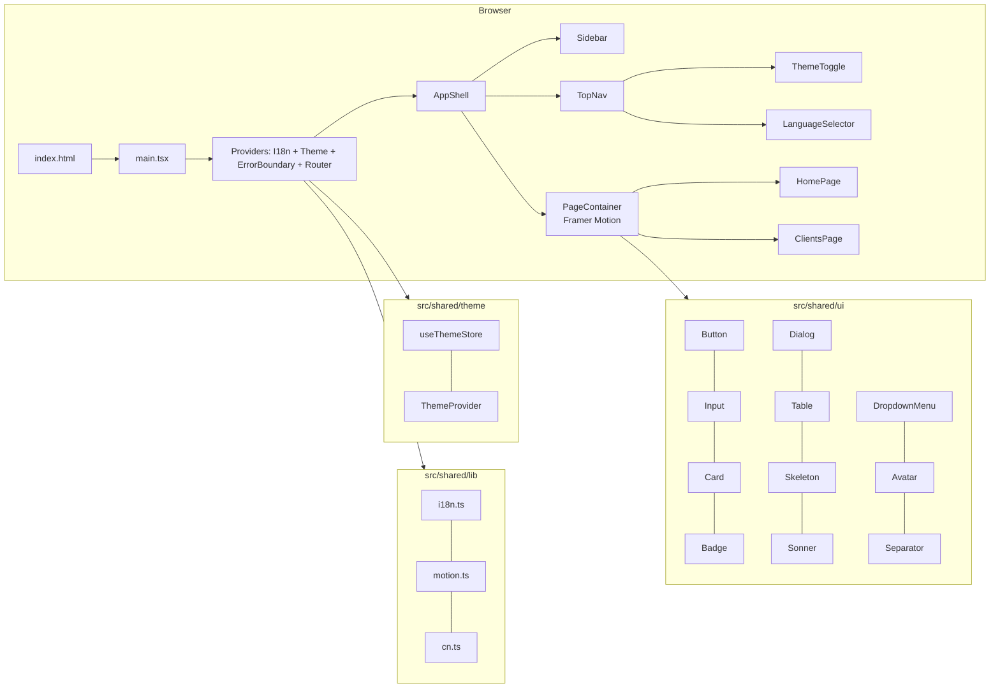
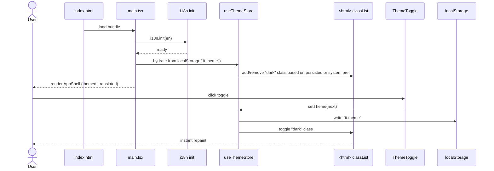
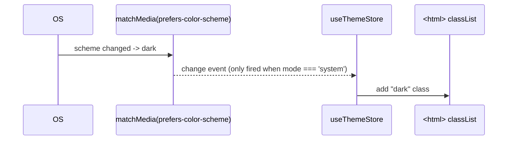

# Frontend design system foundation

## 1. Context & goal

Establish a scalable frontend design system as the foundation for full UI modernisation: Tailwind v4 CSS-first design tokens, shadcn/ui primitives, dark/light theming via Zustand, Framer Motion animation primitives, react-i18next scaffolding, and shared layout/UI components (AppShell, Sidebar, TopNav, PageHeader, PageContainer, ThemeToggle, LanguageSelector, LoadingSpinner, EmptyState, ErrorBoundary). The existing `ClientsPage` is migrated to the new shell with minimal styling adjustments (a full redesign lands in FEAT-20260512-03). Backend is untouched.

## 2. Acceptance criteria

- [ ] AC-1: `pnpm install` resolves clean; `pnpm build` exits 0; `pnpm lint` exits 0.
- [ ] AC-2: `pnpm test:run` and `pnpm test:coverage` both pass with thresholds **lines/functions/statements >= 95**, **branches >= 90** (project gate, see `vitest.config.ts`).
- [ ] AC-3: `src/index.css` defines a Tailwind v4 `@theme` block with the design tokens (colors with light + dark, radius, shadows, Inter font) and a `.dark` selector strategy for dark mode.
- [ ] AC-4: shadcn/ui CLI is initialised; the components Button, Input, Card, Badge, Dialog, Table, Skeleton, Sonner, DropdownMenu, Avatar, Separator exist under `src/shared/ui/` and pass type-check.
- [ ] AC-5: A Zustand `useThemeStore` persists theme to `localStorage` (key `it.theme`), supports `'light' | 'dark' | 'system'`, hydrates on mount, listens to `prefers-color-scheme` when in `system` mode, and toggles the `dark` class on `<html>`.
- [ ] AC-6: `ThemeToggle` cycles light -> dark -> system; rendered in the `TopNav`; keyboard accessible; announced via `aria-label`.
- [ ] AC-7: Framer Motion shared variants exist at `src/shared/lib/motion.ts` exporting `fadeIn`, `slideUp`, `staggerChildren`, `pageTransition`; consumed by `PageContainer`.
- [ ] AC-8: i18n bootstraps from `src/shared/lib/i18n.ts`; `en.json` covers all strings rendered by the new shared components and the migrated `HomePage`/`ClientsPage` headers, buttons, empty states, errors.
- [ ] AC-9: `AppShell` composes `Sidebar` + `TopNav` + outlet; mobile breakpoint collapses Sidebar to a Sheet/Dialog drawer; tablet/desktop keeps it docked. Keyboard focus traps the drawer when open and returns focus on close.
- [ ] AC-10: `ErrorBoundary` wraps the routed area and renders a localized fallback with a "Try again" action.
- [ ] AC-11: The existing `ClientsPage` renders inside the new `AppShell` and uses design tokens (replaces hard-coded `blue-600`, `slate-*` with semantic classes `bg-primary`, `text-muted-foreground`, etc.); all existing client tests still pass without behavioural regression.
- [ ] AC-12: WCAG AA: focus rings visible in both themes; no contrast ratio below 4.5 for normal text; `prefers-reduced-motion` short-circuits all motion variants.
- [ ] AC-13: `pnpm audit --audit-level=high` exits 0 after new dependencies install.

## 3. Architecture (mermaid)

## 4. Sequence (happy path — theme toggle + i18n hydrate)

Edge case — system theme follows OS change while in `system` mode:

## 5. File-by-file change list

### Config / tooling

| Path | Action | Purpose |
|---|---|---|
| `frontend/package.json` | edit | Add deps: `framer-motion`, `zustand`, `react-i18next`, `i18next`, `i18next-browser-languagedetector`, `lucide-react`, `@fontsource/inter`, `class-variance-authority`, `clsx`, `tailwind-merge`, `tailwindcss-animate`, `sonner`, `@radix-ui/react-dialog`, `@radix-ui/react-dropdown-menu`, `@radix-ui/react-avatar`, `@radix-ui/react-separator`, `@radix-ui/react-slot`. Confirm Tailwind v4 already present (it is: `tailwindcss@^4.0.0` + `@tailwindcss/vite`). Add devDep: `@types/node` (already), nothing else. |
| `frontend/components.json` | create | shadcn/ui CLI config: style `default`, RSC `false`, Tailwind v4 (no `tailwind.config.ts`), CSS file `src/index.css`, baseColor `slate`, cssVariables `true`, aliases pointing to `@/shared/ui`, `@/shared/lib/cn`, `@/shared/ui/hooks`. |
| `frontend/tsconfig.json` | edit | Add path alias `@/components/ui/*` -> `src/shared/ui/*` only if needed by shadcn generator; otherwise leave alone. |
| `frontend/vite.config.ts` | no change | Tailwind plugin already wired. |
| `frontend/index.html` | edit | Remove hard-coded `bg-slate-50 text-slate-900` from `<body>` (now driven by tokens); add `class="h-full"` to `<html>` and `<body>` for full-height shell. |
| `frontend/vitest.config.ts` | edit | Add to coverage `exclude`: `src/shared/ui/**` for vendored shadcn primitives (Button, Input, Card, Badge, Dialog, Table, Skeleton, DropdownMenu, Avatar, Separator, Sonner). Rationale: pure presentational wrappers around Radix. Hand-written components (`ThemeToggle`, `LanguageSelector`, `LoadingSpinner`, `EmptyState`, `ErrorBoundary`, AppShell, Sidebar, TopNav, PageHeader, PageContainer) stay included and tested. |

### Styles & tokens

| Path | Action | Purpose |
|---|---|---|
| `frontend/src/index.css` | edit | Replace single `@import 'tailwindcss';` with: `@import 'tailwindcss';` + `@import '@fontsource/inter/400.css';` `500/600/700` + `@plugin 'tailwindcss-animate';` + `@custom-variant dark (&:where(.dark, .dark *));` + `@theme { ... }` block defining `--font-sans: 'Inter', ui-sans-serif, system-ui, sans-serif;` `--radius: 0.5rem;` `--color-background`, `--color-foreground`, `--color-card`, `--color-card-foreground`, `--color-popover`, `--color-popover-foreground`, `--color-primary` (HSL 222 47 11 light / 210 40 98 dark), `--color-primary-foreground`, `--color-secondary`, `--color-muted`, `--color-muted-foreground`, `--color-accent`, `--color-destructive` (red 0 84 60), `--color-border`, `--color-input`, `--color-ring`, `--shadow-sm`, `--shadow-md`, `--shadow-lg`. Two scopes: `:root { ... }` for light, `.dark { ... }` for dark. Add `@media (prefers-reduced-motion: reduce) { *, ::before, ::after { animation-duration: 0.001ms !important; transition-duration: 0.001ms !important; } }`. |

### Shared lib utilities

| Path | Action | Purpose |
|---|---|---|
| `frontend/src/shared/lib/cn.ts` | create | `export function cn(...inputs: ClassValue[]) { return twMerge(clsx(inputs)); }` standard shadcn helper. |
| `frontend/src/shared/lib/cn.test.ts` | create | Test merging classes, deduplicating Tailwind conflicts, ignoring falsy values. |
| `frontend/src/shared/lib/motion.ts` | create | Export `fadeIn`, `slideUp`, `staggerChildren`, `pageTransition` as `Variants`/`Transition` objects. Each variant honours a `prefersReducedMotion()` helper that returns the no-motion form when the media query matches. |
| `frontend/src/shared/lib/motion.test.ts` | create | Snapshot the variant shapes; verify `prefersReducedMotion()` returns no-op when `matchMedia('(prefers-reduced-motion: reduce)').matches === true` (mocked). |
| `frontend/src/shared/lib/i18n.ts` | create | `i18next.use(LanguageDetector).use(initReactI18next).init({ resources: { en: { translation: en } }, fallbackLng: 'en', supportedLngs: ['en'], interpolation: { escapeValue: false }, detection: { order: ['localStorage', 'navigator'], lookupLocalStorage: 'it.lang' } });`. Export default `i18n`. |
| `frontend/src/shared/lib/i18n.test.ts` | create | Verify `t('common.appName')` resolves; verify fallback returns the key when missing; verify `i18n.changeLanguage('en')` keeps working. |
| `frontend/src/shared/locales/en.json` | create | Translation keys grouped: `common.{appName, save, cancel, delete, edit, create, search, loading, error, retry, close, confirm, yes, no, language, theme, light, dark, system}`; `nav.{home, clients, invoices, settings}`; `home.{title, subtitle, ctaClients}`; `clients.{title, newClient, searchPlaceholder, empty.title, empty.body, deleteConfirm.title, deleteConfirm.body, toast.created, toast.updated, toast.deleted, toast.deleteFailed}`; `errors.{boundary.title, boundary.body, boundary.action}`. |

### Theme

| Path | Action | Purpose |
|---|---|---|
| `frontend/src/shared/theme/themeStore.ts` | create | Zustand store with `persist` middleware: state `{ theme: 'light' | 'dark' | 'system' }`, actions `setTheme(t)`, `toggleTheme()` (cycles light->dark->system->light), selector `useResolvedTheme()` -> `'light' | 'dark'`. Side-effect: store subscribes to `matchMedia('(prefers-color-scheme: dark)')` and updates `document.documentElement.classList` on every theme change or media change. Persist key `it.theme`. |
| `frontend/src/shared/theme/themeStore.test.ts` | create | Unit tests: default is `system`; `setTheme('dark')` adds `.dark` to `<html>`; `setTheme('light')` removes it; in `system` mode follows mocked `matchMedia`; persist round-trip via mocked `localStorage`; `toggleTheme` cycles correctly. |
| `frontend/src/shared/theme/ThemeProvider.tsx` | create | Mount-only component: on first render, call `useThemeStore.getState()` to ensure hydration; attach `matchMedia` listener; clean up on unmount. Renders `children`. (Zustand makes a context unnecessary, but the provider name keeps the boundary obvious.) |
| `frontend/src/shared/theme/ThemeProvider.test.tsx` | create | Mounts, applies the persisted class on first render, removes listener on unmount. |
| `frontend/src/shared/theme/useTheme.ts` | create | `export function useTheme() { return useThemeStore((s) => ({ theme: s.theme, resolved: s.resolved, setTheme: s.setTheme, toggle: s.toggleTheme })); }`. |

### shadcn/ui vendored primitives

> Generated via `pnpm dlx shadcn@latest init` then `pnpm dlx shadcn@latest add button input card badge dialog table skeleton sonner dropdown-menu avatar separator`. Files land in `src/shared/ui/` per `components.json` aliases. Each is a thin wrapper around Radix + cva. Excluded from coverage (see `vitest.config.ts` change).

| Path | Action | Purpose |
|---|---|---|
| `frontend/src/shared/ui/button.tsx` | create | shadcn Button (variants: default, secondary, destructive, outline, ghost, link; sizes: sm, default, lg, icon). |
| `frontend/src/shared/ui/input.tsx` | create | shadcn Input. |
| `frontend/src/shared/ui/card.tsx` | create | Card + CardHeader/Title/Description/Content/Footer. |
| `frontend/src/shared/ui/badge.tsx` | create | Badge with cva variants. |
| `frontend/src/shared/ui/dialog.tsx` | create | Radix Dialog wrapper. |
| `frontend/src/shared/ui/table.tsx` | create | Table primitives. |
| `frontend/src/shared/ui/skeleton.tsx` | create | Pulse skeleton. |
| `frontend/src/shared/ui/sonner.tsx` | create | `<Toaster />` wrapper that reads theme from `useResolvedTheme()`. |
| `frontend/src/shared/ui/dropdown-menu.tsx` | create | Radix DropdownMenu wrapper. |
| `frontend/src/shared/ui/avatar.tsx` | create | Radix Avatar wrapper. |
| `frontend/src/shared/ui/separator.tsx` | create | Radix Separator wrapper. |

### Shared first-party components (hand-written, tested)

| Path | Action | Purpose |
|---|---|---|
| `frontend/src/shared/components/AppShell.tsx` | create | Layout: grid `[sidebar 240px | main]` on lg+, single column on mobile; renders `<Sidebar />`, `<TopNav />`, `<main>{children ?? <Outlet />}</main>` wrapped in `<ErrorBoundary>` and `<PageContainer>`. |
| `frontend/src/shared/components/AppShell.test.tsx` | create | Renders sidebar, topnav, outlet; collapses sidebar at mobile breakpoint (mock `matchMedia`); opens drawer on hamburger click; traps focus. |
| `frontend/src/shared/components/Sidebar.tsx` | create | Static nav using `react-router` `NavLink`; items keyed off `nav.*` i18n; highlights active route via `aria-current="page"`; supports `collapsed` and `drawer` modes. |
| `frontend/src/shared/components/Sidebar.test.tsx` | create | Renders nav items, marks active link, fires `onClose` from drawer mode. |
| `frontend/src/shared/components/TopNav.tsx` | create | Header bar: hamburger (mobile only), breadcrumb slot (children), right cluster `LanguageSelector` + `ThemeToggle` + `Avatar` (placeholder initials). |
| `frontend/src/shared/components/TopNav.test.tsx` | create | Renders controls; hamburger emits `onMenuClick`. |
| `frontend/src/shared/components/PageHeader.tsx` | create | `{ title, description?, actions? }` block; uses `text-2xl font-semibold tracking-tight` + muted description. |
| `frontend/src/shared/components/PageHeader.test.tsx` | create | Renders title, optional description, optional actions slot. |
| `frontend/src/shared/components/PageContainer.tsx` | create | Wraps `motion.main` with `pageTransition`; provides `max-w-7xl mx-auto px-4 sm:px-6 lg:px-8 py-6` layout. |
| `frontend/src/shared/components/PageContainer.test.tsx` | create | Renders children; honours reduced-motion (no animation classes when `matchMedia` mocked to reduce). |
| `frontend/src/shared/components/ThemeToggle.tsx` | create | DropdownMenu with three items (Light/Dark/System) and an icon trigger (`Sun`/`Moon`/`Monitor` from lucide). Active item shows check. |
| `frontend/src/shared/components/ThemeToggle.test.tsx` | create | Opens menu, switches theme, persists, updates `<html>` class. |
| `frontend/src/shared/components/LanguageSelector.tsx` | create | DropdownMenu stub: only `en` available; structure ready for additional locales. Reads from `i18n.languages`. |
| `frontend/src/shared/components/LanguageSelector.test.tsx` | create | Renders English, calls `i18n.changeLanguage('en')` on select. |
| `frontend/src/shared/components/LoadingSpinner.tsx` | create | Animated SVG; `aria-label={t('common.loading')}`; size prop. |
| `frontend/src/shared/components/LoadingSpinner.test.tsx` | create | Renders with role `status`, supports size. |
| `frontend/src/shared/components/EmptyState.tsx` | create | `{ icon?, title, description?, action? }`; uses `Card` and lucide icon. |
| `frontend/src/shared/components/EmptyState.test.tsx` | create | Renders title and optional slots; action callback fires. |
| `frontend/src/shared/components/ErrorBoundary.tsx` | create | Class component (`componentDidCatch`); fallback uses `EmptyState` with `errors.boundary.*` keys + Retry button (`window.location.reload()` or `resetError` prop). |
| `frontend/src/shared/components/ErrorBoundary.test.tsx` | create | Catches thrown child error, renders fallback, retry resets state. |

### Wiring & migration

| Path | Action | Purpose |
|---|---|---|
| `frontend/src/main.tsx` | edit | Import `./shared/lib/i18n` (side-effect init) before app render; wrap `<App />` with `<ThemeProvider>` and `<Suspense fallback={<LoadingSpinner />}>`. Keep `<BrowserRouter>`. |
| `frontend/src/app/App.tsx` | edit | Replace flat `<Routes>` with `<Routes><Route element={<AppShell />}>{children}</Route></Routes>` so every page renders inside the shell via `<Outlet />`. Keep `ToastProvider` for now alongside `<Toaster />` (sonner) — migration of `useToast` callers to sonner is tracked as FEAT-20260512-03 follow-up; for this feature, mount both, but new components use sonner. Add 404 route rendering `<EmptyState />`. |
| `frontend/src/app/App.test.tsx` | edit | Update to assert shell renders (find `nav`), home heading present, clients route navigable. |
| `frontend/src/pages/HomePage.tsx` | edit | Replace hard-coded `slate-*`/`blue-*` with `text-foreground`/`text-muted-foreground`/`text-primary`; wrap content in `<PageHeader>` + `<Card>`; pull strings from `t('home.*')`. Drop redundant `<main>` (provided by `PageContainer`). |
| `frontend/src/pages/HomePage.test.tsx` | edit | Match new heading text via i18n key (English); link assertion unchanged. |
| `frontend/src/features/clients/ui/ClientsPage.tsx` | edit | Token-only migration: replace `bg-blue-600` with `Button` from shared/ui; replace search `<input>` with `<Input>`; replace `text-slate-*` with `text-muted-foreground`/`text-foreground`; replace `border-slate-300` with `border-input`; drop outer `<main className="mx-auto max-w-5xl p-6">` (shell provides it); use `PageHeader` for the title row; localize visible strings (`t('clients.*')`). Behaviour and tests unchanged. |
| `frontend/src/features/clients/ui/ClientsPage.test.tsx` | edit | Update text matchers to English from `en.json` (regex still works for the same words). |
| `frontend/src/features/clients/ui/ClientFormModal.tsx` | edit | Reskin only: swap raw div modal for `<Dialog>` from shared/ui; preserve `open` / `onClose` props and `data-testid` markers. |
| `frontend/src/features/clients/ui/ClientFormModal` test (if exists) | edit | Tests of the existing modal already live in `ClientsPage.test.tsx` and `ClientForm.test.tsx` — no new test file needed. |
| `frontend/tests/smoke.spec.ts` | edit | Update Playwright smoke: assert app shell `<nav>` is present; theme toggle reachable by `aria-label`; click it and assert `<html class>` flips. |

## 6. API contract

Not applicable. This feature is frontend-only. No HTTP routes added or modified. Existing client API calls remain at `/api/v1/clients`.

## 7. Data model changes

None. No backend changes. The only "data" written by this feature is to `localStorage`:

| Key | Shape | Purpose |
|---|---|---|
| `it.theme` | `{ "state": { "theme": "light" \| "dark" \| "system" }, "version": 0 }` | Zustand-persist payload for theme preference. |
| `it.lang` | `"en"` | i18next-browser-languagedetector cache. |

## 8. Test strategy

| Layer | Test | Asserts |
|---|---|---|
| Unit (FE) | `cn.test.ts` | merges classes, drops falsy, resolves Tailwind conflicts (`p-2 p-4` -> `p-4`). |
| Unit (FE) | `motion.test.ts` | variant objects have expected keys; reduced-motion path returns zero-duration. |
| Unit (FE) | `i18n.test.ts` | `t('common.appName')` resolves; missing key falls back to key; `changeLanguage('en')` is idempotent. |
| Unit (FE) | `themeStore.test.ts` | default `system`; `setTheme('dark')` adds `.dark` class; persistence round-trip; system listener flips on `matchMedia` change; toggle cycles. |
| Unit (FE) | `ThemeProvider.test.tsx` | mounts and applies persisted class; removes listener on unmount. |
| Unit (FE) | `ThemeToggle.test.tsx` | opens dropdown, selects Dark, calls `setTheme('dark')`, store updates, `<html>` flips. |
| Unit (FE) | `LanguageSelector.test.tsx` | renders English, click invokes `i18n.changeLanguage`. |
| Unit (FE) | `LoadingSpinner.test.tsx` | role `status`, aria-label localized, size prop applied. |
| Unit (FE) | `EmptyState.test.tsx` | renders title, description, action button; click fires callback. |
| Unit (FE) | `ErrorBoundary.test.tsx` | child throws -> fallback renders; retry button resets state and re-renders children. |
| Unit (FE) | `AppShell.test.tsx` | renders sidebar, topnav, outlet; mobile collapses sidebar; hamburger opens drawer; Esc closes; focus returns to trigger. |
| Unit (FE) | `Sidebar.test.tsx` | nav items render with i18n labels; active route marked `aria-current="page"`; `onClose` fires in drawer mode. |
| Unit (FE) | `TopNav.test.tsx` | hamburger emits click; renders LanguageSelector + ThemeToggle + Avatar. |
| Unit (FE) | `PageHeader.test.tsx` | renders title; optional description and actions slots. |
| Unit (FE) | `PageContainer.test.tsx` | renders children; reduced-motion path skips animation props. |
| Unit (FE) | `HomePage.test.tsx` (updated) | welcome heading present via i18n; clients link present. |
| Unit (FE) | `App.test.tsx` (updated) | shell `<nav>` rendered; `/` shows home; `/clients` reachable. |
| Unit (FE) | `ClientsPage.test.tsx` (updated) | existing behavioural assertions pass with new components. |
| E2E | `tests/smoke.spec.ts` (updated) | app loads, sidebar visible, theme toggle flips `<html class>`, nav to /clients works. |

Coverage discipline (project gate 95/95/95/90):
- New first-party files all ship with a colocated `*.test.{ts,tsx}` exercising every branch (mode switches, presence/absence of optional props, error paths, reduced-motion path).
- Vendored shadcn primitives under `src/shared/ui/` are excluded in `vitest.config.ts` (pure presentational wrappers around Radix; same precedent as backend's `**/dto/**` exclusion).
- `src/shared/locales/en.json` is JSON (not in `*.{ts,tsx}` include) so it is naturally outside coverage.
- `src/shared/theme/ThemeProvider.tsx` and `themeStore.ts` test the `matchMedia` and `localStorage` side-effects with `vi.stubGlobal` to keep branch coverage above 90.

## 9. Security considerations

| OWASP item | Applies? | Mitigation in this plan |
|---|---|---|
| A01 Broken Access Control | no | Frontend-only feature; no new auth surfaces. |
| A02 Cryptographic Failures | no | No credentials handled. `localStorage` stores theme + locale only — non-sensitive. |
| A03 Injection | yes | i18n uses `escapeValue: false` because React already escapes; **no `dangerouslySetInnerHTML`** anywhere; `Trans` components avoided in favour of plain `t()`. Reviewer should enforce this. |
| A05 Security Misconfiguration | yes | shadcn primitives are vendored, not runtime-loaded. CSP unchanged; no inline scripts added. Inter font is bundled via `@fontsource/inter` (no third-party CDN, no privacy leak). |
| A06 Vulnerable Components | yes | `pnpm audit --audit-level=high` runs as part of the build; new deps (framer-motion, zustand, react-i18next, lucide-react, Radix) are mainstream and current. CI fails on high/critical. |
| A07 Identification & Auth | no | No auth changes. |
| A08 Software & Data Integrity | yes | All new deps installed via `pnpm` lockfile; no postinstall script bypass. |
| A09 Logging & Monitoring | n/a | Frontend; no PII logged. `ErrorBoundary` reports to console only — no remote sink in this feature. |
| A10 SSRF | no | n/a. |

Accessibility (informally a security-of-experience concern): WCAG AA contrast for both themes, visible focus ring (`--color-ring` token), keyboard navigation through sidebar/dropdowns/dialogs (Radix handles this), `aria-label` on icon-only buttons, `prefers-reduced-motion` honoured.

## 10. Risks & open questions

- **Risk**: Tailwind v4 + shadcn/ui CLI is newer territory. Some `shadcn add` templates assume `tailwind.config.ts`. **Default**: configure `components.json` with `"tailwind": { "config": "", "css": "src/index.css", "baseColor": "slate", "cssVariables": true }` (Tailwind v4 mode), and hand-port any generated file that still references `tailwind.config.ts`. If the CLI cannot generate Tailwind v4 output cleanly, the developer agent vendors the components from the upstream Tailwind v4 branch of shadcn/ui (`shadcn@canary`) — same code, just no codegen step.
- **Risk**: Coexistence of the existing `ToastProvider` and new `sonner` `<Toaster />`. **Default**: keep both during this feature so existing tests stay green; migrate all `useToast()` callers to `sonner` in FEAT-20260512-03 (clients-page redesign). Mark the legacy `Toast.tsx` `// @deprecated` in the same PR.
- **Risk**: Locale detection on first visit may flash the wrong language. **Default**: detector order `['localStorage', 'navigator']`; only `en` in `supportedLngs`, so detection is essentially a no-op until the next feature adds more locales — no FOUC.
- **Risk**: System-theme listener leaks if `ThemeProvider` unmounts (unlikely but possible in tests). **Default**: store the unsubscribe function inside the Zustand store and call it from `ThemeProvider`'s `useEffect` cleanup.
- **Open question**: Should `Sidebar` icons come from lucide or be inline SVG? **Default**: lucide — it is already added as a dep and matches the Linear/Vercel aesthetic mentioned in the request.
- **Open question**: Avatar source for the (currently unauthenticated) user? **Default**: initials placeholder (`IT`) using shadcn `Avatar` + `AvatarFallback`. Wire to a real identity in the auth feature.

## 11. Effort

`L` because: ~30 net-new files (12 vendored UI primitives + 11 first-party components + lib/theme + tests + locale + config), three existing pages/tests edited, design-token CSS authored from scratch, two new state systems (theme, i18n) introduced, plus the test coverage cost to keep the 95/95/95/90 gate green. No backend, no DB, no API design — that is what keeps it out of `XL`.
