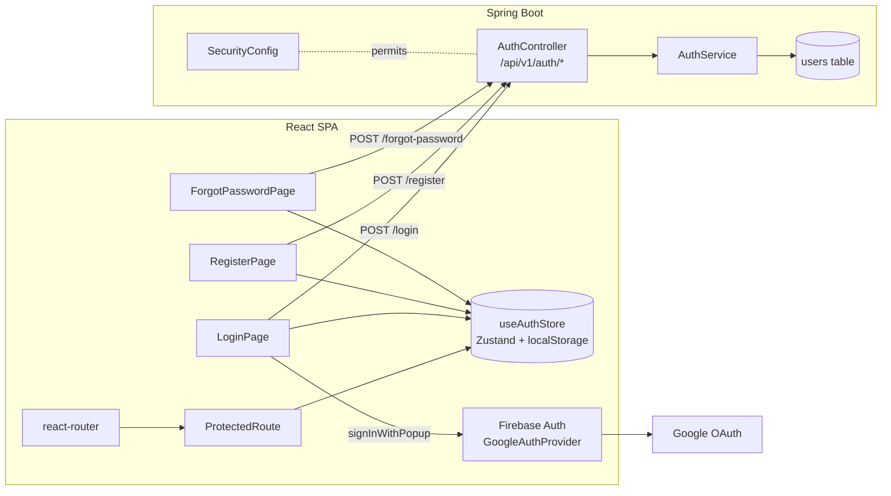
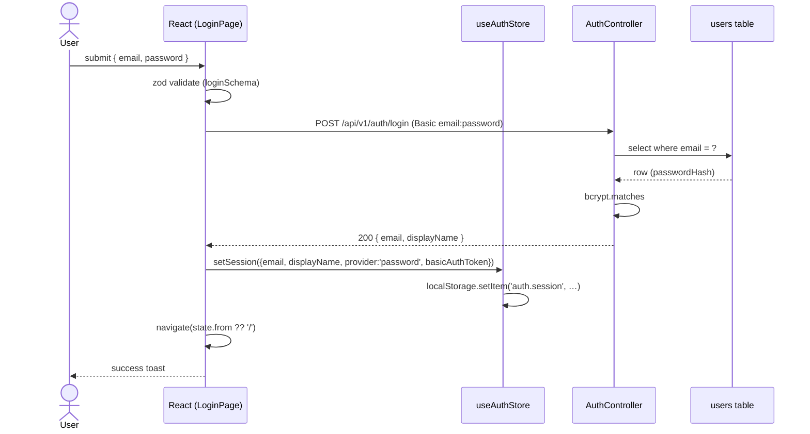
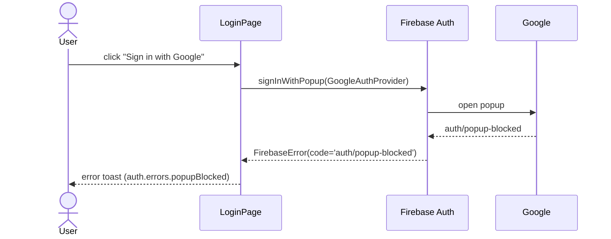

# Authentication modernization

## 1. Context & goal

The app currently has no client-side auth UX: the SPA implicitly relies on Spring Security HTTP Basic prompts. This feature introduces dedicated Login / Register / Forgot-Password pages, Firebase Google OAuth, a Zustand auth store with persisted sessions, and `ProtectedRoute` gating. Success = an unauthenticated user lands on `/login`, can sign in via email+password or Google, is then routed back to the app shell, and `localStorage` survives a reload.

This feature **depends on FEAT-20260512-01 (design system)**: shadcn/ui (`Button`, `Input`, `Card`, `Label`, `Separator`), Sonner toasts, Framer Motion primitives, `react-i18next`, `AppShell`, and the Inter/Tailwind v4 tokens are assumed to already exist under `frontend/src/shared/`.

## 2. Acceptance criteria

- [ ] AC-1: Visiting `/clients` (or any protected path) while unauthenticated redirects to `/login` and preserves the original target in `state.from`.
- [ ] AC-2: Visiting `/login`, `/register`, or `/forgot-password` while authenticated redirects to `/` (or to `state.from` if present).
- [ ] AC-3: `LoginPage` renders email + password fields, a "Sign in with Google" button, links to `/register` and `/forgot-password`, and a "Show password" toggle.
- [ ] AC-4: Submitting the email/password form calls `POST /api/v1/auth/login` with HTTP Basic credentials; on `200` the auth store stores `{ email, displayName, provider: 'password', basicAuthToken }` in memory and `localStorage`; on `401` a Sonner error toast appears with i18n key `auth.errors.invalidCredentials`.
- [ ] AC-5: Clicking the Google button calls Firebase `signInWithPopup(GoogleAuthProvider)`, on success stores `{ email, displayName, photoURL, provider: 'google', idToken }`, and redirects to `state.from || '/'`.
- [ ] AC-6: `RegisterPage` validates name, email, password (≥ 8 chars, ≥ 1 digit, ≥ 1 letter), and confirm-password match before calling `POST /api/v1/auth/register`; success redirects to `/login` with a "registration successful" toast.
- [ ] AC-7: `ForgotPasswordPage` validates email and on submit calls `POST /api/v1/auth/forgot-password`; always shows the same generic confirmation toast regardless of whether the email exists (no user enumeration).
- [ ] AC-8: All three pages use a split-panel layout (brand on the left, form on the right) on `md+` viewports and stack vertically on `<md`.
- [ ] AC-9: All page transitions on `/login` `/register` `/forgot-password` use Framer Motion fade+slide; respect `prefers-reduced-motion`.
- [ ] AC-10: All user-facing strings live under the `auth.*` namespace in `frontend/src/shared/locales/en.json` (zero hard-coded English).
- [ ] AC-11: A "Sign out" action clears the store + `localStorage` and redirects to `/login`.
- [ ] AC-12: Auth state rehydrates from `localStorage` on app boot; expired/invalid sessions are silently cleared.
- [ ] AC-13: Vitest coverage for new code meets the project gate (lines / functions / statements ≥ 95 %, branches ≥ 90 %). `auth` store, `ProtectedRoute`, `LoginPage`, `RegisterPage`, `ForgotPasswordPage`, zod schemas, and the `authApi` module each have colocated tests.
- [ ] AC-14: JaCoCo line + branch ≥ 95 % for the new `AuthController` and `AuthService`. ESLint, Prettier, Checkstyle, PMD, SpotBugs all pass.
- [ ] AC-15: The backend exposes `POST /api/v1/auth/login`, `POST /api/v1/auth/register`, `POST /api/v1/auth/forgot-password` and these three paths are added to the public-permit list in `SecurityConfig`.

## 3. Architecture (mermaid)



## 4. Sequence (happy path + edge case)

### 4a Email/password login (happy path)



### 4b Google OAuth (edge case: popup blocked)



## 5. File-by-file change list

### Frontend — create

| Path | Action | Purpose |
|---|---|---|
| `frontend/.env.example` | create | Document `VITE_FIREBASE_*` env vars |
| `frontend/src/shared/lib/firebase.ts` | create | `initializeApp` + `getAuth` singleton from `VITE_FIREBASE_*` |
| `frontend/src/shared/lib/firebase.test.ts` | create | Asserts factory throws on missing env, initialises once |
| `frontend/src/shared/locales/en.json` | edit/create | Add `auth.*` namespace (extends FEAT-01 file; create if absent) |
| `frontend/src/features/auth/model/types.ts` | create | `AuthUser`, `AuthSession`, `AuthProvider` types |
| `frontend/src/features/auth/model/schema.ts` | create | `loginSchema`, `registerSchema`, `forgotPasswordSchema` (zod) |
| `frontend/src/features/auth/model/schema.test.ts` | create | Boundary tests for each schema (valid + invalid) |
| `frontend/src/features/auth/model/useAuthStore.ts` | create | Zustand store with `user`, `status`, `login`, `loginWithGoogle`, `register`, `forgotPassword`, `logout`, `hydrate` |
| `frontend/src/features/auth/model/useAuthStore.test.ts` | create | Unit tests for every action incl. localStorage persistence |
| `frontend/src/features/auth/api/authApi.ts` | create | `loginRequest`, `registerRequest`, `forgotPasswordRequest` (fetch via `shared/lib/http`) |
| `frontend/src/features/auth/api/authApi.test.ts` | create | MSW handlers covering 200 / 401 / 409 / 5xx |
| `frontend/src/features/auth/ui/AuthSplitLayout.tsx` | create | Brand-left / form-right responsive layout + Framer Motion transition |
| `frontend/src/features/auth/ui/AuthSplitLayout.test.tsx` | create | Renders children; collapses to single column at narrow viewport |
| `frontend/src/features/auth/ui/GoogleSignInButton.tsx` | create | Button calling `signInWithPopup`; emits store updates |
| `frontend/src/features/auth/ui/GoogleSignInButton.test.tsx` | create | Mocks Firebase: success path + popup-blocked path |
| `frontend/src/features/auth/ui/PasswordField.tsx` | create | Input + show/hide toggle (shadcn `Input` + `Button`) |
| `frontend/src/features/auth/ui/PasswordField.test.tsx` | create | Toggle flips `type` attribute |
| `frontend/src/features/auth/ui/LoginForm.tsx` | create | RHF + zod form (extracted for testability) |
| `frontend/src/features/auth/ui/LoginForm.test.tsx` | create | Validation errors, submit calls store, disables during pending |
| `frontend/src/features/auth/ui/RegisterForm.tsx` | create | RHF + zod register form with confirm-password match refine |
| `frontend/src/features/auth/ui/RegisterForm.test.tsx` | create | Validation + match check + submit |
| `frontend/src/features/auth/ui/ForgotPasswordForm.tsx` | create | RHF + zod single-field form |
| `frontend/src/features/auth/ui/ForgotPasswordForm.test.tsx` | create | Validation + submit + generic success toast |
| `frontend/src/pages/LoginPage.tsx` | create | Page wrapper: `<AuthSplitLayout><LoginForm/></AuthSplitLayout>` |
| `frontend/src/pages/LoginPage.test.tsx` | create | Happy path: type → submit → store updated → redirect |
| `frontend/src/pages/RegisterPage.tsx` | create | Page wrapper |
| `frontend/src/pages/RegisterPage.test.tsx` | create | Happy path + already-registered (409) toast |
| `frontend/src/pages/ForgotPasswordPage.tsx` | create | Page wrapper |
| `frontend/src/pages/ForgotPasswordPage.test.tsx` | create | Generic confirmation regardless of email existence |
| `frontend/src/shared/ui/ProtectedRoute.tsx` | create | `<Outlet/>` wrapper; reads `useAuthStore`; `<Navigate to="/login" state={{from}}/>` |
| `frontend/src/shared/ui/ProtectedRoute.test.tsx` | create | Authenticated renders outlet; unauthenticated redirects |
| `frontend/src/shared/ui/PublicOnlyRoute.tsx` | create | Inverse of ProtectedRoute (used to bounce authed users off /login) |
| `frontend/src/shared/ui/PublicOnlyRoute.test.tsx` | create | Authenticated user gets redirected to `/` |

### Frontend — edit

| Path | Action | Purpose |
|---|---|---|
| `frontend/package.json` | edit | Add deps: `firebase ^11.0.0`, `react-hook-form ^7.53.0`, `@hookform/resolvers ^3.9.0`, `zustand ^5.0.0`. (`zod` already present, `sonner` + `framer-motion` from FEAT-01.) |
| `frontend/src/main.tsx` | edit | Call `useAuthStore.getState().hydrate()` before `createRoot` render |
| `frontend/src/app/App.tsx` | edit | Add `/login`, `/register`, `/forgot-password` wrapped in `<PublicOnlyRoute/>`; wrap existing `/`, `/clients` in `<ProtectedRoute/>`; keep `ToastProvider` (or swap to Sonner per FEAT-01) |
| `frontend/src/app/App.test.tsx` | edit | Cover new routes + redirect behaviour |
| `frontend/src/shared/lib/http.ts` | edit | Attach `Authorization: Basic <token>` header when `useAuthStore.getState().user?.basicAuthToken` is set; on `401` invoke `useAuthStore.getState().logout()` and `navigate('/login')` (via injected callback to avoid router import in module scope) |
| `frontend/src/shared/lib/http.test.ts` | edit | Adds Basic header when session present; 401 triggers logout |
| `frontend/src/mocks/handlers.ts` | edit | Add `POST /api/v1/auth/login|register|forgot-password` handlers (200 / 401 / 409) |
| `frontend/src/test-setup.ts` | edit | Stub `localStorage` reset per test; mock `firebase/auth` module globally (default to success) |
| `frontend/.gitignore` | edit | Ensure `.env`, `.env.local` ignored (likely already covered — verify) |

### Backend — create

| Path | Action | Purpose |
|---|---|---|
| `backend/src/main/java/com/example/invoicetracker/adapter/web/AuthController.java` | create | `/api/v1/auth/{login,register,forgot-password}` |
| `backend/src/main/java/com/example/invoicetracker/adapter/web/dto/LoginRequest.java` | create | record `LoginRequest(@NotBlank @Email String email, @NotBlank String password)` |
| `backend/src/main/java/com/example/invoicetracker/adapter/web/dto/LoginResponse.java` | create | record `LoginResponse(String email, String displayName)` |
| `backend/src/main/java/com/example/invoicetracker/adapter/web/dto/RegisterRequest.java` | create | record `RegisterRequest(@NotBlank String displayName, @NotBlank @Email String email, @ValidPassword String password)` |
| `backend/src/main/java/com/example/invoicetracker/adapter/web/dto/ForgotPasswordRequest.java` | create | record `ForgotPasswordRequest(@NotBlank @Email String email)` |
| `backend/src/main/java/com/example/invoicetracker/adapter/web/validation/ValidPassword.java` | create | Jakarta `@Constraint` requiring ≥ 8 chars, ≥ 1 digit, ≥ 1 letter |
| `backend/src/main/java/com/example/invoicetracker/application/AuthService.java` | create | `login`, `register`, `requestPasswordReset` use-cases |
| `backend/src/main/java/com/example/invoicetracker/domain/AppUser.java` | create | Domain record `AppUser(UUID id, String email, String displayName, String passwordHash, Instant createdAt)` |
| `backend/src/main/java/com/example/invoicetracker/domain/AppUserRepository.java` | create | Interface: `Optional<AppUser> findByEmail`, `AppUser save`, `boolean existsByEmail` |
| `backend/src/main/java/com/example/invoicetracker/adapter/persistence/AppUserEntity.java` | create | JPA entity (Lombok allowed per CLAUDE.md) |
| `backend/src/main/java/com/example/invoicetracker/adapter/persistence/AppUserJpaRepository.java` | create | Spring Data interface |
| `backend/src/main/java/com/example/invoicetracker/adapter/persistence/AppUserRepositoryAdapter.java` | create | Adapter following the `entityManager.find()` pattern |
| `backend/src/main/resources/db/migration/V3__create_app_users.sql` | create | Postgres DDL + partial unique index `ux_app_users_email_active ON app_users(lower(email))` |
| `backend/src/test/java/com/example/invoicetracker/adapter/web/AuthControllerTest.java` | create | `@SpringBootTest(webEnvironment=MOCK)` + `MockMvc` slice |
| `backend/src/test/java/com/example/invoicetracker/application/AuthServiceTest.java` | create | Pure JUnit + Mockito |
| `backend/src/test/java/com/example/invoicetracker/adapter/persistence/AppUserRepositoryAdapterIT.java` | create | Testcontainers Postgres |

### Backend — edit

| Path | Action | Purpose |
|---|---|---|
| `backend/src/main/java/com/example/invoicetracker/config/SecurityConfig.java` | edit | Permit `/api/v1/auth/**`; add `BCryptPasswordEncoder` bean; add `UserDetailsService` backed by `AppUserRepository`; keep HTTP Basic for everything else |
| `backend/src/test/java/com/example/invoicetracker/config/SecurityConfigTest.java` | create/edit | Verify auth endpoints are publicly reachable; protected endpoints still require Basic |
| `backend/pom.xml` | edit | Add `spring-boot-starter-validation` if not already present, `spring-security-crypto` for BCrypt (transitive but explicit) |
| `docs/openapi.json` | edit | Add three new auth paths (documentation agent will do this; planning-side just lists them) |
| `postman/collection.json` | edit | Add three new requests (documentation agent) |

## 6. API contract

| Method | Path | Auth | Request | Response | Errors |
|---|---|---|---|---|---|
| POST | `/api/v1/auth/login` | none (public) | `{ email: string, password: string }` | `200 { email, displayName }` + `Set-Cookie: none` (stateless) | `400` validation, `401` invalid credentials, `429` rate-limited (future) |
| POST | `/api/v1/auth/register` | none (public) | `{ displayName: string, email: string, password: string }` | `201 { email, displayName }` | `400` validation, `409` email already exists (`code=USER_EMAIL_TAKEN`) |
| POST | `/api/v1/auth/forgot-password` | none (public) | `{ email: string }` | `204 No Content` (always — anti-enumeration) | `400` invalid email format only |

All error bodies follow `application/problem+json` (existing convention from FEAT-20260511-01: `{ type, title, status, detail, code }`).

**Request schema details** (zod-equivalent):

- `loginSchema`: `email` non-empty + RFC-5322 + ≤ 254 chars, `password` ≥ 1 char (server enforces strength on register only).
- `registerSchema`: `displayName` ≥ 1 ≤ 120, `email` like above, `password` ≥ 8 with ≥ 1 letter + ≥ 1 digit, `confirmPassword` must equal `password` (zod `.refine`).
- `forgotPasswordSchema`: `email` like above.

## 7. Data model changes

**New table** `app_users`:

```sql
CREATE TABLE app_users (
    id              UUID PRIMARY KEY,
    email           TEXT NOT NULL,
    display_name    TEXT NOT NULL,
    password_hash   TEXT NOT NULL,            -- bcrypt; NULL not allowed (Google-only users use Firebase, no row needed)
    created_at      TIMESTAMPTZ NOT NULL DEFAULT now(),
    updated_at      TIMESTAMPTZ NOT NULL DEFAULT now(),
    deleted_at      TIMESTAMPTZ
);
CREATE UNIQUE INDEX ux_app_users_email_active
    ON app_users (lower(email)) WHERE deleted_at IS NULL;
CREATE INDEX ix_app_users_created_at ON app_users (created_at);
```

Migration file: `V3__create_app_users.sql` (V2 reserved for FEAT-01 if needed; verify next available version before merge).

**Frontend localStorage** key `auth.session` storing JSON:
```ts
{ email: string; displayName: string; provider: 'password' | 'google';
  basicAuthToken?: string;   // base64(email:password) — kept only in localStorage, never logged
  idToken?: string;          // Firebase ID token for Google users
  expiresAt?: number }       // ms epoch, used to drop expired Google tokens on hydrate
```

## 8. Test strategy

| Layer | Test | Asserts |
|---|---|---|
| Unit (BE) | `AuthServiceTest.login_returns_user_for_valid_credentials` | repo lookup + bcrypt match + returns DTO |
| Unit (BE) | `AuthServiceTest.login_throws_BadCredentials_on_unknown_email` | uniform 401 (no enumeration) |
| Unit (BE) | `AuthServiceTest.login_throws_BadCredentials_on_wrong_password` | bcrypt mismatch |
| Unit (BE) | `AuthServiceTest.register_persists_hashed_password` | password never stored plaintext |
| Unit (BE) | `AuthServiceTest.register_throws_Conflict_on_duplicate_email` | uniqueness guard (case-insensitive) |
| Unit (BE) | `AuthServiceTest.requestPasswordReset_is_silent_on_unknown_email` | returns void regardless |
| Unit (BE) | `AuthControllerTest.login_returns_200_with_body` | `@SpringBootTest MOCK` + MockMvc |
| Unit (BE) | `AuthControllerTest.login_returns_400_on_missing_email` | bean validation |
| Unit (BE) | `AuthControllerTest.register_returns_400_on_weak_password` | `@ValidPassword` |
| Unit (BE) | `AuthControllerTest.register_returns_409_problem_json_on_duplicate` | problem+json shape, code=USER_EMAIL_TAKEN |
| Unit (BE) | `AuthControllerTest.forgotPassword_returns_204_always` | anti-enumeration |
| Integration (BE) | `AppUserRepositoryAdapterIT.persists_and_finds_by_email` | Testcontainers Postgres, case-insensitive find |
| Integration (BE) | `AppUserRepositoryAdapterIT.partial_unique_index_blocks_duplicate_active` | DB-level uniqueness on lower(email) |
| Integration (BE) | `SecurityConfigTest.auth_endpoints_are_public` | `/api/v1/auth/login` returns 401-but-not-401-from-filter (i.e. reaches controller) |
| Integration (BE) | `SecurityConfigTest.clients_endpoint_still_requires_basic` | regression |
| Unit (FE) | `schema.test.ts` | each zod schema accepts valid + rejects each invalid boundary |
| Unit (FE) | `useAuthStore.test.ts` | `login` success/failure paths; `loginWithGoogle` success/popup-blocked; `logout` clears localStorage; `hydrate` restores; expired Google token dropped |
| Unit (FE) | `authApi.test.ts` (MSW) | 200 / 401 / 409 / 500 each surface correct `ApiError.code` |
| Unit (FE) | `LoginForm.test.tsx` | required fields, calls store, disables during pending, displays server error |
| Unit (FE) | `RegisterForm.test.tsx` | confirm-password mismatch shows error and blocks submit |
| Unit (FE) | `ForgotPasswordForm.test.tsx` | shows the same toast on success and on 404 (anti-enumeration) |
| Unit (FE) | `GoogleSignInButton.test.tsx` | mocks `firebase/auth` — success path; `auth/popup-blocked` shows toast |
| Unit (FE) | `PasswordField.test.tsx` | toggle flips input type and aria-pressed |
| Unit (FE) | `AuthSplitLayout.test.tsx` | renders children; brand panel has `md:` classes |
| Unit (FE) | `ProtectedRoute.test.tsx` | renders outlet when authed; `<Navigate to="/login" state={{from}}/>` when not |
| Unit (FE) | `PublicOnlyRoute.test.tsx` | inverse |
| Unit (FE) | `LoginPage.test.tsx` | full happy path: render → type → click → store updated → redirect; covers 401 toast |
| Unit (FE) | `RegisterPage.test.tsx` | 409 conflict toast + happy path redirect |
| Unit (FE) | `ForgotPasswordPage.test.tsx` | submit invokes API + shows generic toast |
| Unit (FE) | `App.test.tsx` (edit) | unauth user on `/clients` redirected to `/login`; authed user on `/login` redirected to `/` |
| Unit (FE) | `http.test.ts` (edit) | adds `Authorization: Basic` when session present; 401 triggers logout |
| Unit (FE) | `firebase.test.ts` | factory memoises; throws clear error when `VITE_FIREBASE_API_KEY` missing |
| E2E (Playwright) | `tests/auth/login.spec.ts` | unauthenticated visit → redirect → submit → land on `/clients` |
| E2E (Playwright) | `tests/auth/register.spec.ts` | new user can register then log in |
| E2E (Playwright) | `tests/auth/forgot-password.spec.ts` | submit shows generic toast |
| E2E (Playwright) | `tests/auth/logout.spec.ts` | logout button clears session and bounces to `/login` |

**Firebase mocking strategy**: a single `vi.mock('firebase/auth', () => ({ ... }))` setup at `src/test-setup.ts` exposes `__setSignInResult` and `__setSignInError` helpers so each test controls outcome. Real Firebase is **never** initialised in tests — `firebase.ts` reads `import.meta.env.VITE_FIREBASE_API_KEY`, which is undefined under Vitest, so a guarded factory short-circuits to the mock.

## 9. Security considerations

| OWASP Top 10 | Applies? | Mitigation in this plan |
|---|---|---|
| A01 Broken Access Control | yes | `ProtectedRoute` on client; backend Spring Security still requires Basic on `/api/v1/clients/**` regardless of FE state |
| A02 Cryptographic Failures | yes | Passwords stored as bcrypt (cost ≥ 12); `basicAuthToken` lives in `localStorage` only (documented trade-off vs httpOnly cookies) |
| A03 Injection | yes | JPA parameter binding; zod + bean validation on every request body |
| A04 Insecure Design | yes | Anti-enumeration on `/forgot-password` (always 204) and on `/login` (uniform 401 for unknown-email + wrong-password) |
| A05 Security Misconfiguration | yes | `firebase.ts` throws on missing env to prevent silent prod misconfigurations; `.env.example` lists every required key |
| A07 Identification & Auth Failures | yes | bcrypt + min-strength regex; future rate-limit hook documented (Bucket4j) |
| A08 Software & Data Integrity | yes | Firebase SDK pinned with version range `^11.0.0`; OWASP DC + `pnpm audit` already gate |
| A09 Logging & Monitoring | yes | `AuthService` logs only `email-hash` (SHA-256 trunc8), never password or token; SLF4J only |
| A10 SSRF | n/a | no outbound calls from BE |

**XSS surface**: form fields use shadcn components which render via React (no `dangerouslySetInnerHTML`); error toasts always render `String` content; CSP not introduced in this feature but tracked as future work in `docs/SECURITY.md`.

**CSRF**: SPA remains stateless HTTP-Basic; ADR-004 still holds. Documented in `docs/SECURITY.md`.

**Storage warning**: storing the Basic credentials base64 in `localStorage` is XSS-exposed. Acceptable for v1 (no existing httpOnly-cookie session machinery). Tracked as risk R-1 below.

## 10. Risks & open questions

- **R-1**: `localStorage`-stored Basic token is XSS-readable. → **Default**: accept for v1 with explicit ADR; migrate to httpOnly session cookie in a follow-up feature (`FEAT-auth-cookies`).
- **R-2**: Firebase Google login produces an ID token the backend does not verify — the SPA still authenticates to the BE via Basic. For Google-only users there is no Basic credential. → **Default**: Google login grants only client-side gating in v1; backend calls from Google-only users will get 401. Documented limitation. Follow-up: BE OIDC verifier.
- **R-3**: Password-reset email is not actually sent (no SMTP wired). → **Default**: `requestPasswordReset` logs at INFO and returns 204; an `// TODO: enqueue reset email` marker is acceptable here only because it is tracked as R-3 in `docs/FEATURES.md`; agents must not leave un-tracked TODOs.
- **R-4**: Migration version collision with FEAT-01. → **Default**: planner reserves `V3__create_app_users.sql`; developer agent re-checks `src/main/resources/db/migration/` before committing and renames if needed.
- **R-5**: Sonner provider may not yet exist if FEAT-01 lands after this. → **Default**: this feature is **blocked** until FEAT-01 merges. The developer agent must verify `import { toast } from 'sonner'` resolves before starting.
- **R-6**: `react-router` v7 vs `react-router-dom` — package.json has `react-router ^7.1.0`. → **Default**: use the new v7 API (`react-router` package, `<Navigate>`, `useNavigate`, `<Outlet>`). No `react-router-dom` dependency added.
- **R-7**: Zustand not yet a dependency. → **Default**: add `zustand ^5.0.0` (FEAT-01 already plans to introduce it for theme; if FEAT-01 adds it first this is a no-op).
- **R-8**: Vitest globals (`import.meta.env`) under jsdom. → **Default**: stub via `vi.stubEnv('VITE_FIREBASE_API_KEY', 'test')` in `test-setup.ts` when a test needs real init.

## 11. Effort

`L` — Touches both halves of the stack (new backend module + 3 new pages + protected-route plumbing + auth store + Firebase integration), plus seven new test files server-side and twenty client-side. Estimated 2 developer-days end-to-end, dominated by Firebase mocking ergonomics and bringing JaCoCo to 95 % on `AuthService` (every branch must be tested, including the silent-forgot-password path).
