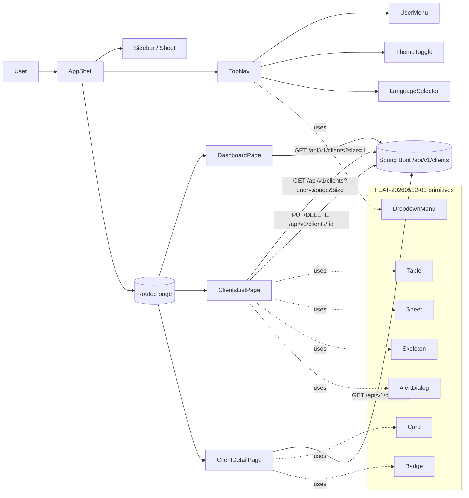
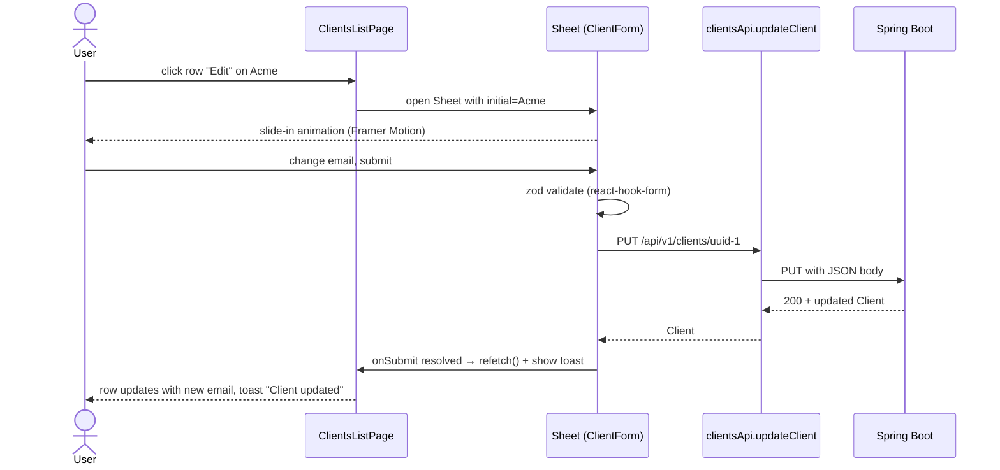
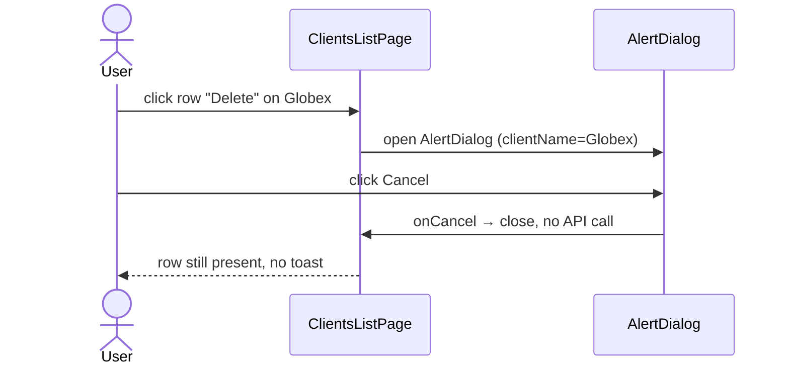

# Dashboard and core UI modernization

## 1. Context & goal

The current `HomePage` (`frontend/src/pages/HomePage.tsx`) and Clients UI (`frontend/src/features/clients/ui/ClientsPage.tsx`) are a scaffold-grade layout with raw Tailwind classes and a bespoke modal/dialog. This feature retrofits a modern SaaS shell — sidebar + topnav + dashboard + redesigned Clients module — onto the shared design system delivered by FEAT-20260512-01 and the auth layout from FEAT-20260512-02, without touching the backend.

Success: a desktop user lands on `/`, sees real-data KPI cards plus a stub activity feed, navigates via a collapsible sidebar with a logout-capable top bar, manages clients through a shadcn `Table` + slide-in `Sheet`, and the whole thing remains usable at 360 px wide.

## 2. Acceptance criteria

- [ ] AC-1: A collapsible `Sidebar` is rendered on `md+` screens with Dashboard and Clients nav items (Lucide icons, active state from `useLocation`), and an `Invoices` item present but disabled.
- [ ] AC-2: On `<md` screens the sidebar collapses into a `Sheet` drawer opened by the `TopNav` hamburger button.
- [ ] AC-3: `TopNav` renders breadcrumbs derived from the current route, a `UserMenu` (`Avatar` + `DropdownMenu` with profile placeholder + logout), `ThemeToggle`, and `LanguageSelector` — all from FEAT-20260512-01 primitives.
- [ ] AC-4: `/` renders a `Dashboard` page with three `Card` KPIs — Total Clients (real `totalElements` from `GET /api/v1/clients?size=1`), Active Clients (same call, status = `ACTIVE` once available; for now equals total), Invoices (hard-coded `0`) — plus a `RecentActivity` stub section showing a placeholder list.
- [ ] AC-5: `/clients` uses a shadcn `Table` with columns Name, Email, Phone, Status, Updated, Actions; supports server-side search (existing `query` param), a client-side status filter `DropdownMenu` (All / Active / Inactive — Active is the only mapped value today), client-side pagination across the current `ClientPage`, and row actions.
- [ ] AC-6: Row "Edit" opens a slide-in `Sheet` containing the `ClientForm` (react-hook-form + zod). "Delete" opens a confirmation `AlertDialog`. The existing `ClientFormModal` and `ConfirmDeleteDialog` are removed.
- [ ] AC-7: `/clients/:id` renders a `ClientDetailPage` (`Card` with contact info, status `Badge`, `createdAt` / `updatedAt`, Edit + Delete buttons that drive the same Sheet / AlertDialog).
- [ ] AC-8: Every async data state (list, detail, create, update, delete) renders a `Skeleton` placeholder while loading; the list shows an `EmptyState` with illustration + CTA when `totalElements === 0`.
- [ ] AC-9: Framer Motion `AnimatePresence` wraps the route outlet (fade+slide page transitions), the list rows (staggered fade-in), and the `Sheet`/`AlertDialog` open/close.
- [ ] AC-10: All user-visible strings in new code are loaded via `useTranslation` and exist as keys in `frontend/src/shared/i18n/locales/en.json` (no inline copy).
- [ ] AC-11: Layout works at 360 px (mobile drawer), 768 px (collapsed icon sidebar), and 1280 px+ (full labeled sidebar). Existing E2E `tests/smoke.spec.ts` continues to pass.
- [ ] AC-12: `pnpm test:coverage` passes with the project gate (lines 95 / functions 95 / statements 95 / branches 90 — see `frontend/vitest.config.ts:16-21`). MSW handlers in `frontend/src/mocks/handlers.ts` cover every new pathway.
- [ ] AC-13: `pnpm build` exits 0, `pnpm lint` exits 0, `pnpm audit --audit-level=high` exits 0.

## 3. Architecture (mermaid)



## 4. Sequence (happy path + edge case)

### 4a. Edit a client (happy path)



### 4b. Edge case — delete confirmation cancel



## 5. File-by-file change list

| Path | Action | Purpose |
|---|---|---|
| `frontend/src/app/App.tsx` | edit | Wrap routes with `AppShell`, register `/`, `/clients`, `/clients/:id`, wrap `<Routes>` in `AnimatePresence` keyed on `location.pathname` |
| `frontend/src/app/routes.tsx` | create | Central route map (used by App + breadcrumb mapper) |
| `frontend/src/shared/layout/AppShell.tsx` | create | Composes `Sidebar` + `TopNav` + `<Outlet/>` inside a responsive grid (sidebar collapses to drawer below `md`) |
| `frontend/src/shared/layout/AppShell.test.tsx` | create | Renders at 360px and 1280px (mock matchMedia), asserts hamburger toggles `Sheet` |
| `frontend/src/shared/layout/Sidebar.tsx` | create | Collapsible desktop sidebar; reads `useUiStore().sidebarCollapsed` (FEAT-01) — falls back to local state if store key missing |
| `frontend/src/shared/layout/Sidebar.test.tsx` | create | Active state on `/clients`, collapse toggles aria-expanded, `Invoices` item disabled |
| `frontend/src/shared/layout/MobileSidebar.tsx` | create | shadcn `Sheet` wrapper that renders the same nav items on mobile |
| `frontend/src/shared/layout/MobileSidebar.test.tsx` | create | Opens via prop, closes on nav click |
| `frontend/src/shared/layout/TopNav.tsx` | create | Hamburger (mobile), breadcrumbs, `UserMenu`, `ThemeToggle` (FEAT-01), `LanguageSelector` (FEAT-01) |
| `frontend/src/shared/layout/TopNav.test.tsx` | create | Hamburger toggles mobile sidebar, breadcrumb derives "Clients > Acme" on `/clients/uuid-1` |
| `frontend/src/shared/layout/Breadcrumbs.tsx` | create | Pure function: route → crumb list; consumes route map from `routes.tsx` |
| `frontend/src/shared/layout/Breadcrumbs.test.tsx` | create | Asserts crumbs for `/`, `/clients`, `/clients/uuid-1` (with client name resolver) |
| `frontend/src/shared/layout/UserMenu.tsx` | create | `Avatar` + `DropdownMenu` (Profile placeholder disabled item, Logout calls `useAuthStore.logout` from FEAT-02; if not present, no-op stub + console.warn) |
| `frontend/src/shared/layout/UserMenu.test.tsx` | create | Renders initials fallback, opens menu, logout click triggers stub |
| `frontend/src/shared/layout/navItems.ts` | create | `[{ key, to, icon, disabled? }]` array — single source of truth for sidebar and mobile drawer |
| `frontend/src/shared/ui/EmptyState.tsx` | create | If FEAT-01 already exports `EmptyState`, this file re-exports it; otherwise local impl: icon + title + description + optional CTA |
| `frontend/src/shared/ui/EmptyState.test.tsx` | create | Renders title, fires CTA click |
| `frontend/src/shared/ui/PageTransition.tsx` | create | Wraps children in Framer `motion.div` with fade+slide variants; used by routed pages |
| `frontend/src/shared/ui/PageTransition.test.tsx` | create | Renders children, applies correct test id |
| `frontend/src/shared/i18n/locales/en.json` | edit | Add `nav.*`, `topnav.*`, `dashboard.*`, `clients.*`, `clientDetail.*`, `common.*` keys (see API contract below) |
| `frontend/src/features/dashboard/ui/DashboardPage.tsx` | create | KPI cards + RecentActivity stub. Uses `useClients({ size: 1 })` for counts |
| `frontend/src/features/dashboard/ui/DashboardPage.test.tsx` | create | Skeleton while loading, KPI numbers render from MSW handler |
| `frontend/src/features/dashboard/ui/KpiCard.tsx` | create | shadcn `Card` + icon + value + label + delta (delta optional) |
| `frontend/src/features/dashboard/ui/KpiCard.test.tsx` | create | Renders title/value, skeleton when `loading` |
| `frontend/src/features/dashboard/ui/RecentActivity.tsx` | create | Static stub list with 3 placeholder rows |
| `frontend/src/features/dashboard/ui/RecentActivity.test.tsx` | create | Renders 3 items + heading |
| `frontend/src/features/clients/ui/ClientsPage.tsx` | edit | Replace bespoke layout with shadcn `Table`, status `DropdownMenu`, `Sheet` for create/edit, `AlertDialog` for delete, `Skeleton` rows, `EmptyState`, `AnimatePresence` on rows |
| `frontend/src/features/clients/ui/ClientsPage.test.tsx` | edit | Re-assert against new selectors: `[data-testid="clients-table"]` rows, status filter, `Sheet` open on Edit |
| `frontend/src/features/clients/ui/ClientTable.tsx` | edit | Migrate to shadcn `<Table>/<TableHeader>/<TableRow>/<TableCell>`; add `motion.tr` with `AnimatePresence` keyed on client.id |
| `frontend/src/features/clients/ui/ClientTable.test.tsx` | create | Renders columns, fires onEdit/onDelete |
| `frontend/src/features/clients/ui/ClientTableSkeleton.tsx` | create | Renders 5 `Skeleton` rows matching the column count |
| `frontend/src/features/clients/ui/ClientTableSkeleton.test.tsx` | create | Renders 5 placeholders |
| `frontend/src/features/clients/ui/ClientFormSheet.tsx` | create | shadcn `Sheet` wrapping `ClientForm`; replaces `ClientFormModal` |
| `frontend/src/features/clients/ui/ClientFormSheet.test.tsx` | create | Open + close + submit propagation |
| `frontend/src/features/clients/ui/ClientForm.tsx` | edit | Swap manual `useState`+`safeParse` for `useForm({ resolver: zodResolver(createClientSchema) })`; use shadcn `Input`, `Textarea`, `Button`, `Form` primitives |
| `frontend/src/features/clients/ui/ClientForm.test.tsx` | edit | Re-assert react-hook-form error rendering and `CLIENT_EMAIL_TAKEN` field-level error |
| `frontend/src/features/clients/ui/ConfirmDeleteDialog.tsx` | edit | Swap bespoke modal for shadcn `AlertDialog`; keep same prop signature for minimal call-site churn |
| `frontend/src/features/clients/ui/ConfirmDeleteDialog.test.tsx` | create | Renders, cancel + confirm fire callbacks |
| `frontend/src/features/clients/ui/ClientFormModal.tsx` | delete | Replaced by `ClientFormSheet` |
| `frontend/src/features/clients/ui/ClientFormModal.test.tsx` | delete | (file does not exist, but listed here for clarity — only delete if present) |
| `frontend/src/features/clients/ui/ClientDetailPage.tsx` | create | Route component for `/clients/:id`; `useClient(id)` from `useClients.ts`; `Card` layout, status `Badge`, Edit (opens `ClientFormSheet`), Delete (opens `AlertDialog`) |
| `frontend/src/features/clients/ui/ClientDetailPage.test.tsx` | create | Renders details from MSW, Edit opens Sheet, Delete + confirm navigates back to `/clients` |
| `frontend/src/features/clients/ui/ClientStatusBadge.tsx` | create | Maps client.status (or derived `ACTIVE` placeholder) to a colored `Badge` |
| `frontend/src/features/clients/ui/ClientStatusBadge.test.tsx` | create | Renders both ACTIVE and INACTIVE variants |
| `frontend/src/features/clients/model/derive.ts` | create | Pure helpers: `deriveStatus(client)`, `formatDate(iso)` — separated so they're testable without rendering |
| `frontend/src/features/clients/model/derive.test.ts` | create | Unit-tests for both helpers (ISO → locale string; missing status → ACTIVE) |
| `frontend/src/pages/HomePage.tsx` | edit | Re-export `DashboardPage` (keeps existing `/` test green by `data-testid="home-page"` on root element) |
| `frontend/src/pages/HomePage.test.tsx` | edit | Update assertions to KPI cards + activity heading |
| `frontend/src/pages/ClientsPage.tsx` | edit | No-op (already a re-export) |
| `frontend/src/pages/ClientDetailPage.tsx` | create | Re-export `@/features/clients/ui/ClientDetailPage` |
| `frontend/src/mocks/handlers.ts` | edit | Add deterministic `defaultClients` reset helper (export `resetMockClients()`); add a 10-client fixture for pagination tests; preserve existing handlers |
| `frontend/package.json` | edit | Add deps: `react-hook-form@^7.53`, `@hookform/resolvers@^3.9`, `framer-motion@^11`, `lucide-react@^0.460`, `react-i18next@^15`, `i18next@^24`. (Assumes FEAT-01 already added: `class-variance-authority`, `clsx`, `tailwind-merge`, shadcn primitives, `zustand`.) Run with `pnpm add`. |

> Notes on FEAT-01/02 dependencies: this plan assumes `@/shared/ui/Button`, `Card`, `Table`, `Sheet`, `Skeleton`, `Badge`, `DropdownMenu`, `Avatar`, `AlertDialog`, `Input`, `Textarea`, `Form`, `ThemeToggle`, `LanguageSelector` exist with shadcn-style APIs, and that `@/shared/auth/useAuthStore` exposes `logout()`. If any are missing when the dev agent starts, raise it as a blocker rather than re-implementing them here.

## 6. API contract

This is a **UI-only** feature; no backend or new HTTP endpoints. Existing endpoints (unchanged) consumed:

| Method | Path | Auth | Request | Response | Errors |
|---|---|---|---|---|---|
| GET | `/api/v1/clients?query&page&size&sort` | basic (existing) | query params | `200 ClientPage` (see `frontend/src/features/clients/model/types.ts:11-17`) | 401 |
| GET | `/api/v1/clients/{id}` | basic | path param | `200 Client` | 404 `CLIENT_NOT_FOUND`, 401 |
| POST | `/api/v1/clients` | basic | `{ name, email, phone?, address? }` | `201 Client` | 400 validation, 409 `CLIENT_EMAIL_TAKEN`, 401 |
| PUT | `/api/v1/clients/{id}` | basic | same as POST | `200 Client` | 400, 404, 409, 401 |
| DELETE | `/api/v1/clients/{id}` | basic | — | `204` | 404, 401 |

i18n key catalogue (new keys added to `en.json` — exhaustive):

```
nav.dashboard               "Dashboard"
nav.clients                 "Clients"
nav.invoices                "Invoices"
nav.invoicesComingSoon      "Coming soon"
nav.collapse                "Collapse sidebar"
nav.expand                  "Expand sidebar"
nav.openMenu                "Open navigation menu"
nav.closeMenu               "Close navigation menu"
topnav.profile              "Profile"
topnav.logout               "Log out"
topnav.userMenuLabel        "User menu"
dashboard.title             "Dashboard"
dashboard.kpi.totalClients  "Total clients"
dashboard.kpi.activeClients "Active clients"
dashboard.kpi.invoices      "Invoices"
dashboard.activity.title    "Recent activity"
dashboard.activity.empty    "Activity will appear here once you start invoicing."
clients.title               "Clients"
clients.newClient           "New client"
clients.searchPlaceholder   "Search by name or email…"
clients.statusFilter        "Status"
clients.status.all          "All"
clients.status.active       "Active"
clients.status.inactive     "Inactive"
clients.empty.title         "No clients yet"
clients.empty.description   "Create your first client to start tracking invoices."
clients.empty.cta           "Add client"
clients.column.name         "Name"
clients.column.email        "Email"
clients.column.phone        "Phone"
clients.column.status       "Status"
clients.column.updated      "Updated"
clients.column.actions      "Actions"
clients.action.edit         "Edit"
clients.action.delete       "Delete"
clients.action.view         "View"
clients.form.title.create   "New client"
clients.form.title.edit     "Edit client"
clients.form.name           "Name"
clients.form.email          "Email"
clients.form.phone          "Phone"
clients.form.address        "Address"
clients.form.required       "Required"
clients.delete.title        "Delete client"
clients.delete.description  "Are you sure you want to delete {{name}}? This action cannot be undone."
clients.toast.created       "Client created"
clients.toast.updated       "Client updated"
clients.toast.deleted       "Client deleted"
clients.toast.deleteFailed  "Failed to delete client"
clientDetail.contactInfo    "Contact information"
clientDetail.createdAt      "Created"
clientDetail.updatedAt      "Updated"
clientDetail.notFound       "Client not found"
clientDetail.backToList     "Back to clients"
common.cancel               "Cancel"
common.save                 "Save"
common.saving               "Saving…"
common.create               "Create"
common.update               "Update"
common.loading              "Loading…"
common.previous             "Previous"
common.next                 "Next"
common.page                 "Page {{page}} of {{total}}"
```

## 7. Data model changes

None. This is purely a frontend refactor; backend tables, migrations, indices, and DTOs are untouched. Schema and types in `frontend/src/features/clients/model/types.ts` remain authoritative. A derived UI-only `status: 'ACTIVE' | 'INACTIVE'` is computed locally in `derive.ts` (defaulting to `ACTIVE` until backend exposes the field) and **never sent** to the API.

## 8. Test strategy

Coverage target: project gate (lines 95 / functions 95 / statements 95 / branches 90). The plan deliberately ships a colocated `*.test.tsx` for **every** new `.tsx` file so a forgotten test does not silently sink coverage.

| Layer | Test | Asserts |
|---|---|---|
| Unit (FE) | `Sidebar.test.tsx::renders_all_nav_items_with_icons` | 3 items rendered; Invoices has `aria-disabled="true"` |
| Unit (FE) | `Sidebar.test.tsx::marks_active_route` | At `/clients`, Clients item has `aria-current="page"` |
| Unit (FE) | `Sidebar.test.tsx::collapse_toggles_aria_expanded` | Click collapse button flips `aria-expanded` and hides labels |
| Unit (FE) | `MobileSidebar.test.tsx::opens_and_closes` | Opens via `open=true`, clicking nav item invokes `onOpenChange(false)` |
| Unit (FE) | `TopNav.test.tsx::hamburger_only_visible_on_mobile` | At width 360 (matchMedia mock), hamburger present; at 1280, not |
| Unit (FE) | `TopNav.test.tsx::shows_user_menu_with_logout` | Avatar click reveals Logout; click invokes `useAuthStore.logout` mock |
| Unit (FE) | `TopNav.test.tsx::breadcrumbs_render` | At `/clients/uuid-1`, renders "Clients > Acme Corp" (with name resolver MSW) |
| Unit (FE) | `Breadcrumbs.test.tsx::root_renders_dashboard_only` | Path `/` → single crumb "Dashboard" |
| Unit (FE) | `Breadcrumbs.test.tsx::deep_path_renders_all_crumbs` | Path `/clients/uuid-1` → 3 crumbs, last not a link |
| Unit (FE) | `UserMenu.test.tsx::avatar_initials_fallback` | Renders "EV" when no avatar URL |
| Unit (FE) | `AppShell.test.tsx::renders_sidebar_on_desktop` | At 1280, `Sidebar` visible; `MobileSidebar` closed |
| Unit (FE) | `AppShell.test.tsx::renders_drawer_on_mobile` | At 360, hamburger opens `MobileSidebar` |
| Unit (FE) | `EmptyState.test.tsx::renders_with_cta` | Title + description rendered, CTA click fires |
| Unit (FE) | `PageTransition.test.tsx::renders_children` | Wraps children with `data-testid="page-transition"` |
| Unit (FE) | `KpiCard.test.tsx::renders_value_and_label` | Renders `1,234` for value=1234 |
| Unit (FE) | `KpiCard.test.tsx::shows_skeleton_when_loading` | `loading=true` → `Skeleton` rendered, no value |
| Unit (FE) | `RecentActivity.test.tsx::renders_placeholder_items` | Renders heading + 3 list items |
| Unit (FE) | `DashboardPage.test.tsx::renders_kpis_from_api` | MSW returns 2 clients → Total = 2, Active = 2, Invoices = 0 |
| Unit (FE) | `DashboardPage.test.tsx::shows_skeletons_then_data` | First render: Skeletons; after MSW resolves: numbers |
| Unit (FE) | `DashboardPage.test.tsx::shows_error_state` | MSW 500 → error region with retry button; retry refetches |
| Unit (FE) | `ClientStatusBadge.test.tsx::active_variant` | data-variant=success when status=ACTIVE |
| Unit (FE) | `ClientStatusBadge.test.tsx::inactive_variant` | data-variant=muted when status=INACTIVE |
| Unit (FE) | `derive.test.ts::deriveStatus_defaults_to_active` | Client without status → ACTIVE |
| Unit (FE) | `derive.test.ts::formatDate_handles_invalid` | Empty string → empty string; valid ISO → locale string |
| Unit (FE) | `ClientTable.test.tsx::renders_rows` | 2 clients → 2 rows, columns visible |
| Unit (FE) | `ClientTable.test.tsx::row_actions_fire_callbacks` | Edit + Delete buttons invoke props |
| Unit (FE) | `ClientTableSkeleton.test.tsx::renders_five_rows` | 5 skeleton rows with role=presentation |
| Unit (FE) | `ClientForm.test.tsx::shows_zod_errors` | Submit blank → "Required" on name + email |
| Unit (FE) | `ClientForm.test.tsx::server_email_taken_maps_to_field` | POST returns `CLIENT_EMAIL_TAKEN` → email field shows "This email is already in use" |
| Unit (FE) | `ClientForm.test.tsx::happy_path_submit` | Valid input → onSubmit called with parsed values |
| Unit (FE) | `ClientFormSheet.test.tsx::opens_and_closes` | open=true renders Sheet; clicking cancel invokes onClose |
| Unit (FE) | `ConfirmDeleteDialog.test.tsx::confirm_fires` | Confirm click invokes onConfirm; Cancel invokes onCancel |
| Unit (FE) | `ClientsPage.test.tsx::renders_skeleton_then_table` | Initial render shows skeleton, then table after MSW |
| Unit (FE) | `ClientsPage.test.tsx::search_filters_results` | Type "Acme" → MSW returns 1 → 1 row |
| Unit (FE) | `ClientsPage.test.tsx::status_filter_active_only` | All=2, Active=2, Inactive=0 (with derived status) |
| Unit (FE) | `ClientsPage.test.tsx::empty_state_shown_when_no_results` | MSW returns 0 → EmptyState visible with CTA |
| Unit (FE) | `ClientsPage.test.tsx::edit_opens_sheet` | Click Edit → Sheet visible with name prefilled |
| Unit (FE) | `ClientsPage.test.tsx::delete_confirm_removes_row` | Confirm → DELETE called → refetch → row gone |
| Unit (FE) | `ClientsPage.test.tsx::pagination_buttons` | 10-row fixture, size=5 → 2 pages, Next/Prev work |
| Unit (FE) | `ClientDetailPage.test.tsx::renders_fields` | MSW client → name/email/phone/address all visible |
| Unit (FE) | `ClientDetailPage.test.tsx::not_found_renders_friendly_message` | 404 → "Client not found" + back link |
| Unit (FE) | `ClientDetailPage.test.tsx::edit_then_save_refetches` | Edit Sheet save → refetched details visible |
| Unit (FE) | `ClientDetailPage.test.tsx::delete_navigates_back` | Confirm delete → router pushes `/clients` |
| Unit (FE) | `HomePage.test.tsx::renders_dashboard` | `/` route renders KPI cards (asserts the existing `data-testid="home-page"` selector survives the swap) |
| Unit (FE) | `App.test.tsx::renders_clients_route` | Navigate to `/clients` renders table |
| Unit (FE) | `App.test.tsx::renders_detail_route` | Navigate to `/clients/uuid-1` renders detail page |
| E2E | `tests/smoke.spec.ts` (existing) | Continues to pass: dashboard loads, sidebar nav to `/clients` works, create client through Sheet succeeds — extend the smoke spec rather than add new files to keep CI runtime flat |

MSW fixtures: extend `frontend/src/mocks/handlers.ts` with an exported `resetMockClients(initial: Client[])` helper used by each `*.test.tsx` `beforeEach` to keep tests deterministic. Add a `seedMany(n)` helper for the pagination test.

## 9. Security considerations

| OWASP item | Applies? | Mitigation in this plan |
|---|---|---|
| A01 Broken Access Control | partial | UI calls existing authenticated endpoints; protected routes from FEAT-02 wrap `AppShell`. Direct nav to `/clients/:id` while logged-out redirects to `/login` via FEAT-02 guard. No new endpoints added, so no new authz surface. |
| A02 Cryptographic Failures | no | No new secrets handled in frontend code. Auth token storage remains FEAT-02's responsibility. |
| A03 Injection | yes | All user input flows through zod schemas (`createClientSchema` in `model/schema.ts`); rendered via React (auto-escaped). No `dangerouslySetInnerHTML`, no `eval`. Search query passed as URL `searchParams` (auto-encoded), not interpolated. |
| A05 Security Misconfiguration | yes | No new env vars; reuses Vite proxy. Lint rule `eslint-plugin-react/no-danger` stays enabled. |
| A07 Identification & Auth | yes | `UserMenu` Logout invokes `useAuthStore.logout()` (FEAT-02) which is responsible for clearing session and navigating to `/login`. We do not implement our own token handling. |
| A08 Software/Data Integrity | yes | New deps pinned to caret-major versions; `pnpm audit --audit-level=high` is part of the gate. `framer-motion`, `lucide-react`, `react-i18next`, `react-hook-form`, `@hookform/resolvers` all maintained by well-known orgs (Framer/Lucide/i18next/react-hook-form). |
| A09 Logging & Monitoring | partial | Only `console.warn` on the missing-`useAuthStore` fallback. No PII, no tokens, no emails logged. |
| A10 SSRF | no | No server requests originate from this UI feature. |

Additional non-OWASP checks:
- Accessibility: every interactive element gets an `aria-label` or visible text; `AnimatePresence` is wrapped with `prefers-reduced-motion` short-circuit (motion variants degrade to no-op when user prefers reduced motion).
- All Lucide icons rendered with `aria-hidden="true"` since they accompany text labels.

## 10. Risks & open questions

- **R1 — FEAT-01 primitive shape mismatch.** Decision: dev agent must use the FEAT-01 primitives as-is. If a primitive is missing (e.g., FEAT-01 shipped no `Sheet`), the agent stops and opens a sub-issue rather than inlining a shim. Default fallback: a one-line Radix wrapper colocated in `src/shared/ui/` and a TODO comment referencing this plan.
- **R2 — FEAT-02 `useAuthStore` may not exist yet.** Decision: `UserMenu` imports `useAuthStore` from `@/shared/auth/useAuthStore` and, if the module is missing, falls back to a typed stub (`{ logout: () => console.warn('auth not wired') }`) gated behind a build-time `import.meta.env.DEV` warning. No runtime crash.
- **R3 — Backend has no `status` field on `Client`.** Decision: derive locally in `derive.ts`. Status filter "Inactive" will always return 0 today; the UI is wired so adding a real field later is a one-line change in `derive.ts`. No backend work in this feature.
- **R4 — `useClient`/`useClients` rely on `useEffect` not `react-query`.** Decision: do not introduce react-query in this feature (out of scope and risks ballooning the change). The existing hooks (`frontend/src/features/clients/api/useClients.ts:1-163`) already expose `refetch` and are sufficient.
- **R5 — Existing E2E `tests/smoke.spec.ts` uses old selectors (`data-testid="btn-new-client"`, etc.).** Decision: keep the same `data-testid` values on the new shadcn-wrapped buttons to avoid forking E2E. The test file is updated only if assertions become structurally impossible.
- **R6 — Coverage gate is 95/95/95/90 (project override).** Decision: every new `.tsx` ships a colocated test. Animation-only wrappers (`PageTransition`) get a render assertion so they don't drag coverage. `motion.*` callback branches are exercised by triggering open/close on at least one Sheet and AlertDialog test.
- **R7 — Mermaid breadcrumbs need the client name resolved asynchronously.** Decision: `Breadcrumbs` accepts an optional `resolveName` prop; `TopNav` passes a resolver that reads from a tiny in-memory cache populated by `ClientDetailPage`. While resolving, the last crumb shows the raw id.

## 11. Effort

`L` because: ~30 new files (layout + dashboard + clients redesign + tests), full Clients module refactor with API-unchanged constraint, animation polish across three surfaces, i18n migration of every existing string, and a 95 % coverage gate that is unforgiving of any forgotten branch. Estimated 1.5–2 dev-agent days end-to-end (implementation + tests + lint cleanup).
