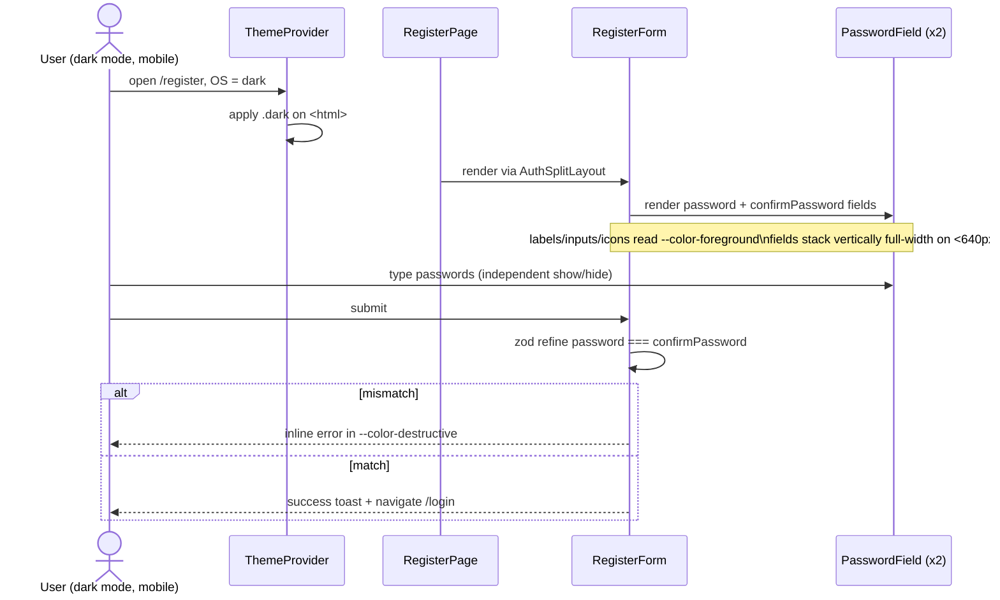

# Design system, dark-mode fixes, responsive layout, form alignment

## 1. Context & goal

The frontend has inconsistent theming (icons render black-on-dark, auth form labels render black-on-dark), a broken Register form ("Repeat Password" field misaligned/hidden), a search input that does not clear on reset, and no codified design tokens or breakpoint contract. Goal: introduce a single, documented design system layered on Tailwind v4 tokens (already in `src/index.css:10`), make every theme-sensitive surface read from those tokens, fix the four visible defects, and guarantee correct rendering across mobile (≤ 640 px), tablet (641–1023 px) and desktop (≥ 1024 px). Frontend-only — no backend or API change.

## 2. Acceptance criteria

- [ ] AC-1: In dark mode, every icon on every page (sidebar, top nav, theme toggle, password show/hide, table actions, dashboard KPI, dropdowns, language selector, empty/error states) uses `currentColor` and inherits a foreground token that meets WCAG AA contrast (≥ 4.5:1 vs. its surface). No icon has a hard-coded `text-black`, `text-gray-*`, `fill-black`, or `stroke-#000`.
- [ ] AC-2: Login, Register, and Forgot-Password forms render labels, helper text, links, headings, placeholders, divider text, and input text in dark mode using `--color-foreground` / `--color-muted-foreground` tokens — verified by Playwright reading `getComputedStyle().color` and asserting it is **not** any near-black value in dark mode.
- [ ] AC-3: Register form's "Repeat Password" (`confirmPassword`) field is visible, vertically aligned with the other fields, uses the same `PasswordField` show/hide control, occupies the same column width, and validates `password === confirmPassword` (already in `registerSchema` at `src/features/auth/model/schema.ts:29`). The eye-toggle on this field operates independently from the password field above.
- [ ] AC-4: On `/clients`, the search input clears when (a) the user presses Escape inside the input, (b) the user clicks a new `Clear` button rendered when `search.length > 0`, and (c) a `Reset` action is invoked from the filter row. After clearing, the underlying query refetches without the `query` parameter and the table reflects the unfiltered list.
- [ ] AC-5: A documented design system exists at `src/shared/theme/tokens.ts` and `docs/DESIGN_SYSTEM.md`, covering: colour tokens (light + dark HSL values), typography scale (xs/sm/base/lg/xl/2xl/3xl with line-heights), spacing scale (Tailwind defaults are adopted explicitly), radius scale, shadow scale, breakpoints (`sm 640`, `md 768`, `lg 1024`, `xl 1280`), and the five component states (default/hover/focus-visible/disabled/error). The doc names which Tailwind utility maps to each role.
- [ ] AC-6: Every primary surface (auth pages, dashboard, clients list, client detail, client form sheet, dialogs, sidebar, top nav) renders without horizontal scroll and without overflow clipping at viewport widths 360 px, 768 px and 1280 px. Asserted by Playwright snapshots of `document.documentElement.scrollWidth ≤ viewport.width`.
- [ ] AC-7: Touch targets in mobile layout are ≥ 44 × 44 px for all interactive controls (icon buttons, password toggle, hamburger, dropdown triggers, table row actions). Asserted by Playwright `boundingBox()`.
- [ ] AC-8: All raw red/grey hex/utility classes in app code (`text-red-500`, `text-red-600`, `text-red-700`, `bg-red-50`, `text-muted-foreground` literal without the var, etc.) are replaced by token-driven equivalents (`text-[var(--color-destructive)]`, `bg-[var(--color-destructive)]/10`, `text-[var(--color-muted-foreground)]`). Asserted by an ESLint rule (`no-restricted-syntax` on the offending class strings) in `eslint.config.mjs`.
- [ ] AC-9: Vitest unit coverage stays at ≥ 95/95/95/90 (per `vitest.config.ts:18`) and Playwright suites in `tests/design-system/`, `tests/auth/` and `tests/clients/` are all green.

## 3. Architecture (mermaid)

```mermaid
flowchart LR
    subgraph tokens["Design tokens (single source of truth)"]
      css[src/index.css\n@theme + :root + .dark]
      ts[src/shared/theme/tokens.ts\nexports typed token map]
      doc[docs/DESIGN_SYSTEM.md\nhuman-readable spec]
    end
    subgraph primitives["Token-bound primitives (src/shared/ui)"]
      input[Input]
      button[Button]
      icon[Icon wrapper\nnew: forces currentColor]
      label[FormLabel\nnew: muted-fg]
      fieldRow[FormField\nnew: vertical layout slot]
    end
    subgraph features["Feature surfaces"]
      auth[LoginForm / RegisterForm / ForgotPasswordForm]
      clients[ClientsPage / ClientForm / ClientTable]
      shell[AppShell / TopNav / Sidebar / ThemeToggle]
    end
    css --> ts
    ts --> primitives
    primitives --> features
    doc -.documents.-> css
    doc -.documents.-> ts
```

## 4. Sequence (happy path + edge case)



```mermaid
sequenceDiagram
    actor U as User
    participant CP as ClientsPage
    participant API as useClients hook
    U->>CP: type "acme" in search
    CP->>API: refetch with query=acme
    U->>CP: press Escape (or click Clear)
    CP->>CP: setSearch(""); setPage(0)
    CP->>API: refetch without query param
    API-->>CP: full unfiltered page
    CP-->>U: input is empty, table re-renders
```

## 5. File-by-file change list

| Path | Action | Purpose |
|---|---|---|
| `frontend/src/index.css` | edit | Add explicit dark-mode declaration of `--color-foreground` usage rules in comments; ensure `color-scheme: light dark` set on `:root`/`.dark`; widen muted-foreground in dark to hit AA. |
| `frontend/src/shared/theme/tokens.ts` | create | Typed export of `colors`, `space`, `radius`, `font`, `breakpoints`, `state` token maps consumed by primitives and docs. |
| `frontend/src/shared/theme/tokens.test.ts` | create | Snapshot-test the token map (catches accidental token rename/removal). |
| `frontend/src/shared/ui/Icon.tsx` | create | Lightweight wrapper around `lucide-react` icons that forces `text-[currentColor]` and sets `aria-hidden` by default. All sidebar / topnav / form icons route through it. |
| `frontend/src/shared/ui/Icon.test.tsx` | create | Asserts colour inheritance, `aria-hidden` default, size variants. |
| `frontend/src/shared/ui/FormLabel.tsx` | create | `<label>` primitive with `text-sm font-medium text-[var(--color-foreground)]`; supports `required`, `htmlFor`. |
| `frontend/src/shared/ui/FormLabel.test.tsx` | create | Renders text, forwards `htmlFor`, applies required asterisk. |
| `frontend/src/shared/ui/FormField.tsx` | create | Vertical wrapper: label + control + error message, fixed spacing (`space-y-1.5`), full-width. Used by every auth/client form field to enforce alignment (fixes AC-3). |
| `frontend/src/shared/ui/FormField.test.tsx` | create | Renders label+input+error, applies aria-describedby wiring. |
| `frontend/src/shared/ui/input.tsx` | edit | Add explicit `text-[var(--color-foreground)]` on the input (currently inherits — and the inherit chain breaks inside the auth split panel). Lift `bg-transparent` → `bg-[var(--color-background)]` so autofill in dark mode is not white. |
| `frontend/src/features/auth/ui/RegisterForm.tsx` | edit | Replace ad-hoc `<label>` + `<Input>` + error `<p>` triplets with `<FormField>`. Wrap confirmPassword in its own `<FormField>` so it is no longer collapsed/misaligned. Apply `text-[var(--color-foreground)]` to headings. |
| `frontend/src/features/auth/ui/LoginForm.tsx` | edit | Same conversion to `<FormField>`. Force heading + subtitle + divider text to token colours. |
| `frontend/src/features/auth/ui/ForgotPasswordForm.tsx` | edit | Same conversion. |
| `frontend/src/features/auth/ui/AuthSplitLayout.tsx` | edit | Right panel: ensure `text-[var(--color-foreground)]` set on the container so children inherit. Brand panel already uses `--color-primary-foreground`. |
| `frontend/src/features/auth/ui/PasswordField.tsx` | edit | Eye icon routed through new `<Icon>`; second instance uses an independent `useState` (already true) — verified by test. Icon colour changed from hard `--color-muted-foreground` to `currentColor` so it follows label theme. |
| `frontend/src/features/auth/ui/RegisterForm.test.tsx` | edit | New tests: confirmPassword field is visible, has independent toggle, validation triggers on mismatch. |
| `frontend/src/features/clients/ui/ClientsPage.tsx` | edit | Add `Clear` button (visible when `search.length > 0`), Escape key handler on the search input, and a `Reset filters` button in the filter row that resets `search`, `statusFilter`, and `page`. Wire `query` to omit `query` field when empty (already true) and ensure input value resets. |
| `frontend/src/features/clients/ui/ClientsPage.test.tsx` | edit | Add cases: clear button appears with text, Escape clears, Reset filters resets all three pieces of state, refetch fires with no `query` arg. |
| `frontend/src/features/clients/ui/ClientForm.tsx` | edit | Replace `text-red-*`, `bg-red-50`, `text-foreground` literals with token utilities. Convert to `<FormField>`. Add responsive widths (`w-full sm:max-w-md`). |
| `frontend/src/features/clients/ui/ClientForm.test.tsx` | edit | Update selectors after token migration. |
| `frontend/src/features/clients/ui/ClientTable.tsx` | edit | Replace `text-red-600 hover:bg-red-50 hover:text-red-600` on delete button with `text-[var(--color-destructive)] hover:bg-[var(--color-destructive)]/10`. Add horizontal scroll wrapper (`overflow-x-auto`) for mobile. |
| `frontend/src/features/clients/ui/ClientStatusBadge.tsx` | edit | Audit for hard colours; route through tokens. |
| `frontend/src/features/dashboard/ui/DashboardPage.tsx` | edit | Heading colour to `--color-foreground` (already done); KPI grid `grid-cols-1 sm:grid-cols-2 lg:grid-cols-3` for tablet step. |
| `frontend/src/features/dashboard/ui/KpiCard.tsx` | edit | Ensure icon + value colours use tokens; min-h to keep skeleton parity. |
| `frontend/src/shared/components/Sidebar.tsx` | edit | Route every icon through `<Icon>`; remove implicit black fallback by adding `text-[var(--color-foreground)]` to default item state. |
| `frontend/src/shared/components/TopNav.tsx` | edit | Same icon routing for hamburger + avatar; ensure dark mode contrast. |
| `frontend/src/shared/components/ThemeToggle.tsx` | edit | Route Sun/Moon/Monitor/Check through `<Icon>`. |
| `frontend/src/shared/components/LanguageSelector.tsx` | edit | Same. |
| `frontend/src/shared/components/AppShell.tsx` | edit | Verify `bg-[var(--color-background)]` and `text-[var(--color-foreground)]` on root; add `lg:` breakpoint comment. |
| `frontend/src/shared/components/PageContainer.tsx` | edit | Add responsive padding (`px-4 sm:px-6 lg:px-8`) and `max-w-7xl mx-auto`. |
| `frontend/src/shared/components/PageHeader.tsx` | edit | Stack title and actions vertically on mobile (`flex-col sm:flex-row`). |
| `frontend/eslint.config.mjs` | edit | Add `no-restricted-syntax` rule banning `text-red-`, `text-black`, `text-gray-`, `bg-red-`, `text-white`, `text-foreground` (literal) inside JSX `className` strings. |
| `frontend/tests/design-system/dark-mode-contrast.spec.ts` | create | Playwright: switch to dark mode on /login, /register, /forgot-password, /, /clients; for each, read computed `color` of labels, headings, icons (via `data-testid`s) and assert it is **not** a near-black colour and that it satisfies AA against the surface. |
| `frontend/tests/design-system/responsive.spec.ts` | create | Playwright matrix [375, 768, 1280] × pages: assert no horizontal scroll, drawer behaviour at < 1024, touch target sizes ≥ 44 px. |
| `frontend/tests/design-system/forms-alignment.spec.ts` | create | Visual + DOM: register form has exactly four `FormField` rows, confirmPassword is visible, both password toggles operate independently, label widths match. |
| `frontend/tests/clients/search-clear.spec.ts` | create | Playwright: type → clear button appears → click → input empty + refetch fires; Escape clears; Reset filters resets all state. |
| `docs/DESIGN_SYSTEM.md` | create | Human-readable spec; mermaid map of token → utility → component. Linked from `docs/ARCHITECTURE.md` Frontend section. |
| `docs/ARCHITECTURE.md` | edit | Add a "Design system" bullet under Frontend pointing at the new doc. |
| `docs/FEATURES.md` | edit | Append FEAT-20260513-01 row. |
| `docs/CHANGELOG.md` | edit | "Added: design system, FormField primitive, search clear. Fixed: dark-mode icon/text contrast, register confirmPassword alignment." |

## 6. API contract

No backend changes. No new endpoints. The existing `GET /api/v1/clients?query=&page=&size=` is consumed unchanged; the only behaviour shift is on the client: when `search === ""` the `query` field is omitted from the request (this is already implemented in `ClientsPage.tsx:37` — the plan only adds explicit clearing paths).

## 7. Data model changes

None.

## 8. Test strategy

| Layer | Test | Asserts |
|---|---|---|
| Unit (FE) | `src/shared/theme/tokens.test.ts` | token map shape, expected keys present, dark variants defined |
| Unit (FE) | `src/shared/ui/Icon.test.tsx` | renders child SVG, applies `aria-hidden`, size class maps, inherits `currentColor` |
| Unit (FE) | `src/shared/ui/FormLabel.test.tsx` | renders text, `htmlFor`, required asterisk |
| Unit (FE) | `src/shared/ui/FormField.test.tsx` | renders label+input+error slots, wires `aria-describedby`, applies vertical spacing |
| Unit (FE) | `src/features/auth/ui/RegisterForm.test.tsx` (extended) | confirmPassword visible, second eye-toggle independent of first, mismatch triggers `auth.errors.passwordsMustMatch`, all four fields rendered |
| Unit (FE) | `src/features/auth/ui/LoginForm.test.tsx` (extended) | labels use foreground token class, divider text uses muted-fg |
| Unit (FE) | `src/features/clients/ui/ClientsPage.test.tsx` (extended) | Clear button shows when typed, click clears `search`, Escape clears, Reset filters resets `search`+`statusFilter`+`page`, refetch called without `query` arg |
| Unit (FE) | `src/features/clients/ui/ClientForm.test.tsx` (extended) | error messages use token destructive class, no `text-red-*` survives |
| E2E | `tests/design-system/dark-mode-contrast.spec.ts` | for /login, /register, /forgot-password, /, /clients in dark mode: computed colour of labels/headings/icons is not `rgb(0,0,0)`/near-black; sample contrast ratio ≥ 4.5 |
| E2E | `tests/design-system/responsive.spec.ts` | viewport ∈ {375, 768, 1280}: no horizontal scroll on any tested route, drawer behaves (already covered in `layout.spec.ts`), touch targets ≥ 44 px |
| E2E | `tests/design-system/forms-alignment.spec.ts` | register form has four visible `data-testid="form-field"` rows; confirmPassword input is visible and has type `password` initially; two eye-toggles operate independently |
| E2E | `tests/clients/search-clear.spec.ts` | typing reveals `Clear`; clicking empties input and triggers reload; Escape clears; Reset filters resets all state |
| E2E (existing) | `tests/design-system/theme.spec.ts`, `tests/design-system/layout.spec.ts`, `tests/design-system/accessibility.spec.ts` | stay green after refactor |

Coverage target stays at the values in `vitest.config.ts:18` (95/95/95/90). New primitives (`Icon`, `FormLabel`, `FormField`) are not added to the coverage `exclude` list — they must be tested.

## 9. Security considerations

| OWASP item | Applies? | Mitigation in this plan |
|---|---|---|
| A01 Broken Access Control | no | No auth surface changed; existing `ProtectedRoute` unchanged. |
| A02 Cryptographic Failures | no | No new secrets / transports. |
| A03 Injection | yes (low) | All new strings (search clear button label, design tokens) are static literals or `t()` keys — no `dangerouslySetInnerHTML`, no `eval`. Search input keeps controlled component; clear path does not re-introduce raw HTML. |
| A05 Security Misconfiguration | yes | New ESLint rule blocks raw colour literals so a future regression cannot ship insecure-looking error states (mismatched contrast hiding warnings). |
| A07 Identification & Auth | yes | RegisterForm logic unchanged; only layout via `FormField`. PasswordField default state stays `type="password"`; show/hide remains user-initiated; `autoComplete="new-password"` preserved. |
| A09 Logging | n/a | No logging changes. |
| Accessibility (not OWASP but mandatory) | yes | Contrast assertions in `dark-mode-contrast.spec.ts`; touch targets in `responsive.spec.ts`; `aria-hidden` enforced by `Icon`; focus-visible ring kept on every interactive primitive. |

## 10. Risks & open questions

- Risk: contrast assertions in Playwright are flaky if executed before `.dark` class is applied. → **Default:** every dark-mode test waits for `await expect(page.locator('html')).toHaveClass(/dark/)` before reading computed styles.
- Risk: replacing literal `text-red-*` in `ClientForm.tsx` may break the existing `ClientForm.test.tsx` selectors. → **Default:** update the existing tests in the same PR; selectors should target `role="alert"` or testids, not Tailwind classes.
- Risk: new `Icon` wrapper duplicates `lucide-react` typing. → **Default:** keep it a thin pass-through (`<Component className={cn('text-[currentColor]', sizes[size], className)} aria-hidden={ariaHidden ?? true} />`); no type re-export.
- Open: should the design system also restyle the marketing brand panel in `AuthSplitLayout` for dark mode? → **Default:** No. The brand panel already uses `--color-primary` / `--color-primary-foreground`, which are inverted under dark mode and remain legible.
- Open: should the `Clear` button be an icon-only `X` or a text button? → **Default:** icon-only `X` (44×44 hit target), `aria-label="Clear search"`, visible when `search.length > 0`.
- Open: do we ship a Storybook? → **Default:** No. Documentation lives in `docs/DESIGN_SYSTEM.md` + tests; Storybook is out of scope.

## 11. Effort

`M` because: ~4 new primitives, ~12 component edits, 1 ESLint rule, 4 new E2E specs, 1 design-system doc — all frontend, no schema or API change, but each surface (auth, clients, dashboard, shell) must be re-audited for tokens and three breakpoints.
