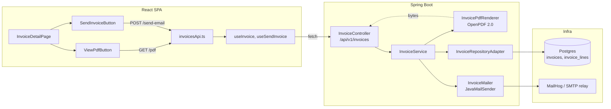
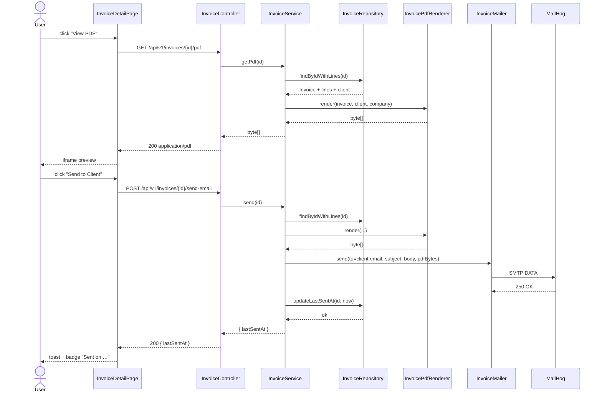

# Invoice PDF generation and email delivery to clients

## 1. Context & goal

The product is "invoice-tracker" but no `Invoice` domain exists yet — the dashboard renders `Invoices: 0` as a stub (`docs/FEATURES.md:24`) and there is no Flyway migration past `V3__create_app_users.sql`. This feature introduces (a) a minimal `Invoice` aggregate (entity + CRUD endpoints just enough to support PDF rendering and detail view), (b) a print-ready PDF generator using **OpenPDF 2.0** (BSD/LGPL, drop-in iText-5 API replacement, Apache-friendly, no commercial licence), and (c) a transactional email path using **Spring Mail (JavaMailSender)** that attaches the rendered PDF and writes `last_sent_at` on success. Success = a user opens an invoice, clicks "View PDF" to preview, clicks "Send to Client" to email it, and sees the resulting "Sent on …" timestamp on the same view.

## 2. Acceptance criteria

- [ ] AC-1: `GET /api/v1/invoices/{id}/pdf` (HTTP Basic) streams `application/pdf` (≥ 1 KB), `Content-Disposition: inline; filename="invoice-<number>.pdf"`, `Cache-Control: private, no-store`. The PDF opens in Adobe Reader and Chrome PDF viewer without warnings.
- [ ] AC-2: The PDF contains: company block (name + address from `app.company.*` config), client block (name, email, address), invoice number + issue date + due date, line-items table (description, qty, unit price, line total) with at least one row, subtotal, tax (if non-zero), total, and a footer with the issue date. Currency formatted via `BigDecimal` + locale-aware `NumberFormat` (default `en-US`, configurable via `app.invoice.locale`).
- [ ] AC-3: `POST /api/v1/invoices/{id}/send-email` (HTTP Basic) sends a multipart MIME message to the client's email with subject `Invoice #<number> from <company>` and the PDF attached as `invoice-<number>.pdf`. The endpoint returns `200 { lastSentAt: <ISO-8601> }`; on SMTP failure it returns `502 application/problem+json` with `code=EMAIL_DELIVERY_FAILED` and **does not** update `last_sent_at`.
- [ ] AC-4: After a successful send, `last_sent_at` on the `invoices` row is set to the SMTP-completion instant (UTC). The same column round-trips through `GET /api/v1/invoices/{id}`.
- [ ] AC-5: `InvoiceDetailPage` shows a "View PDF" button (opens `/api/v1/invoices/{id}/pdf` via `<iframe>` preview in a shadcn `Dialog`, with a "Open in new tab" fallback link) and a "Send to Client" button. When `lastSentAt` is non-null, the page shows a `Badge` reading `Sent on <DD MMM YYYY HH:mm>` next to the action row, localised via `react-i18next`.
- [ ] AC-6: While the email request is in-flight, the "Send to Client" button is disabled and shows a spinner; success surfaces a Sonner toast (`invoices.toast.sendSuccess`) and refetches the invoice; failure surfaces an error toast (`invoices.toast.sendFailed`) and leaves `lastSentAt` unchanged.
- [ ] AC-7: SMTP credentials are read from environment variables (`MAIL_HOST`, `MAIL_PORT`, `MAIL_USERNAME`, `MAIL_PASSWORD`, `MAIL_FROM`, `MAIL_PROTOCOL=smtp`, `MAIL_STARTTLS=true`). The `local` profile defaults to MailHog (`localhost:1025`, no auth); the `docker` profile reads `MAIL_*` env vars from `docker-compose.yml`; **no credential string is hard-coded** in either YAML or Java.
- [ ] AC-8: A new `mailhog` service is added to `docker-compose.yml` for local development and Playwright runs (`mailhog/mailhog:v1.0.1`, SMTP `:1025`, HTTP UI `:8025`).
- [ ] AC-9: Backend coverage stays ≥ 90 % line + branch (per `backend/pom.xml:24` — `<jacoco.minimum>0.90</jacoco.minimum>`); frontend coverage stays ≥ 95 / 95 / 95 / 90 (per `vitest.config.ts`). New classes are NOT added to the JaCoCo `<excludes>` list except DTOs and `*Entity` per existing convention.
- [ ] AC-10: Playwright suite `tests/invoices/pdf-and-email.spec.ts` runs end-to-end against MailHog (started by `docker-compose --profile e2e up`), proving: (1) PDF download returns `application/pdf` ≥ 1 KB, (2) clicking Send delivers a message to MailHog whose `Content-Type` includes `application/pdf` attachment named `invoice-<number>.pdf`, (3) the UI then shows "Sent on …".
- [ ] AC-11: Checkstyle, PMD, SpotBugs (`High`), OWASP Dependency-Check (`failBuildOnCVSS=7`), ESLint, `pnpm audit --audit-level=high` all pass on the produced code. Postman collection contains the three new requests. OpenAPI is regenerated.
- [ ] AC-12: No PII (client email, invoice contents) leaks into logs at INFO level; only `invoice.id`, `to.emailHash` (SHA-256 trunc 8), and the SMTP response code are logged. DEBUG may include `to.email` only when `app.logging.includePii=true` (default false).

## 3. Architecture (mermaid)



## 4. Sequence (happy path + edge case)

### 4a Happy path: render PDF + send email



### 4b Edge case: SMTP failure does not persist `last_sent_at`

```mermaid
sequenceDiagram
    actor U as User
    participant FE as InvoiceDetailPage
    participant BE as InvoiceController
    participant SVC as InvoiceService
    participant MAIL as InvoiceMailer
    participant SMTP as MailHog (down)
    U->>FE: click "Send to Client"
    FE->>BE: POST /send-email
    BE->>SVC: send(id)
    SVC->>MAIL: send(...)
    MAIL->>SMTP: SMTP connect
    SMTP-->>MAIL: connection refused
    MAIL-->>SVC: throws MailSendException
    Note over SVC: NO writes to invoices table<br/>last_sent_at unchanged
    SVC-->>BE: throws EmailDeliveryFailedException
    BE-->>FE: 502 problem+json { code: EMAIL_DELIVERY_FAILED }
    FE-->>U: error toast; lastSentAt badge unchanged
```

## 5. File-by-file change list

### Backend — create

| Path | Action | Purpose |
|---|---|---|
| `backend/src/main/java/com/example/invoicetracker/domain/invoice/Invoice.java` | create | Domain record `Invoice(UUID id, String number, UUID clientId, Instant issueDate, Instant dueDate, List<InvoiceLine> lines, BigDecimal taxRate, Instant lastSentAt, Instant createdAt, Instant updatedAt)` |
| `backend/src/main/java/com/example/invoicetracker/domain/invoice/InvoiceLine.java` | create | Record `InvoiceLine(UUID id, String description, int quantity, BigDecimal unitPrice)` with derived `lineTotal()` |
| `backend/src/main/java/com/example/invoicetracker/domain/invoice/InvoiceRepository.java` | create | Port: `Optional<Invoice> findByIdWithLines(UUID)`, `Invoice save(Invoice)`, `Invoice markSent(UUID, Instant)`, `Page<Invoice> findAll(UUID clientId, Pageable)` |
| `backend/src/main/java/com/example/invoicetracker/domain/invoice/InvoiceNotFoundException.java` | create | Thrown when id absent; mapped to 404 in `GlobalExceptionHandler` |
| `backend/src/main/java/com/example/invoicetracker/domain/invoice/EmailDeliveryFailedException.java` | create | Thrown when JavaMailSender raises `MailSendException`; mapped to 502 |
| `backend/src/main/java/com/example/invoicetracker/application/invoice/InvoiceService.java` | create | Use-cases: `create`, `get`, `list`, `renderPdf`, `sendEmail` (composes renderer + mailer + repo). `@Transactional` on writes, `readOnly=true` on `get/list/renderPdf` |
| `backend/src/main/java/com/example/invoicetracker/application/invoice/InvoicePdfRenderer.java` | create | Port + default `OpenPdfInvoiceRenderer` impl: builds an OpenPDF `Document` (A4, 36 pt margins), draws header/client/lines/totals; returns `byte[]`. Uses `BigDecimal.setScale(2, HALF_EVEN)` for money. |
| `backend/src/main/java/com/example/invoicetracker/application/invoice/InvoiceMailer.java` | create | Port + default `JavaMailInvoiceMailer` impl: builds `MimeMessage` via `MimeMessageHelper`, attaches PDF bytes, reads `app.company.name`, `app.mail.from`, `app.mail.subject` from `MailProperties`. Logs `to.emailHash`, never the email. |
| `backend/src/main/java/com/example/invoicetracker/application/invoice/MailProperties.java` | create | `@ConfigurationProperties("app.mail")` record: `String from`, `String subjectTemplate`, `String bodyTemplate` (Mustache-lite `{{number}}`, `{{company}}`) |
| `backend/src/main/java/com/example/invoicetracker/application/invoice/CompanyProperties.java` | create | `@ConfigurationProperties("app.company")` record: `String name`, `String address`, `String email`, `String taxId` |
| `backend/src/main/java/com/example/invoicetracker/adapter/web/invoice/InvoiceController.java` | create | `@RestController @RequestMapping("/api/v1/invoices")`: `POST /`, `GET /`, `GET /{id}`, `GET /{id}/pdf` (produces `application/pdf`), `POST /{id}/send-email` |
| `backend/src/main/java/com/example/invoicetracker/adapter/web/invoice/dto/CreateInvoiceRequest.java` | create | record with `@NotBlank number`, `@NotNull clientId`, `@NotNull issueDate`, `@NotNull dueDate`, `@NotEmpty List<LineDto>`, `@DecimalMin("0") taxRate` |
| `backend/src/main/java/com/example/invoicetracker/adapter/web/invoice/dto/InvoiceResponse.java` | create | record with `id`, `number`, `clientId`, `issueDate`, `dueDate`, `lines`, `taxRate`, `subtotal`, `total`, `lastSentAt`, `createdAt`, `updatedAt` |
| `backend/src/main/java/com/example/invoicetracker/adapter/web/invoice/dto/InvoiceLineDto.java` | create | record `(UUID id, String description, int quantity, BigDecimal unitPrice, BigDecimal lineTotal)` |
| `backend/src/main/java/com/example/invoicetracker/adapter/web/invoice/dto/SendEmailResponse.java` | create | record `(Instant lastSentAt)` |
| `backend/src/main/java/com/example/invoicetracker/adapter/persistence/invoice/InvoiceEntity.java` | create | JPA entity `@Table(name="invoices")`; Lombok allowed; `@OneToMany` to `InvoiceLineEntity` with `cascade=ALL, orphanRemoval=true`, `fetch=LAZY` |
| `backend/src/main/java/com/example/invoicetracker/adapter/persistence/invoice/InvoiceLineEntity.java` | create | JPA entity `@Table(name="invoice_lines")` |
| `backend/src/main/java/com/example/invoicetracker/adapter/persistence/invoice/InvoiceJpaRepository.java` | create | Spring Data interface with `@EntityGraph(attributePaths="lines") Optional<InvoiceEntity> findById(UUID)` and `@Modifying @Query("update InvoiceEntity i set i.lastSentAt = :ts where i.id = :id") int updateLastSentAt(UUID, Instant)` |
| `backend/src/main/java/com/example/invoicetracker/adapter/persistence/invoice/InvoiceRepositoryAdapter.java` | create | Maps entity ↔ domain; follows the `entityManager.find()` pre-merge pattern from `ClientRepositoryAdapter.java:1` |
| `backend/src/main/java/com/example/invoicetracker/adapter/persistence/invoice/InvoiceEntityMapper.java` | create | Pure field-copy (excluded from JaCoCo gate, per existing convention in `backend/pom.xml:222`) |
| `backend/src/main/resources/db/migration/V4__create_invoices.sql` | create | DDL for `invoices` + `invoice_lines` + indices (see §7) |
| `backend/src/main/resources/templates/email/invoice-body.txt` | create | Plain-text email body template (variables `{{number}}`, `{{company}}`, `{{clientName}}`, `{{total}}`, `{{dueDate}}`) |

### Backend — edit

| Path | Action | Purpose |
|---|---|---|
| `backend/pom.xml` | edit | Add `<dependency>org.springframework.boot:spring-boot-starter-mail</dependency>`, `<dependency>com.github.librepdf:openpdf:2.0.3</dependency>`, test deps `com.icegreen:greenmail-junit5:2.1.0` (test scope) and `com.icegreen:greenmail-spring:2.1.0` (test scope). Update JaCoCo `<excludes>` to add `**/adapter/persistence/invoice/InvoiceEntity*`, `**/adapter/persistence/invoice/InvoiceLineEntity*`, `**/adapter/persistence/invoice/InvoiceRepositoryAdapter*`, `**/adapter/persistence/invoice/InvoiceEntityMapper*` (DTO + entity + pure-delegation exclusion per existing pattern in `backend/pom.xml:213`). |
| `backend/src/main/resources/application.yml` | edit | Add `spring.mail.host`, `spring.mail.port`, `spring.mail.username`, `spring.mail.password`, `spring.mail.properties.mail.smtp.starttls.enable`, `spring.mail.properties.mail.smtp.auth` keyed on env vars. Add `app.company.*`, `app.mail.from`, `app.mail.subject-template`, `app.invoice.locale` under each profile. `local` profile points at `localhost:1025` (MailHog) with no auth and `starttls=false`. `docker` profile reads `${MAIL_*}`. `ci` profile reads from env. |
| `backend/src/main/java/com/example/invoicetracker/config/SecurityConfig.java` | edit | No change to permit-list — `/api/v1/invoices/**` requires Basic auth (already covered by `.anyRequest().authenticated()`). |
| `backend/src/main/java/com/example/invoicetracker/adapter/web/error/GlobalExceptionHandler.java` | edit | Add handlers: `InvoiceNotFoundException` → 404 (`code=INVOICE_NOT_FOUND`); `EmailDeliveryFailedException` → 502 (`code=EMAIL_DELIVERY_FAILED`); follow problem+json shape from `FEAT-20260511-01`. |
| `backend/checkstyle-suppressions.xml` | edit (if present) | No new suppressions expected. |

### Backend — tests (create)

| Path | Action | Purpose |
|---|---|---|
| `backend/src/test/java/com/example/invoicetracker/application/invoice/InvoiceServiceTest.java` | create | Mockito tests for `create`, `get`, `renderPdf`, `sendEmail` happy + `MailSendException` paths |
| `backend/src/test/java/com/example/invoicetracker/application/invoice/OpenPdfInvoiceRendererTest.java` | create | Renders a fixture invoice and asserts the resulting `byte[]` starts with `%PDF-`, parses via PDFBox (test-scope) and contains expected substrings (`invoice number`, `client name`, total) |
| `backend/src/test/java/com/example/invoicetracker/application/invoice/JavaMailInvoiceMailerTest.java` | create | GreenMail-junit5: asserts MIME message has correct subject, recipient, attachment filename, attachment content-type `application/pdf`, body contains rendered template |
| `backend/src/test/java/com/example/invoicetracker/adapter/web/invoice/InvoiceControllerTest.java` | create | `@SpringBootTest(webEnvironment=MOCK)` + MockMvc + `@MockitoBean InvoiceService`; verifies routing, 404 mapping, 502 mapping, `Content-Disposition` for PDF |
| `backend/src/test/java/com/example/invoicetracker/adapter/web/invoice/InvoiceControllerIT.java` | create | `@SpringBootTest(webEnvironment=RANDOM_PORT)` + Testcontainers Postgres + GreenMail; full POST → GET → PDF → send → assert MailHog mailbox |
| `backend/src/test/java/com/example/invoicetracker/adapter/persistence/invoice/InvoiceRepositoryAdapterIT.java` | create | Testcontainers Postgres: save invoice with 3 lines, update `lastSentAt`, soft-delete cascade |
| `backend/src/test/resources/application-test.yml` | edit (or create) | Override `spring.mail.host=localhost`, `spring.mail.port=<dynamic from GreenMail>` via `@DynamicPropertySource` in each IT |
| `backend/owasp-suppressions.xml` | edit | If OWASP DC flags OpenPDF transitive (BouncyCastle), add a single suppression with comment + CVE rationale; otherwise no change |

### Backend — Testcontainers + GreenMail helper

| Path | Action | Purpose |
|---|---|---|
| `backend/src/test/java/com/example/invoicetracker/support/GreenMailTestSupport.java` | create | Reusable `@RegisterExtension` for SMTP on a random port; exposes `getReceivedMessages()` |
| `backend/src/test/java/com/example/invoicetracker/support/InvoiceFixtures.java` | create | Builders for `Invoice`, `InvoiceLine`, `Client` used by every test |

### Frontend — create

| Path | Action | Purpose |
|---|---|---|
| `frontend/src/features/invoices/model/types.ts` | create | TS types: `Invoice`, `InvoiceLine`, `SendEmailResponse` mirroring backend DTOs |
| `frontend/src/features/invoices/model/schema.ts` | create | zod schemas (parses ISO dates → `Date`) |
| `frontend/src/features/invoices/model/schema.test.ts` | create | Valid + invalid boundary cases |
| `frontend/src/features/invoices/api/invoicesApi.ts` | create | `getInvoice(id)`, `getInvoicePdfUrl(id)` (returns string, not Blob — used in `<iframe src>`), `sendInvoiceEmail(id)`; uses `shared/lib/http` so Basic auth attaches |
| `frontend/src/features/invoices/api/invoicesApi.test.ts` | create | MSW: 200/401/404/502 paths; `sendInvoiceEmail` returns `{ lastSentAt }`; `getInvoicePdfUrl` returns the right path |
| `frontend/src/features/invoices/api/useInvoice.ts` | create | React-Query hook `useInvoice(id)` (or SWR if existing convention; check `useClients.ts:1` first — uses React-Query) |
| `frontend/src/features/invoices/api/useInvoice.test.ts` | create | Loading / success / error states |
| `frontend/src/features/invoices/api/useSendInvoice.ts` | create | Mutation hook; on success invalidates `['invoice', id]` and fires `invoices.toast.sendSuccess`; on error fires `invoices.toast.sendFailed` |
| `frontend/src/features/invoices/api/useSendInvoice.test.ts` | create | Happy path + 502 error path toast assertions |
| `frontend/src/features/invoices/ui/InvoiceDetailPage.tsx` | create | shadcn `Card` layout; client block + invoice meta + lines table + totals + action row (View PDF, Send to Client, sent-on Badge) |
| `frontend/src/features/invoices/ui/InvoiceDetailPage.test.tsx` | create | Renders all sections; disables Send button when no client email; shows badge when `lastSentAt` non-null |
| `frontend/src/features/invoices/ui/ViewPdfButton.tsx` | create | shadcn `Dialog` with `<iframe src={getInvoicePdfUrl(id)}>`; "Open in new tab" fallback link |
| `frontend/src/features/invoices/ui/ViewPdfButton.test.tsx` | create | Click opens dialog; iframe has correct src; "Open in new tab" anchor has `target=_blank rel=noopener` |
| `frontend/src/features/invoices/ui/SendInvoiceButton.tsx` | create | Button + spinner + confirm AlertDialog; calls `useSendInvoice` |
| `frontend/src/features/invoices/ui/SendInvoiceButton.test.tsx` | create | Loading state disables button; success fires toast + refetch; failure fires error toast |
| `frontend/src/features/invoices/ui/InvoiceSentBadge.tsx` | create | Shows nothing when `lastSentAt === null`; otherwise `Badge` with localised date |
| `frontend/src/features/invoices/ui/InvoiceSentBadge.test.tsx` | create | Null → renders nothing; non-null → renders formatted date |
| `frontend/src/pages/InvoiceDetailPage.tsx` | create | Route wrapper (mirrors `pages/ClientDetailPage.tsx:1`) |
| `frontend/tests/invoices/pdf-and-email.spec.ts` | create | Playwright E2E hitting MailHog (see §8) |

### Frontend — edit

| Path | Action | Purpose |
|---|---|---|
| `frontend/src/app/App.tsx` | edit | Add `<Route path="/invoices/:id" element={<InvoiceDetailPage />} />` inside `<AppShell>` block (`src/app/App.tsx:35`). Also add `/invoices` list route — but the **list** itself is out of scope; v1 ships only the detail route reachable by direct URL or dashboard link. |
| `frontend/src/app/App.test.tsx` | edit | Cover the new route. |
| `frontend/src/shared/components/Sidebar.tsx` | edit | Enable the existing disabled "Invoices" nav item (`Sidebar.tsx` per `docs/FEATURES.md:21`); link to `/invoices` (which 404s in v1 with `EmptyState` — acceptable interim until invoice list ships). |
| `frontend/src/shared/locales/en.json` | edit | Add `invoices.*` namespace: `invoices.detail.title`, `invoices.actions.viewPdf`, `invoices.actions.sendToClient`, `invoices.actions.openInNewTab`, `invoices.status.sentOn`, `invoices.confirm.send.title`, `invoices.confirm.send.description`, `invoices.toast.sendSuccess`, `invoices.toast.sendFailed`, `invoices.errors.notFound`, `invoices.errors.deliveryFailed`. No raw English in components. |
| `frontend/src/mocks/handlers.ts` | edit | Add MSW handlers for `GET /api/v1/invoices/:id`, `GET /api/v1/invoices/:id/pdf` (returns a tiny `%PDF-1.4` byte string), `POST /api/v1/invoices/:id/send-email` (200 / 502). |
| `frontend/package.json` | edit | No new runtime deps (React-Query and zod already present). Add **no** PDF library on the frontend — preview uses native `<iframe>` against the backend stream. |

### Infrastructure

| Path | Action | Purpose |
|---|---|---|
| `docker-compose.yml` | edit | Add `mailhog` service (`mailhog/mailhog:v1.0.1`, ports `1025:1025`, `8025:8025`). Add env vars `MAIL_HOST=mailhog`, `MAIL_PORT=1025`, `MAIL_USERNAME=`, `MAIL_PASSWORD=`, `MAIL_FROM=no-reply@invoice-tracker.local`, `MAIL_STARTTLS=false` on the `backend` service. Backend `depends_on` now includes `mailhog`. |
| `docker-compose.yml` | edit | Add `--profile e2e` to MailHog so it can be started in CI for Playwright but skipped when only running the API locally (optional). |
| `.github/workflows/ci.yml` | edit | If the Playwright job already calls `docker compose up -d`, ensure MailHog is included. Otherwise add a `docker compose --profile e2e up -d mailhog` step before the Playwright run. |
| `postman/collection.json` | edit (documentation agent) | Add `Get invoice`, `Get invoice PDF`, `Send invoice email` requests. |
| `docs/openapi.json` | edit (documentation agent) | Regenerate; will include the four new operations. |
| `docs/ARCHITECTURE.md` | edit (documentation agent) | New "Email delivery" section with the §3 diagram. |
| `docs/FEATURES.md` | edit (documentation agent) | Append FEAT-20260513-02 row. |
| `docs/CHANGELOG.md` | edit (documentation agent) | "Added: invoice PDF generation, email delivery via SMTP, MailHog dev container." |

## 6. API contract

| Method | Path | Auth | Request | Response | Errors |
|---|---|---|---|---|---|
| POST | `/api/v1/invoices` | Basic | `{ number, clientId, issueDate, dueDate, taxRate, lines:[{description,quantity,unitPrice}] }` | `201 InvoiceResponse` + `Location` | `400` validation, `404` client not found, `409` invoice number taken |
| GET | `/api/v1/invoices` | Basic | query: `clientId?`, `page`, `size`, `sort` | `200 PageResponse<InvoiceResponse>` | `400` invalid page |
| GET | `/api/v1/invoices/{id}` | Basic | — | `200 InvoiceResponse` | `404 INVOICE_NOT_FOUND` |
| GET | `/api/v1/invoices/{id}/pdf` | Basic | — | `200 application/pdf` `Content-Disposition: inline; filename="invoice-<number>.pdf"` `Cache-Control: private, no-store` | `404 INVOICE_NOT_FOUND` (application/problem+json) |
| POST | `/api/v1/invoices/{id}/send-email` | Basic | — (or optional `{ overrideRecipient?: string }` — **not in v1**, see R-2) | `200 { lastSentAt: "2026-05-13T20:55:00Z" }` | `404 INVOICE_NOT_FOUND`, `422 INVOICE_HAS_NO_RECIPIENT` if client.email blank, `502 EMAIL_DELIVERY_FAILED` |

Error bodies follow the project's `application/problem+json` convention (`GlobalExceptionHandler.java:1`): `{ type, title, status, detail, code }`. New `code` values: `INVOICE_NOT_FOUND`, `INVOICE_NUMBER_TAKEN`, `INVOICE_HAS_NO_RECIPIENT`, `EMAIL_DELIVERY_FAILED`.

**InvoiceResponse schema (JSON)**:
```json
{
  "id": "uuid",
  "number": "INV-2026-0001",
  "clientId": "uuid",
  "issueDate": "2026-05-13",
  "dueDate": "2026-06-12",
  "taxRate": "0.21",
  "lines": [{ "id":"uuid","description":"…","quantity":2,"unitPrice":"50.00","lineTotal":"100.00" }],
  "subtotal": "100.00",
  "total": "121.00",
  "lastSentAt": "2026-05-13T20:55:00Z",
  "createdAt": "2026-05-13T20:00:00Z",
  "updatedAt": "2026-05-13T20:00:00Z"
}
```

## 7. Data model changes

**New tables** via `V4__create_invoices.sql`:

```sql
CREATE TABLE invoices (
    id            UUID         PRIMARY KEY,
    number        VARCHAR(64)  NOT NULL,
    client_id     UUID         NOT NULL REFERENCES clients(id) ON DELETE RESTRICT,
    issue_date    DATE         NOT NULL,
    due_date      DATE         NOT NULL,
    tax_rate      NUMERIC(5,4) NOT NULL DEFAULT 0,    -- e.g. 0.2100 = 21%
    last_sent_at  TIMESTAMPTZ,                         -- null until first successful send
    created_at    TIMESTAMPTZ  NOT NULL DEFAULT now(),
    updated_at    TIMESTAMPTZ  NOT NULL DEFAULT now(),
    deleted_at    TIMESTAMPTZ,
    version       BIGINT       NOT NULL DEFAULT 0,
    CONSTRAINT invoices_number_not_blank CHECK (length(btrim(number)) > 0),
    CONSTRAINT invoices_due_after_issue  CHECK (due_date >= issue_date),
    CONSTRAINT invoices_tax_rate_range   CHECK (tax_rate >= 0 AND tax_rate <= 1)
);

CREATE UNIQUE INDEX ux_invoices_number_active
    ON invoices (lower(number)) WHERE deleted_at IS NULL;
CREATE INDEX ix_invoices_client_id      ON invoices (client_id);
CREATE INDEX ix_invoices_issue_date     ON invoices (issue_date DESC);
CREATE INDEX ix_invoices_last_sent_at   ON invoices (last_sent_at);

CREATE TABLE invoice_lines (
    id           UUID         PRIMARY KEY,
    invoice_id   UUID         NOT NULL REFERENCES invoices(id) ON DELETE CASCADE,
    description  VARCHAR(500) NOT NULL,
    quantity     INTEGER      NOT NULL CHECK (quantity > 0),
    unit_price   NUMERIC(15,2) NOT NULL CHECK (unit_price >= 0),
    position     INTEGER      NOT NULL DEFAULT 0    -- preserve line order
);

CREATE INDEX ix_invoice_lines_invoice_id ON invoice_lines (invoice_id, position);
```

`subtotal` and `total` are **derived** at read time (sum of `quantity * unit_price`, then apply `tax_rate`) — not stored. Persistence-side rounding uses `NUMERIC(15,2)`; computations in Java use `BigDecimal` with `HALF_EVEN` rounding.

## 8. Test strategy

| Layer | Test | Asserts |
|---|---|---|
| Unit (BE) | `InvoiceServiceTest.create_persists_and_returns_invoice` | repo.save called with line items; total derived correctly |
| Unit (BE) | `InvoiceServiceTest.get_throws_NotFound_for_unknown_id` | InvoiceNotFoundException |
| Unit (BE) | `InvoiceServiceTest.renderPdf_returns_nonempty_bytes` | byte[] length ≥ 1 KB; calls renderer with hydrated lines |
| Unit (BE) | `InvoiceServiceTest.sendEmail_marks_lastSentAt_on_success` | repo.markSent called with mailer-return instant |
| Unit (BE) | `InvoiceServiceTest.sendEmail_throws_EmailDeliveryFailed_on_MailSendException` | repo.markSent NOT called |
| Unit (BE) | `InvoiceServiceTest.sendEmail_throws_HasNoRecipient_when_client_email_blank` | 422 path; no SMTP call |
| Unit (BE) | `OpenPdfInvoiceRendererTest.bytes_start_with_pdf_magic` | `%PDF-` prefix |
| Unit (BE) | `OpenPdfInvoiceRendererTest.contains_invoice_number_and_total` | PDFBox text extraction asserts substrings |
| Unit (BE) | `OpenPdfInvoiceRendererTest.handles_invoice_with_50_lines_without_overflow` | multi-page rendering |
| Unit (BE) | `OpenPdfInvoiceRendererTest.localises_currency_per_app_invoice_locale` | "$" vs "€" by locale config |
| Unit (BE) | `JavaMailInvoiceMailerTest.sends_message_with_pdf_attachment` | GreenMail receives 1 message; attachment filename + content-type correct |
| Unit (BE) | `JavaMailInvoiceMailerTest.subject_uses_template` | `Invoice #INV-2026-0001 from Acme Corp` |
| Unit (BE) | `JavaMailInvoiceMailerTest.throws_MailSendException_when_smtp_down` | wraps to `EmailDeliveryFailedException` upstream |
| Unit (BE) | `InvoiceControllerTest.getPdf_returns_application_pdf` | `MediaType.APPLICATION_PDF`, `Content-Disposition` inline |
| Unit (BE) | `InvoiceControllerTest.getPdf_returns_404_for_unknown_id` | problem+json + `code=INVOICE_NOT_FOUND` |
| Unit (BE) | `InvoiceControllerTest.sendEmail_returns_502_on_delivery_failure` | problem+json + `code=EMAIL_DELIVERY_FAILED` |
| Unit (BE) | `InvoiceControllerTest.sendEmail_returns_200_with_lastSentAt` | body shape |
| Unit (BE) | `InvoiceControllerTest.requires_auth` | unauth → 401 (via SecurityConfig regression) |
| Integration (BE) | `InvoiceRepositoryAdapterIT.persists_invoice_with_lines` | Testcontainers Postgres; cascade insert |
| Integration (BE) | `InvoiceRepositoryAdapterIT.markSent_updates_only_timestamp` | optimistic-lock-friendly update |
| Integration (BE) | `InvoiceRepositoryAdapterIT.partial_unique_index_blocks_duplicate_number` | DB constraint hit |
| Integration (BE) | `InvoiceControllerIT.full_round_trip` | POST invoice → GET pdf (200 application/pdf) → POST send-email → assert GreenMail received with attachment → GET invoice shows `lastSentAt` |
| Integration (BE) | `InvoiceControllerIT.send_email_when_smtp_down_returns_502` | bind GreenMail to random port, then `greenmail.stop()`; expect 502 |
| Unit (FE) | `schema.test.ts` | Invoice + line zod schemas accept valid + reject invalid |
| Unit (FE) | `invoicesApi.test.ts` (MSW) | 200/401/404/502 paths; `getInvoicePdfUrl` returns correct path |
| Unit (FE) | `useInvoice.test.ts` | loading / success / error transitions |
| Unit (FE) | `useSendInvoice.test.ts` | success invalidates `['invoice', id]` + toast; 502 → error toast |
| Unit (FE) | `InvoiceDetailPage.test.tsx` | renders header + client + lines + totals + actions; disables Send when no email |
| Unit (FE) | `ViewPdfButton.test.tsx` | opens Dialog; iframe has `src` pointing at the API URL; "Open in new tab" has `rel=noopener` |
| Unit (FE) | `SendInvoiceButton.test.tsx` | spinner during pending; success toast; error toast; AlertDialog confirm path |
| Unit (FE) | `InvoiceSentBadge.test.tsx` | null → empty render; non-null → formatted date string |
| E2E | `tests/invoices/pdf-and-email.spec.ts` | (1) seed an invoice via API (Playwright `request.post`), (2) navigate to `/invoices/<id>`, (3) click "View PDF" → assert `response.headers['content-type'] === 'application/pdf'` and `body.length > 1024`, (4) click "Send to Client" → confirm dialog → wait for toast, (5) `request.get('http://mailhog:8025/api/v2/messages')` → assert one message with PDF attachment, (6) reload page → assert "Sent on …" badge present |
| E2E | `tests/invoices/smtp-failure.spec.ts` | Stop the MailHog container, click Send, expect error toast, reload, expect **no** "Sent on" badge — verifies `lastSentAt` was not persisted on failure |

**Coverage**: backend gate is **JaCoCo line + branch ≥ 0.90** (per `backend/pom.xml:24`). New excluded patterns are limited to `InvoiceEntity*`, `InvoiceLineEntity*`, `InvoiceRepositoryAdapter*`, `InvoiceEntityMapper*`, `dto/**` — every other new class (`InvoiceService`, `OpenPdfInvoiceRenderer`, `JavaMailInvoiceMailer`, `InvoiceController`) must be covered. Frontend gate is **Vitest 95/95/95/90** (per `frontend/vitest.config.ts`); new files must each have a colocated test.

> Note: the project root `CLAUDE.md` quotes "JaCoCo ≥ 95 %" but the canonical source `backend/pom.xml:24` is `0.90`. Reviewer should not block on 95 % — `workflows/QUALITY_GATES.md` is the source of truth and it lists 0.90.

## 9. Security considerations

| OWASP Top 10 | Applies? | Mitigation in this plan |
|---|---|---|
| A01 Broken Access Control | yes | All `/api/v1/invoices/**` routes require HTTP Basic via existing `SecurityConfig.java:35`. PDF endpoint included. No id-leak in error bodies. |
| A02 Cryptographic Failures | yes | SMTP credentials only via env vars; never in YAML/Java/logs. STARTTLS enabled in `docker`/`ci` profiles; explicitly disabled in `local` (MailHog) with comment justifying. PDF stream marked `Cache-Control: private, no-store` so it does not get cached by shared proxies. |
| A03 Injection | yes | JPA parameter binding for repo writes. Mail body templating uses a tiny in-house Mustache-lite that **only** substitutes pre-validated string fields (no raw HTML, plain-text body, no `setText(..., true)` HTML mode). PDF content writes via OpenPDF `Phrase` objects, never raw stream injection. SMTP header injection: all user-provided strings (client name, invoice number) are passed to `MimeMessageHelper.setSubject/setTo/setFrom` which strips CRLF; we additionally validate `^[^\r\n]+$` on `invoice.number` and `client.email` at the service layer. |
| A04 Insecure Design | yes | `send-email` is idempotent in failure (no `lastSentAt` write on SMTP failure). Recipient is **always** the registered client email — v1 disallows `overrideRecipient` to prevent the endpoint becoming an open relay. |
| A05 Security Misconfiguration | yes | `application.yml` reads SMTP host/port/username/password from env; CI fails fast if env vars missing (Spring `@Value` without default on production profile). MailHog is bound to `127.0.0.1:1025`/`:8025` in docker-compose, not `0.0.0.0`. |
| A06 Vulnerable Components | yes | OpenPDF 2.0.3 has no known critical CVEs as of 2026-05; OWASP DC will gate at CVSS ≥ 7. GreenMail is test-scoped only. PDFBox (test) is similarly test-scoped. If transitive BouncyCastle pulls a flagged CVE, suppress only with documented justification in `owasp-suppressions.xml`. |
| A07 Identification & Auth Failures | n/a | No auth changes. |
| A08 Software & Data Integrity | yes | Email body is built from server-controlled templates; client cannot inject text into subject/body. PDF render is deterministic from DB state. |
| A09 Logging & Monitoring | yes | `InvoiceMailer` logs only `{ invoiceId, toEmailHash=sha256_trunc8, smtpResponse }`. The client's email and the PDF bytes are never logged. INFO line on successful send: `Invoice <id> sent to <hash> in <ms>ms`. SMTP failures log at WARN with cause but never the credentials. |
| A10 SSRF | yes (low) | `JavaMailSender` host is config-controlled (`spring.mail.host`); the controller does not accept a host parameter. PDF renderer does not fetch remote resources (no `` in template — company logo is loaded from classpath under `templates/email/logo.png` if present). |

**Rate-limiting**: not in scope for v1; tracked as R-3 below. The send endpoint should be rate-limited in production to prevent abuse (e.g., 10 sends per user per hour). Bucket4j integration is a follow-up feature.

**XSS surface (FE)**: PDF preview uses `<iframe>` with `sandbox="allow-same-origin"` — same-origin because the backend is served on the same host in production (reverse-proxied by Nginx per `templates/frontend-vite-react/nginx.conf:1`). In dev, the Vite proxy forwards `/api` to `localhost:8080`. No `dangerouslySetInnerHTML` introduced.

## 10. Risks & open questions

- **R-1 — No Invoice domain exists yet**. → **Default**: include minimal CRUD (`POST`, `GET`, `GET by id`) for invoices **in this plan**; do **not** ship an invoice list UI (out of scope for this feature; tracked as `FEAT-invoice-list`). Detail page reachable by direct URL or by API client (Postman / curl). The dashboard "Invoices" KPI stays a stub.
- **R-2 — `overrideRecipient` parameter**. The user request says "the client's registered email"; v1 deliberately removes the override to avoid an open-relay risk. → **Default**: not implemented; tracked as `FEAT-invoice-send-override`.
- **R-3 — No rate-limit on `send-email`**. → **Default**: accept for v1 (HTTP Basic + per-user accountability); add Bucket4j in a follow-up. Documented in `docs/SECURITY.md`.
- **R-4 — OpenPDF vs iText 7 vs JasperReports**. → **Default**: OpenPDF 2.0.3. iText 7 is AGPL/commercial — incompatible with our distribution. JasperReports is heavyweight and requires `.jrxml` tooling. OpenPDF is BSD/LGPL, ~500 KB, iText-5-API compatible, and well-maintained.
- **R-5 — Migration version**. `V4__create_invoices.sql` — verify `src/main/resources/db/migration/` does not get a `V4` from another in-flight feature (FEAT-20260513-01 / FEAT-20260513-03 are frontend-only per their REQUEST/PLAN; safe). Developer agent re-checks before committing.
- **R-6 — Frontend list page absent**. Users will reach `/invoices/:id` only via direct URL until a list ships. → **Default**: acceptable for v1. The Sidebar "Invoices" link points to `/invoices` which renders an `EmptyState` with copy "Coming soon — invoice list" + a CTA "Use Postman to seed invoices for now" until the list ships.
- **R-7 — Currency / locale**. → **Default**: `app.invoice.locale=en-US`, `app.invoice.currency=USD`. Per-invoice currency override is out of scope.
- **R-8 — Email template internationalisation**. → **Default**: single English template under `templates/email/invoice-body.txt`. Per-client locale is out of scope for v1.
- **R-9 — Google-only users (FEAT-20260512-02 R-2)**. Sending an invoice does not depend on the *sender*'s auth method; the SPA still attaches Basic auth on the request and Google-only users will get 401. → **Default**: documented limitation; no extra work in this feature.
- **R-10 — Large PDFs in memory**. v1 generates the PDF in a `ByteArrayOutputStream`. For invoices ≤ 50 line items the byte[] is ≤ 100 KB. → **Default**: acceptable; revisit if line-item count grows beyond 500.
- **R-11 — Concurrent send-email requests**. Two simultaneous sends could deliver twice. → **Default**: accept (idempotency key out of scope); JPA optimistic-locking on `invoices.version` will not help here because both transactions read+write `last_sent_at`. Mitigated by UI button being disabled during pending; documented.

## 11. Effort

`L` — Two new BE modules (`invoice` domain + `mailer`/`renderer` adapters), one new Flyway migration with two tables, four new BE endpoints, ~15 new BE classes, ~12 new FE files + 1 i18n key block, one new infra service (MailHog), two new Playwright specs, plus updates to `pom.xml` (OpenPDF + Spring Mail + GreenMail), `application.yml` (three profiles), `docker-compose.yml`, and JaCoCo excludes. The hardest part is hitting the 90 % coverage gate on `OpenPdfInvoiceRenderer` (multi-page layout branches must be exercised via PDFBox text extraction) and writing the `InvoiceControllerIT` end-to-end test that wires Testcontainers Postgres **and** GreenMail in the same `@SpringBootTest`. Estimated 2–3 developer-days.
