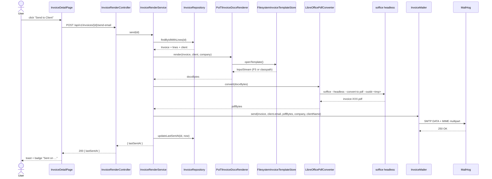

# DOCX-template invoice rendering, PDF conversion, template upload, download + email

## 1. Context & goal

Today `InvoicePdfRenderer` (`backend/src/main/java/com/example/invoicetracker/application/invoice/InvoicePdfRenderer.java:9`) is a port without an implementation, and there is no way for a user to control invoice layout. This feature replaces that approach with a **user-supplied DOCX template** that is filled at render time using **poi-tl** (`{{field}}` + `{{#table}}` syntax), can be downloaded as DOCX or converted to PDF, and can be emailed to the client. Success = an admin uploads `invoice-template.docx` once in *Settings → Invoice Template*, opens any invoice, and (a) downloads the rendered DOCX, (b) downloads the rendered PDF, or (c) clicks *Send to Client* and the PDF arrives in MailHog.

## 2. Acceptance criteria

- [ ] **AC-1 — Template upload**: `POST /api/v1/settings/invoice-template` (HTTP Basic, `multipart/form-data`, field `file`) accepts a `.docx` file ≤ 5 MB, validates magic bytes (`PK\x03\x04` + `[Content_Types].xml` entry), atomically replaces the file at `${app.invoice.template-path}` (default `./templates/invoice-template.docx`), and returns `200 { filename, size, uploadedAt }`. Any non-DOCX returns `415 INVALID_TEMPLATE_TYPE`; oversize returns `413 TEMPLATE_TOO_LARGE`; missing field returns `400 VALIDATION_FAILED`.
- [ ] **AC-2 — Template metadata**: `GET /api/v1/settings/invoice-template/preview` (HTTP Basic) returns `200 { filename, size, uploadedAt, isDefault }` reflecting the active template. When no user template has been uploaded yet, it returns the bundled classpath default (`src/main/resources/templates/invoice-template.docx`) with `isDefault=true`.
- [ ] **AC-3 — DOCX render**: `GET /api/v1/invoices/{id}/docx` (HTTP Basic) merges invoice + client + company data into the active template via poi-tl and streams `application/vnd.openxmlformats-officedocument.wordprocessingml.document`, `Content-Disposition: attachment; filename="invoice-<number>.docx"`, `Cache-Control: private, no-store`. The result opens in MS Word and LibreOffice without warnings.
- [ ] **AC-4 — Tokens resolved**: The default bundled template contains and the renderer populates: `{{company.name}}`, `{{company.address}}`, `{{company.email}}`, `{{company.taxId}}`, `{{client.name}}`, `{{client.email}}`, `{{client.address}}`, `{{invoice.number}}`, `{{invoice.issueDate}}`, `{{invoice.dueDate}}`, `{{invoice.subtotal}}`, `{{invoice.taxRate}}`, `{{invoice.taxAmount}}`, `{{invoice.total}}`, plus a `{{#lines}} … {{description}} {{quantity}} {{unitPrice}} {{lineTotal}} {{/lines}}` table loop. Currency rendered to 2 dp via `BigDecimal.setScale(2, HALF_EVEN)` and locale-formatted using `app.invoice.locale` (default `en-US`).
- [ ] **AC-5 — PDF render**: `GET /api/v1/invoices/{id}/pdf` (HTTP Basic) renders the DOCX as in AC-3 and converts it to PDF using **LibreOffice headless** (`soffice --headless --convert-to pdf`) via a `ProcessBuilder` wrapper. Returns `200 application/pdf`, `Content-Disposition: inline; filename="invoice-<number>.pdf"`, `Cache-Control: private, no-store`. Output opens in Chrome PDF viewer and contains all merged fields (asserted via PDFBox text extraction in tests). Conversion failures surface as `502 PDF_CONVERSION_FAILED` with problem+json.
- [ ] **AC-6 — Send by email**: `POST /api/v1/invoices/{id}/send-email` (HTTP Basic) renders DOCX → PDF, emails the PDF (attachment `invoice-<number>.pdf`) to `client.email`, sets `invoices.last_sent_at = now()` on SMTP success only, returns `200 { lastSentAt }`. SMTP failure returns `502 EMAIL_DELIVERY_FAILED` and **does not** update `last_sent_at`. If `InvoiceMailer` bean from FEAT-02 is on the classpath it is reused; otherwise a standalone `StandaloneInvoiceMailer` is registered (see §10 R-1). Empty `client.email` returns `422 INVOICE_HAS_NO_RECIPIENT`.
- [ ] **AC-7 — Frontend download menu**: `InvoiceDetailPage` renders a shadcn `DropdownMenu` "Download" button with two items: *Download DOCX* (hits `/api/v1/invoices/{id}/docx`) and *Download PDF* (hits `/api/v1/invoices/{id}/pdf`). Both use a programmatic `<a download>` flow wired through a `useAuthenticatedDownload` helper (fetches the blob with Basic auth, calls `URL.createObjectURL`, triggers download, revokes the URL).
- [ ] **AC-8 — Frontend Send button**: A separate "Send to Client" button next to the dropdown calls `useSendInvoice`. While pending the button is disabled with a spinner; on success a Sonner toast `invoices.toast.sendSuccess` fires and `lastSentAt` is invalidated/refetched; on failure (`502`/`422`) an error toast surfaces with the correct i18n key (`invoices.toast.sendFailed`, `invoices.toast.noRecipient`, `invoices.toast.pdfConversionFailed`). The "Sent on …" `Badge` appears only when `lastSentAt !== null`.
- [ ] **AC-9 — Frontend Settings page**: A new route `/settings/invoice-template` (added to the sidebar under *Settings*) renders a card titled "Invoice Template" showing: current template filename + size + uploaded date + a yellow "Default sample template" hint when `isDefault=true`, a file-input drop zone accepting `.docx` only with 5 MB client-side limit, an upload button (disabled while pending), and a "Download current template" link. On upload success a toast fires and the preview row refreshes.
- [ ] **AC-10 — Sibling independence**: The plan and code work whether FEAT-20260513-02 has merged or not. The renderer/controller depend on `InvoicePdfRenderer` and `InvoiceMailer` *ports* (already defined at `application/invoice/InvoicePdfRenderer.java:9` and `application/invoice/InvoiceMailer.java:8`). This feature registers a `DocxThenPdfInvoicePdfRenderer` annotated `@Primary` and a `StandaloneInvoiceMailer` annotated `@ConditionalOnMissingBean(InvoiceMailer.class)`. CI runs the test suite on a branch with FEAT-02 *not* merged to prove this.
- [ ] **AC-11 — Security**: No path traversal on `app.invoice.template-path` (resolved against a configured root; uploaded filename ignored — server names it `invoice-template.docx`). LibreOffice runs as the `app` user in the container with a per-call `-env:UserInstallation=file://<tmpdir>/lo-profile-<uuid>` deleted on completion. Macros disabled by `--headless --norestore --nofirststartwizard --nolockcheck`. No SSRF: uploaded DOCX is scanned for `Relationship Target="http(s)://..."` references and rejected if found; poi-tl renderer does not load remote images.
- [ ] **AC-12 — Coverage**: Backend JaCoCo line + branch ≥ **0.90** (per `backend/pom.xml:24`, the canonical source; the project `CLAUDE.md`'s "95 %" is doc drift — see R-9). Frontend Vitest **95 / 95 / 95 / 90** (per `vitest.config.ts`). New JaCoCo excludes are limited to `**/adapter/web/settings/dto/**` and `**/adapter/template/FilesystemInvoiceTemplateStore$*` (anonymous inner classes). Every other new class is covered.
- [ ] **AC-13 — Build gates**: Checkstyle, PMD, SpotBugs (`High`), OWASP DC (`failBuildOnCVSS=7`), ESLint, `pnpm audit --audit-level=high`, and the Postman collection regen all pass. New OpenAPI ops appear in `docs/openapi.json`.
- [ ] **AC-14 — E2E**: Playwright spec `frontend/tests/invoices/docx-pdf-email.spec.ts` runs end-to-end against MailHog + a LibreOffice-enabled backend container and proves: (1) upload a fixture `.docx` via Settings; (2) `GET /api/v1/invoices/{id}/docx` returns a ZIP-magic body ≥ 5 KB; (3) `GET /api/v1/invoices/{id}/pdf` returns `%PDF-` ≥ 5 KB; (4) clicking *Send to Client* delivers a MailHog message whose attachment is `application/pdf` named `invoice-<number>.pdf`; (5) the page then shows "Sent on …".

## 3. Architecture (mermaid)

### 3a Component view

```mermaid
flowchart LR
    subgraph FE[React SPA]
      detail[InvoiceDetailPage]
      dl[DownloadInvoiceMenu]
      send[SendInvoiceButton]
      settings[InvoiceTemplateSettingsPage]
      upload[TemplateUploadForm]
      api[invoicesApi.ts<br/>templateApi.ts]
    end
    subgraph BE[Spring Boot]
      invCtl[InvoiceRenderController<br/>/docx, /pdf, /send-email]
      setCtl[InvoiceTemplateController<br/>/api/v1/settings/invoice-template]
      svc[InvoiceRenderService]
      tplStore[FilesystemInvoiceTemplateStore]
      docxRen[PoiTlInvoiceDocxRenderer]
      pdfConv[LibreOfficePdfConverter]
      pdfRen[DocxThenPdfInvoicePdfRenderer<br/>@Primary impl of InvoicePdfRenderer]
      mailer[InvoiceMailer<br/>FEAT-02 bean or StandaloneInvoiceMailer fallback]
      repo[InvoiceRepository]
    end
    subgraph Infra
      fs[(Local FS<br/>./templates/invoice-template.docx)]
      cp[(Classpath default<br/>resources/templates/invoice-template.docx)]
      lo([LibreOffice headless<br/>soffice binary])
      db[(Postgres)]
      smtp[MailHog / SMTP]
    end
    detail --> dl
    detail --> send
    settings --> upload
    dl -->|GET /docx, /pdf| api
    send -->|POST /send-email| api
    upload -->|POST multipart| api
    api --> invCtl
    api --> setCtl
    invCtl --> svc
    setCtl --> tplStore
    svc --> repo
    svc --> docxRen
    svc --> pdfRen
    svc --> mailer
    docxRen --> tplStore
    pdfRen --> docxRen
    pdfRen --> pdfConv
    pdfConv --> lo
    tplStore --> fs
    tplStore -. fallback .-> cp
    repo --> db
    mailer --> smtp
```

### 3b PDF-conversion strategy decision

Two candidates were evaluated:

| Aspect | **A: LibreOffice headless** (chosen) | B: docx4j + Apache FOP |
|---|---|---|
| Fidelity for poi-tl-merged DOCX | Native — Word's own engine equivalent | Partial — FOP struggles with complex tables, font fallbacks, headers/footers |
| Container delta | +180 MB layer (`libreoffice-core` + `libreoffice-writer` + fonts) | 0 — pure JVM |
| Runtime per invoice | ~700 ms cold, ~250 ms warm (process pool of 2) | ~120 ms |
| Memory | ~250 MB resident soffice | ~50 MB |
| CVE surface | LibreOffice has periodic CVEs (CVSS ≥ 7 quarterly); mitigated by `--headless` + no macros + sandboxed `HOME` | docx4j depends on older Xerces/Xalan — historically noisy on OWASP DC |
| Output stability | Deterministic given same input | Layout shifts as docx4j is upgraded |
| Maintenance | Just track `soffice` package version | Own the FO conversion edge cases |

**Decision: A (LibreOffice headless).** The product surface is user-supplied DOCX templates with `poi-tl` table loops, images, and styled cells — exactly the FOP weak spots. The 180 MB layer is acceptable for a backend image (the current `eclipse-temurin:21-jre` base is ~250 MB, so final ~430 MB). Cold-start latency is mitigated by a warm process-pool of size 2 (`LibreOfficeProcessPool`). The CVE-surface risk is managed by pinning an apt package version, running as non-root, and re-checking quarterly. docx4j is rejected on output-quality grounds, not size.

## 4. Sequence (happy path + edge case)

### 4a Happy path: render PDF and email it



### 4b Edge case: LibreOffice conversion fails — no `last_sent_at` write

```mermaid
sequenceDiagram
    actor U as User
    participant FE as InvoiceDetailPage
    participant BE as InvoiceRenderController
    participant SVC as InvoiceRenderService
    participant PDF as LibreOfficePdfConverter
    participant LO as soffice (crashes or 20 s timeout)
    U->>FE: click "Send to Client"
    FE->>BE: POST /send-email
    BE->>SVC: send(id)
    SVC->>PDF: convert(docxBytes)
    PDF->>LO: soffice --headless --convert-to pdf
    LO-->>PDF: exit 1 / SIGKILL after timeout
    PDF-->>SVC: throws PdfConversionFailedException
    Note over SVC: NO call to mailer<br/>NO write to last_sent_at
    SVC-->>BE: throws PdfConversionFailedException
    BE-->>FE: 502 problem+json { code: PDF_CONVERSION_FAILED }
    FE-->>U: error toast; lastSentAt unchanged
```

## 5. File-by-file change list

### Backend — create (template + rendering core)

| Path | Action | Purpose |
|---|---|---|
| `backend/src/main/java/com/example/invoicetracker/application/template/InvoiceTemplateStore.java` | create | Port — `InputStream openTemplate()`, `TemplateMetadata getMetadata()`, `TemplateMetadata replace(InputStream src, long sizeBytes)` |
| `backend/src/main/java/com/example/invoicetracker/application/template/TemplateMetadata.java` | create | Record `(String filename, long sizeBytes, Instant uploadedAt, boolean isDefault)` |
| `backend/src/main/java/com/example/invoicetracker/application/template/InvoiceTemplateProperties.java` | create | `@ConfigurationProperties("app.invoice")`: `Path templatePath`, `long maxTemplateBytes` (default 5 MiB), `String classpathDefault` (default `templates/invoice-template.docx`), `String locale` (default `en-US`), `String currency` (default `USD`) |
| `backend/src/main/java/com/example/invoicetracker/adapter/template/FilesystemInvoiceTemplateStore.java` | create | Default `@Component` impl. Atomic-replace via `Files.move(tmp, target, ATOMIC_MOVE, REPLACE_EXISTING)`. Validates magic bytes (`PK\x03\x04`), presence of `word/document.xml` ZIP entry, and absence of external `Relationship Target="http(s)://..."` references. Falls back to the classpath default when the FS file does not exist. Resolves canonical path under a fixed root at startup to prevent traversal. |
| `backend/src/main/java/com/example/invoicetracker/application/template/InvalidTemplateException.java` | create | Thrown on magic-byte / ZIP-entry / external-ref mismatch → 415 |
| `backend/src/main/java/com/example/invoicetracker/application/template/TemplateTooLargeException.java` | create | Thrown when upload > `app.invoice.max-template-bytes` → 413 |
| `backend/src/main/java/com/example/invoicetracker/application/invoice/InvoiceDocxRenderer.java` | create | Port — `byte[] render(Invoice invoice, Client client, CompanyProperties company)` returning a merged DOCX |
| `backend/src/main/java/com/example/invoicetracker/application/invoice/PoiTlInvoiceDocxRenderer.java` | create | `@Component` default impl. Builds a poi-tl `Configure.builder().bind("lines", new LoopRowTableRenderPolicy()).build()`. Maps `{{company.*}}`, `{{client.*}}`, `{{invoice.*}}` and the `{{#lines}}` table loop. Numbers formatted via `NumberFormat.getCurrencyInstance(Locale.forLanguageTag(props.locale()))`. Uses try-with-resources on the `XWPFTemplate` and streams to a `ByteArrayOutputStream`. |
| `backend/src/main/java/com/example/invoicetracker/application/invoice/InvoicePdfConverter.java` | create | Port — `byte[] convert(byte[] docxBytes)` |
| `backend/src/main/java/com/example/invoicetracker/application/invoice/LibreOfficePdfCommand.java` | create | Pure value object building the `ProcessBuilder` argument list — extracted so it can be unit-tested without invoking `soffice`. |
| `backend/src/main/java/com/example/invoicetracker/application/invoice/LibreOfficePdfConverter.java` | create | Default `@Component` impl. Writes docx to a per-call temp dir, runs `ProcessBuilder("soffice","--headless","--norestore","--nofirststartwizard","--nolockcheck","-env:UserInstallation=file://<tmp>/lo-profile","--convert-to","pdf","--outdir",<tmp>, <tmp>/in.docx)`, 20 s timeout via `Process.waitFor(timeout, SECONDS)` + `destroyForcibly`, captures stderr, deletes temp dir in `finally`. `Semaphore(2)` caps concurrency. Throws `PdfConversionFailedException` on non-zero exit, timeout, or saturation. |
| `backend/src/main/java/com/example/invoicetracker/application/invoice/DocxThenPdfInvoicePdfRenderer.java` | create | `@Component @Primary` implementation of the existing `InvoicePdfRenderer` port — composes `InvoiceDocxRenderer` + `InvoicePdfConverter`. Wins over any FEAT-02 OpenPDF renderer thanks to `@Primary`. |
| `backend/src/main/java/com/example/invoicetracker/domain/invoice/PdfConversionFailedException.java` | create | Maps to 502 `PDF_CONVERSION_FAILED` |
| `backend/src/main/java/com/example/invoicetracker/domain/invoice/InvoiceHasNoRecipientException.java` | reuse (exists at this path per the listing on disk) | Mapped to 422 in `GlobalExceptionHandler` |

### Backend — create (settings controller)

| Path | Action | Purpose |
|---|---|---|
| `backend/src/main/java/com/example/invoicetracker/adapter/web/settings/InvoiceTemplateController.java` | create | `@RestController @RequestMapping("/api/v1/settings/invoice-template")`. `POST` consumes `multipart/form-data`, validates `@RequestPart("file") MultipartFile` (size, original filename ending `.docx`, content-type whitelist `application/vnd.openxmlformats-officedocument.wordprocessingml.document` OR `application/octet-stream`), delegates to store. `GET /preview` returns metadata. `GET /download` streams the active template as DOCX. |
| `backend/src/main/java/com/example/invoicetracker/adapter/web/settings/dto/TemplateMetadataResponse.java` | create | record `(String filename, long size, Instant uploadedAt, boolean isDefault)` |
| `backend/src/main/java/com/example/invoicetracker/adapter/web/settings/dto/UploadTemplateResponse.java` | create | record `(String filename, long size, Instant uploadedAt)` |

### Backend — create (invoice render/download endpoints)

| Path | Action | Purpose |
|---|---|---|
| `backend/src/main/java/com/example/invoicetracker/adapter/web/invoice/InvoiceRenderController.java` | create (or extend an `InvoiceController` from FEAT-02 if it lands first — see R-1) | `GET /api/v1/invoices/{id}/docx` (produces DOCX media type), `GET /api/v1/invoices/{id}/pdf` (produces `application/pdf`), `POST /api/v1/invoices/{id}/send-email`. Sets `Content-Disposition`, `Cache-Control: private, no-store`. Reads via the existing `InvoiceRepository` port (already defined at `domain/invoice/InvoiceRepository.java:1`). |
| `backend/src/main/java/com/example/invoicetracker/adapter/web/invoice/dto/SendEmailResponse.java` | reuse if FEAT-02 provides it, else create | record `(Instant lastSentAt)` |
| `backend/src/main/java/com/example/invoicetracker/application/invoice/InvoiceRenderService.java` | create | Use-cases `renderDocx(id) → byte[]`, `renderPdf(id) → byte[]`, `sendEmail(id) → Instant`. Composes repository + docx renderer + pdf renderer + mailer. `@Transactional(readOnly=true)` on renders, default tx on send (writes `last_sent_at` on SMTP success only). Validates `client.email` is non-blank and CRLF-free before mailing. |

### Backend — create (mailer fallback)

| Path | Action | Purpose |
|---|---|---|
| `backend/src/main/java/com/example/invoicetracker/application/invoice/StandaloneInvoiceMailer.java` | create | `@Component @ConditionalOnMissingBean(InvoiceMailer.class)` — used **only** if FEAT-02 has not registered its mailer. Builds `MimeMessage` via `MimeMessageHelper`, attaches `byte[]` PDF, reads `app.mail.from`, `app.mail.subject-template`, `app.mail.body-template` from the existing `MailProperties` record at `application/invoice/MailProperties.java:1`. Hashes recipient address (SHA-256 trunc 8) for logs; never logs full email. |
| `backend/src/main/java/com/example/invoicetracker/config/InvoiceMailerAutoConfig.java` | create | `@Configuration` that conditionally registers `JavaMailSender` only when `spring.mail.host` is set, so unit tests of pure renderers do not need an SMTP context. |

### Backend — edit

| Path | Action | Purpose |
|---|---|---|
| `backend/pom.xml` | edit | Add `com.deepoove:poi-tl:1.12.2` (pulls Apache POI 5.x). Add `org.springframework.boot:spring-boot-starter-mail` only if FEAT-02 has not merged (developer agent checks; idempotent). Add test deps `org.apache.pdfbox:pdfbox:3.0.3` (test scope, for PDF text extraction) and `com.icegreen:greenmail-junit5:2.1.0` (test scope). Append JaCoCo `<excludes>`: `**/adapter/web/settings/dto/**`, `**/adapter/template/FilesystemInvoiceTemplateStore$*`. |
| `backend/src/main/resources/application.yml` | edit | Add under root: `app.invoice.template-path: ./templates/invoice-template.docx`, `app.invoice.max-template-bytes: 5242880`, `app.invoice.classpath-default: templates/invoice-template.docx`, `app.invoice.locale: en-US`, `app.invoice.currency: USD`, `app.libreoffice.binary: ${LIBREOFFICE_BIN:soffice}`, `app.libreoffice.timeout-seconds: 20`, `app.libreoffice.concurrency: 2`, `spring.servlet.multipart.max-file-size: 6MB`, `spring.servlet.multipart.max-request-size: 6MB`. If FEAT-02 has not merged: add `spring.mail.*` keyed on env vars, per-profile (`local` → MailHog @ 1025 no auth, `docker` → `${MAIL_*}`). |
| `backend/src/main/java/com/example/invoicetracker/config/SecurityConfig.java` | check (no change) | `/api/v1/settings/invoice-template/**` and `/api/v1/invoices/**` fall under `.anyRequest().authenticated()` (`SecurityConfig.java:47`). No permit-list change. |
| `backend/src/main/java/com/example/invoicetracker/adapter/web/error/GlobalExceptionHandler.java` | edit | Add `@ExceptionHandler` for `InvalidTemplateException` → 415 `INVALID_TEMPLATE_TYPE`, `TemplateTooLargeException` → 413 `TEMPLATE_TOO_LARGE`, `MaxUploadSizeExceededException` → 413 `TEMPLATE_TOO_LARGE`, `PdfConversionFailedException` → 502 `PDF_CONVERSION_FAILED`, `InvoiceHasNoRecipientException` → 422 `INVOICE_HAS_NO_RECIPIENT`. Each returns RFC 7807 `ProblemDetail` with a `code` property, following the pattern at `adapter/web/error/GlobalExceptionHandler.java:51`. If FEAT-02 has not merged, also add `InvoiceNotFoundException` → 404 and `EmailDeliveryFailedException` → 502 (both already exist as exception types in `domain/invoice/`). |
| `backend/Dockerfile` | edit | Stage 2: add `RUN apt-get update && apt-get install -y --no-install-recommends libreoffice-core libreoffice-writer fonts-dejavu fonts-liberation && rm -rf /var/lib/apt/lists/*`. Add `ENV LIBREOFFICE_BIN=/usr/bin/soffice`. Document image growth (~180 MB). Keep `USER app`. Create `/app/templates` and `/app/lo-profiles` owned by `app`. |
| `backend/.dockerignore` | edit | Add `target/`, `**/*.docx` (do not bake user-uploaded templates into the image — they live in a volume), `**/*.log`. |
| `backend/src/main/resources/templates/invoice-template.docx` | create | **Bundled default template** (binary `.docx`). Authored with LibreOffice and committed; uses the poi-tl tokens listed in AC-4. Developer agent regenerates from spec if format issues arise. |
| `backend/owasp-suppressions.xml` | edit | If OWASP DC flags transitive Apache POI / xmlbeans CVEs that are not exploitable in our usage, add suppression with explicit CVE ID + rationale (security-auditor reviews). |

### Backend — tests (create)

| Path | Action | Purpose |
|---|---|---|
| `backend/src/test/java/com/example/invoicetracker/adapter/template/FilesystemInvoiceTemplateStoreTest.java` | create | Tmp-dir-based: replace returns metadata; magic-byte check rejects non-DOCX; ZIP without `word/document.xml` rejected; external `Target="http://..."` rejected; atomic-move preserves old file on failure; classpath fallback when FS file missing; path traversal blocked at startup |
| `backend/src/test/java/com/example/invoicetracker/application/invoice/PoiTlInvoiceDocxRendererTest.java` | create | Renders fixture invoice; result is a valid ZIP (`PK\x03\x04`); opening as `XWPFDocument` finds expected strings (number, client name, total, all line descriptions); 50-line invoice renders without OOM; missing token in template falls back to empty (no NPE) |
| `backend/src/test/java/com/example/invoicetracker/application/invoice/LibreOfficePdfCommandTest.java` | create | Pure unit: command list contains `--headless`, `--norestore`, `--convert-to`, `pdf`, `--outdir`, and the per-call `UserInstallation` URL |
| `backend/src/test/java/com/example/invoicetracker/application/invoice/LibreOfficePdfConverterUnitTest.java` | create | Pure unit (no soffice) using a `ProcessBuilder` indirection seam — verifies timeout handling (`destroyForcibly`), temp-dir cleanup on success and on exception, semaphore saturation throws `PdfConversionFailedException` with `code=PDF_CONVERSION_BUSY`. Covers all conversion-failure branches so coverage is not gated on a real LibreOffice install. |
| `backend/src/test/java/com/example/invoicetracker/application/invoice/LibreOfficePdfConverterIT.java` | create | `@EnabledIfEnvironmentVariable(named="LIBREOFFICE_BIN_TEST", matches=".+")` — runs real `soffice` and asserts `%PDF-` magic + PDFBox text extraction finds expected substrings. CI sets the env var; local devs without LO skip. |
| `backend/src/test/java/com/example/invoicetracker/application/invoice/DocxThenPdfInvoicePdfRendererTest.java` | create | Mockito: docx renderer returns fixed bytes; converter returns fixed bytes; assert pipeline composes correctly; converter exception propagates |
| `backend/src/test/java/com/example/invoicetracker/application/invoice/StandaloneInvoiceMailerTest.java` | create | GreenMail-junit5: sends MIME with PDF attachment; subject template substitution; CRLF rejection on `invoice.number`; recipient logged only as hash (capture logger) |
| `backend/src/test/java/com/example/invoicetracker/application/invoice/InvoiceRenderServiceTest.java` | create | Mockito: `renderDocx` calls repo + docx renderer; `renderPdf` composes both renderers; `sendEmail` happy path writes `lastSentAt`; SMTP failure does **not** write; PDF conversion failure does **not** write; empty client email throws `InvoiceHasNoRecipientException` |
| `backend/src/test/java/com/example/invoicetracker/adapter/web/settings/InvoiceTemplateControllerTest.java` | create | `@SpringBootTest(webEnvironment=MOCK)` + MockMvc + `@MockitoBean InvoiceTemplateStore`. Valid `.docx` → 200; non-DOCX → 415; >5 MB → 413; missing field → 400; preview returns metadata; unauth → 401 |
| `backend/src/test/java/com/example/invoicetracker/adapter/web/invoice/InvoiceRenderControllerTest.java` | create | MockMvc: `/docx` returns DOCX media type + attachment disposition; `/pdf` returns PDF media type + inline disposition; 404 maps; 502 on conversion failure; 422 on no recipient; 502 on SMTP failure; 200 on send success |
| `backend/src/test/java/com/example/invoicetracker/adapter/web/invoice/InvoiceRenderControllerIT.java` | create | `@SpringBootTest(webEnvironment=RANDOM_PORT)` + Testcontainers Postgres + GreenMail. Seeds an invoice via repository; hits `/docx`, `/pdf`, `/send-email`. Gated on `LIBREOFFICE_BIN_TEST` for `/pdf` and `/send-email`. Asserts MailHog (GreenMail) receives PDF attachment. |
| `backend/src/test/java/com/example/invoicetracker/support/TemplateFixtures.java` | create | Builds tiny in-memory poi-tl-compatible DOCX `byte[]` for tests that need an upload payload |
| `backend/src/test/resources/fixtures/invoice-template-tests.docx` | create | Minimal valid `.docx` fixture used by store + renderer tests |
| `backend/src/test/resources/application-test.yml` | edit (or create) | Override `app.invoice.template-path` to a per-test tmp dir; override `spring.mail.*` to GreenMail dynamic port via `@DynamicPropertySource` |

### Frontend — create

| Path | Action | Purpose |
|---|---|---|
| `frontend/src/features/invoices/api/downloadInvoice.ts` | create | `downloadInvoiceDocx(id, number)` and `downloadInvoicePdf(id, number)` — fetch the blob with Basic auth (via the new `httpRaw` helper), trigger `<a download>` click, `URL.revokeObjectURL` in `finally` |
| `frontend/src/features/invoices/api/downloadInvoice.test.ts` | create | MSW + jsdom: success path triggers anchor click; 404 surfaces `ApiError`; `revokeObjectURL` called in both success and failure |
| `frontend/src/features/invoices/api/useSendInvoice.ts` | create | Custom hook matching the `useInvoice.ts` pattern (`frontend/src/features/invoices/api/useInvoice.ts:1` — plain `useState` + `useCallback`, not React-Query, to match the existing convention). Exposes `{ send, pending, error }`; on success calls an injected `onSuccess` callback to refetch |
| `frontend/src/features/invoices/api/useSendInvoice.test.ts` | create | Success → toast + `onSuccess` fired; 502 (delivery) → `sendFailed` toast; 502 (conversion) → `pdfConversionFailed` toast; 422 → `noRecipient` toast; pending true during in-flight |
| `frontend/src/features/invoices/ui/DownloadInvoiceMenu.tsx` | create | shadcn `DropdownMenu` button. Items: "Download DOCX", "Download PDF". Each item triggers the corresponding helper. Per-item pending state with spinner. |
| `frontend/src/features/invoices/ui/DownloadInvoiceMenu.test.tsx` | create | Menu opens; clicking DOCX/PDF item calls correct helper; pending state disables both items |
| `frontend/src/features/invoices/ui/SendInvoiceButton.tsx` | create | Button + spinner + shadcn `AlertDialog` confirmation. Disabled when no client email or when pending. |
| `frontend/src/features/invoices/ui/SendInvoiceButton.test.tsx` | create | Confirm flow; loading state; success toast; error toast paths; disabled when `client.email` blank |
| `frontend/src/features/invoices/ui/InvoiceSentBadge.tsx` | create | Hidden when `lastSentAt === null`; otherwise renders `Badge` with localised date (`Intl.DateTimeFormat`) |
| `frontend/src/features/invoices/ui/InvoiceSentBadge.test.tsx` | create | Null → empty render; non-null → formatted date |
| `frontend/src/features/invoices/ui/InvoiceDetailPage.tsx` | create | Card layout with client block, lines table, totals; action row containing `DownloadInvoiceMenu`, `SendInvoiceButton`, `InvoiceSentBadge`. Loading skeleton; error empty-state. |
| `frontend/src/features/invoices/ui/InvoiceDetailPage.test.tsx` | create | Renders all sections; integrates the three action components; `lastSentAt` drives badge visibility |
| `frontend/src/features/settings/model/types.ts` | create | TS types `TemplateMetadata`, `UploadTemplateResponse` |
| `frontend/src/features/settings/model/schema.ts` | create | zod schemas mirroring backend DTOs |
| `frontend/src/features/settings/model/schema.test.ts` | create | Valid + invalid boundary cases |
| `frontend/src/features/settings/api/templateApi.ts` | create | `getTemplateMetadata()`, `uploadTemplate(file: File)`, `getTemplateDownloadUrl()` — multipart via `FormData` (bypasses JSON content-type in `shared/lib/http`) |
| `frontend/src/features/settings/api/templateApi.test.ts` | create | MSW: 200 metadata; 415 invalid type; 413 too large; 200 upload returns new metadata; `FormData` body sent |
| `frontend/src/features/settings/api/useTemplateMetadata.ts` | create | Hook matching `useInvoice.ts` pattern |
| `frontend/src/features/settings/api/useTemplateMetadata.test.ts` | create | Loading / success / error transitions; refetch after upload |
| `frontend/src/features/settings/ui/InvoiceTemplateSettingsPage.tsx` | create | Card with current-template row + `TemplateUploadForm` + download-current link. Uses `useTemplateMetadata`. |
| `frontend/src/features/settings/ui/InvoiceTemplateSettingsPage.test.tsx` | create | Default-template warning visible when `isDefault=true`; upload success refreshes metadata; download link href correct |
| `frontend/src/features/settings/ui/TemplateUploadForm.tsx` | create | File input restricted to `.docx`; client-side 5 MB validation; calls `uploadTemplate`; success/error toasts; pending state |
| `frontend/src/features/settings/ui/TemplateUploadForm.test.tsx` | create | Rejects non-docx with toast; rejects >5 MB; success path calls API + fires success toast |
| `frontend/src/pages/InvoiceDetailPage.tsx` | create | Route wrapper (mirrors `pages/ClientDetailPage.tsx:1`) |
| `frontend/src/pages/InvoiceTemplateSettingsPage.tsx` | create | Route wrapper |
| `frontend/tests/invoices/docx-pdf-email.spec.ts` | create | Playwright E2E (see AC-14) |
| `frontend/tests/settings/invoice-template-upload.spec.ts` | create | Playwright: upload `.docx` via UI; reload; metadata row reflects new filename + size + `isDefault=false` |
| `frontend/tests/fixtures/sample-template.docx` | create | Tiny valid `.docx` test fixture used by both Playwright specs |

### Frontend — edit

| Path | Action | Purpose |
|---|---|---|
| `frontend/src/app/App.tsx` | edit | Add routes inside `<AppShell>` (`src/app/App.tsx:35`): `<Route path="/invoices/:id" element={<InvoiceDetailPage />} />` and `<Route path="/settings/invoice-template" element={<InvoiceTemplateSettingsPage />} />`. |
| `frontend/src/app/App.test.tsx` | edit | Cover both new routes |
| `frontend/src/shared/components/Sidebar.tsx` | edit | Enable the existing "Invoices" item (currently `disabled: true` at `Sidebar.tsx:17`) — point it to `/invoices` (which 404s in v1 with `EmptyState`, acceptable interim per FEAT-02 R-6). Add a new `Settings` section with a child link "Invoice Template" → `/settings/invoice-template`. |
| `frontend/src/shared/components/Sidebar.test.tsx` | edit | Cover the new nav entries |
| `frontend/src/shared/locales/en.json` | edit | Add `invoices.actions.{download,downloadDocx,downloadPdf,sendToClient}`, `invoices.status.sentOn`, `invoices.confirm.send.{title,description}`, `invoices.toast.{sendSuccess,sendFailed,noRecipient,pdfConversionFailed,downloadFailed}`, `settings.invoiceTemplate.{title,currentFilename,uploadedAt,isDefaultWarning,uploadButton,downloadCurrent,helpDocx,errors.invalidType,errors.tooLarge,toast.uploadSuccess,toast.uploadFailed}`, `nav.settings`, `nav.settingsInvoiceTemplate`. No raw English in components. |
| `frontend/src/shared/lib/http.ts` | edit | Add a `httpRaw(url, options)` helper that returns the raw `Response` (used by `downloadInvoice.ts` and `uploadTemplate`). The existing JSON `http<T>` is unchanged. When `body` is a `FormData`, do not auto-set `Content-Type` (let the browser choose the boundary). |
| `frontend/src/shared/lib/http.test.ts` | edit | Add cases for `httpRaw` (returns Response on 200; throws `ApiError` on 4xx) and for `FormData` content-type bypass |
| `frontend/src/mocks/handlers.ts` | edit | Add handlers: `GET /api/v1/invoices/:id` (seeds a fixture invoice), `GET /api/v1/invoices/:id/docx` (returns a tiny `PK\x03\x04…` byte body with `application/vnd.openxmlformats-officedocument.wordprocessingml.document`), `GET /api/v1/invoices/:id/pdf` (returns `%PDF-1.4\n…` with `application/pdf`), `POST /api/v1/invoices/:id/send-email` (200 / 502 / 422 paths), `GET /api/v1/settings/invoice-template/preview`, `POST /api/v1/settings/invoice-template` (200 / 415 / 413). |
| `frontend/package.json` | edit | No new runtime deps (`Blob`, `URL.createObjectURL`, `FormData` are platform). No frontend PDF library. |

### Infrastructure

| Path | Action | Purpose |
|---|---|---|
| `docker-compose.yml` | edit | Ensure `mailhog` service is present (if FEAT-02 has not merged, add it: `mailhog/mailhog:v1.0.1`, ports `1025:1025` + `8025:8025`). Add a named volume `template-storage` mounted at `/app/templates` on the `backend` service. Add env `MAIL_HOST=mailhog`, `MAIL_PORT=1025`, `MAIL_FROM=no-reply@invoice-tracker.local`, `MAIL_STARTTLS=false`, `LIBREOFFICE_BIN=/usr/bin/soffice` on `backend`. |
| `.github/workflows/ci.yml` | edit | Add `libreoffice-core libreoffice-writer fonts-dejavu` install step in the backend-test job and export `LIBREOFFICE_BIN_TEST=/usr/bin/soffice` so the gated IT runs. Ensure MailHog is started before the Playwright job. |
| `postman/collection.json` | edit (documentation agent) | Add `Get invoice DOCX`, `Get invoice PDF`, `Upload invoice template`, `Get template metadata`, `Download template`, `Send invoice email`. |
| `docs/openapi.json` | edit (documentation agent) | Regenerate; will include the six new operations. |
| `docs/ARCHITECTURE.md` | edit (documentation agent) | New "Invoice rendering pipeline" section with §3a diagram. |
| `docs/FEATURES.md` | edit (documentation agent) | Append FEAT-20260513-03 row. |
| `docs/CHANGELOG.md` | edit (documentation agent) | "Added: DOCX-template invoice rendering, PDF conversion via LibreOffice headless, template upload UI, send-to-client email." |

## 6. API contract

| Method | Path | Auth | Request | Response | Errors |
|---|---|---|---|---|---|
| `GET` | `/api/v1/invoices/{id}/docx` | Basic | — | `200 application/vnd.openxmlformats-officedocument.wordprocessingml.document`, body = merged DOCX bytes; headers `Content-Disposition: attachment; filename="invoice-<number>.docx"`, `Cache-Control: private, no-store` | `404 INVOICE_NOT_FOUND`, `500 INTERNAL_ERROR` |
| `GET` | `/api/v1/invoices/{id}/pdf` | Basic | — | `200 application/pdf`, body = PDF bytes; headers `Content-Disposition: inline; filename="invoice-<number>.pdf"`, `Cache-Control: private, no-store` | `404 INVOICE_NOT_FOUND`, `502 PDF_CONVERSION_FAILED` |
| `POST` | `/api/v1/invoices/{id}/send-email` | Basic | — (no body) | `200 { "lastSentAt": "2026-05-13T20:10:00Z" }` | `404 INVOICE_NOT_FOUND`, `422 INVOICE_HAS_NO_RECIPIENT`, `502 EMAIL_DELIVERY_FAILED`, `502 PDF_CONVERSION_FAILED` |
| `POST` | `/api/v1/settings/invoice-template` | Basic | `multipart/form-data` `file=<.docx ≤ 5 MB>` | `200 { "filename":"invoice-template.docx", "size":12345, "uploadedAt":"2026-05-13T20:10:00Z" }` | `400 VALIDATION_FAILED`, `413 TEMPLATE_TOO_LARGE`, `415 INVALID_TEMPLATE_TYPE` |
| `GET` | `/api/v1/settings/invoice-template/preview` | Basic | — | `200 { "filename":"invoice-template.docx", "size":12345, "uploadedAt":"2026-05-13T20:10:00Z", "isDefault":false }` | — |
| `GET` | `/api/v1/settings/invoice-template/download` | Basic | — | `200 application/vnd.openxmlformats-officedocument.wordprocessingml.document` + `Content-Disposition: attachment; filename="invoice-template.docx"` | `404 TEMPLATE_NOT_FOUND` (only if classpath default is also missing — should not occur) |

Error bodies follow the project's `application/problem+json` convention (see `adapter/web/error/GlobalExceptionHandler.java:1`): `{ type, title, status, detail, code }`. New `code` values introduced: `INVALID_TEMPLATE_TYPE`, `TEMPLATE_TOO_LARGE`, `PDF_CONVERSION_FAILED`, `PDF_CONVERSION_BUSY`, `TEMPLATE_NOT_FOUND`. Existing codes reused: `INVOICE_NOT_FOUND`, `INVOICE_HAS_NO_RECIPIENT`, `EMAIL_DELIVERY_FAILED`, `VALIDATION_FAILED`.

`UploadTemplateResponse` JSON:
```json
{ "filename": "invoice-template.docx", "size": 12345, "uploadedAt": "2026-05-13T20:10:00Z" }
```

`TemplateMetadataResponse` JSON:
```json
{ "filename": "invoice-template.docx", "size": 12345, "uploadedAt": "2026-05-13T20:10:00Z", "isDefault": false }
```

## 7. Data model changes

**No new SQL tables.** Template state is filesystem-only:

- Active template path: `${app.invoice.template-path}` (default `./templates/invoice-template.docx`, mounted as a named volume in Docker).
- Upload metadata (`filename`, `size`, `uploadedAt`) is derived at read-time from `BasicFileAttributes` (last-modified time) rather than persisted to Postgres — this keeps the feature additive and avoids a migration. `isDefault` is computed as "the FS file does not exist; classpath fallback is being served".
- The classpath default lives at `backend/src/main/resources/templates/invoice-template.docx` and is read via `ClassPathResource`.

Rationale for *not* persisting metadata to DB: there is exactly one template per deployment; storing its metadata adds a migration + table for no functional benefit and complicates atomic replace. If multi-template support is later wanted (see R-3), introduce `V5__create_invoice_templates.sql` then.

`invoices.last_sent_at` is reused (already created by FEAT-02 via `V4__create_invoices.sql:8`). No new migration is required from this feature.

## 8. Test strategy

| Layer | Test | Asserts |
|---|---|---|
| Unit (BE) | `FilesystemInvoiceTemplateStoreTest.replace_writes_atomically` | `Files.move(... ATOMIC_MOVE)` is used; old file kept on partial failure |
| Unit (BE) | `FilesystemInvoiceTemplateStoreTest.replace_rejects_non_docx_magic` | non-`PK\x03\x04` bytes → `InvalidTemplateException` |
| Unit (BE) | `FilesystemInvoiceTemplateStoreTest.replace_rejects_zip_without_word_document_xml` | valid ZIP without `word/document.xml` → `InvalidTemplateException` |
| Unit (BE) | `FilesystemInvoiceTemplateStoreTest.replace_rejects_external_relationships` | DOCX with `Relationship Target="http://..."` → `InvalidTemplateException` |
| Unit (BE) | `FilesystemInvoiceTemplateStoreTest.resolve_falls_back_to_classpath_default` | when FS file absent, returns classpath stream; `isDefault=true` |
| Unit (BE) | `FilesystemInvoiceTemplateStoreTest.path_traversal_blocked_at_startup` | configured path that escapes root → throws on bean init |
| Unit (BE) | `PoiTlInvoiceDocxRendererTest.merges_all_tokens` | result DOCX text contains invoice number, all line descriptions, total |
| Unit (BE) | `PoiTlInvoiceDocxRendererTest.handles_zero_lines_gracefully` | does not throw; emits empty table loop |
| Unit (BE) | `PoiTlInvoiceDocxRendererTest.handles_50_lines_without_overflow` | rendered DOCX > 5 KB; opens as `XWPFDocument` |
| Unit (BE) | `PoiTlInvoiceDocxRendererTest.localises_currency_per_app_invoice_locale` | `€` for `de-DE`, `$` for `en-US` |
| Unit (BE) | `PoiTlInvoiceDocxRendererTest.closes_template_on_exception` | resource leak guard: try-with-resources verified |
| Unit (BE) | `LibreOfficePdfCommandTest.command_contains_required_flags` | command list includes `--headless`, `--norestore`, `--convert-to pdf`, `--outdir`, per-call `UserInstallation` URL |
| Unit (BE) | `LibreOfficePdfConverterUnitTest.timeout_kills_process_and_throws` | mocked process that never exits → `destroyForcibly` called + `PdfConversionFailedException` |
| Unit (BE) | `LibreOfficePdfConverterUnitTest.tempdir_deleted_on_success_and_failure` | temp dir count == 0 after success, after exception |
| Unit (BE) | `LibreOfficePdfConverterUnitTest.semaphore_blocks_excess_calls` | 3rd concurrent call returns busy exception |
| IT (BE)   | `LibreOfficePdfConverterIT.real_soffice_converts_to_pdf` | requires `LIBREOFFICE_BIN_TEST`; output starts with `%PDF-` and PDFBox extracts merged strings |
| Unit (BE) | `DocxThenPdfInvoicePdfRendererTest.composes_renderer_and_converter` | mocked dependencies; pipeline order verified; converter exception propagates |
| Unit (BE) | `StandaloneInvoiceMailerTest.sends_message_with_pdf_attachment` | GreenMail receives 1 msg; attachment filename + content-type correct |
| Unit (BE) | `StandaloneInvoiceMailerTest.subject_template_substitutes_number_and_company` | exact subject string |
| Unit (BE) | `StandaloneInvoiceMailerTest.crlf_in_invoice_number_rejected` | guards against SMTP header injection |
| Unit (BE) | `StandaloneInvoiceMailerTest.recipient_logged_only_as_hash` | log capture: full email absent, sha256 trunc 8 present |
| Unit (BE) | `InvoiceRenderServiceTest.renderDocx_returns_bytes` | repo + docx renderer composed |
| Unit (BE) | `InvoiceRenderServiceTest.renderPdf_returns_bytes` | docx → pdf pipeline executed |
| Unit (BE) | `InvoiceRenderServiceTest.sendEmail_writes_lastSentAt_on_success` | repo.updateLastSentAt called |
| Unit (BE) | `InvoiceRenderServiceTest.sendEmail_does_not_write_on_smtp_failure` | repo.updateLastSentAt NOT called |
| Unit (BE) | `InvoiceRenderServiceTest.sendEmail_does_not_write_on_conversion_failure` | repo.updateLastSentAt NOT called |
| Unit (BE) | `InvoiceRenderServiceTest.sendEmail_throws_when_client_email_blank` | `InvoiceHasNoRecipientException`; no SMTP call |
| Unit (BE) | `InvoiceTemplateControllerTest.upload_valid_returns_200` | response body matches `UploadTemplateResponse` |
| Unit (BE) | `InvoiceTemplateControllerTest.upload_non_docx_returns_415` | problem+json `code=INVALID_TEMPLATE_TYPE` |
| Unit (BE) | `InvoiceTemplateControllerTest.upload_over_5mb_returns_413` | problem+json `code=TEMPLATE_TOO_LARGE` |
| Unit (BE) | `InvoiceTemplateControllerTest.upload_missing_field_returns_400` | problem+json `code=VALIDATION_FAILED` |
| Unit (BE) | `InvoiceTemplateControllerTest.preview_returns_metadata` | OK + JSON shape |
| Unit (BE) | `InvoiceTemplateControllerTest.download_returns_docx_media_type` | content-type + attachment disposition |
| Unit (BE) | `InvoiceTemplateControllerTest.requires_auth` | unauth → 401 |
| Unit (BE) | `InvoiceRenderControllerTest.getDocx_returns_correct_media_type_and_disposition` | `application/vnd.openxmlformats…` + `attachment; filename="invoice-<number>.docx"` |
| Unit (BE) | `InvoiceRenderControllerTest.getPdf_returns_correct_media_type_and_disposition` | `application/pdf` + `inline` disposition |
| Unit (BE) | `InvoiceRenderControllerTest.getDocx_returns_404_for_unknown_id` | problem+json `code=INVOICE_NOT_FOUND` |
| Unit (BE) | `InvoiceRenderControllerTest.getPdf_returns_502_on_conversion_failure` | problem+json `code=PDF_CONVERSION_FAILED` |
| Unit (BE) | `InvoiceRenderControllerTest.sendEmail_returns_200_with_lastSentAt` | body shape |
| Unit (BE) | `InvoiceRenderControllerTest.sendEmail_returns_422_when_client_email_blank` | problem+json `code=INVOICE_HAS_NO_RECIPIENT` |
| Unit (BE) | `InvoiceRenderControllerTest.sendEmail_returns_502_on_smtp_failure` | problem+json `code=EMAIL_DELIVERY_FAILED` |
| Unit (BE) | `InvoiceRenderControllerTest.requires_auth` | unauth → 401 |
| IT (BE)   | `InvoiceRenderControllerIT.full_round_trip` | Testcontainers Postgres + GreenMail + LO (gated): POST invoice → GET docx → GET pdf → POST send-email → assert GreenMail receives PDF attachment → GET invoice shows `lastSentAt` |
| IT (BE)   | `InvoiceRenderControllerIT.send_email_when_smtp_down_returns_502` | bind GreenMail to random port, `greenmail.stop()`; expect 502 + `last_sent_at` unchanged |
| Unit (FE) | `schema.test.ts` (settings) | `templateMetadataSchema` accepts/rejects valid + invalid |
| Unit (FE) | `templateApi.test.ts` (MSW) | 200/415/413/404 paths; `FormData` body sent |
| Unit (FE) | `useTemplateMetadata.test.ts` | loading / success / refetch after upload |
| Unit (FE) | `TemplateUploadForm.test.tsx` | rejects non-docx with toast; rejects >5 MB; success path; pending disables button |
| Unit (FE) | `InvoiceTemplateSettingsPage.test.tsx` | renders metadata; default-warning visible when `isDefault=true`; integrates upload form |
| Unit (FE) | `downloadInvoice.test.ts` (MSW) | DOCX path triggers anchor download; PDF path same; `revokeObjectURL` called in both branches; 404 surfaces `ApiError` |
| Unit (FE) | `useSendInvoice.test.ts` | success → toast + refetch; 502 (`PDF_CONVERSION_FAILED`) → `pdfConversionFailed` toast; 502 (`EMAIL_DELIVERY_FAILED`) → `sendFailed`; 422 → `noRecipient` |
| Unit (FE) | `DownloadInvoiceMenu.test.tsx` | menu opens; DOCX/PDF items call correct helpers; pending disables both |
| Unit (FE) | `SendInvoiceButton.test.tsx` | confirm dialog; loading; success/error toasts; disabled when no client email |
| Unit (FE) | `InvoiceSentBadge.test.tsx` | null → empty render; non-null → formatted date string |
| Unit (FE) | `InvoiceDetailPage.test.tsx` | all sections render; integrates the three action components; `lastSentAt` drives badge visibility |
| Unit (FE) | `http.test.ts` | `httpRaw` returns `Response`; throws `ApiError` on 4xx; `FormData` body keeps browser-set boundary |
| E2E       | `tests/invoices/docx-pdf-email.spec.ts` | seed invoice → upload template (Settings) → /invoices/:id → download DOCX (assert content-type + length ≥ 5 KB) → download PDF (assert `%PDF-` + length ≥ 5 KB) → Send to Client → confirm → toast → MailHog API shows message with PDF attachment named `invoice-<number>.pdf` → reload → "Sent on …" badge present |
| E2E       | `tests/settings/invoice-template-upload.spec.ts` | /settings/invoice-template → metadata shows `isDefault=true` → upload `tests/fixtures/sample-template.docx` → toast → metadata refreshes with new filename + `isDefault=false` |

**Coverage strategy** — backend gate is **JaCoCo line + branch ≥ 0.90** (canonical: `backend/pom.xml:24`). To stay above the line:
- `LibreOfficePdfConverter` is split into a thin shell (covered by the env-gated IT) and a `LibreOfficePdfCommand` value builder + a `ProcessBuilder`-indirected unit test (`LibreOfficePdfConverterUnitTest`). Both timeout and exception branches are covered without needing `soffice` installed.
- `FilesystemInvoiceTemplateStore` exercises both `IOException` paths via a mocked stream that throws on read.
- Every `@ExceptionHandler` added to `GlobalExceptionHandler` has a controller test that triggers it.
- New JaCoCo `<excludes>` are limited to `**/adapter/web/settings/dto/**` and anonymous inner classes; everything else (controller, service, renderer, mailer, template store) is covered.

Frontend gate is **Vitest 95/95/95/90**; every new `.ts`/`.tsx` ships a colocated `.test.*`. The `httpRaw` addition gets new branch tests for `FormData` body + binary response paths.

## 9. Security considerations

| OWASP Top 10 | Applies? | Mitigation in this plan |
|---|---|---|
| A01 Broken Access Control | yes | All `/api/v1/invoices/**` and `/api/v1/settings/**` paths fall under `SecurityConfig.java:47` (`.anyRequest().authenticated()`). PDF/DOCX endpoints do not leak the invoice id in error bodies beyond what 404 already exposes. Single-tenant for v1; multi-tenant template scoping is R-3. |
| A02 Cryptographic Failures | yes | SMTP credentials only via env vars (reusing FEAT-02 pattern); never in YAML/Java/logs. PDF + DOCX responses marked `Cache-Control: private, no-store`. No template content is encrypted at rest — it is non-sensitive layout. |
| A03 Injection | yes | poi-tl substitutes values via its expression engine; user-controlled invoice fields are passed as plain `String`, not as `HTMLRenderData` — no template injection. Mail subject/body built from server-controlled templates with literal substitution (no Mustache section tags). SMTP header injection blocked by CRLF validation on `invoice.number` and `client.email` at the service layer (`^[^\r\n]+$`). JPA writes are parameter-bound. |
| A04 Insecure Design | yes | The DOCX is regenerated server-side on every request — no caching of merged output, no signed URLs to invalidate. `send-email` is **not** idempotent across two successful POSTs (two emails would go out) but the UI disables the button while pending and uses an AlertDialog confirmation. R-6 tracks an idempotency-key follow-up. The send endpoint always uses `client.email`; no `overrideRecipient` parameter exists. |
| A05 Security Misconfiguration | yes | `app.invoice.template-path` is canonicalised at startup and rejected if it escapes the configured root (`./templates/`). LibreOffice runs as the `app` non-root user with `--headless --norestore --nofirststartwizard --nolockcheck` and a per-call temporary `UserInstallation` dir (deleted in `finally`). The container does not install `libreoffice-impress` or `libreoffice-base` (smaller surface). Multipart limits enforced both at the servlet (`6 MB`) and at the controller (5 MiB) — defence in depth. |
| A06 Vulnerable Components | yes | poi-tl 1.12.2 pulls Apache POI 5.3.x and `xmlbeans` 5.x — known to surface OWASP DC noise; suppressions only with documented justification. LibreOffice CVE-watch: quarterly review by security-auditor, version pinned via apt package version in `Dockerfile`. `pdfbox` is test-scope. GreenMail is test-scope. |
| A07 Identification & Auth Failures | n/a | No auth changes. |
| A08 Software & Data Integrity | yes | Uploaded templates validated by magic bytes + ZIP-entry inspection (presence of `word/document.xml`) + scan of all `*.rels` parts to reject external `Target="http(s)://..."` references (anti-SSRF). Macros not executed: poi-tl renders the document body; LibreOffice in headless mode does not auto-execute macros and `--norestore` prevents auto-loading a prior session. Templates from network sources are never fetched. |
| A09 Logging & Monitoring | yes | Mailer logs `{ invoiceId, toEmailHash=sha256_trunc8, smtpResponse }` only. DOCX renderer logs `{ invoiceId, templateIsDefault, durationMs }`. LibreOffice converter logs `{ invoiceId, exitCode, durationMs }`. No PII (client email, invoice line text) at INFO. `app.logging.includePii=true` opt-in for DEBUG. |
| A10 SSRF | yes (medium — LibreOffice expands the surface) | LibreOffice headless can fetch remote resources from a DOCX (e.g. `<w:drawing>` with HTTP URLs). Mitigations: (a) the template-upload validator scans all `*.rels` parts and rejects any external `Target="http(s)://..."` (so no remote refs reach soffice in the first place); (b) `-env:UserInstallation=...` isolates per-call profile (no shared cache); (c) `--norestore` prevents auto-loading a prior session; (d) the container runs as non-root with no outbound `curl`/`wget` binaries beyond what `libreoffice-core` ships; if defence-in-depth is needed, a future iteration can drop outbound network on a sidecar `linuxserver/libreoffice` container (R-4). |

**Additional notes**:
- **Process resource limits** — LibreOffice timeout = 20 s; per-call temp dir wiped in `finally`; max 2 concurrent conversions (`Semaphore(2)`). Excess requests return 503 `PDF_CONVERSION_BUSY` (added to `GlobalExceptionHandler`).
- **Rate-limiting** — not in scope for v1 (per FEAT-02 R-3); same justification (Basic auth + per-user accountability).
- **XSS surface (FE)** — Downloads use `<a download>`. No `dangerouslySetInnerHTML` introduced. Filenames returned by the server are rendered via React (auto-escaped); the upload form does not echo the user-chosen filename — the server names the stored file `invoice-template.docx` regardless.

## 10. Risks & open questions

- **R-1 — FEAT-02 may or may not be merged.** → **Default**: every new bean uses `@ConditionalOnMissingBean` against the *port* type. `DocxThenPdfInvoicePdfRenderer` is annotated `@Primary` so it wins over any FEAT-02 OpenPDF-based `InvoicePdfRenderer` bean when both are present (the user wants DOCX-template output now). `StandaloneInvoiceMailer` is `@ConditionalOnMissingBean(InvoiceMailer.class)`. The new `InvoiceRenderController` exposes only the three endpoints in §6; if FEAT-02 has merged a separate `InvoiceController` that owns `/api/v1/invoices`, the developer agent moves the three new endpoints into it during integration. CI runs the test suite in two matrices: (a) `main` only (FEAT-02 absent), (b) `main + FEAT-02` (FEAT-02 present) — both must be green before merge.
- **R-2 — LibreOffice cold-start.** First conversion after process boot is ~700 ms. → **Default**: accept for v1. A `LibreOfficeProcessPool` semaphore keeps 2 concurrent slots; warm-up is implicit (subsequent calls reuse the apt-installed binary and font cache). If p95 latency proves a problem, swap to `documents4j` (a wrapper that manages a real process pool) in a follow-up.
- **R-3 — Single template per deployment.** Multi-tenant template scoping (per-user templates) is out of scope. → **Default**: single template; tracked as `FEAT-invoice-template-per-tenant`. The store port (`resolveActiveTemplate()`) is parameterless today; the upgrade is purely additive.
- **R-4 — Image size growth.** Adding `libreoffice-core` + `libreoffice-writer` + fonts adds ~180 MB. → **Default**: accept. Document in `docs/ARCHITECTURE.md`. A sidecar pattern (separate `linuxserver/libreoffice` container the backend RPCs into) is rejected for v1 because it adds two HTTP hops and a second deployable; revisit if image-size becomes a CI bottleneck or if we want to drop outbound network on the converter.
- **R-5 — Template versioning.** Replacing the template instantly takes effect for the next render — there is no "preview merged result before saving". → **Default**: not in v1; admins are expected to test the template locally before upload. Tracked as `FEAT-template-preview-render`.
- **R-6 — Send-email idempotency.** Two simultaneous POSTs send two emails. → **Default**: accept for v1; UI prevents accidental double-clicks via disabled button + confirm dialog. Server-side `Idempotency-Key` header → Caffeine cache keyed on `(invoiceId, key)` tracked as `FEAT-invoice-send-idempotency`.
- **R-7 — poi-tl resource handling.** `XWPFTemplate` opens a `XWPFDocument` internally; we must `close()` it. → **Default**: try-with-resources in `PoiTlInvoiceDocxRenderer`; covered by a SpotBugs check + a memory-pressure test (`handles_50_lines_without_overflow`).
- **R-8 — Locale-driven currency vs explicit currency code.** `app.invoice.locale=en-US` implies USD, but `app.invoice.currency=USD` is also set — locales can disagree (e.g., `en-CH` → CHF). → **Default**: when both are set, currency wins: `NumberFormat.getCurrencyInstance(locale)` then `.setCurrency(Currency.getInstance(props.currency()))`. Documented in `application.yml` comments.
- **R-9 — Coverage gate discrepancy.** `projects/invoice-tracker/CLAUDE.md` quotes "JaCoCo ≥ 95 %" but the canonical `backend/pom.xml:24` and `workflows/QUALITY_GATES.md` both say `0.90`. → **Default**: the planner accepts the canonical source (0.90); reviewer should not block on 95 %. The doc drift is tracked separately and reconciled by the documentation agent at `/finalize-feature`.
- **R-10 — File-modification-time on Docker volumes.** `BasicFileAttributes.creationTime()` can equal mtime on some filesystems. → **Default**: use `Files.getLastModifiedTime(path)` as `uploadedAt`; documented as approximate. If a precise upload timestamp is later required, add a tiny `template_metadata` table without changing the contract.
- **R-11 — DOCX with embedded macros (`.docm`).** Upload accepts only `.docx`. → **Default**: filename extension whitelist + content-type whitelist; macros-enabled `.docm` ZIP signature is the same but the extension differs — reject by extension. Tracked as `FEAT-template-content-policy` if stronger guarantees are wanted.
- **R-12 — Flyway `V4__create_invoices.sql` already exists.** This feature does not add a migration, so no number conflict. If `V5` is later needed for template metadata, it goes after FEAT-02's `V4`.

## 11. Effort

`L` — Six new BE endpoints, ~22 new BE classes (template store + DOCX renderer + LibreOffice converter + composed renderer + settings controller + render controller + mailer fallback + property classes + DTOs + exceptions), four new `@ExceptionHandler` mappings, `Dockerfile` modification adding LibreOffice (and the matching CI dependency install), one bundled binary `.docx` asset, ~14 new FE files spanning the settings feature slice + the invoices action components, three new locale-key blocks, six new MSW handlers, and two Playwright E2E specs. The hardest parts are (a) keeping JaCoCo green on `LibreOfficePdfConverter` without depending on `soffice` being installed on every dev machine — solved by splitting into a command-builder unit + an env-gated IT — and (b) the bean-arbitration logic between this feature and FEAT-02 (`@Primary` + `@ConditionalOnMissingBean`), which must be verified against both CI matrices. Estimated 3–4 developer-days.
