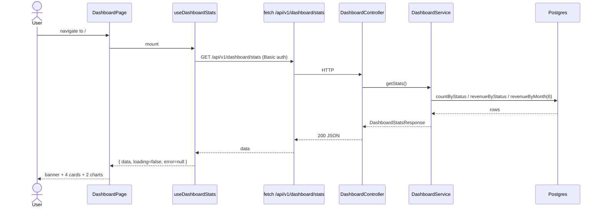
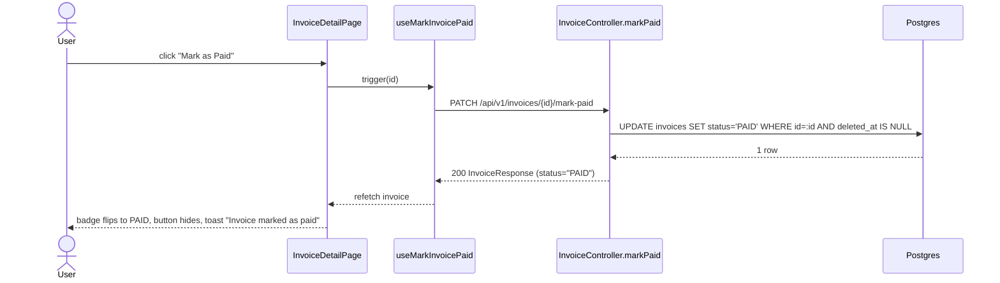

# Dashboard Upgrade — stats, charts, centralized Coolors palette, invoice status

## 1. Context & goal

Replace the placeholder home page with a Payfazz-style dashboard (welcome banner, 4 stat cards, revenue bar chart, status donut chart). At the same time, migrate the entire UI to a **centralized, token-driven** Coolors palette (`#000000 #14213D #FCA311 #E5E5E5 #FFFFFF`) so changing one CSS variable propagates everywhere. Expose invoice lifecycle status (DRAFT / SENT / PAID) in the list and detail pages with a Mark-as-Paid action. Success = the home route renders the new dashboard against real `/api/v1/dashboard/stats` data, no component contains a hardcoded hex, sidebar stays dark navy in light and dark mode, and every existing page still passes its visual + behavioural tests.

## 2. Acceptance criteria

- [ ] AC-1: `GET /api/v1/dashboard/stats` returns `{ totalInvoices, draftCount, sentCount, paidCount, totalRevenue, paidRevenue, pendingRevenue, revenueByMonth[] }` for the authenticated user; 401 when unauthenticated.
- [ ] AC-2: `PATCH /api/v1/invoices/{id}/mark-paid` transitions any status → `PAID` and returns the updated `InvoiceResponse`; 404 if not found; 401 unauthenticated.
- [ ] AC-3: Home page (`/`) renders welcome banner → 4 stat cards → revenue bar chart (last 6 months) + status donut chart side-by-side on `lg+`, stacked below.
- [ ] AC-4: Invoices list page shows a `Status` column with a `StatusBadge`; invoice detail page shows the badge in the header and a `Mark as Paid` button visible only when `status !== 'PAID'`.
- [ ] AC-5: **No source file under `frontend/src/**` contains a hardcoded hex** (`#RRGGBB` / `#RGB`) except `src/index.css` and `tailwind.config.*`. Verified by `grep -REn "#[0-9a-fA-F]{3,6}" src` returning only css/config matches.
- [ ] AC-6: All semantic tokens are defined once in `src/index.css` `@theme` + `:root` + `.dark` blocks; **sidebar** uses dedicated `--color-sidebar-*` tokens that do NOT flip with `.dark` (always dark navy).
- [ ] AC-7: Switching `--color-accent` in `:root` from `#FCA311` to any other hex visibly changes every accented surface (chart bar fill, donut PAID slice, Mark-as-Paid button, focus ring, sidebar active item) without source edits — manual smoke check.
- [ ] AC-8: Existing pages (Clients list/detail, Invoices list/detail, Login, Register, Settings) still render and pass their existing tests after the palette migration.
- [ ] AC-9: Vitest coverage ≥ 90 / 90 / 90 / 90 (lines/functions/statements/branches) for the frontend. JaCoCo line + branch ≥ 90 % for backend changes (excluding `dto/**` and `**/adapter/persistence/**/*Entity`).
- [ ] AC-10: Postman collection contains `GET /api/v1/dashboard/stats` and `PATCH /api/v1/invoices/{id}/mark-paid`; OpenAPI is regenerated.

## 3. Architecture

```mermaid
flowchart LR
    user[User] --> spa[React SPA]
    spa -->|GET /api/v1/dashboard/stats| dash[DashboardController]
    spa -->|PATCH /api/v1/invoices/:id/mark-paid| inv[InvoiceController]
    spa -->|GET /api/v1/invoices| inv
    dash --> dashSvc[DashboardService]
    inv --> invSvc[InvoiceService]
    dashSvc --> repo[(InvoiceRepository
        countByStatus
        revenueByStatus
        revenueByMonth)]
    invSvc --> repo
    repo --> db[(Postgres
        invoices.status)]

    subgraph Theme [Frontend theme system]
        idx[src/index.css
        @theme + :root + .dark]
        sb[--color-sidebar-* tokens
        light AND dark]
        idx -->|tokens| comp[All components
        bg-[var(--color-...)]]
        sb -->|tokens| sidebar[Sidebar.tsx]
    end
```

## 4. Sequence

### 4.1 Happy path — load dashboard



### 4.2 Edge case — mark as paid



## 5. File-by-file change list

### Backend

| Path | Action | Purpose |
|---|---|---|
| `backend/src/main/resources/db/migration/V6__add_invoice_status.sql` | keep (already exists) | Adds `status VARCHAR(10) NOT NULL DEFAULT 'DRAFT'` to `invoices`; backfills SENT for `last_sent_at IS NOT NULL` |
| `backend/src/main/resources/db/migration/V7__add_invoice_status_index.sql` | create | `CREATE INDEX ix_invoices_status ON invoices (status) WHERE deleted_at IS NULL;` for dashboard aggregates |
| `backend/src/main/java/.../domain/invoice/InvoiceStatus.java` | keep | enum DRAFT, SENT, PAID — already exists |
| `backend/src/main/java/.../domain/invoice/Invoice.java` | keep | record already has `InvoiceStatus status` |
| `backend/src/main/java/.../adapter/persistence/invoice/InvoiceEntity.java` | keep | `@Enumerated(EnumType.STRING)` field already exists |
| `backend/src/main/java/.../adapter/persistence/invoice/InvoiceEntityMapper.java` | verify | confirm `toEntity` and `toDomain` map `status` (no change if already done) |
| `backend/src/main/java/.../domain/invoice/InvoiceRepository.java` | keep | port has `markPaid`, `markSentIfDraft`, `countByStatus`, `revenueByStatus`, `revenueByMonth` |
| `backend/src/main/java/.../adapter/persistence/invoice/InvoiceJpaRepository.java` | keep | JPQL `markPaid`, `markSentIfDraft`, native `revenueByStatus`, `revenueByMonth` already wired |
| `backend/src/main/java/.../adapter/persistence/invoice/InvoiceRepositoryAdapter.java` | keep | delegates already in place |
| `backend/src/main/java/.../application/invoice/InvoiceService.java` | keep | `markAsPaid(id)` already exists; `sendEmail` transitions DRAFT→SENT |
| `backend/src/main/java/.../adapter/web/invoice/InvoiceController.java` | keep | `PATCH /{id}/mark-paid` already exposed; response DTO includes `status` |
| `backend/src/main/java/.../adapter/web/invoice/dto/InvoiceResponse.java` | keep | already has `String status` field |
| `backend/src/main/java/.../adapter/web/dashboard/DashboardController.java` | keep | `GET /api/v1/dashboard/stats` exists |
| `backend/src/main/java/.../adapter/web/dashboard/dto/DashboardStatsResponse.java` | keep | record with 7 scalars + `List<MonthlyRevenue>` |
| `backend/src/main/java/.../adapter/web/dashboard/dto/MonthlyRevenue.java` | keep | record `(String month, BigDecimal revenue)` |
| `backend/src/main/java/.../application/dashboard/DashboardService.java` | edit | log INFO (not DEBUG) on each `getStats()` for audit; ensure `revenueByMonth` returns exactly `REVENUE_MONTHS=6` slots, zero-filled if a month is empty (currently it skips empty months — fix by building a `YearMonth` list and merging) |
| `backend/src/main/java/.../config/SecurityConfig.java` | edit | add `.requestMatchers("/api/v1/dashboard/**").authenticated()` (or rely on catch-all `.anyRequest().authenticated()` — verify) |
| `backend/src/test/java/.../application/dashboard/DashboardServiceTest.java` | create | unit test with mocked `InvoiceRepository` covering empty DB, all-DRAFT, mixed statuses, zero-fill of missing months |
| `backend/src/test/java/.../adapter/web/dashboard/DashboardControllerTest.java` | create | `@WebMvcTest` slice via `MockMvcBuilders.webAppContextSetup` + `@MockitoBean DashboardService` + `@WithMockUser`; asserts 200 JSON shape and 401 anonymous |
| `backend/src/test/java/.../adapter/web/dashboard/DashboardControllerIT.java` | create | `@SpringBootTest(webEnvironment=RANDOM_PORT)` + Testcontainers Postgres; seeds 3 invoices (1 DRAFT, 1 SENT, 1 PAID), calls `/api/v1/dashboard/stats` with `RestClient`, asserts totals |
| `backend/src/test/java/.../application/invoice/InvoiceServiceTest.java` | edit | add `markAsPaid_transitions_status_to_PAID`, `markAsPaid_throws_InvoiceNotFound_when_missing`, `sendEmail_transitions_DRAFT_to_SENT` |
| `backend/src/test/java/.../adapter/web/invoice/InvoiceControllerTest.java` | edit | add `markPaid_returns_200_with_PAID_status`, `markPaid_returns_404_when_missing`, `markPaid_returns_401_when_anonymous` |
| `backend/src/test/java/.../adapter/persistence/invoice/InvoiceRepositoryAdapterIT.java` | edit | add `markPaid_persists_status_PAID`, `countByStatus_returns_grouped_counts`, `revenueByMonth_groups_by_yyyy_mm` |
| `backend/src/test/java/.../support/InvoiceFixtures.java` | edit | add `withStatus(InvoiceStatus)` builder helper |
| `postman/collection.json` | edit | add request for `GET /api/v1/dashboard/stats` and `PATCH /api/v1/invoices/{{id}}/mark-paid` with assertions on `status` field |

### Frontend — palette migration (touches every component)

| Path | Action | Purpose |
|---|---|---|
| `frontend/src/index.css` | edit | Replace `@theme` + `:root` + `.dark` blocks per §6 below. Add `--color-sidebar-*` tokens that are identical in light and dark. Add semantic chart tokens: `--color-chart-1`, `--color-chart-2`, `--color-chart-3`. Add status tokens: `--color-status-draft-bg`, `--color-status-draft-fg`, `--color-status-sent-bg`, `--color-status-sent-fg`, `--color-status-paid-bg`, `--color-status-paid-fg` |
| `frontend/src/shared/components/Sidebar.tsx` | edit | Replace every `bg-[#14213D]`, `border-[#1e2e52]`, `text-[#E5E5E5]`, `bg-[#FCA311]/20`, `text-[#FCA311]`, `ring-[#FCA311]`, `hover:bg-white/10` with `bg-[var(--color-sidebar-bg)]`, `border-[var(--color-sidebar-border)]`, `text-[var(--color-sidebar-text)]`, `bg-[var(--color-sidebar-active-bg)]`, `text-[var(--color-sidebar-active-text)]`, `ring-[var(--color-sidebar-active-text)]`, `hover:bg-[var(--color-sidebar-hover-bg)]` |
| `frontend/src/features/dashboard/ui/DashboardPage.tsx` | edit | Replace `bg-[#14213D]` → `bg-[var(--color-sidebar-bg)]` on welcome banner (we reuse the sidebar token because the banner is always dark in both themes); replace `text-[#E5E5E5]/80` → `text-[var(--color-sidebar-muted)]` |
| `frontend/src/features/dashboard/ui/StatCard.tsx` | edit | Drop hardcoded `border-l-[#FCA311]`, `border-l-[#22c55e]`, `border-l-[#3b82f6]`; introduce accent map → CSS tokens: `amber→--color-accent`, `green→--color-status-paid-fg`, `blue→--color-status-sent-fg`, `default→--color-border` |
| `frontend/src/features/dashboard/ui/RevenueChart.tsx` | edit | Use `getComputedStyle(document.documentElement).getPropertyValue('--color-accent')` via a small `useThemeColor` hook (memoised, listens to `MutationObserver` on `<html>` class for dark toggle). Pass to `<Bar fill={accent}>`. Grid stroke → `--color-border`. Tick fill → `--color-muted-foreground` |
| `frontend/src/features/dashboard/ui/InvoiceStatusChart.tsx` | edit | Replace `COLORS` hardcoded map with token reads via `useThemeColor` for `--color-status-draft-fg`, `--color-status-sent-fg`, `--color-status-paid-fg` |
| `frontend/src/shared/lib/useThemeColor.ts` | create | `export function useThemeColor(varName: string): string` — reads computed style on mount + observes `<html>` class flips; returns the resolved color string (hex/hsl). Memoised by `varName` |
| `frontend/src/shared/lib/useThemeColor.test.ts` | create | Vitest: stub `getComputedStyle`, assert it returns the resolved value, asserts re-read after `document.documentElement.classList.add('dark')` |
| `frontend/src/features/invoices/ui/InvoicesListPage.tsx` | edit | Remove inline `STATUS_CLASSES` + local `StatusBadge`; import `StatusBadge` from `@/features/invoices/ui/StatusBadge` |
| `frontend/src/features/invoices/ui/StatusBadge.tsx` | create | Reusable badge mapping `'DRAFT' \| 'SENT' \| 'PAID'` → token classes (`bg-[var(--color-status-{status}-bg)] text-[var(--color-status-{status}-fg)]`). i18n label via `t('invoices.status.{status}')` |
| `frontend/src/features/invoices/ui/StatusBadge.test.tsx` | create | Renders each status; asserts class names contain the token; asserts label uses i18n |
| `frontend/src/features/invoices/ui/InvoiceDetailPage.tsx` | edit | Show `<StatusBadge status={invoice.status} />` in header next to `{invoice.number}`; render `<MarkAsPaidButton invoiceId={id} status={invoice.status} onPaid={refetch} />` in action row |
| `frontend/src/features/invoices/ui/MarkAsPaidButton.tsx` | create | Button hidden when `status === 'PAID'`. Calls `markInvoicePaid(id)`, shows loading state, toast success/failure, calls `onPaid` |
| `frontend/src/features/invoices/ui/MarkAsPaidButton.test.tsx` | create | Renders/hides per status; calls API on click; success toast; failure toast |
| `frontend/src/features/invoices/api/markInvoicePaid.ts` | create | `markInvoicePaid(id: string): Promise<Invoice>` — `PATCH /api/v1/invoices/{id}/mark-paid` |
| `frontend/src/features/invoices/api/markInvoicePaid.test.ts` | create | MSW: success returns invoice with `status: 'PAID'`; 404 throws `ApiError` |
| `frontend/src/features/invoices/api/useMarkInvoicePaid.ts` | create | Hook wrapping the API call with `loading`/`error` state |
| `frontend/src/mocks/handlers.ts` | edit | Add `http.patch('/api/v1/invoices/:id/mark-paid', ...)` returning the invoice with `status: 'PAID'`; 404 if id unknown. (Dashboard handler already present.) |
| `frontend/src/shared/locales/en.json` | edit | Add `invoices.status.DRAFT/SENT/PAID`, `invoices.actions.markAsPaid`, `invoices.toast.markPaidSuccess/Failed`, `dashboard.welcome.title/subtitle`, `dashboard.cards.totalInvoices/totalRevenue/paidInvoices/pending`, `dashboard.charts.revenueByMonth/invoiceStatus`, `dashboard.error` |
| `frontend/src/features/dashboard/ui/DashboardPage.tsx` | edit (i18n) | Replace inline strings with `t('dashboard.welcome.title', { name })`, etc. Inject user name via existing `useAuthStore` |
| `frontend/src/features/dashboard/ui/DashboardPage.test.tsx` | edit | Update assertions to use new i18n keys; assert welcome banner uses sidebar token by reading `getComputedStyle` (smoke). Add test: `welcome banner background equals --color-sidebar-bg` |
| `frontend/src/features/dashboard/ui/StatCard.test.tsx` | create | Renders label/value/sub; accent="amber" applies `border-[var(--color-accent)]` class |
| `frontend/src/features/dashboard/ui/RevenueChart.test.tsx` | create | Renders responsive container; chart receives the 6 data points; XAxis labels are 3-letter months |
| `frontend/src/features/dashboard/ui/InvoiceStatusChart.test.tsx` | create | Renders pie when any count > 0; renders nothing meaningful when all zero (no slices) |
| `frontend/src/shared/components/Sidebar.test.tsx` | edit | Update existing class assertions to expect `bg-[var(--color-sidebar-bg)]` etc; assert dark mode does NOT change sidebar background (toggle `.dark`, re-read style) |
| `frontend/src/shared/components/AppShell.tsx` | keep | already uses `bg-[var(--color-background)]` |
| `frontend/src/shared/components/TopNav.tsx` | keep | already uses `var(--color-*)`; no change |
| `frontend/src/shared/ui/button.tsx` | keep | already token-driven |
| `frontend/src/shared/ui/card.tsx` | keep | already token-driven |
| `frontend/src/shared/ui/badge.tsx` | keep | already token-driven |
| `frontend/src/app/App.tsx` | keep | route table unchanged |
| `frontend/src/pages/HomePage.tsx` | keep | re-exports `DashboardPage` |
| `frontend/tailwind.config.*` | n/a | Tailwind v4 reads `@theme` block from `index.css` — no JS config |
| `frontend/tests/dashboard.spec.ts` | create | Playwright E2E: logs in, navigates to `/`, asserts welcome banner + stat cards + both charts visible; clicks Mark-as-Paid on first non-paid invoice → returns to `/`, asserts `paidCount` increased |

### Audit list (files to grep before merge — every component that currently uses tokens or could regress)

These files already use tokens correctly; the developer must **re-verify** that the new `:root` palette values don't break their visual contract:
- `src/features/auth/ui/*` (Login, Register, ForgotPassword)
- `src/features/clients/ui/*` (List, Detail, Form)
- `src/features/settings/ui/*` (template upload)
- `src/shared/ui/*` (button, card, badge, dropdown-menu, table, skeleton, dialog, separator, sonner, ProtectedRoute, PublicOnlyRoute, ThemeToggle, LanguageSelector, EmptyState, PageHeader, PageContainer, ErrorBoundary, Toast)
- `src/shared/components/*` (AppShell, TopNav)

## 6. API contract

| Method | Path | Auth | Request | Response | Errors |
|---|---|---|---|---|---|
| GET | `/api/v1/dashboard/stats` | Basic | none | `200 { totalInvoices: long, draftCount: long, sentCount: long, paidCount: long, totalRevenue: BigDecimal, paidRevenue: BigDecimal, pendingRevenue: BigDecimal, revenueByMonth: [{ month: "YYYY-MM", revenue: BigDecimal }] }` | `401 anonymous`, `500 unexpected` |
| PATCH | `/api/v1/invoices/{id}/mark-paid` | Basic | none (path param) | `200 InvoiceResponse` (with `status: "PAID"`) | `401 anonymous`, `404 invoice not found / soft-deleted` |
| GET | `/api/v1/invoices` | Basic | `?clientId=&page=&size=` | `200 PageResponse<InvoiceResponse>` (existing — now each entry includes `status`) | `401` |
| GET | `/api/v1/invoices/{id}` | Basic | none | `200 InvoiceResponse` (includes `status`) | `401`, `404` |

### Response shape — `DashboardStatsResponse`

```json
{
  "totalInvoices": 12,
  "draftCount": 4,
  "sentCount": 5,
  "paidCount": 3,
  "totalRevenue": "24500.00",
  "paidRevenue": "8200.00",
  "pendingRevenue": "16300.00",
  "revenueByMonth": [
    { "month": "2025-12", "revenue": "0.00" },
    { "month": "2026-01", "revenue": "3200.00" },
    { "month": "2026-02", "revenue": "4100.00" },
    { "month": "2026-03", "revenue": "5800.00" },
    { "month": "2026-04", "revenue": "4400.00" },
    { "month": "2026-05", "revenue": "7000.00" }
  ]
}
```

`revenueByMonth` is exactly 6 entries (current month + 5 prior), zero-filled.

### Response shape — `InvoiceResponse` (delta)

Adds existing `status: "DRAFT" | "SENT" | "PAID"` field — already present in `InvoiceResponse.java:23`.

## 7. Data model changes

| Change | Where | Status |
|---|---|---|
| `invoices.status VARCHAR(10) NOT NULL DEFAULT 'DRAFT'` | `V6__add_invoice_status.sql` | already shipped |
| Backfill `SENT` where `last_sent_at IS NOT NULL` | `V6__…` | already shipped |
| `CREATE INDEX ix_invoices_status ON invoices (status) WHERE deleted_at IS NULL` | new `V7__add_invoice_status_index.sql` | to add |
| `InvoiceEntity.status` (`@Enumerated(EnumType.STRING)`, length 10, default DRAFT) | `InvoiceEntity.java` | already present |
| `Invoice` record `InvoiceStatus status` field | `Invoice.java` | already present |

No new tables. Existing rows have `status='DRAFT'` (default) or `'SENT'` (from V6 backfill).

## 6b. Color system architecture (canonical reference)

### Palette mapping

| Hex | Role | Tokens it backs |
|---|---|---|
| `#000000` | Pure black — used sparingly | `--color-foreground` in light mode (text on white); shadow base |
| `#14213D` | Navy — brand primary, sidebar, dark surfaces | `--color-primary` (light), `--color-sidebar-bg` (both modes), `--color-background` (dark), `--color-card` (dark), `--color-foreground` (light alt) |
| `#FCA311` | Orange — accent, calls to action, primary chart bar, focus ring | `--color-accent`, `--color-ring`, `--color-chart-1`, `--color-status-paid-fg` (active state in sidebar), `--color-primary` (dark) |
| `#E5E5E5` | Light grey — borders, muted backgrounds, DRAFT chip | `--color-border`, `--color-input`, `--color-muted`, `--color-secondary`, `--color-sidebar-text`, `--color-status-draft-bg` |
| `#FFFFFF` | White — surfaces, primary text on dark | `--color-background` (light), `--color-card` (light), `--color-primary-foreground`, `--color-sidebar-active-text` (when active text is white), `--color-foreground` (dark) |

### `src/index.css` target shape

```css
@import 'tailwindcss';
@import '@fontsource/inter/400.css';
@import '@fontsource/inter/500.css';
@import '@fontsource/inter/600.css';
@import '@fontsource/inter/700.css';
@plugin 'tailwindcss-animate';

@custom-variant dark (&:where(.dark, .dark *));

@theme {
  --font-sans: 'Inter', ui-sans-serif, system-ui, sans-serif;
  --radius: 0.5rem;

  /* Coolors palette — raw */
  --palette-black:  #000000;
  --palette-navy:   #14213D;
  --palette-orange: #FCA311;
  --palette-grey:   #E5E5E5;
  --palette-white:  #FFFFFF;

  /* Semantic — light mode defaults */
  --color-background:           var(--palette-white);
  --color-foreground:           var(--palette-navy);
  --color-card:                 var(--palette-white);
  --color-card-foreground:      var(--palette-navy);
  --color-popover:              var(--palette-white);
  --color-popover-foreground:   var(--palette-navy);
  --color-primary:              var(--palette-navy);
  --color-primary-foreground:   var(--palette-white);
  --color-secondary:            var(--palette-grey);
  --color-secondary-foreground: var(--palette-navy);
  --color-muted:                var(--palette-grey);
  --color-muted-foreground:     #6b7280;          /* derived neutral; visible on white */
  --color-accent:               var(--palette-orange);
  --color-accent-foreground:    var(--palette-navy);
  --color-destructive:          #dc2626;
  --color-destructive-foreground: var(--palette-white);
  --color-border:               var(--palette-grey);
  --color-input:                var(--palette-grey);
  --color-ring:                 var(--palette-orange);

  /* Charts */
  --color-chart-1: var(--palette-orange);
  --color-chart-2: var(--palette-navy);
  --color-chart-3: var(--palette-grey);

  /* Status badges */
  --color-status-draft-bg: var(--palette-grey);
  --color-status-draft-fg: #4b5563;
  --color-status-sent-bg:  #dbeafe;
  --color-status-sent-fg:  #1d4ed8;
  --color-status-paid-bg:  #dcfce7;
  --color-status-paid-fg:  #166534;

  /* Sidebar — always dark, NOT overridden by .dark */
  --color-sidebar-bg:           var(--palette-navy);
  --color-sidebar-text:         var(--palette-grey);
  --color-sidebar-border:       #1e2e52;
  --color-sidebar-muted:        rgba(229, 229, 229, 0.6);
  --color-sidebar-active-bg:    rgba(252, 163, 17, 0.2);
  --color-sidebar-active-text:  var(--palette-orange);
  --color-sidebar-hover-bg:     rgba(255, 255, 255, 0.1);
}

:root { /* same as @theme — kept for runtime overrides */ }

.dark {
  --color-background:           var(--palette-navy);
  --color-foreground:           var(--palette-grey);
  --color-card:                 #1a2b4a;
  --color-card-foreground:      var(--palette-grey);
  --color-popover:              #1a2b4a;
  --color-popover-foreground:   var(--palette-grey);
  --color-primary:              var(--palette-orange);
  --color-primary-foreground:   var(--palette-navy);
  --color-secondary:            #1e2e52;
  --color-secondary-foreground: var(--palette-grey);
  --color-muted:                #1e2e52;
  --color-muted-foreground:     #9ca3af;
  --color-accent:               var(--palette-orange);
  --color-accent-foreground:    var(--palette-navy);
  --color-destructive:          #ef4444;
  --color-destructive-foreground: var(--palette-white);
  --color-border:               #1e2e52;
  --color-input:                #1e2e52;
  --color-ring:                 var(--palette-orange);
  /* sidebar tokens deliberately omitted — they inherit from :root, so sidebar stays dark navy */
}
```

### Tailwind usage rule (enforced by ESLint codemod step, then by review)

- **Allowed**: `bg-[var(--color-...)]`, `text-[var(--color-...)]`, `border-[var(--color-...)]`, `ring-[var(--color-...)]`.
- **Forbidden** anywhere outside `index.css`: literal `#RRGGBB`, `rgb()`, `rgba()`, Tailwind palette classes like `bg-blue-700`, `text-gray-600`, `bg-green-100`. Add a Semgrep rule + a simple `grep` step in `pnpm lint`.
- **Sidebar exception**: only `Sidebar.tsx` and the dashboard welcome banner use `--color-sidebar-*`.

### Components that need to be migrated off hardcoded colors

Found by `grep -REn "#[0-9a-fA-F]{3,6}" src` (results from analysis):
1. `src/shared/components/Sidebar.tsx` — 10+ occurrences of `#14213D`, `#1e2e52`, `#FCA311`, `#E5E5E5`
2. `src/features/dashboard/ui/DashboardPage.tsx` — `#14213D`, `#E5E5E5/80`
3. `src/features/dashboard/ui/StatCard.tsx` — `#FCA311`, `#22c55e`, `#3b82f6`
4. `src/features/dashboard/ui/RevenueChart.tsx` — `#FCA311`, `#e5e7eb`
5. `src/features/dashboard/ui/InvoiceStatusChart.tsx` — `#E5E5E5`, `#3b82f6`, `#22c55e`, `#ccc`
6. `src/features/invoices/ui/InvoicesListPage.tsx` — Tailwind palette classes `bg-gray-100 text-gray-600`, `bg-blue-100 text-blue-700`, `bg-green-100 text-green-700` (not hex but equally forbidden — migrate to `StatusBadge` using tokens)

Other files were verified token-compliant.

## 8. Test strategy

| Layer | Test | Asserts |
|---|---|---|
| Unit (BE) | `DashboardServiceTest.getStats_returns_zero_filled_six_months_when_empty_db` | result has exactly 6 entries, each `revenue=0`, current month is last |
| Unit (BE) | `DashboardServiceTest.getStats_aggregates_counts_per_status` | with mocked repo returning `[["DRAFT",4],["SENT",5],["PAID",3]]`, response = `{draft:4, sent:5, paid:3, total:12}` |
| Unit (BE) | `DashboardServiceTest.getStats_pending_equals_total_minus_paid` | mocked revenues; pendingRevenue is computed not fetched |
| Unit (BE) | `DashboardServiceTest.getStats_handles_null_revenue_rows` | repo returns `[["PAID", null]]` → response has paidRevenue=0 |
| Unit (BE) | `InvoiceServiceTest.markAsPaid_transitions_status_to_PAID` | uses InvoiceFixtures with status=SENT; after call, returned invoice has status=PAID |
| Unit (BE) | `InvoiceServiceTest.markAsPaid_throws_when_repo_returns_zero_rows` | mocked repo throws InvoiceNotFoundException; assert propagated |
| Unit (BE) | `InvoiceServiceTest.sendEmail_transitions_DRAFT_to_SENT` | starting status DRAFT, after sendEmail returns SENT |
| Unit (BE) | `DashboardControllerTest.getStats_returns_200_with_authentication` | `@WithMockUser` + MockMvc; asserts JSON shape via jsonPath |
| Unit (BE) | `DashboardControllerTest.getStats_returns_401_when_anonymous` | no `@WithMockUser`; asserts 401 |
| Unit (BE) | `InvoiceControllerTest.markPaid_returns_200` | mockBean InvoiceService.markAsPaid returns paid invoice; assert status="PAID" in JSON |
| Unit (BE) | `InvoiceControllerTest.markPaid_returns_404_when_missing` | service throws InvoiceNotFoundException; assert 404 |
| Integration (BE) | `DashboardControllerIT.aggregates_real_postgres_data` | Testcontainers Postgres + Flyway; seed 3 invoices (D/S/P); GET stats; assert counts and revenues exact |
| Integration (BE) | `InvoiceRepositoryAdapterIT.markPaid_persists_in_db` | save invoice DRAFT → adapter.markPaid → re-read via JPA → status=PAID |
| Integration (BE) | `InvoiceRepositoryAdapterIT.countByStatus_returns_grouped_counts` | seed mixed; assert map shape |
| Integration (BE) | `InvoiceRepositoryAdapterIT.revenueByMonth_groups_by_yyyy_mm_and_respects_window` | seed invoices in months -7, -3, current; assert only -3 + current appear when window=6 |
| Unit (FE) | `useThemeColor.test.ts` | resolves `--color-accent` from computed style; re-resolves when `<html>` class flips to `.dark` |
| Unit (FE) | `StatCard.test.tsx` | renders label/value/sub; `accent="amber"` adds class `border-[var(--color-accent)]` |
| Unit (FE) | `RevenueChart.test.tsx` | 6 bars rendered for 6 months; first XAxis tick contains expected month abbrev |
| Unit (FE) | `InvoiceStatusChart.test.tsx` | renders 3 cells with 3 distinct fill props (read via `useThemeColor`); empty data → no `<Cell>` |
| Unit (FE) | `DashboardPage.test.tsx` (updated) | banner uses `var(--color-sidebar-bg)` class string; 4 stat cards render; both charts render; error path renders `role=alert`; uses `t('dashboard.welcome.title')` |
| Unit (FE) | `StatusBadge.test.tsx` | renders DRAFT → class includes `--color-status-draft-bg`; PAID → `--color-status-paid-bg`; uses i18n label |
| Unit (FE) | `MarkAsPaidButton.test.tsx` | hidden when status=PAID; visible for DRAFT/SENT; click → calls `markInvoicePaid`; success toast; on failure → error toast |
| Unit (FE) | `markInvoicePaid.test.ts` | MSW: 200 returns invoice with status=PAID; 404 → throws ApiError |
| Unit (FE) | `InvoiceDetailPage.test.tsx` (updated) | shows StatusBadge in header; MarkAsPaidButton present when not paid; refetch triggers on success |
| Unit (FE) | `InvoicesListPage.test.tsx` (updated) | new `Status` column header; each row contains a `StatusBadge`; uses shared component (no inline) |
| Unit (FE) | `Sidebar.test.tsx` (updated) | computed background = sidebar token; toggling `.dark` on `<html>` does NOT change sidebar bg |
| E2E | `tests/dashboard.spec.ts` | login → land on `/` → banner visible → stat cards visible → revenue chart and donut visible → navigate to /invoices → click first non-paid row → click Mark as Paid → toast → back to / → paidCount visibly incremented |

### Coverage targets

- Backend JaCoCo: line ≥ 90 %, branch ≥ 90 %. Excluded: `dto/**`, `**/adapter/persistence/**/*Entity`, `**/config/**`. `DashboardService` and `InvoiceService.markAsPaid` covered by both unit + IT.
- Frontend Vitest: 90 / 90 / 90 / 90. New code (`useThemeColor`, `StatusBadge`, `MarkAsPaidButton`, `markInvoicePaid`, dashboard UI) all colocated with `.test.tsx` files.

## 9. Security considerations

| OWASP item | Applies? | Mitigation in this plan |
|---|---|---|
| A01 Broken Access Control | yes | Both new endpoints require authenticated user via existing `SecurityConfig` `.anyRequest().authenticated()`; `DashboardController` is class-mapped under `/api/v1/dashboard` which falls under the same default. **Verify** that the dashboard path is not in any `permitAll()` exception. |
| A03 Injection | yes | `revenueByMonth` uses a parameterised native query (`:months`) with a CAST to INTERVAL — no string concatenation of user input. `markPaid` uses JPQL with bound `:id`. |
| A04 Insecure Design | yes | `markAsPaid` is idempotent (PAID → PAID stays PAID, returns 200). Not exposed to anonymous. No state machine bypass: `markPaid` from any active state is intentionally allowed per AC-2. |
| A05 Security Misconfiguration | yes | Charts request no extra origins; recharts is bundled. No new CORS surface. Tailwind v4 inlines its own CSS — no CDN. |
| A07 Identification & Auth | yes | Re-uses existing HTTP Basic filter chain; no new auth surface. `@WithMockUser` in slice tests, fixed user/password in `@SpringBootTest` per project convention. |
| A08 Data Integrity Failures | low | `markPaid` writes only the `status` column; uses JPA `@Version` optimistic lock already on entity. |
| A09 Logging | yes | `DashboardService.getStats()` logs INFO `dashboard.stats requested by userId={}, totalInvoices={}` — no PII. `InvoiceService.markAsPaid` already logs INFO with invoice id only. |
| A10 SSRF | n/a | No outbound URLs in the new code. |

Frontend: chart libraries are not given `dangerouslySetInnerHTML`. The `useThemeColor` hook reads only from `document.documentElement` computed style — no user input.

## 10. Risks & open questions

| Risk / question | Default chosen |
|---|---|
| **Token name collision** between Tailwind v4 `@theme` defaults and our custom tokens | All custom tokens use the `--color-*` prefix that Tailwind v4 itself uses for its semantic palette; overriding works by definition. We do not redefine `--color-blue-500` etc. |
| **Sidebar in dark mode** — the user wants it always dark, but a future user toggle for "light sidebar" might be requested | Out of scope. Sidebar tokens live in `:root` only; not in `.dark`. If a light sidebar is wanted later, add `.dark` overrides for those 7 tokens — design already supports it. |
| **Recharts and CSS variables** — recharts SVG `fill` prop only takes a string, cannot bind to a CSS var directly | Resolved via `useThemeColor` hook (already factored). Hook re-reads on `MutationObserver` for `<html>` class change so dark mode updates chart colors live. |
| **`revenueByMonth` zero-fill** — current SQL skips months with no invoices, so the chart skips columns | Plan adds Java post-processing in `DashboardService.buildMonthlyRevenue` to compute the last 6 `YearMonth` slots and merge in repo rows, defaulting missing ones to `BigDecimal.ZERO`. |
| **H2 vs Postgres parity** — `TO_CHAR(..., 'YYYY-MM')` and `DATE_TRUNC` are Postgres-specific; ApplicationTests run on H2 | The Spring `test` profile that uses H2 only powers `ApplicationTests.contextLoads`. All dashboard tests use Testcontainers Postgres. **No dashboard test runs on H2.** Add `@ActiveProfiles` accordingly to keep CI green. |
| **InvoicesListPage** already has an inline `StatusBadge` — collision with new shared component | Default: delete inline, import shared. Snapshot/class tests will be updated in the same PR. |
| **MSW handler for `mark-paid`** — currently missing | Plan adds it; test for `useMarkInvoicePaid` depends on it. |
| **Welcome banner color** — should it follow `--color-card` (so dark mode flips it) or stay dark like sidebar (always navy)? | Default: stays dark (uses `--color-sidebar-bg`) for consistent brand identity, matching Payfazz reference. |
| **Date for dashboard "current month"** — clock injection | Use `java.time.Clock` bean, defaulting to `Clock.systemUTC()`; tests inject a fixed `Clock`. Add a `@Bean` in `config/`. |

## 11. Switchable Palettes

Two built-in palettes must be selectable at runtime without a page reload:

| ID | Name | Hex values |
|---|---|---|
| `navy-amber` | Navy & Amber (default) | `#000000` `#14213D` `#FCA311` `#E5E5E5` `#FFFFFF` |
| `teal-steel` | Teal & Steel | `#353535` `#3C6E71` `#FFFFFF` `#D9D9D9` `#284B63` |

### Token mapping for `teal-steel`

| Token | Value |
|---|---|
| `--palette-black` | `#353535` |
| `--palette-navy` | `#284B63` (dark surface) |
| `--palette-teal` | `#3C6E71` (replaces orange as accent) |
| `--palette-grey` | `#D9D9D9` |
| `--palette-white` | `#FFFFFF` |

Semantic mapping carries through unchanged — only the raw palette values differ.

### Implementation

**`src/index.css`** — add a `.palette-teal-steel` class block that overrides `--palette-*` tokens:
```css
.palette-teal-steel {
  --palette-navy:   #284B63;
  --palette-orange: #3C6E71;   /* reuse the orange slot → becomes teal */
  --palette-grey:   #D9D9D9;
  --palette-white:  #FFFFFF;
  --palette-black:  #353535;
  /* sidebar tokens must also be re-declared here */
  --color-sidebar-bg:          #284B63;
  --color-sidebar-border:      #1e3a52;
  --color-sidebar-active-text: #3C6E71;
  --color-sidebar-active-bg:   rgba(60, 110, 113, 0.2);
}
```

**`src/shared/theme/paletteStore.ts`** — Zustand store (same pattern as themeStore):
```ts
export type Palette = 'navy-amber' | 'teal-steel';
interface PaletteState { palette: Palette; setPalette: (p: Palette) => void; }
```

Persists to `localStorage` key `'invoice-tracker-palette'`. On change, toggles `.palette-teal-steel` on `document.documentElement`.

**`src/shared/theme/usePalette.ts`** — hook that reads/writes `paletteStore` and applies the class.

**`src/shared/theme/PaletteProvider.tsx`** — `useEffect` on mount that reads `localStorage` and applies the class before first paint (eliminates flash).

**`src/shared/components/PaletteToggle.tsx`** — button placed next to `ThemeToggle` in `TopNav`. Shows palette name; clicking cycles between the two palettes (or opens a mini-dropdown).

**`src/app/App.tsx`** — wrap with `<PaletteProvider>`.

### File additions

| Path | Action |
|---|---|
| `src/shared/theme/paletteStore.ts` | create |
| `src/shared/theme/usePalette.ts` | create |
| `src/shared/theme/PaletteProvider.tsx` | create |
| `src/shared/components/PaletteToggle.tsx` | create |
| `src/shared/components/PaletteToggle.test.tsx` | create — renders both palette names; click cycles palette; class applied to `<html>` |
| `src/index.css` | add `.palette-teal-steel` block |
| `src/app/App.tsx` | wrap with `<PaletteProvider>` |
| `src/shared/components/TopNav.tsx` | add `<PaletteToggle />` next to `<ThemeToggle />` |

### Constraints
- `useThemeColor` hook already listens to `MutationObserver` on `<html>` class — palette class changes will trigger chart color re-reads automatically.
- Adding more palettes in future = add one CSS class block + one entry in `Palette` union type. No component changes needed.
- E2E test: toggle palette → sidebar background changes → toggle back → restores.

## 12. Effort

`XL` — touches every component (palette migration), adds 4 new frontend components + 2 new backend test files + 1 migration + 1 new hook + palette switcher system, and requires regression sweeping of all existing pages and tests. Backend scaffold already exists but post-processing (zero-fill) + `Clock` injection + IT coverage still need to be written. Estimate: 2–3 dev days for the developer agent, plus a review cycle.
