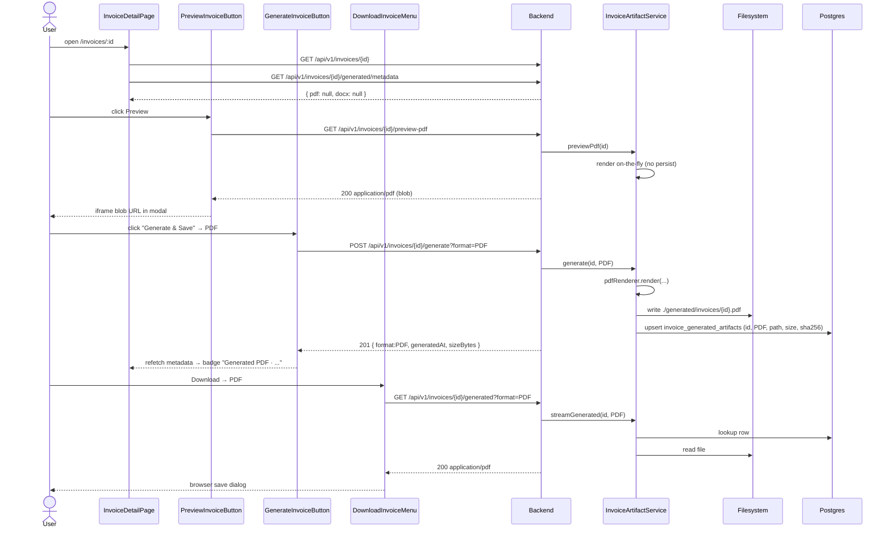

# Invoice template editor and full lifecycle (preview, generate, persist, download, email)

## 1. Context & goal

Today, users can only upload a DOCX template from Settings, and PDF/DOCX rendering happens on-the-fly per request with no persisted copy. This feature closes the lifecycle: an in-context template manager inside the Invoices area, an inline PDF preview, a "Generate & Save" action that persists the rendered bytes (so subsequent downloads serve the same artefact and an immutable copy survives template edits), a polished download menu (PDF / DOCX), and a one-click "Send by email" that operates on the persisted artefact when available. Success = a user can open an invoice, preview it inline, generate & save, then download or email the saved artefact without leaving the Invoices module.

## 2. Acceptance criteria

- [ ] AC-1: A new route `/invoices/template` (linked from the Invoices sidebar / list-page toolbar) renders an in-context **Template Manager** with current template metadata, placeholder reference (`{{company.*}}`, `{{client.*}}`, `{{invoice.*}}`, `{{lines}}` loop), download-current and upload-new actions — without navigating into Settings.
- [ ] AC-2: On `/invoices/:id`, a **Preview** button opens an inline PDF preview modal that streams `GET /api/v1/invoices/{id}/preview-pdf` into an `<iframe>` blob URL (no full page navigation). The modal closes on Esc / backdrop / Close button and exposes "Open in new tab" + "Download PDF" + "Download DOCX" actions.
- [ ] AC-3: A **Generate & Save** action on the invoice detail page calls `POST /api/v1/invoices/{id}/generate?format=PDF|DOCX` which renders the chosen format and persists it. After success the UI shows a `GeneratedArtifactBadge` ("Generated PDF · 14 May 2026") and subsequent **Download** / **Preview** / **Send email** actions serve the persisted bytes instead of re-rendering.
- [ ] AC-4: `GET /api/v1/invoices/{id}/generated?format=PDF|DOCX` streams the persisted artefact (404 if not generated yet). `GET /api/v1/invoices/{id}/generated/metadata` lists what has been generated (`{ pdf: {generatedAt, sizeBytes} | null, docx: {...} | null }`).
- [ ] AC-5: The existing `DownloadInvoiceMenu` is extended: when a generated artefact exists it labels the option "Download saved PDF / DOCX"; otherwise it falls back to the on-the-fly `/pdf` and `/docx` endpoints. A small chevron menu offers "Regenerate" which re-runs `/generate` and overwrites the stored bytes.
- [ ] AC-6: **Send by email** on the invoice detail page is surfaced as a primary post-preview CTA (kept in the action row). When a persisted PDF exists, `POST /api/v1/invoices/{id}/send-email` reuses those bytes; otherwise it falls back to live rendering. `last_sent_at` is updated only on SMTP success (existing behaviour preserved).
- [ ] AC-7: Persisted artefacts are stored on the filesystem under `app.invoice.generated-path` (default `./generated/invoices/<invoiceId>.{pdf|docx}`) and the location is recorded in a new `invoice_generated_artifacts` table (one row per `(invoiceId, format)`). Path traversal, max-size, and quota enforcement match the existing template-store hardening.
- [ ] AC-8: Soft-deleting an invoice marks any generated artefacts as orphaned (`deleted_at` set on the row); the on-disk file is deleted lazily by a cleanup hook in `InvoiceService.delete` (existing path) and confirmed by an integration test.
- [ ] AC-9: All new endpoints require HTTP Basic auth, return `application/problem+json` on error, log INFO with the invoice id (no PII), and stream `Cache-Control: private, no-store` on artefact responses.
- [ ] AC-10: New i18n keys are added under `invoices.template.*`, `invoices.preview.*`, `invoices.generate.*`, `invoices.actions.*` in `en.json`. No hard-coded user-visible strings.
- [ ] AC-11: Backend coverage gates remain `JaCoCo line+branch ≥ 0.95`. Frontend gates remain `Vitest 95/95/95/90`. New code must not drag the merged metrics below these thresholds; new code adds tests in the same PR.
- [ ] AC-12: Postman `collection.json` and `docs/openapi.json` include the four new endpoints; `docs/API.md`, `docs/FEATURES.md`, `docs/ARCHITECTURE.md`, `docs/SEQUENCE_DIAGRAMS.md`, `docs/CHANGELOG.md` updated by the documentation agent.

## 3. Architecture (mermaid)

```mermaid
flowchart LR
    subgraph FE["React SPA — src/features/invoices"]
      list[InvoicesListPage] -->|"Manage template"| tplMgr[InvoiceTemplateManagerPage<br/>/invoices/template]
      list --> detail[InvoiceDetailPage]
      detail --> preview[PreviewInvoiceButton<br/>blob iframe modal]
      detail --> gen[GenerateInvoiceButton<br/>PDF / DOCX dropdown]
      detail --> dl[DownloadInvoiceMenu<br/>saved-vs-live logic]
      detail --> send[SendInvoiceButton<br/>uses saved bytes if present]
      detail --> badge[GeneratedArtifactBadge]
      tplMgr -.reuses.-> tplForm[TemplateUploadForm]
      tplMgr --> placeholderRef[PlaceholderReferenceCard]
      preview --> api1[invoicePreviewApi.ts]
      gen --> api2[generatedArtifactApi.ts]
      dl --> api2
      send --> api3[invoicesApi.sendInvoiceEmail]
      api1 -->|"GET /preview-pdf"| BE
      api2 -->|"POST /generate, GET /generated"| BE
      api3 -->|"POST /send-email"| BE
    end
    subgraph BE["Spring Boot — adapter.web.invoice"]
      ctl[InvoiceController<br/>+ /preview-pdf<br/>+ /generate<br/>+ /generated<br/>+ /generated/metadata]
      svc[InvoiceArtifactService<br/>application.invoice]
      renderSvc[InvoiceRenderService<br/>existing]
      store[FilesystemGeneratedArtifactStore<br/>adapter.artifact]
      jpa[InvoiceGeneratedArtifactRepositoryAdapter<br/>adapter.persistence.invoice]
    end
    subgraph DB[(Postgres)]
      t_inv[invoices]
      t_art[invoice_generated_artifacts<br/>NEW]
    end
    subgraph FS[(Filesystem)]
      gen_dir["./generated/invoices/&lt;id&gt;.pdf|.docx"]
    end
    ctl --> svc
    svc --> renderSvc
    svc --> store
    svc --> jpa
    store --> gen_dir
    jpa --> t_art
    t_art -. FK .-> t_inv
```

## 4. Sequence diagrams

### 4a. Happy path — preview, generate, download



### 4b. Edge case — regenerate after template change

```mermaid
sequenceDiagram
    actor U as User
    participant Tpl as InvoiceTemplateManagerPage
    participant FE as InvoiceDetailPage
    participant API as Backend
    participant SVC as InvoiceArtifactService
    U->>Tpl: upload new template.docx
    Tpl->>API: POST /api/v1/settings/invoice-template
    API-->>Tpl: 200 (template replaced)
    Note over Tpl,API: existing artefacts are NOT auto-invalidated
    U->>FE: open /invoices/:id
    FE-->>U: badge still shows old "Generated PDF · 12 May"
    U->>FE: click "Regenerate" in DownloadMenu
    FE->>API: POST /api/v1/invoices/{id}/generate?format=PDF&overwrite=true
    API->>SVC: generate(id, PDF, overwrite=true)
    SVC->>SVC: render with new template
    SVC->>API: persist; bump generated_at
    API-->>FE: 200 { format:PDF, generatedAt: now, sha256 changed }
    FE-->>U: badge updated, toast "Regenerated"
```

## 5. File-by-file change list

### Backend — create

| Path | Action | Purpose |
|---|---|---|
| `backend/src/main/resources/db/migration/V8__create_invoice_generated_artifacts.sql` | create | New table + FK + partial unique `(invoice_id, format) WHERE deleted_at IS NULL`. |
| `backend/src/main/java/com/example/invoicetracker/domain/invoice/GeneratedArtifact.java` | create | Record `(invoiceId UUID, format ArtifactFormat, relativePath String, sizeBytes long, sha256 String, generatedAt Instant, deletedAt Instant)`. |
| `backend/src/main/java/com/example/invoicetracker/domain/invoice/ArtifactFormat.java` | create | Enum `PDF`, `DOCX`. |
| `backend/src/main/java/com/example/invoicetracker/domain/invoice/GeneratedArtifactRepository.java` | create | Port — `find(invoiceId, format)`, `findAllByInvoice(invoiceId)`, `upsert(GeneratedArtifact)`, `softDeleteByInvoice(invoiceId)`. |
| `backend/src/main/java/com/example/invoicetracker/domain/invoice/GeneratedArtifactNotFoundException.java` | create | 404 → `GENERATED_ARTIFACT_NOT_FOUND`. |
| `backend/src/main/java/com/example/invoicetracker/application/invoice/GeneratedArtifactStore.java` | create | Port — `write(invoiceId, format, bytes) → relativePath`, `read(relativePath) → byte[]`, `delete(relativePath)`. |
| `backend/src/main/java/com/example/invoicetracker/application/invoice/InvoiceArtifactService.java` | create | Use-case service: `previewPdf(id)`, `generate(id, format, overwrite)`, `streamGenerated(id, format)`, `metadata(id)`, `deleteAll(id)`. Wraps `InvoiceRenderService` + `GeneratedArtifactStore` + `GeneratedArtifactRepository`. `@Transactional` boundaries: write methods transactional, reads readOnly. |
| `backend/src/main/java/com/example/invoicetracker/application/invoice/GeneratedArtifactProperties.java` | create | `@ConfigurationProperties("app.invoice.generated")` — `path Path` (default `./generated/invoices`), `maxBytesPerArtifact long` (default 25 MiB), `enabled boolean` (default true). |
| `backend/src/main/java/com/example/invoicetracker/adapter/artifact/FilesystemGeneratedArtifactStore.java` | create | Implements `GeneratedArtifactStore`. Same hardening pattern as `FilesystemInvoiceTemplateStore`: canonical path normalisation, atomic write via tmp+move, parent dir creation, SHA-256 computation, size cap. |
| `backend/src/main/java/com/example/invoicetracker/adapter/persistence/invoice/GeneratedArtifactEntity.java` | create | JPA entity → `invoice_generated_artifacts`. Lombok `@Getter/@Setter/@NoArgsConstructor`. |
| `backend/src/main/java/com/example/invoicetracker/adapter/persistence/invoice/GeneratedArtifactJpaRepository.java` | create | Spring Data JPA repo. |
| `backend/src/main/java/com/example/invoicetracker/adapter/persistence/invoice/GeneratedArtifactEntityMapper.java` | create | Domain ↔ entity mapping. |
| `backend/src/main/java/com/example/invoicetracker/adapter/persistence/invoice/GeneratedArtifactRepositoryAdapter.java` | create | Implements `GeneratedArtifactRepository` port. |
| `backend/src/main/java/com/example/invoicetracker/adapter/web/invoice/dto/GeneratedArtifactResponse.java` | create | `record GeneratedArtifactResponse(String format, Instant generatedAt, long sizeBytes, String sha256)`. |
| `backend/src/main/java/com/example/invoicetracker/adapter/web/invoice/dto/InvoiceArtifactsMetadataResponse.java` | create | `record InvoiceArtifactsMetadataResponse(GeneratedArtifactResponse pdf, GeneratedArtifactResponse docx)`. |

### Backend — edit

| Path | Action | Purpose |
|---|---|---|
| `backend/src/main/java/com/example/invoicetracker/adapter/web/invoice/InvoiceController.java` | edit | Add 4 endpoints: `GET /{id}/preview-pdf` (live render — no persist; `Cache-Control: private, no-store`); `POST /{id}/generate?format=PDF\|DOCX&overwrite=false` → `201`; `GET /{id}/generated?format=PDF\|DOCX` → `200` stream; `GET /{id}/generated/metadata` → JSON. Inject `InvoiceArtifactService`. |
| `backend/src/main/java/com/example/invoicetracker/application/invoice/InvoiceService.java` | edit | `sendEmail(UUID)` — try resolving persisted PDF via `InvoiceArtifactService.findPdfBytes(id)` first; fall back to live `pdfRenderer.render` if absent. Inject `InvoiceArtifactService` (added constructor arg). `delete(UUID)` (if exists) — call `artifactService.deleteAll(id)`. |
| `backend/src/main/java/com/example/invoicetracker/application/invoice/InvoiceRenderService.java` | edit | `sendEmail(UUID)` — same as above for the `/docx-email` pipeline. |
| `backend/src/main/java/com/example/invoicetracker/adapter/web/error/GlobalExceptionHandler.java` | edit | Map `GeneratedArtifactNotFoundException` → 404 `GENERATED_ARTIFACT_NOT_FOUND`. |
| `backend/src/main/resources/application.yml` | edit | Add `app.invoice.generated.path: ./generated/invoices`, `app.invoice.generated.max-bytes-per-artifact: 26214400`, `app.invoice.generated.enabled: true`. Mirror in `local`/`docker`/`ci` profiles where overrides matter. |
| `backend/src/main/java/com/example/invoicetracker/config/AppConfig.java` | edit | `@EnableConfigurationProperties(GeneratedArtifactProperties.class)` (added next to existing `InvoiceTemplateProperties`). |
| `backend/Dockerfile` | edit | `RUN mkdir -p /app/generated/invoices && chown -R appuser:appuser /app/generated` so a non-root container can write. |
| `templates/project/docker-compose.yml` *(N/A — project-specific)* `projects/invoice-tracker/docker-compose.yml` | edit | Add named volume `generated_invoices:/app/generated/invoices` for the backend service so files survive container restarts. |

### Frontend — create

| Path | Action | Purpose |
|---|---|---|
| `frontend/src/features/invoices/model/artifact.ts` | create | Types: `ArtifactFormat = 'PDF'\|'DOCX'`, `GeneratedArtifact`, `InvoiceArtifactsMetadata`. |
| `frontend/src/features/invoices/api/generatedArtifactApi.ts` | create | `getArtifactsMetadata(id)`, `generateArtifact(id, format, overwrite?)`, `downloadGeneratedArtifact(id, format, filename)`, `getPreviewPdfBlobUrl(id) → Promise<string>` (creates and returns `URL.createObjectURL(blob)` so caller can revoke). |
| `frontend/src/features/invoices/api/generatedArtifactApi.test.ts` | create | Vitest + MSW unit tests covering success, 404, network error. |
| `frontend/src/features/invoices/api/useGeneratedArtifactsMetadata.ts` | create | React hook mirroring `useInvoice` (no React-Query introduced unless already adopted). |
| `frontend/src/features/invoices/api/useGeneratedArtifactsMetadata.test.ts` | create | Hook test. |
| `frontend/src/features/invoices/ui/PreviewInvoiceButton.tsx` | create | Opens shadcn `Dialog`; fetches blob via `getPreviewPdfBlobUrl(id)`; renders `<iframe src={blobUrl} sandbox="allow-same-origin">`; revokes the object URL in `useEffect` cleanup; exposes "Open in new tab", "Download PDF", "Download DOCX" buttons that reuse `DownloadInvoiceMenu` API helpers. |
| `frontend/src/features/invoices/ui/PreviewInvoiceButton.test.tsx` | create | RTL: renders, opens, calls API, revokes URL on unmount, handles 404. |
| `frontend/src/features/invoices/ui/GenerateInvoiceButton.tsx` | create | shadcn `DropdownMenu` ("Generate PDF" / "Generate DOCX") + loading state per format + Sonner toast on success/failure + emits `onGenerated` callback to refetch metadata. |
| `frontend/src/features/invoices/ui/GenerateInvoiceButton.test.tsx` | create | RTL: renders, fires both formats, error toast, success callback. |
| `frontend/src/features/invoices/ui/GeneratedArtifactBadge.tsx` | create | Renders a small `Badge` showing "Generated PDF · 14 May 2026" / "Generated DOCX · ..." with `formatDate` helper; absent when neither present. |
| `frontend/src/features/invoices/ui/GeneratedArtifactBadge.test.tsx` | create | RTL coverage. |
| `frontend/src/features/invoices/ui/InvoiceTemplateManagerPage.tsx` | create | In-context page at `/invoices/template`: reuses `useTemplateMetadata` + `TemplateUploadForm` + new `PlaceholderReferenceCard`; back link to `/invoices`. |
| `frontend/src/features/invoices/ui/InvoiceTemplateManagerPage.test.tsx` | create | RTL — loading, default warning, upload flow. |
| `frontend/src/features/invoices/ui/PlaceholderReferenceCard.tsx` | create | Static, i18n-driven reference card listing the `{{company.*}}`, `{{client.*}}`, `{{invoice.*}}`, `{{lines}}` placeholders, with "Copy" buttons (`navigator.clipboard.writeText`). |
| `frontend/src/features/invoices/ui/PlaceholderReferenceCard.test.tsx` | create | Snapshot + clipboard mock test. |
| `frontend/src/pages/InvoiceTemplateManagerPage.tsx` | create | Thin re-export — matches existing project pattern of one-file pages under `src/pages/`. |
| `frontend/tests/invoices/preview-and-generate.spec.ts` | create | Playwright E2E: open invoice, preview, generate PDF, download saved PDF (assert filename + content-type), regenerate. |
| `frontend/tests/invoices/template-manager.spec.ts` | create | Playwright E2E: from `/invoices` open template manager, see placeholder reference, upload a valid DOCX, see updated metadata. |
| `frontend/tests/invoices/send-with-saved.spec.ts` | create | Playwright E2E: generate PDF, click Send, assert MailHog received attachment matching saved bytes. |

### Frontend — edit

| Path | Action | Purpose |
|---|---|---|
| `frontend/src/features/invoices/ui/InvoiceDetailPage.tsx` | edit | Action row order: `PreviewInvoiceButton`, `GenerateInvoiceButton`, `DownloadInvoiceMenu`, `SendInvoiceButton`, `MarkAsPaidButton`, `GeneratedArtifactBadge`, existing `InvoiceSentBadge`. Pass `metadata`/`refetchMetadata` to children. |
| `frontend/src/features/invoices/ui/DownloadInvoiceMenu.tsx` | edit | Accept `metadata: InvoiceArtifactsMetadata` prop. When `metadata.pdf != null`, label item "Download saved PDF" and hit `GET /generated?format=PDF`; same for DOCX. Add "Regenerate" sub-item that calls `generateArtifact(id, fmt, true)`. Keep on-the-fly fallback when no saved artefact. |
| `frontend/src/features/invoices/ui/DownloadInvoiceMenu.test.tsx` | edit | Cover saved-vs-live branching + regenerate. |
| `frontend/src/features/invoices/ui/SendInvoiceButton.tsx` | edit | No URL change; rely on backend choosing saved-vs-live. Add subtitle to confirm dialog: "Will use saved PDF if generated, otherwise renders live." (i18n). |
| `frontend/src/features/invoices/ui/SendInvoiceButton.test.tsx` | edit | Add assertion for new subtitle string. |
| `frontend/src/features/invoices/ui/InvoicesListPage.tsx` | edit | Toolbar adds `<Link to="/invoices/template">` button "Manage template". |
| `frontend/src/features/invoices/ui/InvoicesListPage.test.tsx` | edit | Assert link renders + nav. |
| `frontend/src/app/App.tsx` | edit | Add `<Route path="/invoices/template" element={<InvoiceTemplateManagerPage />} />`. |
| `frontend/src/app/App.test.tsx` | edit | Cover new route. |
| `frontend/src/shared/components/navItems.ts` | edit | Add child item `{ to: '/invoices/template', labelKey: 'nav.invoiceTemplate' }` under "Invoices" (or keep flat; pick child default). |
| `frontend/src/i18n/en.json` | edit | Add `invoices.preview.*`, `invoices.generate.*`, `invoices.actions.preview/generate/regenerate/downloadSavedPdf/downloadSavedDocx`, `invoices.template.title/intro/placeholders.*/copyPlaceholder/back`, `invoices.toast.generateSuccess/generateFailed/regenerated/previewFailed`, `invoices.badge.generatedPdf/generatedDocx`, `nav.invoiceTemplate`. |
| `frontend/src/mocks/handlers.ts` | edit | Add MSW handlers: `GET /preview-pdf` (returns small bytes), `POST /generate` (returns artefact JSON), `GET /generated` (returns bytes), `GET /generated/metadata` (returns JSON, configurable via test setup). |

### Tests — backend (create)

| Path | Action | Purpose |
|---|---|---|
| `backend/src/test/java/com/example/invoicetracker/application/invoice/InvoiceArtifactServiceTest.java` | create | Unit — happy path, overwrite=false collision, missing template fallback, max-size guard. |
| `backend/src/test/java/com/example/invoicetracker/adapter/artifact/FilesystemGeneratedArtifactStoreTest.java` | create | Unit — write/read/delete round-trip; path traversal rejected; tmp file cleaned on failure. |
| `backend/src/test/java/com/example/invoicetracker/adapter/persistence/invoice/GeneratedArtifactRepositoryAdapterIT.java` | create | Testcontainers Postgres — upsert + soft delete + partial-unique behaviour. |
| `backend/src/test/java/com/example/invoicetracker/adapter/web/invoice/InvoiceArtifactControllerTest.java` | create | `@WebMvcTest`-style — happy paths + 401/404 for each new endpoint. |
| `backend/src/test/java/com/example/invoicetracker/adapter/web/invoice/InvoiceArtifactControllerIT.java` | create | `@SpringBootTest webEnvironment=RANDOM_PORT` — end-to-end on a real Postgres + temp directory: generate, download, regenerate, send-email-with-saved. |

## 6. API contract

| Method | Path | Auth | Request | Success Response | Errors |
|---|---|---|---|---|---|
| GET | `/api/v1/invoices/{id}/preview-pdf` | Basic | — | `200 application/pdf`, `Content-Disposition: inline; filename="invoice-<number>.pdf"`, `Cache-Control: private, no-store` | `401 UNAUTHENTICATED`, `404 INVOICE_NOT_FOUND`, `502 PDF_CONVERSION_FAILED`, `503 PDF_CONVERSION_BUSY` |
| POST | `/api/v1/invoices/{id}/generate?format=PDF\|DOCX&overwrite=true\|false` (default `overwrite=false`) | Basic | empty body | `201 application/json` `{ "format":"PDF", "generatedAt":"...", "sizeBytes":12345, "sha256":"..." }` | `400 VALIDATION_FAILED` (bad format), `401`, `404 INVOICE_NOT_FOUND`, `409 ARTIFACT_ALREADY_EXISTS` (when `overwrite=false` and row exists), `413 ARTIFACT_TOO_LARGE`, `502 PDF_CONVERSION_FAILED`, `503 PDF_CONVERSION_BUSY` |
| GET | `/api/v1/invoices/{id}/generated?format=PDF\|DOCX` | Basic | — | `200` PDF or DOCX bytes, `Content-Disposition: attachment; filename="invoice-<number>.<ext>"`, `Cache-Control: private, no-store` | `401`, `404 INVOICE_NOT_FOUND`, `404 GENERATED_ARTIFACT_NOT_FOUND` |
| GET | `/api/v1/invoices/{id}/generated/metadata` | Basic | — | `200 application/json` `{ "pdf": GeneratedArtifactResponse \| null, "docx": GeneratedArtifactResponse \| null }` | `401`, `404 INVOICE_NOT_FOUND` |
| (unchanged) POST | `/api/v1/invoices/{id}/send-email` | Basic | empty body | `200 { "lastSentAt":"..." }` — implementation now prefers saved PDF when present | `401`, `404`, `422 INVOICE_HAS_NO_RECIPIENT`, `502 PDF_CONVERSION_FAILED`, `502 EMAIL_DELIVERY_FAILED` |

**Error code additions** (`GlobalExceptionHandler` + `docs/API.md`):

| Code | Status | Meaning |
|---|---|---|
| `GENERATED_ARTIFACT_NOT_FOUND` | 404 | Artefact has not been generated for this invoice+format. |
| `ARTIFACT_ALREADY_EXISTS` | 409 | `overwrite=false` and a row exists. |
| `ARTIFACT_TOO_LARGE` | 413 | Rendered bytes exceed `app.invoice.generated.max-bytes-per-artifact`. |

## 7. Data model changes

**New table** `invoice_generated_artifacts`:

```sql
-- V8__create_invoice_generated_artifacts.sql
CREATE TABLE invoice_generated_artifacts (
    id            UUID         PRIMARY KEY,
    invoice_id    UUID         NOT NULL REFERENCES invoices(id) ON DELETE CASCADE,
    format        VARCHAR(8)   NOT NULL CHECK (format IN ('PDF','DOCX')),
    relative_path VARCHAR(512) NOT NULL,
    size_bytes    BIGINT       NOT NULL CHECK (size_bytes >= 0),
    sha256        CHAR(64)     NOT NULL,
    generated_at  TIMESTAMPTZ  NOT NULL DEFAULT now(),
    deleted_at    TIMESTAMPTZ,
    version       BIGINT       NOT NULL DEFAULT 0
);

CREATE UNIQUE INDEX ux_iga_invoice_format_active
    ON invoice_generated_artifacts (invoice_id, format) WHERE deleted_at IS NULL;
CREATE INDEX ix_iga_invoice_id ON invoice_generated_artifacts (invoice_id);
```

- Partial unique mirrors the `clients`/`invoices` soft-delete pattern (ADR-002).
- `relative_path` is filesystem-relative to `app.invoice.generated.path`; never absolute. Adapter prepends the canonical root.
- No schema change to `invoices`.

## 8. Test strategy

| Layer | Test | Asserts |
|---|---|---|
| Unit (BE) | `InvoiceArtifactServiceTest.preview_uses_live_renderer_and_never_persists` | repo never called; renderer called once. |
| Unit (BE) | `InvoiceArtifactServiceTest.generate_pdf_persists_row_and_writes_file` | store.write + repo.upsert each called once; returned `generatedAt` set. |
| Unit (BE) | `InvoiceArtifactServiceTest.generate_throws_when_overwrite_false_and_row_exists` | `ArtifactAlreadyExistsException`. |
| Unit (BE) | `InvoiceArtifactServiceTest.generate_with_overwrite_true_replaces_and_bumps_generatedAt` | new sha256 and timestamp recorded. |
| Unit (BE) | `InvoiceArtifactServiceTest.streamGenerated_returns_bytes_when_row_present` | store.read called with stored path. |
| Unit (BE) | `InvoiceArtifactServiceTest.streamGenerated_throws_404_when_missing` | `GeneratedArtifactNotFoundException`. |
| Unit (BE) | `InvoiceArtifactServiceTest.metadata_returns_both_nulls_when_none_generated` | DTO `pdf=null, docx=null`. |
| Unit (BE) | `InvoiceArtifactServiceTest.deleteAll_removes_files_and_marks_rows_deleted` | store.delete + repo.softDelete called for both formats. |
| Unit (BE) | `InvoiceArtifactServiceTest.generate_rejects_bytes_above_max_size` | `ArtifactTooLargeException`. |
| Unit (BE) | `FilesystemGeneratedArtifactStoreTest.write_creates_file_with_sha256` | bytes on disk, SHA matches, atomic move used. |
| Unit (BE) | `FilesystemGeneratedArtifactStoreTest.read_returns_bytes_when_present` | round-trip equality. |
| Unit (BE) | `FilesystemGeneratedArtifactStoreTest.read_throws_when_file_missing` | `IOException`. |
| Unit (BE) | `FilesystemGeneratedArtifactStoreTest.delete_is_idempotent` | no exception when file already gone. |
| Unit (BE) | `FilesystemGeneratedArtifactStoreTest.rejects_path_traversal_attempts` | `IllegalArgumentException` on `../etc/passwd`. |
| Unit (BE) | `InvoiceServiceTest.sendEmail_uses_saved_pdf_when_present` | `pdfRenderer.render` NOT called; `store.read` IS called. |
| Unit (BE) | `InvoiceServiceTest.sendEmail_falls_back_to_live_render_when_no_saved` | `pdfRenderer.render` called. |
| Unit (BE) | `InvoiceRenderServiceTest.sendEmail_uses_saved_pdf_when_present` | mirror of above for the DOCX-pipeline send-email. |
| Unit (BE) | `InvoiceArtifactControllerTest.preview_returns_application_pdf_inline` | content-type, disposition `inline`, body length > 0. |
| Unit (BE) | `InvoiceArtifactControllerTest.generate_returns_201_with_metadata` | status 201, body JSON shape, `Location` header optional. |
| Unit (BE) | `InvoiceArtifactControllerTest.generate_returns_409_when_overwrite_false_and_exists` | problem-detail code `ARTIFACT_ALREADY_EXISTS`. |
| Unit (BE) | `InvoiceArtifactControllerTest.streamGenerated_returns_404_when_missing` | `GENERATED_ARTIFACT_NOT_FOUND`. |
| Unit (BE) | `InvoiceArtifactControllerTest.metadata_returns_both_formats_or_nulls` | JSON keys present. |
| Unit (BE) | `InvoiceArtifactControllerTest.all_endpoints_return_401_without_auth` | bare `MockMvc` no auth → 401 for the four routes. |
| Integration (BE) | `InvoiceArtifactControllerIT.full_lifecycle_pdf` | Testcontainers Postgres + temp `app.invoice.generated.path`: generate → metadata → download bytes equal → regenerate (sha256 changes). |
| Integration (BE) | `InvoiceArtifactControllerIT.send_email_uses_saved_when_present` | MailHog receives attachment of exactly `sha256(persisted)`. |
| Integration (BE) | `GeneratedArtifactRepositoryAdapterIT.partial_unique_allows_resurrection_after_softdelete` | soft delete row then upsert same `(invoice,format)` succeeds. |
| Unit (FE) | `generatedArtifactApi.test.ts` | success 200, 404, 502 paths. |
| Unit (FE) | `useGeneratedArtifactsMetadata.test.ts` | loading/error/data states. |
| Unit (FE) | `PreviewInvoiceButton.test.tsx` | opens modal, fetches blob, revokes URL on unmount, "Open in new tab" anchor renders. |
| Unit (FE) | `GenerateInvoiceButton.test.tsx` | both formats invoke API; success toast; refetch callback fired. |
| Unit (FE) | `GeneratedArtifactBadge.test.tsx` | renders for PDF, DOCX, both, none. |
| Unit (FE) | `DownloadInvoiceMenu.test.tsx` (extended) | saved labels when metadata present; live labels otherwise; regenerate path. |
| Unit (FE) | `InvoiceTemplateManagerPage.test.tsx` | loading + metadata + upload-success refetch + placeholder card present. |
| Unit (FE) | `PlaceholderReferenceCard.test.tsx` | renders all placeholder strings; copy button writes to clipboard. |
| Unit (FE) | `InvoiceDetailPage.test.tsx` (existing — extend) | new buttons render in expected order; badge visible after `generated/metadata` returns non-null. |
| Unit (FE) | `InvoicesListPage.test.tsx` (extended) | "Manage template" link present. |
| E2E (Playwright) | `tests/invoices/preview-and-generate.spec.ts` | preview opens modal, generate PDF, download saved PDF (assert content-type), regenerate updates badge. |
| E2E (Playwright) | `tests/invoices/template-manager.spec.ts` | from `/invoices` click "Manage template" → upload .docx → metadata updates → back link to `/invoices`. |
| E2E (Playwright) | `tests/invoices/send-with-saved.spec.ts` | generate PDF then Send → MailHog `/api/v2/messages` returns 1 message with PDF attachment. |

**Coverage budget**: backend gate 95/95 lines/branches merged across unit+IT — new files have explicit branch tests for each conditional (overwrite/no-overwrite, saved/live fallback, format enum, soft-delete state). Frontend gate 95/95/95/90 — every new component has a `.test.tsx` covering loading, success, error.

## 9. Security considerations

| OWASP item | Applies? | Mitigation in this plan |
|---|---|---|
| A01 Broken Access Control | yes | All four endpoints require HTTP Basic via existing `SecurityConfig` (no rule changes — they fall under `/api/v1/invoices/**` which is already authenticated). Tests assert 401 without credentials. |
| A02 Cryptographic Failures | partial | `Cache-Control: private, no-store` on every artefact response; SHA-256 recorded and surfaced for integrity checks; no plaintext credentials in YAML or logs. |
| A03 Injection | yes | JPA parameter binding only; `format` parsed via enum (rejects strings outside `PDF`/`DOCX`); `relative_path` is computed server-side (not user input). |
| A04 Insecure Design | yes | `overwrite=false` default prevents accidental clobber; explicit Regenerate flow. Soft-delete on artefacts mirrors the existing project pattern. |
| A05 Security Misconfiguration | yes | New `app.invoice.generated.path` is canonicalised and validated; container directory is created with non-root ownership in Dockerfile. |
| A06 Vulnerable Components | yes | No new third-party deps — reuses poi-tl, LibreOffice, existing renderers. |
| A07 Identification & Auth Failures | yes | Authenticated user identity is not embedded in `relative_path`; `invoice_id` UUID is the only correlator (cannot be enumerated by file scan). |
| A08 Software & Data Integrity Failures | yes | SHA-256 stored in DB; integration test asserts hash matches bytes on read. Atomic write via tmp+move (no half-written files). |
| A09 Security Logging & Monitoring | yes | INFO logs on generate/regenerate/delete with `invoiceId` only (no email, no path, no bytes). |
| A10 SSRF | n/a | No outbound calls in this feature. (Template SSRF check already in place — unchanged.) |

**Explicit non-goals**: rate-limiting on `/generate` (tracked as follow-up, same as send-email R-1); per-tenant quotas (single-tenant deployment for v1).

## 10. Risks & open questions

- **R-1**: Local FS may not survive container redeploy → default to a Docker named volume `generated_invoices:/app/generated/invoices` in `projects/invoice-tracker/docker-compose.yml`. Production-grade object storage (S3) is a follow-up port-swap (`GeneratedArtifactStore` is the port). **Default**: filesystem store for v1.
- **R-2**: Saving the rendered PDF means a template edit will NOT propagate to previously-generated invoices → surface the "Regenerate" action explicitly in `DownloadInvoiceMenu` and document in `docs/FEATURES.md`. **Default**: do not auto-invalidate.
- **R-3**: `Preview` re-renders on every click (no caching) — accept for v1; LibreOffice semaphore (`Semaphore(2)`) already throttles concurrent renders. **Default**: no preview cache.
- **R-4**: Storage growth (25 MiB × N invoices) — add startup INFO log of total `generated/` size; future cleanup job tracked as `FEAT-artifact-cleanup`. **Default**: no automatic eviction.
- **R-5**: `POST /generate` is not idempotent if `overwrite=true` is sent twice — the second call still succeeds and bumps `generated_at`. **Default**: accept; idempotency-keys are out of scope.
- **R-6**: Existing `/pdf` and `/docx-pdf` endpoints remain on-the-fly. **Default**: leave them; do not silently redirect to saved bytes — preserves backward compatibility for Postman/external callers. Send-email is the only existing endpoint that auto-prefers saved bytes (because we control that flow end-to-end).
- **R-7**: Frontend tooltip for "Manage template" inside Invoices duplicates the Settings entry. **Default**: keep both, mark Settings entry as the canonical home (same destination is fine — the new route is `/invoices/template`, distinct from `/settings/invoice-template`). Sidebar shows "Manage template" only under Invoices to reduce noise.

## 11. Effort

`L` because: 1 new table + migration, 1 new persistence adapter + JPA repo + mapper + entity, 1 new application service, 1 new filesystem adapter, 4 new REST endpoints with multipart-style streaming, 6 new frontend components, 1 new route, multi-format download menu refactor, Docker volume + Dockerfile change, ≥ 12 new backend tests, ≥ 8 new frontend unit tests, 3 new Playwright specs, plus full doc set (API.md, FEATURES.md, ARCHITECTURE.md mermaid, SEQUENCE_DIAGRAMS.md, CHANGELOG.md, openapi.json, Postman collection). Cuts across domain, application, both adapters, REST, FE feature slice, infrastructure, tests, and docs — comfortably in the L bucket but not XL (no auth/session model changes, no new third-party deps, no new external integrations).
