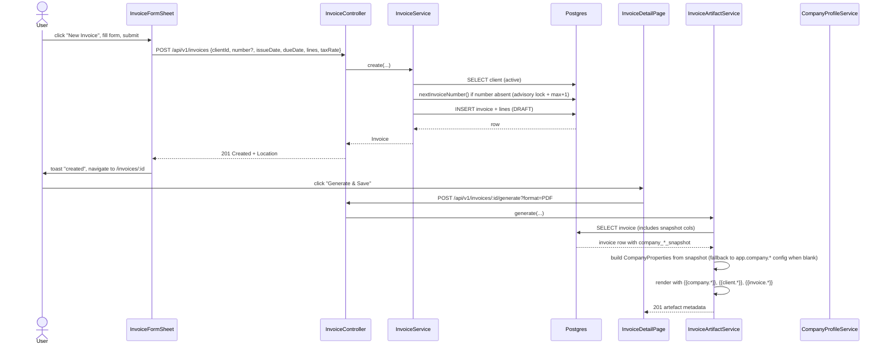

# Invoice creation form, per-client company profile, and invoices UX overhaul

## DESIGN REVISION (2026-05-15)

The original plan used a **global singleton `company_profile`** table. This is replaced by:

1. **Per-client company profile** — each `Client` stores the billing entity (your company) details used when invoicing that client. This allows different sender profiles for different clients (e.g. separate IBAN/bank per client).
2. **Invoice data snapshot** — at invoice creation (and on DRAFT update when the client changes), the client's data and company profile are snapshotted into the invoice so that future edits to the client do not alter existing invoices.
3. **IBAN, Swift/BIC, bank name** — added to the company profile fields (matching real invoice format: see example invoice `Invoice April 2023.docx`).
4. **Remove global `CompanyProfile`** — delete the entire `company_profile` table, domain, service, controller, and frontend page that were implemented in the first pass. Replace with per-client company fields and invoice snapshots.

The example invoice (`Invoice April 2023.docx`) shows the expected output:
- **Vendor**: name, address, VAT number
- **Bank**: IBAN, Swift/BIC, bank name
- **Client**: name, address
- **Invoice**: number, date
- **Service**: line description, subtotal, VAT, total

### New data model

```sql
-- V9 (REPLACES company_profile migration): Add per-client company profile fields
ALTER TABLE clients
  ADD COLUMN company_name       VARCHAR(200)  NOT NULL DEFAULT '',
  ADD COLUMN company_address    VARCHAR(500)  NOT NULL DEFAULT '',
  ADD COLUMN company_vat_number VARCHAR(50)   NOT NULL DEFAULT '',
  ADD COLUMN company_iban       VARCHAR(100)  NOT NULL DEFAULT '',
  ADD COLUMN company_swift_bic  VARCHAR(20)   NOT NULL DEFAULT '',
  ADD COLUMN company_bank_name  VARCHAR(200)  NOT NULL DEFAULT '';

-- V10: Add invoice snapshot columns (nullable for backward compat with old rows)
ALTER TABLE invoices
  ADD COLUMN client_name_snapshot        VARCHAR(200) NOT NULL DEFAULT '',
  ADD COLUMN client_address_snapshot     VARCHAR(500) NOT NULL DEFAULT '',
  ADD COLUMN company_name_snapshot       VARCHAR(200) NOT NULL DEFAULT '',
  ADD COLUMN company_address_snapshot    VARCHAR(500) NOT NULL DEFAULT '',
  ADD COLUMN company_vat_snapshot        VARCHAR(50)  NOT NULL DEFAULT '',
  ADD COLUMN company_iban_snapshot       VARCHAR(100) NOT NULL DEFAULT '',
  ADD COLUMN company_swift_snapshot      VARCHAR(20)  NOT NULL DEFAULT '',
  ADD COLUMN company_bank_name_snapshot  VARCHAR(200) NOT NULL DEFAULT '';
```

### Updated CompanyProperties record

```java
public record CompanyProperties(
    String name,
    String address,
    String email,    // kept for email templates
    String taxId,    // kept as alias; also populated from vatNumber snapshot
    String vatNumber,
    String iban,
    String swiftBic,
    String bankName
) {}
```

### Files to DELETE (from first-pass implementation):

**Backend:**
- `backend/src/main/resources/db/migration/V9__create_company_profile.sql`  → REPLACE with client company fields migration
- `domain/company/CompanyProfile.java`
- `domain/company/CompanyProfileRepository.java`
- `adapter/persistence/company/CompanyProfileEntity.java`
- `adapter/persistence/company/CompanyProfileJpaRepository.java`
- `adapter/persistence/company/CompanyProfileRepositoryAdapter.java`
- `application/company/CompanyProfileService.java`
- `application/company/CompanyProfileCommand.java`
- `adapter/web/settings/CompanyProfileController.java`
- `adapter/web/settings/dto/CompanyProfileResponse.java`
- `adapter/web/settings/dto/UpdateCompanyProfileRequest.java`
- All `*CompanyProfile*Test*.java` files

**Frontend:**
- `src/features/settings/api/companyProfileApi.ts` + `.test.ts`
- `src/features/settings/api/useCompanyProfile.ts` + `.test.ts`
- `src/features/settings/model/companySchema.ts` + `.test.ts`
- `src/features/settings/ui/CompanyProfilePage.tsx` + `.test.tsx`
- `src/pages/CompanyProfilePage.tsx` + `.test.tsx`

## 1. Context & goal

Users currently cannot create invoices from the UI: there is no "New Invoice" button and no form. The sidebar wrongly places "Manage template" under Invoices, the template page exposes a placeholder reference card that confuses users. This feature delivers (a) full invoice CRUD via a sheet form, (b) **per-client company profile** with IBAN/bank details that get snapshotted into invoices, (c) sidebar/navigation cleanup, and (d) sourcing of `{{company.*}}` and `{{client.*}}` placeholders from the invoice snapshot at render time.

## 2. Acceptance criteria

- [ ] AC-1: `Invoices` list page shows a "New Invoice" button next to the page title; clicking it opens an `InvoiceFormSheet` (right-side drawer, same UX as `ClientsPage` -> `ClientFormSheet`).
- [ ] AC-2: In the create sheet the user picks a client from a searchable dropdown (active clients only); invoice number is pre-filled with the next sequential value `INV-YYYY-NNNN` (4-digit, zero-padded, scoped to the current year) but remains editable.
- [ ] AC-3: The sheet enforces: client required; issue & due dates required with `dueDate >= issueDate`; tax rate `0 <= x <= 1`; at least one line item; per line `description` non-blank, `quantity >= 1`, `unitPrice >= 0` with up to 2 decimals. Subtotal, tax amount and total are recomputed live; readouts use the same formatting as the detail page.
- [ ] AC-4: Submitting the create form POSTs `/api/v1/invoices` and on success closes the sheet, refreshes the list, and shows a success toast `invoices.toast.created`.
- [ ] AC-5: Invoice detail page shows an `Edit` button (only when status is `DRAFT`) that opens the same sheet pre-filled; submitting it calls `PUT /api/v1/invoices/{id}`; toast `invoices.toast.updated`.
- [ ] AC-6: Invoice detail page shows a `Delete` button with a `ConfirmDeleteDialog`; confirming calls `DELETE /api/v1/invoices/{id}` (existing soft-delete from FEAT-20260514-02) and navigates back to `/invoices`; toast `invoices.toast.deleted`.
- [ ] AC-7: Sidebar `Invoices` item has **no** `Manage template` child; the `Manage template` page remains reachable via `Settings -> Invoice template` (existing route) and the "Settings" header link. The list-page header chip linking to `/invoices/template` is removed.
- [ ] AC-8: `InvoiceTemplateManagerPage` no longer renders `PlaceholderReferenceCard`; the component file and its colocated test are deleted.
- [ ] AC-9: The `Client` form gains six new optional fields — `companyName`, `companyAddress`, `companyVatNumber`, `companyIban`, `companySwiftBic`, `companyBankName` — matching the per-client company profile stored in the `clients` table. Existing clients see blank defaults; values are editable from the client edit sheet.
- [ ] AC-10: At invoice creation (and on DRAFT update when the client changes), the client's company profile fields are snapshotted into the invoice row. `GeneratedArtifact` rendering fills `{{company.*}}` placeholders from the invoice snapshot, falling back to `app.company.*` config only when the snapshot is blank.
- [ ] AC-11: The Postman collection contains every new/changed endpoint and `docs/openapi.json` regenerates cleanly. CHANGELOG, FEATURES, ARCHITECTURE, SEQUENCE diagrams updated.
- [ ] AC-12: Quality gates pass: JaCoCo line + branch >= 95%, Vitest 95/95/95/90, ESLint + Checkstyle + PMD + SpotBugs + OWASP-DC clean, Playwright suite green.

## 3. Architecture (mermaid)

```mermaid
flowchart LR
    subgraph FE[React SPA]
        ILP[InvoicesListPage]
        IFS[InvoiceFormSheet]
        IDP[InvoiceDetailPage]
        CFP[ClientFormSheet]
        SB[Sidebar]
    end

    subgraph BE[Spring Boot]
        IC[InvoiceController]
        CC[ClientController]
        IS[InvoiceService]
        IAS[InvoiceArtifactService]
        REND[PoiTl + OpenPdf Renderers]
    end

    subgraph DB[(Postgres)]
        T_INV[invoices + snapshot cols]
        T_CLI[clients + company_* cols]
        T_LINES[invoice_lines]
    end

    ILP -->|opens| IFS
    IFS -->|POST/PUT /api/v1/invoices| IC
    IDP -->|DELETE /api/v1/invoices/:id| IC
    IC --> IS --> T_INV
    IS -.snapshots company_* on create/update.-> T_CLI
    CFP -->|PUT /api/v1/clients/:id| CC --> T_CLI
    IAS --> REND
    REND -.reads company.* from snapshot cols.-> T_INV
    T_INV --- T_LINES
```

## 4. Sequence (happy path: create invoice + generate)



Edge case: concurrent creates racing on the auto-generated number. Both call `nextInvoiceNumber()` inside a single transaction that takes `SELECT pg_advisory_xact_lock(hashtext('invoice_number_' || year))`, computes `max(number)+1`, then INSERTs. The advisory lock prevents the race; the existing partial unique index on `lower(number)` is the belt-and-braces guarantee that surfaces `409 Conflict` via the existing `InvoiceNumberTakenException` handler if the user manually typed a colliding number.

## 5. File-by-file change list

### Backend

| Path | Action | Purpose |
|---|---|---|
| `backend/src/main/resources/db/migration/V9__add_company_profile_to_clients.sql` | create/replace | `ALTER TABLE clients ADD COLUMN company_name VARCHAR(200) NOT NULL DEFAULT ''` (+ address, vat_number, iban, swift_bic, bank_name). Replaces the original singleton `company_profile` migration. |
| `backend/src/main/resources/db/migration/V10__add_snapshot_to_invoices.sql` | create | `ALTER TABLE invoices ADD COLUMN client_name_snapshot … company_*_snapshot` (all NOT NULL DEFAULT ''). |
| `backend/src/main/java/.../domain/client/Client.java` | edit | Add six `companyXxx` fields to the domain record; update `ClientRepository` port. |
| `backend/src/main/java/.../adapter/persistence/client/ClientEntity.java` | edit | Map the six new columns. |
| `backend/src/main/java/.../adapter/persistence/invoice/InvoiceEntity.java` | edit | Map the eight new snapshot columns. |
| `backend/src/main/java/.../application/invoice/InvoiceService.java` | edit | (a) `create(...)` now accepts an optional `number` (null -> server generates via `nextInvoiceNumber()`); (b) add `update(UUID, ...)` that rejects non-DRAFT with `InvoiceNotEditableException`; (c) add `nextInvoiceNumber()` using advisory lock + repository scan for the current year. |
| `backend/src/main/java/.../application/invoice/InvoiceArtifactService.java` | edit | Build `CompanyProperties` from the invoice's snapshot columns at render time; fall back to the injected `app.company.*` config bean when the snapshot is all-blank. No `CompanyProfileService` dependency. |
| `backend/src/main/java/.../domain/invoice/InvoiceRepository.java` | edit | Add `Invoice update(Invoice invoice)` (replace lines, update fields); add `String findMaxNumberForYear(int year)`. |
| `backend/src/main/java/.../adapter/persistence/invoice/InvoiceRepositoryAdapter.java` | edit | Implement the two new methods. `update` deletes existing lines then inserts new ones (matches FK ON DELETE CASCADE on `invoice_lines`); `findMaxNumberForYear` uses a JPQL `MAX` on `number` where number LIKE `INV-{year}-%`. |
| `backend/src/main/java/.../adapter/persistence/invoice/InvoiceJpaRepository.java` | edit | Add `@Query` for max-number-by-year and `@Modifying` advisory lock query (or call via `EntityManager.createNativeQuery`). |
| `backend/src/main/java/.../domain/invoice/InvoiceNotEditableException.java` | create | Thrown by `update()` when invoice status != DRAFT. Mapped to `409 Conflict` with `code=INVOICE_NOT_EDITABLE`. |
| `backend/src/main/java/.../adapter/web/error/InvoiceExceptionHandler.java` | edit | Add `@ExceptionHandler(InvoiceNotEditableException.class)`. |
| `backend/src/main/java/.../adapter/web/invoice/InvoiceController.java` | edit | (a) `number` becomes optional in `CreateInvoiceRequest`; (b) add `@PutMapping("/{id}")` taking `UpdateInvoiceRequest`. |
| `backend/src/main/java/.../adapter/web/invoice/dto/CreateInvoiceRequest.java` | edit | Drop `@NotBlank` on `number`; keep `@Size(max=64)` and pattern when present. |
| `backend/src/main/java/.../adapter/web/invoice/dto/UpdateInvoiceRequest.java` | create | Record mirroring `CreateInvoiceRequest` but `number` optional. |
| `backend/src/main/java/.../config/InvoicePropertiesConfig.java` | edit | Keep `CompanyProperties` binding (used as fallback). No removal. |
| `backend/src/test/java/.../application/company/CompanyProfileServiceTest.java` | create | Unit: get returns seeded empty record; update persists trimmed values; `toRenderProperties` falls back to config when DB blank. |
| `backend/src/test/java/.../adapter/web/settings/CompanyProfileControllerTest.java` | create | `@WebMvcTest` slice: GET 200, PUT 200, PUT 400 on invalid email, 401 unauthenticated. |
| `backend/src/test/java/.../adapter/web/settings/CompanyProfileControllerIT.java` | create | `@SpringBootTest` + Testcontainers: end-to-end PUT then GET round-trip; row uses singleton id. |
| `backend/src/test/java/.../application/invoice/InvoiceServiceUpdateTest.java` | create | update on DRAFT succeeds; update on SENT throws `InvoiceNotEditableException`; lines replaced atomically. |
| `backend/src/test/java/.../application/invoice/InvoiceServiceNumberGenerationTest.java` | create | `nextInvoiceNumber()` returns `INV-YYYY-0001` for empty year; increments correctly; rolls over per year. |
| `backend/src/test/java/.../adapter/web/invoice/InvoiceControllerUpdateTest.java` | create | PUT 200 happy path; 409 on non-DRAFT; 400 on validation. |
| `backend/src/test/java/.../adapter/persistence/invoice/InvoiceRepositoryAdapterUpdateIT.java` | create | Testcontainers: update replaces lines, preserves id, version increments, `findMaxNumberForYear` returns expected string. |
| `backend/src/test/java/.../adapter/persistence/company/CompanyProfileRepositoryAdapterIT.java` | create | Testcontainers: load returns seeded row; save updates in place; singleton id constraint rejects a second row. |
| `backend/src/test/java/.../application/invoice/InvoiceArtifactServiceCompanyProfileTest.java` | create | Renders DOCX using DB-backed company profile; falls back to config when DB blank. |

### Frontend

| Path | Action | Purpose |
|---|---|---|
| `frontend/src/features/invoices/model/schema.ts` | edit | Add `invoiceLineFormSchema` (line item input) and `invoiceFormSchema` for the form payload (number optional, dates ISO, taxRate `0..1`, lines non-empty). Export `InvoiceFormValues`, `InvoiceLineFormValues`. |
| `frontend/src/features/invoices/model/types.ts` | edit | Add `CreateInvoicePayload`, `UpdateInvoicePayload`. |
| `frontend/src/features/invoices/api/invoicesApi.ts` | edit | Add `createInvoice(payload)`, `updateInvoice(id, payload)`, `deleteInvoice(id)`, `listClientsForPicker()` (re-uses `/api/v1/clients`). |
| `frontend/src/features/invoices/api/useCreateInvoice.ts` + `.test.ts` | create | Mutation hook with success/error states; MSW tests for 201, 400 validation, 409 number-taken. |
| `frontend/src/features/invoices/api/useUpdateInvoice.ts` + `.test.ts` | create | Same shape as create; covers 409 INVOICE_NOT_EDITABLE. |
| `frontend/src/features/invoices/api/useDeleteInvoice.ts` + `.test.ts` | create | Calls DELETE; tests 204 and 404. |
| `frontend/src/features/invoices/ui/InvoiceForm.tsx` + `.test.tsx` | create | Pure form component (no fetch): client dropdown (searchable using existing clients hook), number input (auto-fill placeholder shown when blank), issue/due date pickers, tax rate %, line items table with add/remove rows, live subtotal/tax/total readouts. Mirrors `ClientForm.tsx` styling. |
| `frontend/src/features/invoices/ui/InvoiceFormSheet.tsx` + `.test.tsx` | create | Right-side drawer wrapping `InvoiceForm`, mirrors `ClientFormSheet.tsx`. |
| `frontend/src/features/invoices/ui/InvoicesListPage.tsx` | edit | Full overhaul: search input (by invoice #), status filter dropdown (ALL/DRAFT/SENT/PAID), per-row icon actions (Eye→preview PDF, Pencil→edit sheet for DRAFT only, Trash→confirm delete), inline `ConfirmDeleteDialog`, wires `useUpdateInvoice` + `useDeleteInvoice`, controlled `PreviewInvoiceButton`. Removes old `<Link>` on number column in favour of inline actions. |
| `frontend/src/features/invoices/ui/InvoicesListPage.test.tsx` | edit | Add tests: search filters rows; status filter shows/hides rows; edit button opens sheet; delete confirm flow; preview opens dialog. |
| `frontend/src/features/invoices/ui/PreviewInvoiceButton.tsx` | edit | Add optional `open` + `onOpenChange` props for controlled/triggerless mode; backward-compatible (button still renders when props absent). |
| `frontend/src/features/invoices/ui/InvoiceDetailPage.tsx` | edit | Add `Edit` button (visible when status === 'DRAFT') that opens `InvoiceFormSheet` pre-filled and refetches on success; add `Delete` button -> `ConfirmDeleteDialog` -> on confirm calls `deleteInvoice` then `navigate('/invoices')`. |
| `frontend/src/features/invoices/ui/InvoiceDetailPage.test.tsx` | edit | Add tests: Edit button hidden for SENT/PAID; Delete confirm flow; navigation after delete. |
| `frontend/src/features/clients/ui/ClientsPage.tsx` | edit | Add `<Plus>` icon to "New Client" button for visual consistency with "New Invoice". |
| `frontend/src/shared/components/PageContainer.tsx` | edit | Remove `max-w-7xl mx-auto` — replace with `w-full` so page content fills the sidebar layout instead of centering. |
| `frontend/src/features/clients/ui/ClientDetailPage.tsx` | edit | Remove `mx-auto max-w-2xl` from page root — detail content now spans full width. |
| `frontend/src/features/invoices/ui/PlaceholderReferenceCard.tsx` | delete | No longer needed. |
| `frontend/src/features/invoices/ui/PlaceholderReferenceCard.test.tsx` | delete | Drop alongside the component. |
| `frontend/src/features/invoices/ui/InvoiceTemplateManagerPage.tsx` | edit | Remove the import and the `<PlaceholderReferenceCard />` render at line 116. |
| `frontend/src/features/invoices/ui/InvoiceTemplateManagerPage.test.tsx` | edit | Remove the assertion that checks the placeholder card renders. |
| `frontend/src/shared/components/Sidebar.tsx` | edit | (a) remove `children: [...]` from the Invoices `NAV_ITEMS` entry (drops the `Manage template` sub-item); (b) add `{ to: '/settings/company', labelKey: 'nav.settingsCompany', icon: Building2 }` to `SETTINGS_ITEMS`. |
| `frontend/src/shared/components/Sidebar.test.tsx` | edit | Remove invoices-sub-item assertion; add settings-company assertion. |
| `frontend/src/shared/locales/en.json` | edit | Remove no-longer-rendered `invoiceTemplate` child key from the Invoices subtree if unused; add `nav.settingsCompany`, `settings.company.*` (page title, field labels, save/saved toasts), `invoices.toast.created/updated/deleted`, `invoices.form.*` (field labels, errors), `invoices.detail.edit`, `invoices.detail.delete`. |
| `frontend/src/shared/locales/<other-langs>.json` | edit | Mirror new keys (placeholder English values acceptable if no translator). |
| `frontend/src/features/settings/api/companyProfileApi.ts` + `.test.ts` | **delete** | Removed — settings/company endpoint no longer exists. |
| `frontend/src/features/settings/api/useCompanyProfile.ts` + `.test.ts` | **delete** | Removed alongside the API. |
| `frontend/src/features/settings/model/companySchema.ts` + `.test.ts` | **delete** | Removed. |
| `frontend/src/features/settings/ui/CompanyProfilePage.tsx` + `.test.tsx` | **delete** | Removed — company profile is now edited via the client form. |
| `frontend/src/pages/CompanyProfilePage.tsx` | **delete** | Removed. |
| `frontend/src/features/clients/ui/ClientForm.tsx` | edit | Add six `company*` fields (companyName, companyAddress, companyVatNumber, companyIban, companySwiftBic, companyBankName) to the client form. |
| `frontend/src/mocks/handlers.ts` | edit | Add MSW handlers for `POST/PUT /api/v1/invoices`, `DELETE /api/v1/invoices/:id`; update client handlers for new company fields. |
| `frontend/tests/invoices/create-invoice.spec.ts` | create | Playwright happy path: login -> Invoices -> New Invoice -> pick client -> add 2 lines -> save -> sees row in list -> opens detail. |
| `frontend/tests/invoices/edit-delete-invoice.spec.ts` | create | Playwright: open DRAFT -> Edit -> change number -> save; then Delete with confirm -> back at list. |

### Docs / Postman

| Path | Action | Purpose |
|---|---|---|
| `docs/ARCHITECTURE.md` | edit | Add `company_profile` table to ER diagram; mark renderer dependency on `CompanyProfileService`. |
| `docs/FEATURES.md` | edit | Add FEAT-20260515-01 row with summary + ACs. |
| `docs/CHANGELOG.md` | edit | New entry under unreleased. |
| `docs/SEQUENCE_DIAGRAMS.md` | edit | Add "Create invoice" sequence and "Update company profile" sequence. |
| `docs/API.md` | edit | Document `GET/PUT /api/v1/settings/company`, `PUT/DELETE /api/v1/invoices/{id}`, auto-numbering behaviour. |
| `docs/openapi.json` | regenerate | Spring Doc auto-generates from controllers; commit refresh. |
| `postman/collection.json` | edit | Add four requests (create variant with empty number, update, delete, get-company, put-company). |

## 6. API contract

| Method | Path | Auth | Request | Response | Errors |
|---|---|---|---|---|---|
| POST | `/api/v1/invoices` | session | `{ clientId: uuid, number?: string<=64, issueDate: ISO date, dueDate: ISO date>=issueDate, lines: [{description<=500, quantity>=1, unitPrice>=0}]+, taxRate: 0..1 }` | `201 { id, number, ... }` + `Location` | 400 validation, 404 `CLIENT_NOT_FOUND`, 409 `INVOICE_NUMBER_TAKEN`, 401 |
| PUT | `/api/v1/invoices/{id}` | session | same shape as POST (number optional, retained if omitted) | `200 { ... }` | 400 validation, 404 `INVOICE_NOT_FOUND`, 409 `INVOICE_NOT_EDITABLE` (status != DRAFT), 409 `INVOICE_NUMBER_TAKEN`, 401 |
| DELETE | `/api/v1/invoices/{id}` | session | – | `204 No Content` | 404 `INVOICE_NOT_FOUND`, 401 |
| PUT | `/api/v1/clients/{id}` | session | Extended with `companyName`, `companyAddress`, `companyVatNumber`, `companyIban`, `companySwiftBic`, `companyBankName` (all optional, max lengths match DB cols) | `200 { ...client }` | 400 validation, 404, 401 |

Note: `GET/PUT /api/v1/settings/company` **removed** — replaced by per-client company profile fields on the `PUT /api/v1/clients/{id}` endpoint.

Error envelope follows the existing `ProblemDetail`-style format used by `error/*ExceptionHandler` classes (`type, title, status, detail, code`).

Auto-number rule: server computes `INV-{currentYear}-{seq:04d}` where `seq = max(existing in year) + 1` (advisory-locked within the create transaction). Year boundary resets to `0001`.

## 7. Data model changes

```sql
-- V9__add_company_profile_to_clients.sql  (REPLACES original company_profile migration)
ALTER TABLE clients
    ADD COLUMN company_name       VARCHAR(200) NOT NULL DEFAULT '',
    ADD COLUMN company_address    VARCHAR(500) NOT NULL DEFAULT '',
    ADD COLUMN company_vat_number VARCHAR(50)  NOT NULL DEFAULT '',
    ADD COLUMN company_iban       VARCHAR(100) NOT NULL DEFAULT '',
    ADD COLUMN company_swift_bic  VARCHAR(20)  NOT NULL DEFAULT '',
    ADD COLUMN company_bank_name  VARCHAR(200) NOT NULL DEFAULT '';

-- V10__add_snapshot_to_invoices.sql
ALTER TABLE invoices
    ADD COLUMN client_name_snapshot        VARCHAR(200) NOT NULL DEFAULT '',
    ADD COLUMN client_address_snapshot     VARCHAR(500) NOT NULL DEFAULT '',
    ADD COLUMN company_name_snapshot       VARCHAR(200) NOT NULL DEFAULT '',
    ADD COLUMN company_address_snapshot    VARCHAR(500) NOT NULL DEFAULT '',
    ADD COLUMN company_vat_snapshot        VARCHAR(50)  NOT NULL DEFAULT '',
    ADD COLUMN company_iban_snapshot       VARCHAR(100) NOT NULL DEFAULT '',
    ADD COLUMN company_swift_snapshot      VARCHAR(20)  NOT NULL DEFAULT '',
    ADD COLUMN company_bank_name_snapshot  VARCHAR(200) NOT NULL DEFAULT '';
```

`invoices` and `invoice_lines` already have soft-delete (`V4__create_invoices.sql:11`) and the partial unique index on `lower(number)` (`V4:18-19`), so the auto-numbering and PUT endpoints inherit those.

Indices: none required (snapshot cols are write-once per invoice creation).

## 8. Test strategy

| Layer | Test | Asserts |
|---|---|---|
| Unit (BE) | `InvoiceServiceUpdateTest.update_draft_succeeds` | lines replaced, fields updated, status preserved |
| Unit (BE) | `InvoiceServiceUpdateTest.update_sent_throws_not_editable` | `InvoiceNotEditableException` |
| Unit (BE) | `InvoiceServiceTest.create_snapshots_company_fields_from_client` | snapshot cols populated from client's company_* at create time |
| Unit (BE) | `InvoiceServiceNumberGenerationTest.first_invoice_of_year_is_0001` | sequence starts at 0001 |
| Unit (BE) | `InvoiceServiceNumberGenerationTest.increments_correctly_for_existing_year` | `INV-2026-0002` after one existing |
| Unit (BE) | `InvoiceServiceNumberGenerationTest.handles_year_rollover` | empty 2027 returns 0001 |
| Unit (BE) | `InvoiceControllerUpdateTest.put_returns_200_happy_path` | full DTO roundtrip |
| Unit (BE) | `InvoiceControllerUpdateTest.put_returns_409_when_not_draft` | exception handler mapping |
| Unit (BE) | `InvoiceArtifactServiceSnapshotTest.render_uses_snapshot_columns` | render reads snapshot, not live client |
| Unit (BE) | `InvoiceArtifactServiceSnapshotTest.render_falls_back_to_config_when_snapshot_blank` | all-blank snapshot -> app.company.* config |
| Integration (BE) | `InvoiceRepositoryAdapterUpdateIT.update_replaces_lines_preserves_id` | id stable, version bumped |
| Integration (BE) | `InvoiceRepositoryAdapterUpdateIT.findMaxNumberForYear_returns_expected_for_year_partition` | numbers in 2025 ignored when querying 2026 |
| Integration (BE) | `ClientRepositoryAdapterIT.save_with_company_fields_roundtrip` | company_* cols persisted and loaded |
| Unit (FE) | `InvoiceForm.test.tsx` | renders all fields; live total math; validation messages; submit emits payload |
| Unit (FE) | `InvoiceFormSheet.test.tsx` | opens/closes; submits via callback |
| Unit (FE) | `useCreateInvoice.test.ts` (MSW) | 201 path; 400 surfaces field errors; 409 INVOICE_NUMBER_TAKEN |
| Unit (FE) | `useUpdateInvoice.test.ts` (MSW) | 200 path; 409 INVOICE_NOT_EDITABLE |
| Unit (FE) | `useDeleteInvoice.test.ts` (MSW) | 204; 404 |
| Unit (FE) | `InvoicesListPage.test.tsx` (edited) | New Invoice button visible; opens sheet; old `link-manage-template` gone |
| Unit (FE) | `InvoiceDetailPage.test.tsx` (edited) | Edit hidden when SENT; Delete dialog; navigation post-delete |
| Unit (FE) | `Sidebar.test.tsx` (edited) | no invoices/template child; settings/company present |
| Unit (FE) | `ClientForm.test.tsx` (edited) | new company_* fields render; validation caps; submit includes them |
| E2E | `tests/invoices/create-invoice.spec.ts` | full happy path through UI |
| E2E | `tests/invoices/edit-delete-invoice.spec.ts` | DRAFT edit + delete flow |

Coverage gate: every new service, controller, and repository adapter method is exercised by both a unit and an integration test; FE form/sheet/page each have a `.test.tsx` next to them. JaCoCo exclusions already cover DTO records, `*Entity`, `*RepositoryAdapter`, and exception handlers per `workflows/QUALITY_GATES.md`, so the new code paths inside services/controllers do not need synthetic tests for adapter delegation lambdas.

## 9. Security considerations

| OWASP item | Applies? | Mitigation in this plan |
|---|---|---|
| A01 Broken Access Control | yes | Both new endpoints require an authenticated session; reuse existing `SecurityConfig` chain. No tenant scoping (single-tenant app). |
| A03 Injection | yes | JPA parameter binding everywhere; no string SQL. Auto-number scan uses parameterised JPQL. Advisory lock key is a constant string, not user input. |
| A04 Insecure Design | yes | Company profile is a singleton enforced by CHECK constraint (no risk of creating shadow rows). Auto-number races defeated by `pg_advisory_xact_lock` plus the existing partial unique index. |
| A05 Security Misconfiguration | yes | `application.yml` `app.company.*` is retained as fallback only; the DB row is the source of truth. No new properties are exposed via actuator. |
| A07 Identification & Auth | yes | No new auth surface; relies on existing filter chain. Tests assert 401 for unauthenticated `GET /settings/company`. |
| A08 Software & Data Integrity | n/a | No new file upload here (template upload unchanged). |
| A09 Logging & Monitoring | yes | INFO log on company profile update with only the user's id (already on `SecurityContextHolder`). Field values never logged. INFO log on invoice create/update with invoice id; PII (client email, addresses) never logged. |
| A10 SSRF | n/a | No outbound URLs constructed from user input. |

Additional notes:
- Email field validation uses Jakarta `@Email` which rejects header-splitting payloads (`\r`, `\n`); we still strip leading/trailing whitespace server-side to match the existing client email pattern in `InvoiceService.sendEmail` (`InvoiceService.java:189-191`).
- `XSS`: the React form fields are rendered through standard JSX text nodes; DOCX rendering uses poi-tl which escapes XML; values stored in the DB are returned as JSON strings — no HTML interpolation.
- Rate limiting on `PUT /settings/company`: out of scope for this feature (no existing rate-limit middleware in the project). Documented as a future risk below.

## 10. Risks & open questions

- **Number generator under concurrent load** -> advisory lock per `(year)` partitions contention; if proven hot, swap to a Postgres sequence per year in a follow-up. Default for now: advisory lock.
- **Multiple users sharing one company profile** -> the app is single-tenant; the singleton row is the right model. Default: do not introduce a tenants table.
- **Should DRAFT-only edit also block changing `clientId`?** -> Yes. The form allows it but the backend re-validates that the new client is active. Default: allow client change on DRAFT.
- **Caching the company profile in `InvoiceArtifactService`** -> Default: no cache; one extra select per render is cheap and avoids stale data after a `PUT`. Revisit if perf telemetry shows it as a hot path.
- **Locale / currency for the live totals readout in the form** -> Default: reuse the same formatting as `InvoiceDetailPage` (`$` + `toFixed(2)`); a proper locale-aware renderer can come with i18n work later.
- **Backfilling existing config-based company values into the DB row** -> Default: leave the seeded row empty so existing users explicitly opt in via the settings page; the renderer falls back to config until they do.

## 11. Effort

**L** — Touches three layers (DB migration, service+controller in two domains, form-heavy FE feature plus a new Settings page), introduces invoice auto-numbering with race handling, and requires updates to MSW handlers, Postman, OpenAPI, and at least three Playwright specs. No single piece is hard; the breadth of files and the coverage gate (95% line+branch on backend, 95/95/95/90 on frontend) push it past M.
