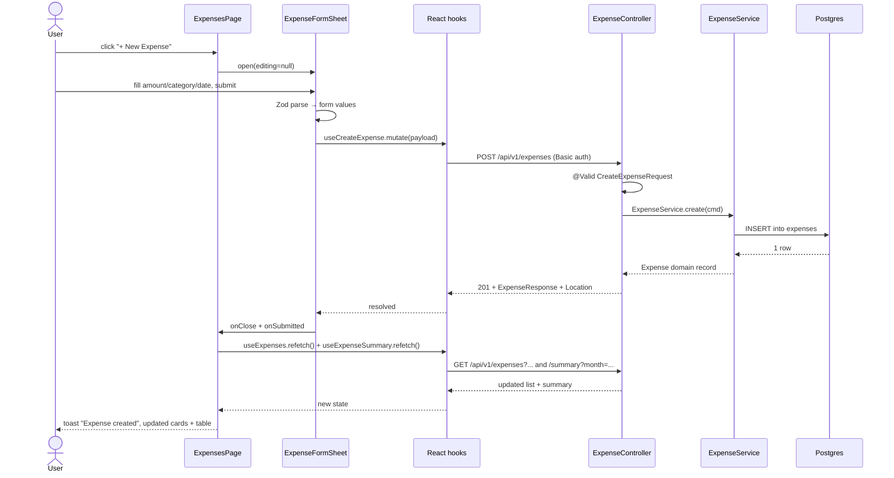

# Expense tracking with category dashboard

## 1. Context & goal

The app tracks invoice revenue but has no symmetric facility for outgoings. This feature adds a dedicated `/expenses` page whose primary surface is a category-breakdown dashboard (icon + name + total + count) for the selected month, with a full CRUD list of individual expenses underneath. Success: a user can add an expense with date / amount / category in under 10 seconds and immediately see the new value reflected in the dashboard totals for that month.

## 2. Acceptance criteria

- [ ] AC-1: A new `Expenses` item appears in the sidebar (between `Invoices` and the `Settings` section) and routes to `/expenses`.
- [ ] AC-2: `GET /api/v1/expenses` returns a paginated list of non-deleted expenses, optionally filtered by `category`, `dateFrom`, `dateTo`, sorted by `expenseDate DESC` by default.
- [ ] AC-3: `POST /api/v1/expenses` with `{ amount, category, expenseDate, description? }` creates an expense and returns `201` with the persisted record (UUID id, timestamps).
- [ ] AC-4: `PUT /api/v1/expenses/{id}` updates an existing non-deleted expense (full replacement); `DELETE /api/v1/expenses/{id}` soft-deletes by setting `deleted_at`.
- [ ] AC-5: `GET /api/v1/expenses/summary?month=YYYY-MM` returns `{ month, grandTotal, totalCount, byCategory: [{ category, total, count }] }` for non-deleted expenses whose `expense_date` falls in that month. When `month` is omitted, the server uses the current month in UTC.
- [ ] AC-6: The `ExpensesPage` shows, top-to-bottom: month/year picker → grand-total summary card → one card per category (only categories with ≥1 expense in the month) → expense table → pagination.
- [ ] AC-7: Each category card displays the category icon (lucide), localized category name, formatted total amount, and the expense count.
- [ ] AC-8: The expense table shows columns `Date | Description | Category (badge+icon) | Amount (right-aligned) | Actions (edit, delete icon-buttons)` with the same visual treatment as `InvoicesListPage` / `ClientTable`.
- [ ] AC-9: Clicking `+ New Expense` opens a centered modal (`ExpenseFormSheet`) using the same backdrop + dialog pattern as `InvoiceFormSheet`; submitting creates the expense, closes the modal, toasts success, and refetches both the list and the summary.
- [ ] AC-10: Editing an expense reuses the same `ExpenseFormSheet` pre-populated with the existing values; deleting first asks for confirmation via the same `ConfirmDeleteDialog` pattern used in `InvoicesListPage`.
- [ ] AC-11: Backend rejects amount ≤ 0, amount > 9_999_999.99, future `expenseDate` (> today + 1 day), description > 500 chars, unknown category with `400 VALIDATION_ERROR`. Frontend Zod schema mirrors these rules.
- [ ] AC-12: All new endpoints are protected by the existing Spring Security HTTP Basic filter chain (same configuration as `/api/v1/invoices`); anonymous requests get `401`.
- [ ] AC-13: JaCoCo merged coverage stays ≥ 0.95 line + 0.95 branch; Vitest stays ≥ 95/95/95/90.
- [ ] AC-14: Postman collection contains every new endpoint with example requests; OpenAPI doc (`docs/openapi.json`) is regenerated; `FEATURES.md`, `ARCHITECTURE.md`, `SEQUENCE_DIAGRAMS.md`, `API.md`, `CHANGELOG.md` are updated by the documentation agent.

## 3. Architecture (mermaid)

```mermaid
flowchart LR
    user[User] --> fe[React SPA<br/>/expenses]
    subgraph FE["src/features/expenses"]
        page[ExpensesPage]
        dash[ExpenseDashboard<br/>month picker + category cards]
        table[ExpenseTable]
        sheet[ExpenseFormSheet]
        badge[CategoryBadge + CategoryIcon]
        hooks[useExpenses / useExpenseSummary<br/>useCreateExpense / useUpdateExpense / useDeleteExpense]
        page --> dash
        page --> table
        page --> sheet
        table --> badge
        dash --> badge
        page --> hooks
    end
    fe -->|GET/POST/PUT/DELETE<br/>/api/v1/expenses[/summary]| be
    subgraph BE["Spring Boot"]
        ctl[ExpenseController<br/>adapter.web.expense]
        svc[ExpenseService<br/>application.expense]
        port[ExpenseRepository<br/>domain.expense]
        adapter[ExpenseRepositoryAdapter<br/>adapter.persistence.expense]
        ctl --> svc
        svc --> port
        port -.implemented by.-> adapter
    end
    adapter --> db[(Postgres<br/>expenses table<br/>V12 migration)]
```

## 4. Sequence (happy path + edge case)

### 4a. Create expense → dashboard refresh (happy path)



### 4b. Edge case — change month (no expenses present)

```mermaid
sequenceDiagram
    actor U as User
    participant FE as ExpensesPage
    participant Dash as ExpenseDashboard
    participant API as useExpenseSummary
    participant BE as ExpenseController
    U->>Dash: select month=2025-12
    Dash->>FE: onMonthChange("2025-12")
    FE->>API: refetch with month=2025-12
    API->>BE: GET /api/v1/expenses/summary?month=2025-12
    BE-->>API: {grandTotal:"0.00", totalCount:0, byCategory:[]}
    API-->>FE: empty summary
    FE-->>U: render EmptyState "No expenses for December 2025" inside dashboard area; expense table also filtered to that month shows empty row
```

## 5. File-by-file change list

### Backend — production

| Path | Action | Purpose |
|---|---|---|
| `backend/src/main/resources/db/migration/V12__create_expenses.sql` | create | Flyway migration: `expenses` table + indexes + CHECK constraints |
| `backend/src/main/java/com/example/invoicetracker/domain/expense/Expense.java` | create | Domain record (id, amount, category, description, expenseDate, createdAt, updatedAt, deletedAt) |
| `backend/src/main/java/com/example/invoicetracker/domain/expense/ExpenseCategory.java` | create | Enum: `FOOD_DRINK, TRANSPORT, HOUSING, HEALTH, ENTERTAINMENT, SHOPPING, TRAVEL, EDUCATION, UTILITIES, OTHER` |
| `backend/src/main/java/com/example/invoicetracker/domain/expense/ExpenseRepository.java` | create | Port: `save`, `findByIdAndDeletedAtIsNull`, `findAllByDeletedAtIsNull(filter, pageable)`, `summaryForMonth(YearMonth)` |
| `backend/src/main/java/com/example/invoicetracker/domain/expense/ExpenseNotFoundException.java` | create | Domain exception → 404 |
| `backend/src/main/java/com/example/invoicetracker/domain/expense/CategorySummary.java` | create | Domain record `(ExpenseCategory category, BigDecimal total, long count)` used by repository summary aggregation |
| `backend/src/main/java/com/example/invoicetracker/application/expense/ExpenseCommand.java` | create | Sealed interface with `Create` + `Update` records (amount BigDecimal, category, expenseDate LocalDate, description) |
| `backend/src/main/java/com/example/invoicetracker/application/expense/ExpenseService.java` | create | Use-cases: `create`, `list(ExpenseFilter, Pageable)`, `get`, `update`, `delete`, `summary(YearMonth, Clock)`; size clamp [1,100] (ADR-003) |
| `backend/src/main/java/com/example/invoicetracker/application/expense/ExpenseFilter.java` | create | Record `(ExpenseCategory category, LocalDate dateFrom, LocalDate dateTo)` |
| `backend/src/main/java/com/example/invoicetracker/application/expense/MonthlySummary.java` | create | Record `(YearMonth month, BigDecimal grandTotal, long totalCount, List<CategorySummary> byCategory)` |
| `backend/src/main/java/com/example/invoicetracker/adapter/web/expense/ExpenseController.java` | create | REST controller at `/api/v1/expenses` |
| `backend/src/main/java/com/example/invoicetracker/adapter/web/expense/dto/CreateExpenseRequest.java` | create | DTO with `@NotNull`, `@DecimalMin("0.01")`, `@DecimalMax("9999999.99")`, `@Digits(integer=7, fraction=2)`, `@Size(max=500)`, `@NotNull category`, `@PastOrPresent expenseDate` (uses `Clock` for testability via `LocalDate.now(clock).plusDays(1)` upper bound) |
| `backend/src/main/java/com/example/invoicetracker/adapter/web/expense/dto/UpdateExpenseRequest.java` | create | Same validation as Create |
| `backend/src/main/java/com/example/invoicetracker/adapter/web/expense/dto/ExpenseResponse.java` | create | Response DTO |
| `backend/src/main/java/com/example/invoicetracker/adapter/web/expense/dto/ExpenseSummaryResponse.java` | create | `{ month: "YYYY-MM", grandTotal: "0.00", totalCount: 0, byCategory: [{category, total, count}] }` |
| `backend/src/main/java/com/example/invoicetracker/adapter/persistence/expense/ExpenseEntity.java` | create | JPA entity (Lombok @Getter/@Setter, mirrors ClientEntity pattern, `@Version`) |
| `backend/src/main/java/com/example/invoicetracker/adapter/persistence/expense/ExpenseJpaRepository.java` | create | Spring Data JPA: `findByIdAndDeletedAtIsNull`, `findAllActive(filterParams, Pageable)` JPQL, `@Query` for monthly summary returning `CategorySummary` projection |
| `backend/src/main/java/com/example/invoicetracker/adapter/persistence/expense/ExpenseEntityMapper.java` | create | Domain ↔ entity mapping; same `updateEntity` pattern as `ClientEntityMapper` for managed-entity updates |
| `backend/src/main/java/com/example/invoicetracker/adapter/persistence/expense/ExpenseRepositoryAdapter.java` | create | Implements `ExpenseRepository` using `EntityManager.find()` first-then-merge pattern (per CLAUDE.md JPA session note) |
| `backend/src/main/java/com/example/invoicetracker/adapter/web/error/GlobalExceptionHandler.java` | edit | Add `@ExceptionHandler(ExpenseNotFoundException.class)` mapping to 404 (if not already covered by a generic NotFound handler) |

### Backend — tests

| Path | Action | Purpose |
|---|---|---|
| `backend/src/test/java/com/example/invoicetracker/application/expense/ExpenseServiceTest.java` | create | Unit tests with mocked `ExpenseRepository` + injected `Clock` |
| `backend/src/test/java/com/example/invoicetracker/adapter/web/expense/ExpenseControllerTest.java` | create | MockMvc-based controller test (per CLAUDE.md: `@SpringBootTest(webEnvironment=MOCK)` + `webAppContextSetup` + `@MockitoBean`; use `@WithMockUser`) |
| `backend/src/test/java/com/example/invoicetracker/adapter/persistence/expense/ExpenseRepositoryAdapterIT.java` | create | Testcontainers Postgres integration test for repository: persists, finds, soft-deletes, summary aggregation matches |
| `backend/src/test/java/com/example/invoicetracker/adapter/web/expense/ExpenseControllerIT.java` | create | `@SpringBootTest(webEnvironment=RANDOM_PORT)` + Testcontainers; end-to-end HTTP exercises create + list + filter + summary + delete + auth |
| `backend/src/test/java/com/example/invoicetracker/adapter/persistence/expense/ExpenseEntityMapperTest.java` | create | Mapper unit test for round-trip |

### Frontend — production

| Path | Action | Purpose |
|---|---|---|
| `frontend/src/features/expenses/model/types.ts` | create | TypeScript types: `Expense`, `ExpensePage`, `ExpenseSummary`, `CategorySummary`, `ExpenseCategory` union, `CreateExpensePayload`, `UpdateExpensePayload` |
| `frontend/src/features/expenses/model/schema.ts` | create | Zod schemas for runtime parse + form validation (`expenseFormSchema`) |
| `frontend/src/features/expenses/model/categories.ts` | create | `EXPENSE_CATEGORIES: readonly ExpenseCategory[]` ordered for UI; helper `categoryI18nKey(c)` |
| `frontend/src/features/expenses/api/expensesApi.ts` | create | `listExpenses`, `getExpense`, `createExpense`, `updateExpense`, `deleteExpense`, `getExpenseSummary` calling `/api/v1/expenses[/summary]` via `@/shared/lib/http` |
| `frontend/src/features/expenses/api/useExpenses.ts` | create | Hook mirroring `useInvoices` (paged, filter args, refetch) |
| `frontend/src/features/expenses/api/useCreateExpense.ts` | create | Mutate hook with `mutate(payload)` |
| `frontend/src/features/expenses/api/useUpdateExpense.ts` | create | Mutate hook with `mutate(id, payload)` |
| `frontend/src/features/expenses/api/useDeleteExpense.ts` | create | Mutate hook with `mutate(id)` |
| `frontend/src/features/expenses/api/useExpenseSummary.ts` | create | Hook with `month: string` param ("YYYY-MM"); refetches when month changes |
| `frontend/src/features/expenses/ui/CategoryIcon.tsx` | create | `({ category }: { category: ExpenseCategory })` → lucide icon: `FOOD_DRINK=Utensils, TRANSPORT=Car, HOUSING=Home, HEALTH=HeartPulse, ENTERTAINMENT=Clapperboard, SHOPPING=ShoppingBag, TRAVEL=Plane, EDUCATION=GraduationCap, UTILITIES=Zap, OTHER=MoreHorizontal` |
| `frontend/src/features/expenses/ui/CategoryBadge.tsx` | create | Pill badge with icon + localized label, using `--color-status-*` tokens per category (palette-safe variants in `index.css`) |
| `frontend/src/features/expenses/ui/ExpenseDashboard.tsx` | create | Month picker (`<input type="month">` styled like other inputs), grand-total summary card, grid of category cards (icon + name + total + count); EmptyState when no expenses |
| `frontend/src/features/expenses/ui/ExpenseTable.tsx` | create | shadcn `Table` with columns + icon-action buttons (Pencil edit, Trash2 delete); reuses `Skeleton` for loading |
| `frontend/src/features/expenses/ui/ExpenseFormSheet.tsx` | create | Centered modal with `react-hook-form` + `zodResolver(expenseFormSchema)`; identical UX pattern to `InvoiceFormSheet` |
| `frontend/src/features/expenses/ui/ExpensesPage.tsx` | create | Page composition: `PageHeader` + `ExpenseDashboard` + `ExpenseTable` + `ExpenseFormSheet` + `ConfirmDeleteDialog` |
| `frontend/src/pages/ExpensesPage.tsx` | create | Thin wrapper re-exporting the feature page (matches `InvoicesPage.tsx` indirection convention) |
| `frontend/src/app/App.tsx` | edit | Add `import { ExpensesPage } from '@/pages/ExpensesPage'` and `<Route path="/expenses" element={<ExpensesPage />} />` inside the protected `AppShell` block |
| `frontend/src/shared/components/Sidebar.tsx` | edit | Append `{ to: '/expenses', labelKey: 'nav.expenses', icon: Wallet }` to `NAV_ITEMS` (lucide `Wallet`) |
| `frontend/src/shared/locales/en.json` | edit | Add `nav.expenses`, `expenses.*` keys (page title, table headers, form labels, category names, toasts, empty states, validation messages) |
| `frontend/src/index.css` | edit | Add 10 `--color-cat-<name>-bg/-fg` token pairs (one per category) inside `:root` and `.dark` blocks for `CategoryBadge` tinting; mirror in `.palette-teal-steel` |

### Frontend — tests

| Path | Action | Purpose |
|---|---|---|
| `frontend/src/features/expenses/model/schema.test.ts` | create | Zod parse: valid + invalid amount, invalid category, future date rejected |
| `frontend/src/features/expenses/api/expensesApi.test.ts` | create | MSW-mocked happy + 400/401/404 paths for every API function |
| `frontend/src/features/expenses/api/useExpenses.test.ts` | create | Hook: loading → data, refetch increments revision, page+filter dependencies |
| `frontend/src/features/expenses/api/useCreateExpense.test.ts` | create | Mutate success + error mapping |
| `frontend/src/features/expenses/api/useUpdateExpense.test.ts` | create | Mutate success + 404 surface |
| `frontend/src/features/expenses/api/useDeleteExpense.test.ts` | create | Mutate success + error |
| `frontend/src/features/expenses/api/useExpenseSummary.test.ts` | create | Month change triggers refetch; empty summary renders zeros |
| `frontend/src/features/expenses/ui/CategoryIcon.test.tsx` | create | Maps every enum value to the correct lucide icon (snapshot of `data-icon` attribute or `svg` role) |
| `frontend/src/features/expenses/ui/CategoryBadge.test.tsx` | create | Renders localized label + icon; class includes category token |
| `frontend/src/features/expenses/ui/ExpenseDashboard.test.tsx` | create | Renders cards from summary; month picker changes month; empty state visible when `byCategory=[]` |
| `frontend/src/features/expenses/ui/ExpenseTable.test.tsx` | create | Rows render with formatted amount + date + badge; edit and delete buttons fire callbacks; empty + loading states |
| `frontend/src/features/expenses/ui/ExpenseFormSheet.test.tsx` | create | Opens, submits create, submits edit with prefilled values, shows validation errors, closes on backdrop click |
| `frontend/src/features/expenses/ui/ExpensesPage.test.tsx` | create | Page composition: list + summary load, create flow toasts + refetches, delete confirmation flow |
| `frontend/tests/expenses/create-and-view.spec.ts` | create | Playwright E2E: log in, navigate to `/expenses`, create an expense, see it in dashboard total + category card + table row |
| `frontend/tests/expenses/delete-flow.spec.ts` | create | Playwright E2E: create then delete, expense disappears from list and summary |

### Docs & infra

| Path | Action | Purpose |
|---|---|---|
| `postman/collection.json` | edit | Add `Expenses` folder with 5 requests (list, create, get, update, delete, summary) |
| `docs/openapi.json` | edit | Regenerated via springdoc on next build (no manual edit) — verify in CI |
| `docs/ARCHITECTURE.md` | edit | Add `expense` boxes to backend + frontend mermaid diagrams (documentation agent) |
| `docs/SEQUENCE_DIAGRAMS.md` | edit | Append "Create Expense" sequence (documentation agent) |
| `docs/API.md` | edit | Append endpoint reference (documentation agent) |
| `docs/FEATURES.md` | edit | Append row for FEAT-20260516-01 (documentation agent) |
| `docs/CHANGELOG.md` | edit | New entry (documentation agent) |

## 6. API contract

Base path: `/api/v1/expenses`. All endpoints require HTTP Basic auth (same filter chain as `/api/v1/invoices`); CSRF disabled per ADR-004.

| Method | Path | Request body / params | Response | Errors |
|---|---|---|---|---|
| GET | `/api/v1/expenses` | Query: `page` (≥0, default 0), `size` (1..100 clamped, default 20), `sort` (default `expenseDate,desc`), `category?` (enum), `dateFrom?` (`YYYY-MM-DD`), `dateTo?` (`YYYY-MM-DD`) | `200` `PageResponse<ExpenseResponse>` | `400 VALIDATION_ERROR` on bad enum/date, `401` |
| POST | `/api/v1/expenses` | `{ amount: string\|number, category: string, expenseDate: "YYYY-MM-DD", description?: string\|null }` | `201` `ExpenseResponse` + `Location: /api/v1/expenses/{id}` | `400 VALIDATION_ERROR`, `401` |
| GET | `/api/v1/expenses/{id}` | — | `200` `ExpenseResponse` | `404 EXPENSE_NOT_FOUND`, `401` |
| PUT | `/api/v1/expenses/{id}` | Same body as POST (full replacement) | `200` `ExpenseResponse` | `400`, `404`, `401` |
| DELETE | `/api/v1/expenses/{id}` | — | `204 No Content` | `404`, `401` |
| GET | `/api/v1/expenses/summary` | Query: `month?` (`YYYY-MM`, defaults to current month UTC) | `200` `ExpenseSummaryResponse` | `400 VALIDATION_ERROR` on malformed month, `401` |

### `ExpenseResponse` schema

```json
{
  "id": "uuid",
  "amount": "0.00",
  "category": "FOOD_DRINK",
  "description": "string|null",
  "expenseDate": "YYYY-MM-DD",
  "createdAt": "2026-05-16T12:34:56Z",
  "updatedAt": "2026-05-16T12:34:56Z"
}
```

### `ExpenseSummaryResponse` schema

```json
{
  "month": "2026-05",
  "grandTotal": "1234.56",
  "totalCount": 17,
  "byCategory": [
    { "category": "FOOD_DRINK", "total": "320.00", "count": 8 },
    { "category": "TRANSPORT",  "total": "914.56", "count": 9 }
  ]
}
```

`byCategory` is sorted by `total DESC`, then `category ASC`. Empty months return `byCategory: []`, `grandTotal: "0.00"`, `totalCount: 0`.

### Validation error envelope

Reuses the existing `GlobalExceptionHandler` shape:

```json
{ "code": "VALIDATION_ERROR", "message": "amount: must be greater than 0", "fieldErrors": { "amount": "must be greater than 0" } }
```

## 7. Data model changes

### New table `expenses`

`V12__create_expenses.sql`:

```sql
CREATE TABLE expenses (
    id            UUID            PRIMARY KEY,
    amount        NUMERIC(10,2)   NOT NULL,
    category      VARCHAR(50)     NOT NULL,
    description   VARCHAR(500),
    expense_date  DATE            NOT NULL,
    created_at    TIMESTAMPTZ     NOT NULL DEFAULT now(),
    updated_at    TIMESTAMPTZ     NOT NULL DEFAULT now(),
    deleted_at    TIMESTAMPTZ,
    version       BIGINT          NOT NULL DEFAULT 0,
    CONSTRAINT expenses_amount_positive CHECK (amount > 0),
    CONSTRAINT expenses_amount_capped   CHECK (amount <= 9999999.99),
    CONSTRAINT expenses_category_known  CHECK (category IN (
        'FOOD_DRINK','TRANSPORT','HOUSING','HEALTH','ENTERTAINMENT',
        'SHOPPING','TRAVEL','EDUCATION','UTILITIES','OTHER'
    ))
);

CREATE INDEX ix_expenses_date_active     ON expenses (expense_date DESC) WHERE deleted_at IS NULL;
CREATE INDEX ix_expenses_category_active ON expenses (category)          WHERE deleted_at IS NULL;
CREATE INDEX ix_expenses_month_active    ON expenses (date_trunc('month', expense_date)) WHERE deleted_at IS NULL;
```

- Soft-delete pattern reused from clients (ADR-001).
- Category persisted as `VARCHAR(50)` with a Postgres CHECK constraint rather than a native ENUM type — keeps migration painless when categories grow; enforcement also lives in `ExpenseCategory.valueOf()` at the application layer (H2 also tolerates VARCHAR, mirroring ADR-002 trade-off).
- No FK to `app_users` for v1: the app is single-tenant. Multi-tenant scoping is a follow-up (tracked as risk R-2 below).

## 8. Test strategy

| Layer | Test class / file | Assertions |
|---|---|---|
| Unit (BE) | `ExpenseServiceTest.create_persists_and_returns_id` | Mocked repo `save` returns input → service returns same id + amount + timestamps populated by fixed `Clock` |
| Unit (BE) | `ExpenseServiceTest.create_rejects_unknown_category` | Throws `IllegalArgumentException` mapped to `400` |
| Unit (BE) | `ExpenseServiceTest.list_clamps_size_to_100` | Pageable size=500 → repo invoked with size=100 |
| Unit (BE) | `ExpenseServiceTest.list_passes_filter_through` | Filter (category=TRANSPORT, dateFrom, dateTo) reaches repo |
| Unit (BE) | `ExpenseServiceTest.update_throws_not_found_when_deleted` | Returns Optional.empty → `ExpenseNotFoundException` |
| Unit (BE) | `ExpenseServiceTest.delete_sets_deleted_at_via_save` | Captures save argument; `deletedAt` non-null and other fields preserved |
| Unit (BE) | `ExpenseServiceTest.summary_zero_fills_empty_months` | Repo returns empty → service returns `grandTotal=0.00, totalCount=0, byCategory=[]` |
| Unit (BE) | `ExpenseServiceTest.summary_sorts_by_total_desc` | Repo returns two categories with different totals → service sorts |
| Unit (BE) | `ExpenseServiceTest.summary_uses_clock_when_month_null` | `summary(null)` resolves to YearMonth.now(clock) |
| Unit (BE) | `ExpenseControllerTest.create_returns_201_with_location` | MockMvc POST → `201`, `Location` header, body matches |
| Unit (BE) | `ExpenseControllerTest.create_returns_400_when_amount_zero` | Body `amount=0` → `400 VALIDATION_ERROR` |
| Unit (BE) | `ExpenseControllerTest.create_returns_400_when_amount_negative` | Body `amount=-1` → `400` |
| Unit (BE) | `ExpenseControllerTest.create_returns_400_when_amount_too_large` | `amount=10000000.00` → `400` |
| Unit (BE) | `ExpenseControllerTest.create_returns_400_when_category_unknown` | `category=XYZ` → `400` |
| Unit (BE) | `ExpenseControllerTest.create_returns_400_when_date_in_future` | `expenseDate=tomorrow+2` → `400` |
| Unit (BE) | `ExpenseControllerTest.create_returns_400_when_description_too_long` | 501-char description → `400` |
| Unit (BE) | `ExpenseControllerTest.list_filters_by_category` | MockMvc query `?category=FOOD_DRINK` → service invoked with that filter |
| Unit (BE) | `ExpenseControllerTest.list_filters_by_date_range` | `?dateFrom=...&dateTo=...` → filter passed |
| Unit (BE) | `ExpenseControllerTest.get_returns_404_when_missing` | Service throws → handler returns `404` |
| Unit (BE) | `ExpenseControllerTest.summary_default_month_is_current` | No `month` query param → service called with `null` (service resolves via Clock) |
| Unit (BE) | `ExpenseControllerTest.summary_returns_400_when_month_malformed` | `?month=2026-13` → `400` |
| Unit (BE) | `ExpenseControllerTest.unauthenticated_returns_401` | No auth header → `401` |
| Unit (BE) | `ExpenseEntityMapperTest.round_trip_preserves_all_fields` | domain → entity → domain identical |
| Integration (BE) | `ExpenseRepositoryAdapterIT.persists_and_finds` | Save then `findByIdAndDeletedAtIsNull` returns record with timestamps from DB |
| Integration (BE) | `ExpenseRepositoryAdapterIT.excludes_soft_deleted` | Set `deletedAt` → repository find returns empty |
| Integration (BE) | `ExpenseRepositoryAdapterIT.filters_by_category_and_date_range` | Seed 5 rows, query with filter → expected subset |
| Integration (BE) | `ExpenseRepositoryAdapterIT.summary_aggregates_correctly` | Seed 3 categories × 2 rows → sums + counts correct, ignores soft-deleted |
| Integration (BE) | `ExpenseRepositoryAdapterIT.update_uses_managed_entity_no_NonUniqueObjectException` | Verifies `EntityManager.find()` then field copy works (CLAUDE.md JPA note) |
| Integration (BE) | `ExpenseControllerIT.full_crud_flow` | POST → GET list → GET one → PUT → DELETE → GET returns 404 |
| Integration (BE) | `ExpenseControllerIT.summary_endpoint_e2e` | POST 3 expenses across categories → GET summary returns expected totals |
| Unit (FE) | `schema.test.ts` | Zod accepts valid; rejects amount=0, amount>9999999.99, category=unknown, future date, description>500 |
| Unit (FE) | `expensesApi.test.ts` | All 6 functions exercised under MSW for 2xx + 4xx + 5xx |
| Unit (FE) | `useExpenses.test.ts` / `useCreateExpense.test.ts` / `useUpdateExpense.test.ts` / `useDeleteExpense.test.ts` / `useExpenseSummary.test.ts` | Loading/data/error transitions; refetch on key change |
| Unit (FE) | `CategoryIcon.test.tsx` | Each of 10 categories renders the documented lucide icon (svg `data-lucide` or rendered path test-id) |
| Unit (FE) | `CategoryBadge.test.tsx` | Renders icon + label; applies category-specific class |
| Unit (FE) | `ExpenseDashboard.test.tsx` | Renders cards from props; month picker change fires callback; empty state when `byCategory.length===0`; grand total formatted as `$1,234.56` |
| Unit (FE) | `ExpenseTable.test.tsx` | Rows render correctly; loading skeleton; empty state; edit / delete callbacks |
| Unit (FE) | `ExpenseFormSheet.test.tsx` | Validation errors shown; submit invokes `onSubmit` with parsed values; pre-filled in edit mode; close on backdrop |
| Unit (FE) | `ExpensesPage.test.tsx` | Integrates dashboard + table + form; create flow toasts and refetches; delete confirmation gate |
| E2E (FE) | `tests/expenses/create-and-view.spec.ts` | Login → /expenses → click "+ New Expense" → fill form → submit → assert table row + category card + grand total updated |
| E2E (FE) | `tests/expenses/delete-flow.spec.ts` | Create expense → click delete icon → confirm → assert row removed, summary decremented |

Coverage rationale: the planned tests touch every public method on `ExpenseService` (8 unit tests), every controller branch (12 tests), every API helper (MSW), every UI component path (loading/empty/data/error), and every hook (mock + integration). DTO records and the JPA entity are excluded per JaCoCo exclusion rules in QUALITY_GATES.md.

## 9. Security considerations

| OWASP item | Applies? | Mitigation in this plan |
|---|---|---|
| A01 Broken Access Control | yes | All endpoints sit behind the existing `SecurityFilterChain` requiring authentication; no resource-owner check needed in v1 (single-tenant — see R-2). Path `/api/v1/expenses/**` added explicitly to the authenticated matcher. |
| A02 Cryptographic Failures | no | No new secrets, tokens, or PII flows. Amount + category are not sensitive. |
| A03 Injection | yes | All queries use Spring Data JPA with bound parameters; the `summary` aggregation uses a parameterized JPQL with `:from`/`:to` `LocalDate` bounds — no string concatenation. Category enum coerced via `ExpenseCategory.valueOf()` before reaching JPQL. |
| A04 Insecure Design | yes | Server-side amount cap (9_999_999.99) prevents overflow / unrealistic values. Future-date rejection prevents back-dating fraud-like inputs. Soft-delete preserves audit trail. |
| A05 Security Misconfiguration | yes | No new beans bypass `SecurityConfig`. New endpoints inherit CSRF-disabled (ADR-004) but are safe because state-changing requests require Basic-auth header that cookies don't auto-attach. |
| A07 Identification & Authentication | yes | Reuses existing HTTP Basic chain — no new auth surface. |
| A08 Software & Data Integrity | yes | `@Version` optimistic lock on entity prevents lost-update under concurrent PUT/DELETE. |
| A09 Logging & Monitoring | yes | `ExpenseService` logs INFO with id only on create/update/delete; never logs `description` (potentially user-entered free text) at INFO. |
| A10 SSRF | no | No outbound calls from this feature. |

Additional: Flyway `V12` validated on container start; if checksum mismatches with prior CI run, Flyway aborts deploy.

## 10. Risks & open questions

- R-1: H2 (used in `test` Spring profile for `ApplicationTests`) ignores the partial index in `WHERE deleted_at IS NULL` filters and DOES support CHECK constraints, but `date_trunc` semantics differ → **chosen default**: do not rely on the `ix_expenses_month_active` index in H2; summary tests run under Testcontainers Postgres only (ADR-002 trade-off pattern).
- R-2: No user_id column on `expenses` — once multi-tenant auth lands, this feature needs a follow-up migration (`V13__add_user_id_to_expenses.sql`) + tenant scoping in `ExpenseService`. **Chosen default**: ship single-tenant for v1, document as known migration item.
- R-3: i18n labels for 10 categories add ~20 new translation keys. **Chosen default**: ship English only; the project today has only `en.json` (`i18n.ts:supportedLngs: ['en']`).
- R-4: Currency is implicit (no currency column). **Chosen default**: amounts displayed with a leading `$` to match `InvoicesListPage.tsx:292`; multi-currency is out of scope and tracked as `FEAT-multi-currency`.
- R-5: Dashboard month picker UX — native `<input type="month">` vs custom popover. **Chosen default**: native input styled via Tailwind tokens, consistent with existing `<input type="date">` usage in invoice forms; revisit if QA flags accessibility.
- R-6: "Future date" cutoff — allow today, reject tomorrow. **Chosen default**: validator uses `LocalDate.now(clock).plusDays(1)` as exclusive upper bound — i.e. today is OK, future dates are not. Tomorrow at the user's wall-clock could be today UTC, so we accept `today + 1 day` to absorb timezone slop. (Note: this contradicts strict `@PastOrPresent`; a custom validator `@NotFutureExpenseDate` will be written.)
- R-7: User's global note about a closed datepicker (`CLAUDE.md` user instructions). **Chosen default**: the modal `ExpenseFormSheet` does NOT auto-close on date-input blur — closing requires explicit `Cancel`, `Submit`, or `Escape`/backdrop click; the date `<input>` is allowed to stay focused/open until the user dismisses it via OK/Cancel within the native picker.

## 11. Effort

**M** — three new backend layers (domain + service + adapter + controller + DTOs + migration) of equal complexity to the existing client slice, plus a richer-than-usual frontend feature with a dashboard composition. No new infrastructure, no template/file rendering, no external services. Estimate: ~1 backend dev-day + ~1.5 frontend dev-days including tests; well within a single feature iteration.
