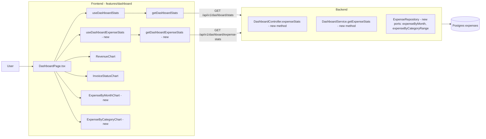
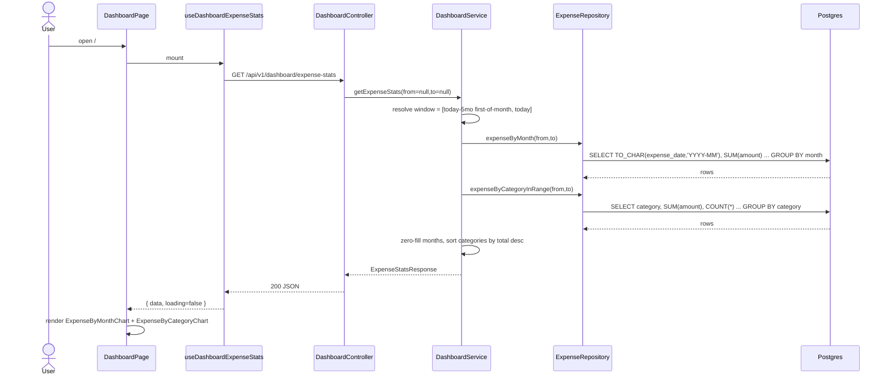
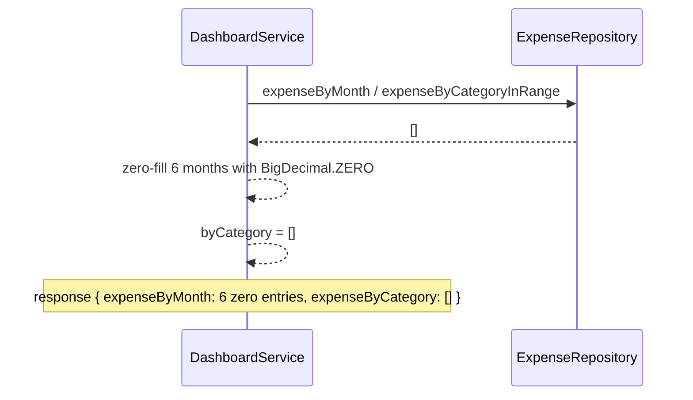

# Expense Dashboard Charts — By Month and By Category (+ Dashboard Date Filter)

## 1. Context & goal

The dashboard currently visualises invoice activity only. Expenses already exist as a first-class entity (`projects/invoice-tracker/backend/src/main/java/com/example/invoicetracker/domain/expense/Expense.java`, migration `V12__create_expenses.sql`) but are invisible from the home dashboard. This feature adds **two read-only chart widgets** to `DashboardPage.tsx` so the user sees expense totals per month and per category at a glance, using the same visual language as `RevenueChart` (bar) and `InvoiceStatusChart` (donut).

## 2. Acceptance criteria

- [ ] AC-1: A new "Expense by Month" bar chart appears on `/` (DashboardPage) showing the last 6 calendar months of expense totals, zero-filled, in the same row position style as `RevenueChart`.
- [ ] AC-2: A new "Expense by Category" donut chart appears on `/` showing total expense per category for the last 6 months window, rendered with the same shadcn/Recharts treatment as `InvoiceStatusChart`.
- [ ] AC-3: Both charts load via a single new endpoint `GET /api/v1/dashboard/expense-stats` returning `{ expenseByMonth: [...], expenseByCategory: [...] }`; one fetch, one render pass on the page.
- [ ] AC-4: Charts render correctly when (a) there are zero expenses (empty pie + 6 zero-bars) and (b) only one category has data.
- [ ] AC-5: A date-range filter control appears at the top-right of the dashboard. It is represented as a **calendar/filter icon button**; clicking it opens a compact popover with two date inputs ("From" and "To"). Clicking OK applies the filter; clicking the icon again or clicking outside dismisses the popover. When a filter is active the icon is visually highlighted (accent colour). Clearing both dates resets to the default 6-month window.
- [ ] AC-6: The active `from`/`to` range is forwarded as query params to **both** `GET /api/v1/dashboard/stats` (existing endpoint) and `GET /api/v1/dashboard/expense-stats` (new endpoint) so all four charts update together on apply.
- [ ] AC-7: All chart labels (titles, axis ticks, legend, tooltip "Expenses" label, category names) are i18n keys; English strings present in `frontend/src/shared/locales/en.json` under `dashboard.charts.*` and `expenses.categories.*` (the latter already exists — re-used).
- [ ] AC-8: Backend coverage gates met: `JaCoCo line ≥ 0.95, branch ≥ 0.95` for new classes. Frontend Vitest 95/95/95/90 met for new files.
- [ ] AC-9: Postman collection updated with the new endpoint; OpenAPI doc regenerated.

## 3. Architecture (mermaid)



## 4. Sequence (happy path + edge case)



Edge case — no expenses for window:



## 5. File-by-file change list

### Backend (Java / Maven)

| Path | Action | Purpose |
|---|---|---|
| `backend/src/main/java/com/example/invoicetracker/domain/expense/MonthlyExpense.java` | create | Domain record `(String month, BigDecimal total)` mirroring `MonthlyRevenue` shape but in the domain layer (kept out of `adapter/web/dashboard/dto` to avoid cross-package leakage of the existing invoice DTO; mapped at the controller boundary). |
| `backend/src/main/java/com/example/invoicetracker/domain/expense/ExpenseRepository.java` | edit | Add two new methods: `List<MonthlyExpense> expenseByMonth(LocalDate from, LocalDate to)` and `List<CategorySummary> expenseByCategoryInRange(LocalDate from, LocalDate to)`. |
| `backend/src/main/java/com/example/invoicetracker/adapter/persistence/expense/ExpenseJpaRepository.java` | edit | Add two `@Query(nativeQuery=true)` methods returning `Object[]`/projection rows. Use `TO_CHAR(expense_date,'YYYY-MM')` (Postgres) — matches existing `revenueByMonth` style at `InvoiceJpaRepository.java:85-97`. |
| `backend/src/main/java/com/example/invoicetracker/adapter/persistence/expense/ExpenseRepositoryAdapter.java` | edit | Implement the two new repository methods; map rows to domain records. Null-safe for `SUM()`-returns-null edge case. |
| `backend/src/main/java/com/example/invoicetracker/application/dashboard/DashboardService.java` | edit | Inject `ExpenseRepository` + reuse `Clock`. Add `getExpenseStats(LocalDate from, LocalDate to)` → returns new `ExpenseStatsResponse`. Default window when both null: `from = firstDayOfMonth(now - 5 months)`, `to = today`. Zero-fill months identical to `buildMonthlyRevenue`. Sort `byCategory` by total desc then category name asc (mirrors `ExpenseService.summary`). Log INFO with totals only — no PII. |
| `backend/src/main/java/com/example/invoicetracker/adapter/web/dashboard/dto/ExpenseStatsResponse.java` | create | `record ExpenseStatsResponse(String from, String to, BigDecimal grandTotal, List<MonthlyExpense> expenseByMonth, List<CategoryExpense> expenseByCategory)`. |
| `backend/src/main/java/com/example/invoicetracker/adapter/web/dashboard/dto/CategoryExpense.java` | create | `record CategoryExpense(ExpenseCategory category, BigDecimal total, long count)` — controller-layer DTO mirroring `CategorySummaryResponse` but in the dashboard dto package. |
| `backend/src/main/java/com/example/invoicetracker/adapter/web/dashboard/DashboardController.java` | edit | Add `@GetMapping("/expense-stats")` accepting `@RequestParam(required=false) LocalDate from` and `LocalDate to`. Validation: if both present, `from ≤ to`; otherwise 400. Calls service, returns 200. Swagger `@Operation`. |
| `backend/src/main/resources/db/migration/V13__add_expense_dashboard_indexes.sql` | create | Add functional/partial index `CREATE INDEX ix_expenses_month_active ON expenses (date_trunc('month', expense_date)) WHERE deleted_at IS NULL;` (Postgres only — guarded by Flyway vendor placeholder; H2 is no longer used by these tests since they run via Testcontainers). |
| `backend/src/test/java/com/example/invoicetracker/application/dashboard/DashboardServiceTest.java` | edit | Add 4 new tests for `getExpenseStats` (see §8). Reuse `FIXED_CLOCK = 2026-05-14`. Mock `ExpenseRepository`. |
| `backend/src/test/java/com/example/invoicetracker/adapter/web/dashboard/DashboardControllerTest.java` | edit | Add 3 new tests: 200 happy path, 400 invalid range, 401 unauth. Use `@MockitoBean` already present. |
| `backend/src/test/java/com/example/invoicetracker/adapter/web/dashboard/DashboardControllerIT.java` | edit | Add 2 IT tests via Testcontainers Postgres: (a) creates 3 expenses across 2 months/2 categories and asserts non-zero sums in correct buckets; (b) 401 when unauth. |
| `backend/src/test/java/com/example/invoicetracker/adapter/persistence/expense/ExpenseRepositoryAdapterIT.java` | edit (or create if absent) | Add IT for the two new repository methods, asserting SQL correctness against Postgres 16 container (`TO_CHAR` grouping, soft-delete filter). |

### Frontend (TypeScript / Vite / pnpm)

| Path | Action | Purpose |
|---|---|---|
| `frontend/src/features/dashboard/model/types.ts` | edit | Add `MonthlyExpense`, `CategoryExpense`, `DashboardExpenseStats` interfaces. Export. |
| `frontend/src/features/dashboard/api/dashboardExpenseApi.ts` | create | `getDashboardExpenseStats(from?: string, to?: string)` → calls `/api/v1/dashboard/expense-stats?from=…&to=…` via `http<DashboardExpenseStats>(...)`. |
| `frontend/src/features/dashboard/api/dashboardExpenseApi.test.ts` | create | MSW tests: success (returns shape), 503 throws `ApiError`. |
| `frontend/src/features/dashboard/api/useDashboardExpenseStats.ts` | create | Hook mirroring `useDashboardStats` — `data | null`, `loading`, `error`; accepts optional `{from, to}` deps; refetches when deps change. |
| `frontend/src/features/dashboard/api/useDashboardExpenseStats.test.ts` | create | Vitest + MSW: loading→success, loading→error, refetch on `from` change. |
| `frontend/src/features/dashboard/ui/ExpenseByMonthChart.tsx` | create | Bar chart component. Props: `{ data: MonthlyExpense[] }`. Internal: reuse `formatMonth` from `RevenueChart` (export it if not already; it is at `RevenueChart.tsx:9`) — import directly. Use `--color-chart-2` token to differentiate from revenue. `data-testid="expense-by-month-chart"`. |
| `frontend/src/features/dashboard/ui/ExpenseByMonthChart.test.tsx` | create | Vitest + RTL: renders, empty data, formats currency tick, tooltip label. |
| `frontend/src/features/dashboard/ui/ExpenseByCategoryChart.tsx` | create | Donut PieChart component. Props: `{ data: CategoryExpense[] }`. Localised legend labels via `t('expenses.categories.<CAT>')`. Re-use `labelPercent` from `InvoiceStatusChart.tsx:11` (already exported). Per-slice colours from CSS tokens `--color-chart-{1..5}` plus a deterministic fallback palette for ≥6 categories. `data-testid="expense-by-category-chart"`. |
| `frontend/src/features/dashboard/ui/ExpenseByCategoryChart.test.tsx` | create | Vitest + RTL: renders, empty data, percentage labels, i18n category names. |
| `frontend/src/features/dashboard/ui/DashboardDateFilter.tsx` | create | A self-contained filter control: a calendar/filter `IconButton` that opens a `Popover` (shadcn) containing two `<Input type="date">` fields ("From" / "To") and an "Apply" + "Clear" button row. Props: `{ from: string \| null; to: string \| null; onChange(from: string \| null, to: string \| null): void }`. When `from` or `to` is set, the button renders with `text-[var(--color-primary)]` (active highlight). `data-testid="dashboard-date-filter"`, `data-testid="date-filter-from"`, `data-testid="date-filter-to"`, `data-testid="date-filter-apply"`, `data-testid="date-filter-clear"`. |
| `frontend/src/features/dashboard/ui/DashboardDateFilter.test.tsx` | create | RTL: renders button, opens popover on click, apply calls onChange with values, clear calls onChange(null,null), icon button highlighted when filter active. |
| `frontend/src/features/dashboard/ui/DashboardPage.tsx` | edit | (1) Add `[from, setFrom] = useState<string\|null>(null)` and `[to, setTo] = useState<string\|null>(null)`. (2) Pass `from`/`to` to both `useDashboardStats(from, to)` and `useDashboardExpenseStats(from, to)`. (3) Render `<DashboardDateFilter>` in the `<PageHeader actions={...}>` slot (top-right). (4) Call `useDashboardExpenseStats()`. Add a second 2-column grid row beneath the existing charts: `<ExpenseByMonthChart>` (col-span-2) + `<ExpenseByCategoryChart>` (col-span-1). Add a 2nd skeleton row inside the existing `dashboard-loading` block. Handle independent error/loading state per section. |
| `frontend/src/features/dashboard/ui/DashboardPage.test.tsx` | edit | Add 6 tests: renders both new chart testids after load, shows expense skeleton when loading, shows expense alert when only expense endpoint fails, renders both i18n headings, renders date filter control, applying filter re-fetches with new params. |
| `frontend/src/features/dashboard/api/useDashboardStats.ts` | edit | Accept optional `from?: string \| null` and `to?: string \| null` params; append them as query params when present; include them in the `useEffect` dependency array so the hook re-fetches on change. |
| `frontend/src/mocks/handlers.ts` | edit | Add `GET /api/v1/dashboard/expense-stats` mock returning 6 months of synthetic data + a populated `expenseByCategory` array using the existing `defaultExpenses` source-of-truth. |
| `frontend/src/shared/locales/en.json` | edit | Add keys: `dashboard.charts.expenseByMonth = "Expense by Month"`, `dashboard.charts.expenseByCategory = "Expense by Category"`, `dashboard.charts.expensesTooltip = "Expenses"`, `dashboard.errors.expenses = "Failed to load expense data."`, `dashboard.filter.label = "Filter by date"`, `dashboard.filter.from = "From"`, `dashboard.filter.to = "To"`, `dashboard.filter.apply = "Apply"`, `dashboard.filter.clear = "Clear"`. |
| `frontend/src/index.css` (or wherever `--color-chart-*` are declared) | edit (only if missing) | Ensure tokens `--color-chart-1..5` exist; if not, add Coolors-palette entries consistent with FEAT-20260514-01. (No-op when tokens already defined.) |

### Tooling / docs

| Path | Action | Purpose |
|---|---|---|
| `postman/collection.json` | edit | Add request for `GET /api/v1/dashboard/expense-stats` under "Dashboard". |
| `docs/openapi.json` | regen | Regenerated by documentation agent post-merge. |
| `tests/dashboard/expense-charts.spec.ts` | create | Playwright E2E: login, navigate to `/`, expect `[data-testid=expense-by-month-chart]` and `[data-testid=expense-by-category-chart]` visible; expect both i18n titles. |

## 6. API contract

| Method | Path | Auth | Request | Response | Errors |
|---|---|---|---|---|---|
| GET | `/api/v1/dashboard/expense-stats` | HTTP Basic (required) | Query params: `from` (ISO `YYYY-MM-DD`, optional), `to` (ISO `YYYY-MM-DD`, optional). When omitted, defaults to last 6 calendar months ending today. | `200 application/json`: `{ "from": "2025-12-01", "to": "2026-05-17", "grandTotal": "1234.56", "expenseByMonth": [ { "month": "2025-12", "total": "0.00" }, …×6 ], "expenseByCategory": [ { "category": "FOOD_DRINK", "total": "420.10", "count": 12 }, … ] }` | `400` invalid range (`from > to`) or malformed date; `401` unauthenticated. |

Response schema notes:

- `expenseByMonth` is **always exactly 6 entries** when defaults are used, ordered chronologically ascending, zero-filled. With a custom range it spans `[from..to]` clamped to month boundaries.
- `expenseByCategory` is sorted by `total` desc, then category name asc; empty array allowed.
- All monetary fields are JSON strings (BigDecimal serialisation) — matches existing invoice DTOs.

## 7. Data model changes

- **No new entities** — `expenses` table from `V12__create_expenses.sql` is sufficient.
- **New migration** `V13__add_expense_dashboard_indexes.sql`:
  ```sql
  CREATE INDEX IF NOT EXISTS ix_expenses_month_active
    ON expenses (date_trunc('month', expense_date))
    WHERE deleted_at IS NULL;
  ```
  Rationale: the `expenseByMonth` query groups by `date_trunc('month', expense_date)`; the existing `ix_expenses_date_active` is on the raw column and is not optimal for monthly aggregation. The comment in `V12__create_expenses.sql:21-23` deferring this index explicitly anticipates this follow-up; backend tests are Testcontainers (Postgres 16), so the H2 limitation no longer applies for the controllers/repos in this feature.

## 8. Test strategy

### Backend

| Layer | Test | Asserts |
|---|---|---|
| Unit (Service) | `DashboardServiceTest.getExpenseStats_zero_fills_six_months_when_no_data` | Returns 6 entries, all `BigDecimal.ZERO`, months `2025-12 … 2026-05` (fixed clock). `expenseByCategory` empty. `grandTotal == 0`. |
| Unit (Service) | `DashboardServiceTest.getExpenseStats_aggregates_totals_and_sorts_categories` | Given mock rows for 2 months + 3 categories, returns correct sums, 6-entry zero-filled array, categories sorted by total desc. |
| Unit (Service) | `DashboardServiceTest.getExpenseStats_custom_range_passes_dates_through` | Asserts repo called with the explicit `from`/`to` (no defaulting). |
| Unit (Service) | `DashboardServiceTest.getExpenseStats_handles_null_sum_values` | Rows with `null` totals map to `BigDecimal.ZERO`. |
| Unit (Controller) | `DashboardControllerTest.getExpenseStats_returns_200_with_payload` | Mocks service, asserts JSON path `$.expenseByMonth[5].month == "2026-05"`, `$.expenseByCategory[0].category == "FOOD_DRINK"`. `@WithMockUser`. |
| Unit (Controller) | `DashboardControllerTest.getExpenseStats_returns_400_when_from_after_to` | Query `?from=2026-05-01&to=2026-01-01` → 400. |
| Unit (Controller) | `DashboardControllerTest.getExpenseStats_requires_auth_returns_401` | Unauth request → 401. |
| Integration | `DashboardControllerIT.expenseStats_reflects_created_expenses` | Create 3 expenses (2 months × 2 categories) via repository setup, GET endpoint, assert month buckets and category totals match. Testcontainers Postgres. |
| Integration | `DashboardControllerIT.expenseStats_returns_401_when_unauthenticated` | `noAuth` RestClient → 401. |
| Integration | `ExpenseRepositoryAdapterIT.expenseByMonth_groups_by_postgres_to_char` | Seed Postgres, call adapter, assert YYYY-MM grouping and soft-delete exclusion. |
| Integration | `ExpenseRepositoryAdapterIT.expenseByCategoryInRange_groups_and_counts` | Seed, assert (category, total, count) tuples and that out-of-range rows are excluded. |

### Frontend

| Layer | Test | Asserts |
|---|---|---|
| Unit (API) | `dashboardExpenseApi.test.ts > returns_stats_on_success` | MSW returns canned body, assert shape and `expenseByMonth.length === 6`. |
| Unit (API) | `dashboardExpenseApi.test.ts > rejects_on_500` | MSW responds 503, expect `ApiError`. |
| Unit (Hook) | `useDashboardExpenseStats.test.ts > loading_then_data` | `loading` true initially, then `data` populated, `error` null. |
| Unit (Hook) | `useDashboardExpenseStats.test.ts > error_propagates` | API 500 path. |
| Unit (Hook) | `useDashboardExpenseStats.test.ts > refetches_on_dependency_change` | Rerender with new `from`; new request observed. |
| Unit (UI) | `ExpenseByMonthChart.test.tsx > renders_container` | `getByTestId('expense-by-month-chart')` exists. |
| Unit (UI) | `ExpenseByMonthChart.test.tsx > renders_with_empty_data` | No crash, container present. |
| Unit (UI) | `ExpenseByCategoryChart.test.tsx > renders_container` | `getByTestId('expense-by-category-chart')` exists. |
| Unit (UI) | `ExpenseByCategoryChart.test.tsx > renders_localised_category_names` | i18n labels appear (`Food & Drink`, etc.). |
| Unit (UI) | `ExpenseByCategoryChart.test.tsx > shows_empty_pie_when_no_data` | Container renders, no slices. |
| Unit (Page) | `DashboardPage.test.tsx > renders_expense_by_month_chart_after_load` | After `dashboard-loading` disappears, `getByTestId('expense-by-month-chart')`. |
| Unit (Page) | `DashboardPage.test.tsx > renders_expense_by_category_chart_after_load` | Same for category chart. |
| Unit (Page) | `DashboardPage.test.tsx > expense_endpoint_failure_shows_inline_alert_but_keeps_invoice_charts` | MSW: 500 on expense-stats, 200 on stats; assert revenue-chart present and expense alert visible. |
| Unit (Page) | `DashboardPage.test.tsx > renders_i18n_chart_headings_after_load` | "Expense by Month" + "Expense by Category" headings present. |
| E2E | `tests/dashboard/expense-charts.spec.ts > shows_both_expense_charts` | Login, navigate, assert both testids and titles visible. |

### Coverage routing

All new classes are testable application/adapter code (not in JaCoCo-excluded `dto/**`, `config/**` patterns from `workflows/QUALITY_GATES.md`). DTO records (`ExpenseStatsResponse`, `CategoryExpense`, `MonthlyExpense`) sit under `dto/**` / `domain/expense` and are excluded as configured; their values are validated through the service tests.

## 9. Security considerations

| OWASP item | Applies? | Mitigation in this plan |
|---|---|---|
| A01 Broken Access Control | yes | Endpoint reuses existing `SecurityConfig` chain; HTTP Basic required (matches `/api/v1/dashboard/stats`). Returns 401 path is explicitly tested. |
| A03 Injection | yes | All queries are JPQL/native Spring Data with `@Param` binding — no string concatenation; `from`/`to` parsed by Spring as `LocalDate` so non-date inputs are rejected at the binding layer. |
| A04 Insecure Design | yes | Range is clamped server-side: if `from > to` → 400. Maximum window enforced to **24 months** in the service (DoS guard against `from=1970-01-01`); returns 400 otherwise. |
| A05 Security Misconfiguration | yes | New endpoint inherits the project's CSRF/CORS posture from `SecurityConfig.java`; no per-endpoint overrides. |
| A07 Identification & Auth | yes | No new auth surface; relies on existing filter chain. |
| A08 Data Integrity | n/a | Read-only endpoint. |
| A09 Logging | yes | `log.info("dashboard.expenseStats from={} to={} grandTotal={}", from, to, grandTotal)` — no PII (no descriptions, no user identifiers beyond what's already logged elsewhere). |
| A10 SSRF | n/a | No outbound calls. |

## 10. Risks & open questions

- **Date-range filter widget is now IN SCOPE** (amended per human review). `DashboardDateFilter` component added to file-change list; `useDashboardStats` updated to accept `from`/`to` deps; both endpoints receive the filter on apply.
- **Chart palette tokens** (`--color-chart-2..5`) may not all be present in `index.css`. Default: read tokens via `useThemeColor`; fall back to hardcoded hex constants in component if `useThemeColor` returns empty (matches resilience pattern already used by `RevenueChart.tsx:23`).
- **H2 vs Postgres `TO_CHAR` divergence.** Default: backend tests for the new repository methods run against Testcontainers Postgres 16 only (matches `DashboardControllerIT` pattern). H2-only `ApplicationTests` will not exercise the new query (acceptable — it's already a smoke test).
- **Concurrent rendering of 2 charts in 1 endpoint vs 2 endpoints.** Chosen: single endpoint to halve roundtrips on cold dashboard load.

## 11. Effort

`M` because: 2 new backend query methods + new service method + new endpoint + DTOs + 1 migration + 2 new chart components + new hook + i18n + tests across 6 layers (unit/IT × BE, unit/E2E × FE) + Postman + docs. No new infrastructure, no auth changes, no data-model changes beyond an index. Comparable in size to FEAT-20260514-01 (dashboard upgrade) but narrower because it reuses charting libs and patterns already in place.
