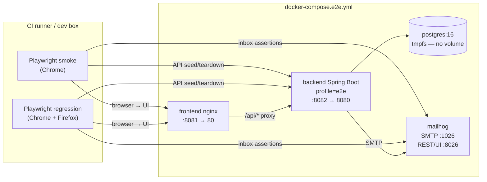

# True E2E smoke + regression suite — industry-standard coverage

## 1. Context & goal

Every existing Playwright spec mocks the backend with `page.route()`. Nothing confirms the SPA +
Spring Boot + Postgres + mail pipeline actually works end-to-end. This feature adds a dedicated
**real-stack E2E layer** with two tiers:

| Tier | When it runs | Target time | Goal |
|---|---|---|---|
| **Smoke** | Every PR + every push to `main` | ≤ 3 min | Prove the golden path of every major flow is not broken |
| **Regression** | Nightly + release branches | ≤ 12 min | Full coverage including edge cases, error paths, cross-browser, mobile |

The stack boots via `docker-compose.e2e.yml` (Postgres + MailHog + Spring Boot + nginx) with a
clean DB per run. Existing mocked specs are completely untouched.

---

## 2. Acceptance criteria

### Infrastructure
- [ ] **AC-1** `docker compose -f docker-compose.e2e.yml up -d --build --wait` boots all four
      services (Postgres 16, MailHog, backend profile=`e2e`, frontend nginx) with health-checks
      healthy. `docker compose down -v` tears down with no leftover volumes.
- [ ] **AC-2** Backend `e2e` profile runs `flyway.clean()` then `flyway.migrate()` on every
      container start → fresh schema each run. MailHog inbox is purged in the global Playwright
      `globalSetup` via `DELETE http://localhost:8026/api/v1/messages`.
- [ ] **AC-3** Playwright config has two named projects: `smoke` (Chrome only, `testDir:
      tests/e2e/smoke`) and `regression` (Chrome + Firefox, `testDir: tests/e2e/regression`).
      Neither project is included in the default `pnpm e2e` command (mocked suite unchanged).
- [ ] **AC-4** All specs import from `tests/e2e/fixtures/test.ts` which extends Playwright
      `test` with a `beforeEach` that calls `resetBackend()` + `purgeMailhog()`.
- [ ] **AC-5** Page Object Model classes live in `tests/e2e/pages/`. Each POM exposes
      semantically named methods (`loginPage.login(email, pass)`, not `.click('#btn')`) so spec
      files contain zero raw locators.
- [ ] **AC-6** A `TestDataFactory` in `tests/e2e/fixtures/factory.ts` provides typed builders:
      `factory.createUser()`, `factory.createClient()`, `factory.createInvoice()`,
      `factory.createExpense()`. Each POSTs to the real API and returns the created entity.
- [ ] **AC-7** `axe-core` accessibility scan runs on every page visit in the regression suite;
      any violation with `impact: critical | serious` fails the test.
- [ ] **AC-8** Every regression spec runs at 1280×800 (desktop) **and** 390×844 (iPhone 14
      viewport) unless the flow is desktop-only (noted in the spec).

### Smoke suite (fast — Chrome only)
- [ ] **AC-9**  `smoke/auth.spec.ts` — register → login → `/` → logout → `/login`.
- [ ] **AC-10** `smoke/clients.spec.ts` — create client → visible in list.
- [ ] **AC-11** `smoke/invoices.spec.ts` — create invoice (one line) → row visible → status `DRAFT`.
- [ ] **AC-12** `smoke/send-email.spec.ts` — send invoice → MailHog receives 1 message with
      correct `To` + `Subject`.
- [ ] **AC-13** `smoke/expenses.spec.ts` — create expense → visible in list.
- [ ] **AC-14** `smoke/dashboard.spec.ts` — dashboard KPI cards render (no zeros when data seeded).
- [ ] **AC-15** `smoke/settings.spec.ts` — upload valid `.docx` template → metadata visible.

### Regression suite (thorough — Chrome + Firefox, desktop + mobile)
- [ ] **AC-16** `regression/auth.spec.ts` — wrong password toast; locked-out user (if applicable);
      session persists on page refresh; logout clears storage; `/login` redirect from protected route.
- [ ] **AC-17** `regression/clients.spec.ts` — full CRUD lifecycle; duplicate email → 409 inline
      error; search by name; search by email; inactive status filter; pagination (seed 25 clients);
      client detail page shows correct contact info.
- [ ] **AC-18** `regression/invoices-crud.spec.ts` — create with multiple lines; edit invoice;
      delete invoice → removed from list; duplicate invoice number → 409 error; zero lines → 400
      validation; invoice detail shows correct totals (subtotal + tax + total).
- [ ] **AC-19** `regression/invoices-lifecycle.spec.ts` — DRAFT → SENT (via send email); SENT →
      PAID (via mark as paid); PAID badge visible; paid invoice cannot be re-sent (button
      disabled or error).
- [ ] **AC-20** `regression/invoices-docx.spec.ts` — generate DOCX for an invoice where company
      profile is saved with known name ("Regression Corp") → download response has
      `Content-Disposition: attachment; filename=invoice-*.docx`; content contains "Regression Corp"
      (read bytes with `@zip.js/zip.js` or raw text scan of the unzipped `word/document.xml`).
      *(depends on FEAT-20260518-02 being merged first; skip guard in spec if company profile
      endpoint returns 404)*.
- [ ] **AC-21** `regression/invoices-send.spec.ts` — MailHog message has PDF attachment;
      send to client with `null` email → 422 toast + MailHog unchanged; MailHog subject
      matches `Invoice #<number>`.
- [ ] **AC-22** `regression/expenses.spec.ts` — create, edit, delete; negative amount → 400;
      category filter; date range filter; pagination (seed 15 expenses).
- [ ] **AC-23** `regression/dashboard.spec.ts` — seed 3 months of invoices + expenses; revenue
      chart has bars for seeded months; expense-by-category chart has correct legend entries;
      date filter narrows KPI cards.
- [ ] **AC-24** `regression/settings-company.spec.ts` — fill all 8 fields → save → reload → values
      pre-filled; empty name → client-side validation blocks submit; IBAN too long → error.
- [ ] **AC-25** `regression/settings-template.spec.ts` — upload valid `.docx` → metadata filename
      visible; upload `.exe` → 415 error toast; upload > 5 MB `.docx` → size error toast;
      download current template → `Content-Disposition` header contains `filename=`.
- [ ] **AC-26** `regression/navigation.spec.ts` — every sidebar link navigates to the correct
      route; active link is highlighted (aria-current=page); sidebar collapse/expand on desktop;
      mobile drawer opens + closes; 404 unknown route shows the Not Found page.
- [ ] **AC-27** `regression/accessibility.spec.ts` — axe scan on `/`, `/clients`, `/invoices`,
      `/expenses`, `/settings/company`, `/settings/invoice-template`; zero critical/serious
      violations.

### CI
- [ ] **AC-28** New CI job `e2e-smoke` (`needs: [backend, frontend]`) runs the smoke project on
      every PR and push. Fails fast (≤ 3 min target). Uploads Playwright HTML report + backend
      logs on failure.
- [ ] **AC-29** New CI job `e2e-regression` runs **nightly** (cron `0 2 * * *`) and on pushes to
      `main`. Runs regression project (Chrome + Firefox). Uploads full trace on failure.
- [ ] **AC-30** Both jobs are gated by `CHECKS.yml` keys `e2e_smoke: true` and
      `e2e_regression: true`.

---

## 3. Architecture



---

## 4. File-by-file change list

### Infrastructure

| Path | Action | Notes |
|---|---|---|
| `docker-compose.e2e.yml` | create | Postgres (tmpfs), MailHog, backend (`SPRING_PROFILES_ACTIVE=e2e`), frontend (nginx) on non-conflicting ports 8081/8082/8026/1026. All four services have `healthcheck`. `COMPOSE_PROJECT_NAME=invoice-tracker-e2e`. |
| `.env.e2e` | create | Fixed test credentials committed to repo. `POSTGRES_DB=invoicetracker_e2e POSTGRES_USER=e2e POSTGRES_PASSWORD=e2e API_USER=admin API_PASSWORD=Secret1!`. |
| `backend/src/main/resources/application.yml` | edit | Add `on-profile: e2e` YAML document: datasource → `postgres:5432/invoicetracker_e2e`, `spring.flyway.clean-disabled=false`, mail host `mailhog:1025`, `app.mail.from=qa@e2e.local`. |
| `backend/src/main/java/.../config/FlywayCleanMigrateInitializer.java` | create | `@Configuration @Profile("e2e")` bean of `FlywayMigrationStrategy` that calls `flyway.clean()` then `flyway.migrate()`. |
| `backend/src/main/java/.../adapter/web/testsupport/E2eResetController.java` | create | `@RestController @Profile("e2e")` — `POST /api/v1/test-support/reset` (auth required). Truncates business tables in correct FK order. Returns 204. |
| `backend/src/test/java/.../testsupport/E2eResetControllerProfileGuardIT.java` | create | `@SpringBootTest` without `e2e` profile — asserts `/test-support/reset` returns 404. |
| `backend/src/test/java/.../testsupport/E2eResetControllerIT.java` | create | With `spring.profiles.active=e2e`, seeds data, calls reset, asserts counts = 0. |

### Playwright infrastructure

| Path | Action | Notes |
|---|---|---|
| `frontend/playwright.config.ts` | edit | Add projects `smoke` (Chrome, `tests/e2e/smoke`) and `regression` (Chrome + Firefox, `tests/e2e/regression`). Default project excludes `tests/e2e/**`. Global setup/teardown hooks. `use.trace: 'on'` for regression, `'on-first-retry'` for smoke. |
| `frontend/package.json` | edit | Add scripts: `e2e:smoke`, `e2e:regression`, `e2e:up`, `e2e:down`. |
| `frontend/tests/e2e/global-setup.ts` | create | Register user, purge MailHog inbox. |
| `frontend/tests/e2e/global-teardown.ts` | create | Optional: report summary. |
| `frontend/tests/e2e/fixtures/test.ts` | create | Extended `test` with `beforeEach` reset + purge. Exports `test`, `expect`, `page`. |
| `frontend/tests/e2e/fixtures/factory.ts` | create | `TestDataFactory`: `createUser`, `createClient`, `createInvoice`, `createExpense`, `saveCompanyProfile`. Typed return values. |
| `frontend/tests/e2e/fixtures/api.ts` | create | Raw HTTP helpers over `request` context: `registerUser`, `loginAndGetBasic`, `seedClient`, `seedInvoice`, `seedExpense`, `purgeMailhog`, `getMailhogMessages`, `resetBackend`. |

### Page Object Model

| Path | Action | Notes |
|---|---|---|
| `frontend/tests/e2e/pages/LoginPage.ts` | create | `goto()`, `login(email, pass)`, `register(email, pass, name)`, `errorToast` locator. |
| `frontend/tests/e2e/pages/AppShellPage.ts` | create | `sidebar`, `navLink(key)`, `logout()`, `currentRoute()`. |
| `frontend/tests/e2e/pages/ClientsPage.ts` | create | `openCreateSheet()`, `fillForm(data)`, `submitForm()`, `findRow(name)`, `deleteRow(name)`, `searchFor(term)`. |
| `frontend/tests/e2e/pages/InvoicesPage.ts` | create | `openCreateSheet()`, `fillForm(data)`, `addLine(desc, qty, price)`, `submitForm()`, `findRow(number)`. |
| `frontend/tests/e2e/pages/InvoiceDetailPage.ts` | create | `statusBadge()`, `clickSend()`, `confirmSend()`, `clickMarkPaid()`, `downloadDocx()`, `downloadPdf()`. |
| `frontend/tests/e2e/pages/ExpensesPage.ts` | create | `openCreateDialog()`, `fillForm(data)`, `submitForm()`, `findRow(description)`. |
| `frontend/tests/e2e/pages/DashboardPage.ts` | create | `kpiCard(key)`, `revenueChart()`, `expenseChart()`, `setDateFilter(from, to)`. |
| `frontend/tests/e2e/pages/SettingsCompanyPage.ts` | create | `goto()`, `fillField(name, value)`, `save()`, `fieldValue(name)`, `fieldError(name)`. |
| `frontend/tests/e2e/pages/SettingsTemplatePage.ts` | create | `goto()`, `uploadFile(path)`, `metadataFilename()`, `downloadCurrent()`. |

### Smoke specs

| Path | Notes |
|---|---|
| `frontend/tests/e2e/smoke/auth.spec.ts` | register → login → `/` → logout → `/login` |
| `frontend/tests/e2e/smoke/clients.spec.ts` | create client → visible in list |
| `frontend/tests/e2e/smoke/invoices.spec.ts` | create invoice → row + DRAFT badge |
| `frontend/tests/e2e/smoke/send-email.spec.ts` | send invoice → MailHog 1 message |
| `frontend/tests/e2e/smoke/expenses.spec.ts` | create expense → visible in list |
| `frontend/tests/e2e/smoke/dashboard.spec.ts` | KPI cards render with seeded data |
| `frontend/tests/e2e/smoke/settings.spec.ts` | upload valid `.docx` → metadata visible |

### Regression specs

| Path | Coverage |
|---|---|
| `frontend/tests/e2e/regression/auth.spec.ts` | Wrong password; session persists on refresh; logout clears storage; protected route redirect; `/login` public route |
| `frontend/tests/e2e/regression/clients.spec.ts` | Full CRUD; duplicate email 409; search name + email; status filter; pagination (25 clients); client detail page |
| `frontend/tests/e2e/regression/invoices-crud.spec.ts` | Multi-line invoice; edit; delete; duplicate number 409; zero lines 400; totals correct |
| `frontend/tests/e2e/regression/invoices-lifecycle.spec.ts` | DRAFT → SENT → PAID; PAID cannot re-send |
| `frontend/tests/e2e/regression/invoices-docx.spec.ts` | Generate DOCX, assert company name in `word/document.xml` (feature-guarded) |
| `frontend/tests/e2e/regression/invoices-send.spec.ts` | PDF attachment in MailHog; null email 422; subject matches invoice number |
| `frontend/tests/e2e/regression/expenses.spec.ts` | CRUD; negative amount 400; category filter; date filter; pagination |
| `frontend/tests/e2e/regression/dashboard.spec.ts` | Revenue chart bars for seeded months; expense chart legend; date filter narrows KPIs |
| `frontend/tests/e2e/regression/settings-company.spec.ts` | Full 8-field save; reload pre-fills; empty name blocked; IBAN too long error |
| `frontend/tests/e2e/regression/settings-template.spec.ts` | Upload valid; upload `.exe` 415; upload > 5 MB; download current |
| `frontend/tests/e2e/regression/navigation.spec.ts` | Every sidebar link; active highlight; collapse/expand; mobile drawer; 404 page |
| `frontend/tests/e2e/regression/accessibility.spec.ts` | axe-core on 6 key pages; zero critical/serious violations |

### Fixtures / helpers

| Path | Notes |
|---|---|
| `frontend/tests/e2e/fixtures/files/sample-template.docx` | Minimal valid `.docx` for upload tests |
| `frontend/tests/e2e/fixtures/files/evil.exe` | 32-byte fake binary for rejection test |
| `frontend/tests/e2e/fixtures/files/oversized-template.docx` | Synthetic 6 MB file generated in `globalSetup` |
| `frontend/tests/e2e/README.md` | Prerequisites, run commands, debugging tips, trace viewer instructions |

### CI

| Path | Action | Notes |
|---|---|---|
| `CHECKS.yml` | edit | Add `e2e_smoke: true` and `e2e_regression: true` |
| `.github/workflows/ci.yml` | edit | Job `e2e-smoke`: `needs: [backend, frontend]`, every PR + push; job `e2e-regression`: `schedule: '0 2 * * *'` + push to `main`. Both build images, compose up, run suite, upload artifacts on failure, compose down. |

### Backend tests

| Path | Notes |
|---|---|
| `FlywayCleanMigrateInitializerTest.java` | Mockito: verifies `clean()` + `migrate()` called in order |
| `E2eResetControllerTest.java` | MockMvc: 204 with auth, 401 anon, truncate SQL runs |
| `E2eResetControllerProfileGuardIT.java` | No `e2e` profile → 404 |
| `E2eResetControllerIT.java` | With `e2e` profile → seed + reset → counts = 0 |

---

## 5. API contract

### POST /api/v1/test-support/reset (e2e profile only)

| | |
|---|---|
| Auth | HTTP Basic |
| Profile | `e2e` only (returns 404 in all other profiles) |
| Response | `204 No Content` |
| Errors | `401` unauthenticated |

Truncates in FK order: `invoice_generated_artifacts`, `invoice_lines`, `invoices`, `expenses`, `clients`, `app_users`, `company_profile` (reset to blank seed row).

---

## 6. Data model changes

None. The `e2e` profile re-uses existing Flyway migrations V1..latest.

---

## 7. Test strategy details

### Two-tier design rationale

```
PR pushed
    └── e2e-smoke (~3 min, Chrome)
            ├── PASS → merge allowed
            └── FAIL → block merge

Every night / push to main
    └── e2e-regression (~12 min, Chrome + Firefox + mobile)
            ├── PASS → green badge
            └── FAIL → Slack/email notification (future)
```

Smoke tests are a **subset** of regression tests — same flows, no error paths, no cross-browser.
This keeps PR feedback fast while nightly regression catches regressions across all browsers.

### Page Object Model rationale

Specs read as business-language assertions:
```typescript
// Good — using POM
await loginPage.login('admin@e2e.local', 'Secret1!');
await expect(dashboardPage.kpiCard('totalInvoices')).toBeVisible();

// Bad — raw locators in spec
await page.click('[data-testid="email-input"]');
await page.fill('[data-testid="email-input"]', 'admin@e2e.local');
```

When a locator changes, only one POM file needs updating — not every spec that uses it.

### Test data factory rationale

```typescript
const client = await factory.createClient({ name: 'Acme Corp', email: 'acme@test.com' });
const invoice = await factory.createInvoice({ clientId: client.id, lines: [{ description: 'Dev', quantity: 1, unitPrice: 500 }] });
```

All API calls use Basic auth from `.env.e2e`. Factory methods assert the response is 2xx before returning.

### Coverage targets

| Flow | Smoke tests | Regression tests | Total assertions |
|---|---|---|---|
| Auth | 2 (happy) | 5 (incl. error paths) | 7 |
| Clients | 1 | 7 | 8 |
| Invoices CRUD | 1 | 6 | 7 |
| Invoices lifecycle | — | 3 | 3 |
| Invoices DOCX | — | 1 (feature-guarded) | 1 |
| Invoice send email | 1 | 3 | 4 |
| Expenses | 1 | 5 | 6 |
| Dashboard | 1 | 3 | 4 |
| Settings company | 1 | 4 | 5 |
| Settings template | 1 | 4 | 5 |
| Navigation / a11y | — | 6 | 6 |
| **Total** | **9** | **47** | **56** |

---

## 8. Accessibility strategy

Every regression spec uses the shared `checkA11y` helper:

```typescript
import { checkA11y } from '../fixtures/a11y';

test('dashboard is accessible', async ({ page }) => {
  await dashboardPage.goto();
  await checkA11y(page); // throws on critical/serious violations
});
```

`checkA11y` uses `@axe-core/playwright` with rules scoped to `wcag2a, wcag2aa, wcag21aa`.
Violations at `moderate` or `minor` are logged as warnings only. `critical` and `serious`
violations fail the test. This catches: missing alt text, insufficient colour contrast,
missing form labels, non-keyboard-navigable interactive elements.

---

## 9. Cross-browser + viewport strategy

| Spec tier | Browsers | Viewports |
|---|---|---|
| Smoke | Chromium | 1280×800 |
| Regression | Chromium + Firefox | 1280×800 + 390×844 (iPhone 14) |

Mobile viewport tests assert:
- Sidebar is hidden (drawer mode), hamburger button visible
- Navigation drawer opens + closes
- Forms are usable (no horizontal overflow)
- KPI cards stack vertically

WebKit (Safari) is left as a future extension — it requires additional CI runner config.

---

## 10. Security considerations

| Item | Mitigation |
|---|---|
| `E2eResetController` in prod | `@Profile("e2e")` — 404 in all other profiles. `E2eResetControllerProfileGuardIT` enforces this. |
| `.env.e2e` committed | Contains only fixed test-purpose credentials. No real secrets. Documented explicitly in README. |
| `flyway.clean-disabled=false` | Only in `e2e` YAML doc. All other profiles keep Flyway 10 default (`true`). |
| axe-core injection | `@axe-core/playwright` is a devDependency; not bundled in prod build. |
| MailHog open relay | Bound to `127.0.0.1` in compose; not reachable from outside the runner. |

---

## 11. Risks & mitigations

| Risk | Mitigation |
|---|---|
| CI flakiness from email polling | Poll MailHog up to 5 s / 250 ms; `retries: 1` on CI |
| Compose port clash with local dev | Non-default ports 8081/8082/8026/1026 + separate project name |
| DOCX byte scan fragility | Scan `word/document.xml` text only (UTF-8 string contains), not binary diff |
| Feature-gated DOCX test | `test.skip(profileEndpointMissing, 'FEAT-20260518-02 not merged')` guard |
| Runner cold build time | Cache `~/.m2` and `~/.pnpm-store`; target ≤ 4 min cold, ≤ 1 min warm |
| Firefox WebDriver differences | Smoke is Chrome-only; Firefox only in nightly regression |
| Mobile viewport edge cases | Initially assert layout correctness, not pixel-perfect |

---

## 12. Effort

**XL** — significant cross-cutting work: backend (2 new e2e-profile classes + 4 tests), frontend
infrastructure (compose, config, global setup, 3 fixture modules), 9 POM classes, 7 smoke specs,
12 regression specs, accessibility helper, CI changes (2 new jobs), docs. No business logic
changes. Estimated 2–3 dev-days including CI iteration and cross-browser debugging.
