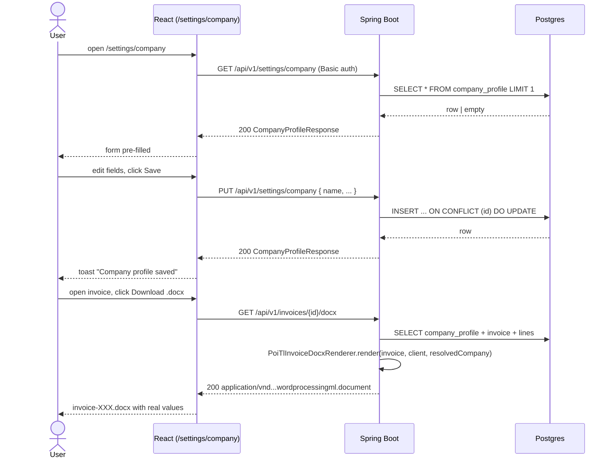
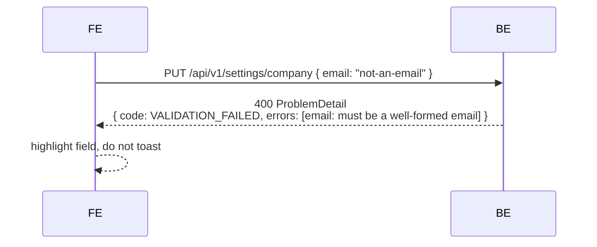

# Persisted Company Profile + documented docx placeholder substitution

## 1. Context & goal

Today the docx renderer (`PoiTlInvoiceDocxRenderer`) already substitutes `{{company.*}}`,
`{{client.*}}` and `{{invoice.*}}` placeholders, but `CompanyProperties` is sourced from
static `app.company.*` YAML — users cannot edit it from the UI and the default sample template
still ships with literal `[Company Name]` text. This feature adds a persisted, editable
`CompanyProfile` (single-row, app-singleton) exposed through `/api/v1/settings/company`
(`GET`/`PUT`), wires it into the renderer ahead of the YAML fallback, refreshes the bundled
default template to use the real `{{...}}` tokens, and builds a Company Profile settings page
at `/settings/company`. Placeholder catalogue is published in `docs/INVOICE_TEMPLATE.md`.

## 2. Acceptance criteria

- [ ] AC-1: `GET /api/v1/settings/company` returns the persisted profile (or sensible blank
      defaults when the row has never been written) for any authenticated user.
- [ ] AC-2: `PUT /api/v1/settings/company` validates and upserts the profile; subsequent
      DOCX/PDF renders show the new values without an app restart.
- [ ] AC-3: All eight company fields are persisted: `name`, `address`, `phone`, `email`,
      `vatNumber`, `iban`, `swiftBic`, `bankName`. Field lengths match the existing
      `clients.company_*` columns.
- [ ] AC-4: `CompanyProfileResolver` (new) is consumed by `InvoiceRenderService.renderDocx`
      and `renderPdf`; it returns persisted values first, then falls back to
      `CompanyProperties` (YAML), then to empty string. Snapshot precedence on the invoice
      itself is unchanged (already covered in `PoiTlInvoiceDocxRenderer`).
- [ ] AC-5: A user uploads the bundled default template, generates a DOCX for an invoice,
      opens it in Word/LibreOffice, and sees their persisted Company name/address/IBAN —
      not `[Company Name]`, not `Invoice Tracker Co`.
- [ ] AC-6: `/settings/company` SPA page shows a form pre-populated from `GET`, validates
      fields client-side (email shape, IBAN ≤ 100, SWIFT ≤ 20, etc.), persists on submit,
      and surfaces the `settings.company.toast.saved` toast on success.
- [ ] AC-7: Sidebar shows a second link **Company Profile** (key `nav.settingsCompany`)
      below **Invoice Template** under the Settings group.
- [ ] AC-8: `docs/INVOICE_TEMPLATE.md` enumerates every placeholder the renderer supports
      (both nested `{{company.name}}` and flat aliases such as `{{companyName}}`), plus the
      `{{lines}}` table convention.
- [ ] AC-9: Legacy PDF endpoint (`GET /api/v1/invoices/{id}/pdf`) and `docx-pdf` endpoint
      still work; PDF rendering route is unchanged.
- [ ] AC-10: Backend JaCoCo line/branch ≥ 0.95 on every new file; Vitest 95/95/95/90 on
      the new frontend slice.

## 3. Architecture (mermaid)

```mermaid
flowchart LR
    user[User] -->|/settings/company| fe[React SPA]
    fe -->|GET / PUT /api/v1/settings/company| ctl[CompanyProfileController]
    ctl --> svc[CompanyProfileService]
    svc --> repo[(company_profile<br/>singleton row)]
    fe -->|GET /api/v1/invoices/{id}/docx| ren[InvoiceRenderController]
    ren --> rsvc[InvoiceRenderService]
    rsvc --> resolver[CompanyProfileResolver]
    resolver -->|persisted| repo
    resolver -->|fallback YAML| props[CompanyProperties]
    rsvc --> docx[PoiTlInvoiceDocxRenderer]
    docx -->|reads| tpl[(invoice-template.docx<br/>+ {{placeholders}})]
    docx -->|writes| out[merged .docx]
```

## 4. Sequence (happy path + edge)



Edge case — invalid email on PUT:



## 5. File-by-file change list

### Backend — create

| Path | Action | Purpose |
|---|---|---|
| `backend/src/main/resources/db/migration/V14__create_company_profile.sql` | create | Single-row `company_profile` table + seed row |
| `backend/src/main/java/com/example/invoicetracker/domain/company/CompanyProfile.java` | create | Domain record (8 fields + `updatedAt`) |
| `backend/src/main/java/com/example/invoicetracker/domain/company/CompanyProfileRepository.java` | create | Port: `find()`, `save(CompanyProfile)` |
| `backend/src/main/java/com/example/invoicetracker/adapter/persistence/company/CompanyProfileEntity.java` | create | JPA entity (`company_profile`, fixed `id=1` smallint PK) |
| `backend/src/main/java/com/example/invoicetracker/adapter/persistence/company/CompanyProfileJpaRepository.java` | create | Spring Data interface |
| `backend/src/main/java/com/example/invoicetracker/adapter/persistence/company/CompanyProfileRepositoryAdapter.java` | create | Port impl (entity-mapper + `find()` in same tx, like `ClientRepositoryAdapter`) |
| `backend/src/main/java/com/example/invoicetracker/application/company/CompanyProfileService.java` | create | `get()`, `update(CompanyProfile)` use-cases |
| `backend/src/main/java/com/example/invoicetracker/application/company/CompanyProfileResolver.java` | create | Reads persisted → falls back to `CompanyProperties` → returns `CompanyProperties` shape so `PoiTlInvoiceDocxRenderer` stays untouched |
| `backend/src/main/java/com/example/invoicetracker/adapter/web/settings/CompanyProfileController.java` | create | `GET`/`PUT /api/v1/settings/company` |
| `backend/src/main/java/com/example/invoicetracker/adapter/web/settings/dto/CompanyProfileRequest.java` | create | Bean-validated request DTO (record) |
| `backend/src/main/java/com/example/invoicetracker/adapter/web/settings/dto/CompanyProfileResponse.java` | create | Response DTO (record) |

### Backend — edit

| Path | Action | Purpose |
|---|---|---|
| `backend/src/main/java/com/example/invoicetracker/application/invoice/InvoiceRenderService.java` | edit | Inject `CompanyProfileResolver`; call `resolver.resolve()` instead of using `companyProperties` directly when rendering docx + pdf. `CompanyProperties` kept as fallback. Same for `sendEmail`. |
| `backend/src/main/java/com/example/invoicetracker/application/invoice/InvoiceService.java` | edit | When generating PDF for legacy `/pdf` and `sendEmail`, resolve through `CompanyProfileResolver` (same pattern). |
| `backend/src/main/java/com/example/invoicetracker/application/invoice/JavaMailInvoiceMailer.java` | edit | Use resolved company for subject + body templating (currently uses static `companyProperties.name()`). |
| `backend/src/main/resources/templates/invoice-template.docx` | edit | Replace `[Company Name]`, `[Street Address]`, `[Client Name]` etc. with `{{companyName}}`, `{{companyAddress}}`, `{{clientName}}`, `{{clientAddress}}`, `{{invoiceNumber}}`, `{{invoiceIssueDate}}`, `{{invoiceDueDate}}`, `{{invoiceSubtotal}}`, `{{invoiceTaxRate}}`, `{{invoiceTaxAmount}}`, `{{invoiceTotal}}`, plus `{{lines}}` table trigger + 1 template row of `{{description}}`/`{{quantity}}`/`{{unitPrice}}`/`{{lineTotal}}`. |

### Backend — tests (create)

| Path | Action | Purpose |
|---|---|---|
| `backend/src/test/java/com/example/invoicetracker/application/company/CompanyProfileServiceTest.java` | create | unit |
| `backend/src/test/java/com/example/invoicetracker/application/company/CompanyProfileResolverTest.java` | create | unit |
| `backend/src/test/java/com/example/invoicetracker/adapter/web/settings/CompanyProfileControllerTest.java` | create | `@SpringBootTest(webEnvironment=MOCK)` + `MockMvc` |
| `backend/src/test/java/com/example/invoicetracker/adapter/persistence/company/CompanyProfileRepositoryAdapterIT.java` | create | Testcontainers IT |
| `backend/src/test/java/com/example/invoicetracker/adapter/web/settings/CompanyProfileFlowIT.java` | create | End-to-end IT: PUT then GET then docx render contains the new name |

### Backend — edit existing tests

| Path | Action | Purpose |
|---|---|---|
| `backend/src/test/java/com/example/invoicetracker/application/invoice/InvoiceRenderServiceTest.java` | edit | Mock new `CompanyProfileResolver` |
| `backend/src/test/java/com/example/invoicetracker/application/invoice/PoiTlInvoiceDocxRendererTest.java` | edit | No-op for production code but add one extra assertion: when resolver returns persisted values, rendered DOCX text contains them. |

### Frontend — create

| Path | Action | Purpose |
|---|---|---|
| `frontend/src/features/settings/model/companyProfile.ts` | create | `CompanyProfile` TS interface (8 fields + `updatedAt`) |
| `frontend/src/features/settings/model/companyProfileSchema.ts` | create | Zod schema for form validation |
| `frontend/src/features/settings/api/companyProfileApi.ts` | create | `getCompanyProfile()`, `updateCompanyProfile()` |
| `frontend/src/features/settings/api/useCompanyProfile.ts` | create | React hook (same pattern as `useTemplateMetadata`) |
| `frontend/src/features/settings/ui/CompanyProfileSettingsPage.tsx` | create | Form page wired to hook + api |
| `frontend/src/features/settings/ui/CompanyProfileForm.tsx` | create | Form component (8 fields, react-hook-form + zodResolver) |
| `frontend/src/pages/CompanyProfileSettingsPage.tsx` | create | Page re-export (mirrors `InvoiceTemplateSettingsPage.tsx`) |

### Frontend — tests (create)

| Path | Action | Purpose |
|---|---|---|
| `frontend/src/features/settings/api/companyProfileApi.test.ts` | create | MSW: GET happy + PUT happy + PUT 400 |
| `frontend/src/features/settings/api/useCompanyProfile.test.ts` | create | loading → data, error path |
| `frontend/src/features/settings/model/companyProfileSchema.test.ts` | create | Valid + invalid permutations |
| `frontend/src/features/settings/ui/CompanyProfileForm.test.tsx` | create | Render, edit, submit, validation errors |
| `frontend/src/features/settings/ui/CompanyProfileSettingsPage.test.tsx` | create | Loading skeleton, populated form, save toast |
| `frontend/tests/settings/company-profile.spec.ts` | create | Playwright E2E |

### Frontend — edit

| Path | Action | Purpose |
|---|---|---|
| `frontend/src/app/App.tsx` | edit | Add `<Route path="/settings/company" element={<CompanyProfileSettingsPage />} />` |
| `frontend/src/app/App.test.tsx` | edit | Add route-render test for `/settings/company` |
| `frontend/src/shared/components/Sidebar.tsx` | edit | Add `{ to: '/settings/company', labelKey: 'nav.settingsCompany', icon: Building }` to `SETTINGS_ITEMS` |
| `frontend/src/shared/components/Sidebar.test.tsx` | edit | New link assertion |
| `frontend/src/mocks/handlers.ts` | edit | Extend `CompanyProfile` mock type with the 4 missing fields (`vatNumber`, `iban`, `swiftBic`, `bankName`, `phone`); keep existing `/api/v1/settings/company` handlers but with the extended shape. |

### Docs

| Path | Action | Purpose |
|---|---|---|
| `projects/invoice-tracker/docs/INVOICE_TEMPLATE.md` | create | Placeholder catalogue + `{{lines}}` table convention + screenshot of bundled default |
| `projects/invoice-tracker/docs/API.md` | edit | Add `/api/v1/settings/company` GET/PUT |
| `projects/invoice-tracker/docs/FEATURES.md` | edit | New row |
| `projects/invoice-tracker/docs/ARCHITECTURE.md` | edit | Add `company_profile` to the data-model diagram |
| `projects/invoice-tracker/docs/CHANGELOG.md` | edit | Entry |
| `projects/invoice-tracker/postman/collection.json` | edit | Two new requests under "Settings" folder |

## 6. API contract

### GET /api/v1/settings/company

| | |
|---|---|
| Auth | HTTP Basic, any authenticated user |
| Request | (no body) |
| Response 200 | `CompanyProfileResponse` |
| Errors | 401 (unauthenticated) |

```json
// 200 OK
{
  "name": "Invoice Tracker Co",
  "address": "123 Business Ave, New York, NY 10001",
  "phone": "+1 555 000 0000",
  "email": "billing@invoicetracker.local",
  "vatNumber": "US123456789",
  "iban": "US12 3456 7890 1234 5678 90",
  "swiftBic": "BOFAUS3N",
  "bankName": "Bank of Example",
  "updatedAt": "2026-05-18T10:14:00Z"
}
```

### PUT /api/v1/settings/company

| | |
|---|---|
| Auth | HTTP Basic, any authenticated user |
| Content-Type | `application/json` |
| Request | `CompanyProfileRequest` |
| Response 200 | `CompanyProfileResponse` |
| Errors | 400 `VALIDATION_FAILED` (Problem+JSON with `errors[]`), 401, 415 |

```json
// PUT body
{
  "name": "Invoice Tracker Co",            // required, 1..200
  "address": "...",                         // optional, 0..500
  "phone": "+1 555 ...",                    // optional, 0..32
  "email": "billing@example.com",           // optional, valid email or empty, ≤254
  "vatNumber": "...",                       // optional, 0..50
  "iban": "...",                            // optional, 0..100, IBAN allowed chars only
  "swiftBic": "...",                        // optional, 0..20
  "bankName": "..."                         // optional, 0..200
}
```

Validation (Jakarta + manual):
- `name`: `@NotBlank`, `@Size(max=200)`
- `email`: `@Email` allowed-empty (custom validator `@OptionalEmail`)
- All others: `@Size(max=<col-length>)`, null → empty string in record canonical ctor

Error body uses existing `GlobalExceptionHandler` ProblemDetail conventions: status 400,
`code=VALIDATION_FAILED`, `errors: [{ field, message }]`.

## 7. Data model changes

```sql
-- V14__create_company_profile.sql
CREATE TABLE company_profile (
    id          SMALLINT     PRIMARY KEY DEFAULT 1 CHECK (id = 1),
    name        VARCHAR(200) NOT NULL DEFAULT '',
    address     VARCHAR(500) NOT NULL DEFAULT '',
    phone       VARCHAR(32)  NOT NULL DEFAULT '',
    email       VARCHAR(254) NOT NULL DEFAULT '',
    vat_number  VARCHAR(50)  NOT NULL DEFAULT '',
    iban        VARCHAR(100) NOT NULL DEFAULT '',
    swift_bic   VARCHAR(20)  NOT NULL DEFAULT '',
    bank_name   VARCHAR(200) NOT NULL DEFAULT '',
    updated_at  TIMESTAMPTZ  NOT NULL DEFAULT now()
);

INSERT INTO company_profile (id) VALUES (1) ON CONFLICT DO NOTHING;
```

Singleton-table approach (PK pinned to `1` with CHECK) avoids null-handling on `find()`
and removes any "which row?" race in `update`. No new indexes — table is single-row.

JPA entity uses `@Version` for optimistic locking (consistency with `ClientEntity`).

## 8. Test strategy

| Layer | Test | Asserts |
|---|---|---|
| Unit (BE) | `CompanyProfileServiceTest.get_returns_seed_row_when_blank` | service returns an empty-strings record |
| Unit (BE) | `CompanyProfileServiceTest.update_persists_and_bumps_updatedAt` | repo.save called with same values, `updatedAt` non-null |
| Unit (BE) | `CompanyProfileResolverTest.persisted_overrides_yaml` | when repo returns name="X", resolve().name() = "X" |
| Unit (BE) | `CompanyProfileResolverTest.falls_back_to_yaml_when_persisted_blank` | empty persisted name → YAML name returned |
| Unit (BE) | `CompanyProfileControllerTest.get_returns_200_with_payload` | MockMvc 200, jsonPath fields |
| Unit (BE) | `CompanyProfileControllerTest.put_400_when_name_blank` | validation problem detail |
| Unit (BE) | `CompanyProfileControllerTest.put_400_when_email_invalid` | `@Email` rejection |
| Unit (BE) | `CompanyProfileControllerTest.put_401_when_anonymous` | filter chain rejects |
| Unit (BE) | `CompanyProfileControllerTest.put_415_when_not_json` | content type guard |
| Integration (BE) | `CompanyProfileRepositoryAdapterIT.upserts_singleton_row` | Testcontainers Postgres, two saves produce one row, second value wins |
| Integration (BE) | `CompanyProfileFlowIT.put_then_render_docx_contains_value` | PUT name=Acme then GET `/api/v1/invoices/{id}/docx` → docx bytes contain "Acme" (POI read-back) |
| Integration (BE) | `InvoiceRenderServiceTest.docx_uses_resolved_company` | resolver mocked to return non-YAML name, asserts renderer received it |
| Unit (FE) | `companyProfileSchema.test.ts` | valid full payload, invalid email, name too long, iban too long |
| Unit (FE) | `companyProfileApi.test.ts` | GET success, PUT success returns updated payload, PUT 400 throws `ApiError` with `errors[]` |
| Unit (FE) | `useCompanyProfile.test.ts` | initial loading=true then data, error sets `error` |
| Unit (FE) | `CompanyProfileForm.test.tsx` | renders 8 inputs, submits on save, shows per-field errors, disables save during submit |
| Unit (FE) | `CompanyProfileSettingsPage.test.tsx` | shows skeleton, pre-fills form, success toast on save |
| Unit (FE) | `App.test.tsx` | `/settings/company` route renders the page when authenticated |
| Unit (FE) | `Sidebar.test.tsx` | new link href + active marker |
| E2E | `tests/settings/company-profile.spec.ts` | navigate to /settings/company, fill form, save, reload, value persists; then download an invoice DOCX and confirm Content-Disposition (DOCX byte assertion deferred to BE IT) |

Coverage target: every new BE file ≥ 95 % line + branch (JaCoCo merges unit + IT exec).
Frontend: vitest 95/95/95/90 — react-hook-form path covered by `CompanyProfileForm.test.tsx`.

## 9. Security considerations

| OWASP item | Applies? | Mitigation in this plan |
|---|---|---|
| A01 Broken Access Control | yes | Endpoint behind existing HTTP Basic filter chain (`SecurityConfig`). Single-tenant by design — no user-scoping needed yet (R-1 below). |
| A03 Injection | yes | JPA parameter binding; no String SQL. Bean-Validation `@Size` caps and `@Email` enforce shape. IBAN/SWIFT regex on the request DTO restricts charset to `[A-Z0-9 ]` to prevent template-engine surprises. |
| A04 Insecure Design | yes | Singleton row + PK CHECK constraint removes "delete all then insert" race; optimistic `@Version` on the entity. |
| A05 Security Misconfiguration | yes | New endpoint inherits CSRF-disabled stateless basic-auth posture documented in `SecurityConfig.java:40`. No new exposure changes. |
| A07 Identification & Auth | yes | Re-uses `AuthRateLimitFilter` rate-limit for `/api/v1/**`. |
| A08 Data Integrity | yes | `@Version` optimistic lock prevents concurrent overwrites; controller returns 409 on `OptimisticLockingFailureException` (mapped in `GlobalExceptionHandler`). |
| A09 Logging | yes | INFO log on update with field-name list only — never the values (could be PII / VAT / IBAN). DEBUG can log lengths. |
| A10 SSRF | no | n/a — no outbound calls. |
| Template injection | yes | poi-tl already runs `Configure.ClearHandler` for unresolved tags. Persisted values are user-owned, so no cross-user concern, but we still strip CRLF on `email` to keep `JavaMailInvoiceMailer` headers safe (mirrors existing CRLF guard in `InvoiceRenderService.java:128`). |

## 10. Risks & open questions

- **Per-user vs single-tenant** — `REQUEST.md` says "per-user (or singleton)". Default chosen: **singleton** (one company per app instance), matching how `app.company` YAML works today and avoiding a join through `app_users` for every render. If multi-tenant becomes needed, add `app_user_id UUID` + unique index in a later migration; the resolver port stays stable.
- **Default seed values** — V14 inserts an empty row; the resolver fills in from YAML on render. This keeps `application.yml` as a deployment-time default without re-running the migration.
- **Template asset edit** — `invoice-template.docx` is a binary. The developer agent must use python-docx or POI in a build-time script (no Word required). Acceptance hinges on opening the bundled template in LibreOffice and verifying `{{...}}` tokens render correctly via the existing `PoiTlInvoiceDocxRenderer.expandLinesTable` + poi-tl pipeline. Default: replace tokens via `python-docx` script run by developer, then commit binary.
- **Invoice snapshots** — `Invoice.companyNameSnapshot()` etc. (V10) take precedence over the resolved company at render time. This is intentional: invoices issued before the profile was edited keep their original company branding. Acceptance test for AC-5 uses a **freshly created** invoice (snapshots empty) so the resolver wins.
- **Mailer subject** — `MailProperties.subjectTemplate` reads `{{company}}` from a hand-rolled substitution. We will route it through the resolver too, otherwise emails still say the YAML company name.
- **Frontend mock shape** — existing `mockCompanyProfile` in `handlers.ts:189` has only 4 fields. We will widen it; existing tests that reference it must keep passing (none currently assert on missing fields).

## 11. Effort

`M` — ~12 new BE files (incl. tests), ~8 new FE files (incl. tests), 1 Flyway migration,
1 binary template edit, 4 doc edits. No architectural shift, no new dependency. Estimated
1.5–2 dev-days including the template asset and Playwright spec.
