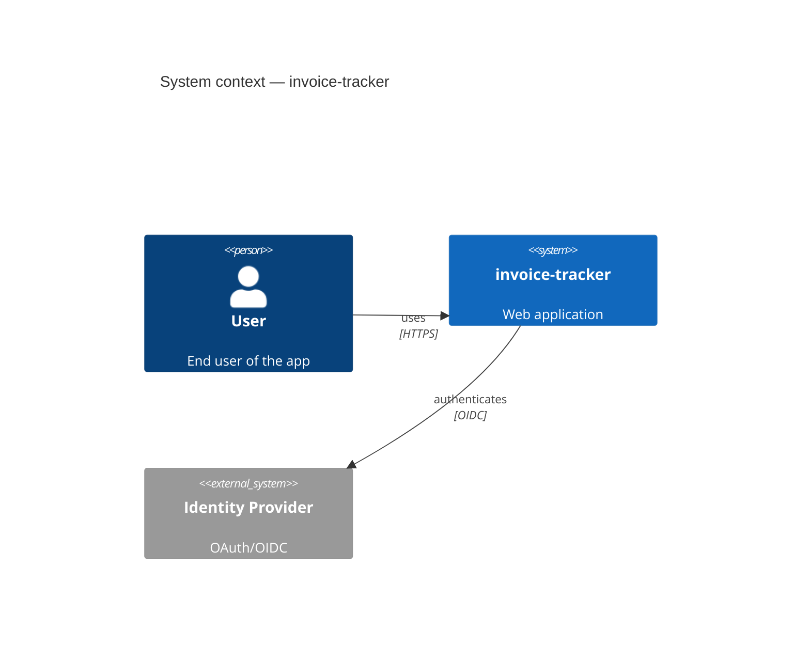
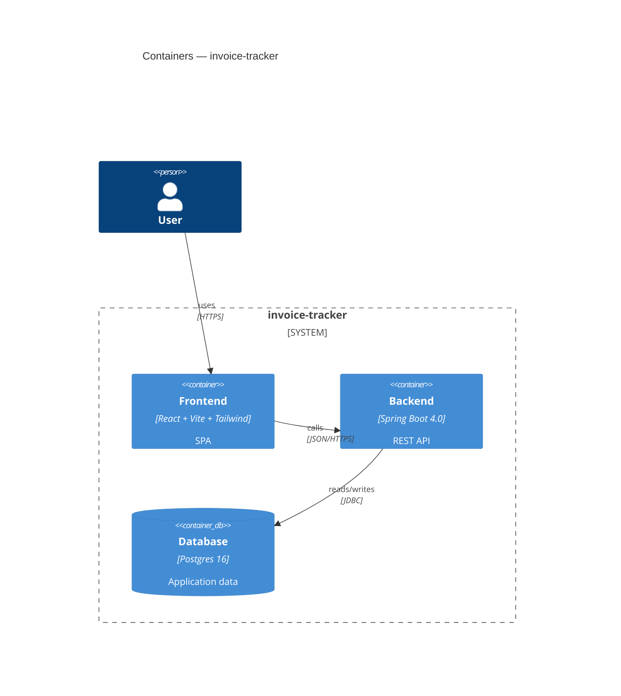
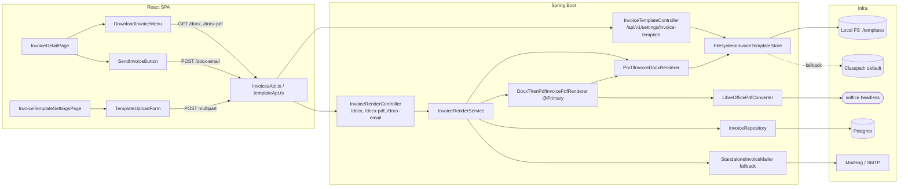

# Architecture

Maintained by the **documentation** subagent. Edit by hand only when refactoring beyond what a single feature does.

## System context (C4 — level 1)



## Containers (C4 — level 2)



## Components — Backend (C4 — level 3)

Updated by FEAT-20260518-02 (persisted company profile + docx placeholder substitution). FEAT-20260516-01 added ExpenseController/Service and AuthRateLimitFilter. FEAT-20260514-02 added InvoiceArtifactService and lifecycle endpoints. FEAT-20260514-01 added DashboardController/Service and MarkAsPaid. FEAT-20260513-03 added InvoiceRenderController, InvoiceRenderService, PoiTlInvoiceDocxRenderer, LibreOfficePdfConverter, DocxThenPdfInvoicePdfRenderer, and InvoiceTemplateController. FEAT-20260513-02 added InvoiceController, InvoiceService, OpenPdfInvoiceRenderer, JavaMailInvoiceMailer, and InvoiceRepositoryAdapter. Previous update: FEAT-20260512-02 (authentication modernization).

```mermaid
flowchart TB
    subgraph adapter_web["adapter.web"]
        ctl[ClientController]
        auth_ctl[AuthController<br/>/api/v1/auth/*]
        inv_ctl[InvoiceController<br/>/api/v1/invoices — CRUD + /pdf + /send-email<br/>+ PATCH /{id}/mark-paid + DELETE /{id}<br/>+ GET /{id}/preview-pdf<br/>+ POST /{id}/generate<br/>+ GET /{id}/generated<br/>+ GET /{id}/generated/metadata]
        exp_ctl[ExpenseController<br/>/api/v1/expenses — CRUD + /summary]
        dash_ctl[DashboardController<br/>GET /api/v1/dashboard/stats]
        render_ctl[InvoiceRenderController<br/>/api/v1/invoices/{id}/docx<br/>/docx-pdf  /docx-email]
        tpl_ctl[InvoiceTemplateController<br/>/api/v1/settings/invoice-template]
        cp_ctl[CompanyProfileController<br/>GET + PUT /api/v1/settings/company<br/>NEW — FEAT-20260518-02]
    end
    subgraph application["application"]
        exp_svc[ExpenseService<br/>create / list / get / update / delete / summary]
        svc[ClientService]
        auth_svc[AuthService]
        inv_svc[InvoiceService<br/>markAsPaid / sendEmail / delete ...]
        inv_art_svc[InvoiceArtifactService<br/>previewPdf / generate / streamGenerated<br/>metadata / deleteAll]
        dash_svc[DashboardService<br/>getStats — Clock-injected<br/>zero-fills revenueByMonth]
        render_svc[InvoiceRenderService<br/>renderDocx / renderPdf / sendEmail]
        cp_svc[CompanyProfileService<br/>get / update — NEW FEAT-20260518-02]
        cp_resolver[CompanyProfileResolver<br/>persisted → YAML → empty<br/>NEW — FEAT-20260518-02]
        tpl_store_port[InvoiceTemplateStore port]
        art_store_port[GeneratedArtifactStore port]
        docx_port[InvoiceDocxRenderer port]
        pdf_conv_port[InvoicePdfConverter port]
        art_props[GeneratedArtifactProperties<br/>app.invoice.generated.*]
    end
    subgraph domain["domain"]
        entities[Client, AppUser, Invoice, InvoiceLine<br/>GeneratedArtifact record<br/>ArtifactFormat enum PDF/DOCX<br/>Expense, ExpenseCategory enum (10 values)<br/>CategorySummary<br/>CompanyProfile record — NEW FEAT-20260518-02]
        status[InvoiceStatus enum<br/>DRAFT / SENT / PAID]
        repos[ClientRepository, AppUserRepository, InvoiceRepository<br/>GeneratedArtifactRepository<br/>CompanyProfileRepository — NEW FEAT-20260518-02<br/>countByStatus / revenueByStatus / revenueByMonth]
        exceptions[InvoiceHasNoRecipientException<br/>PdfConversionFailedException<br/>GeneratedArtifactNotFoundException<br/>ArtifactAlreadyExistsException<br/>ArtifactTooLargeException]
    end
    subgraph adapter_persistence["adapter.persistence"]
        jpa[ClientRepositoryAdapter<br/>AppUserRepositoryAdapter<br/>InvoiceRepositoryAdapter<br/>GeneratedArtifactRepositoryAdapter<br/>ExpenseRepositoryAdapter<br/>CompanyProfileRepositoryAdapter — NEW FEAT-20260518-02<br/>markPaid / softDelete / revenueByMonth / summary JPQL]
    end
    subgraph adapter_template["adapter.template"]
        fs_store[FilesystemInvoiceTemplateStore<br/>atomic replace / ZIP validation / SSRF scan<br/>VBA macro rejection]
    end
    subgraph adapter_artifact["adapter.artifact"]
        fs_art_store[FilesystemGeneratedArtifactStore<br/>atomic write via tmp+move / SHA-256<br/>canonical path / size cap / path-traversal guard]
    end
    subgraph adapter_rendering["application.invoice (impls)"]
        poi[PoiTlInvoiceDocxRenderer<br/>poi-tl + LoopRowTableRenderPolicy]
        lo[LibreOfficePdfConverter<br/>ProcessBuilder soffice / Semaphore-2]
        composed[DocxThenPdfInvoicePdfRenderer<br/>@Primary — composes poi + lo]
        mailer[StandaloneInvoiceMailer<br/>@ConditionalOnMissingBean]
    end
    subgraph config["config"]
        sec[SecurityConfig]
        rl[AuthRateLimitFilter<br/>Bucket4j 8.10.1<br/>5 req/IP/min on /auth/login, /auth/register]
        mail_cfg[InvoiceMailerAutoConfig<br/>conditional JavaMailSender]
        app_cfg[AppConfig<br/>Clock.systemUTC bean<br/>@EnableConfigurationProperties(GeneratedArtifactProperties)]
    end
    subgraph infra_ext["External"]
        db[(Postgres<br/>invoices / invoice_lines<br/>invoice_generated_artifacts<br/>app_users / clients<br/>expenses — V12<br/>company_profile — V14 NEW FEAT-20260518-02)]
        fs[(FS ./templates/invoice-template.docx)]
        gen_fs[(FS ./generated/invoices/&lt;id&gt;.pdf|.docx<br/>named Docker volume generated_invoices)]
        lo_bin([soffice headless binary])
        smtp[MailHog / SMTP]
        cp[(Classpath default template)]
        yaml_co[CompanyProperties<br/>app.company.* YAML fallback]
    end
    exp_ctl --> exp_svc
    ctl --> svc
    auth_ctl --> auth_svc
    inv_ctl --> inv_svc
    inv_ctl --> inv_art_svc
    dash_ctl --> dash_svc
    render_ctl --> render_svc
    tpl_ctl --> tpl_store_port
    cp_ctl --> cp_svc
    cp_svc --> repos
    cp_resolver --> repos
    cp_resolver -. fallback .-> yaml_co
    dash_svc --> repos
    inv_svc --> repos
    inv_svc --> inv_art_svc
    inv_art_svc --> render_svc
    inv_art_svc --> art_store_port
    inv_art_svc --> repos
    render_svc --> docx_port
    render_svc --> pdf_conv_port
    render_svc --> mailer
    render_svc --> repos
    render_svc --> cp_resolver
    tpl_store_port -.implemented by.-> fs_store
    art_store_port -.implemented by.-> fs_art_store
    docx_port -.implemented by.-> poi
    pdf_conv_port -.implemented by.-> lo
    composed --> poi
    composed --> lo
    repos -.implemented by.-> jpa
    jpa --> db
    fs_store --> fs
    fs_store -. fallback .-> cp
    fs_art_store --> gen_fs
    lo --> lo_bin
    mailer --> smtp
    sec -.permits.- auth_ctl
    app_cfg -.provides Clock.-> dash_svc
```

## Company profile + placeholder resolution (FEAT-20260518-02)

```mermaid
flowchart LR
    user[User] -->|/settings/company| fe[React SPA]
    fe -->|GET / PUT /api/v1/settings/company| ctl[CompanyProfileController]
    ctl --> svc[CompanyProfileService]
    svc --> repo[(company_profile<br/>singleton row)]
    fe -->|GET /api/v1/invoices/{id}/docx| ren[InvoiceRenderController]
    ren --> rsvc[InvoiceRenderService]
    rsvc --> resolver[CompanyProfileResolver]
    resolver -->|persisted| repo
    resolver -->|fallback YAML| props[CompanyProperties]
    rsvc --> docx[PoiTlInvoiceDocxRenderer]
    docx -->|reads| tpl[(invoice-template.docx<br/>+ poi-tl tokens)]
    docx -->|writes| out[merged .docx]
```

**`company_profile` table** (Flyway `V14__create_company_profile.sql`):

| Column | Type | Notes |
|--------|------|-------|
| `id` | SMALLINT PK | `DEFAULT 1 CHECK (id = 1)` — singleton enforcement |
| `name` | VARCHAR(200) | Required; rendered as `{{companyName}}` / `{{company.name}}` |
| `address` | VARCHAR(500) | |
| `phone` | VARCHAR(32) | |
| `email` | VARCHAR(254) | `@OptionalEmail` validation (empty allowed) |
| `vat_number` | VARCHAR(50) | |
| `iban` | VARCHAR(100) | Charset restricted to `[A-Z0-9 ]` |
| `swift_bic` | VARCHAR(20) | |
| `bank_name` | VARCHAR(200) | |
| `updated_at` | TIMESTAMPTZ | `DEFAULT now()` |

JPA entity carries `@Version` for optimistic locking (same pattern as `ClientEntity`). No secondary indexes — table is single-row.

**`CompanyProfileResolver` precedence chain** (called by `InvoiceRenderService`, `InvoiceService`, `JavaMailInvoiceMailer`):

1. Persisted `company_profile` row (non-blank fields win)
2. `CompanyProperties` YAML (`app.company.*`) fallback
3. Empty string (never null)

---

## Invoice artifact lifecycle (FEAT-20260514-02)

```mermaid
flowchart LR
    subgraph FE["React SPA — src/features/invoices"]
      list[InvoicesListPage] -->|"Manage template"| tplMgr[InvoiceTemplateManagerPage<br/>/invoices/template]
      list --> detail[InvoiceDetailPage]
      detail --> preview[PreviewInvoiceButton<br/>blob iframe modal]
      detail --> gen[GenerateInvoiceButton<br/>PDF / DOCX dropdown]
      detail --> dl[DownloadInvoiceMenu<br/>saved-vs-live logic]
      detail --> send[SendInvoiceButton<br/>uses saved bytes if present]
      detail --> badge[GeneratedArtifactBadge]
      tplMgr -.reuses.-> tplForm[TemplateUploadForm]
      tplMgr --> placeholderRef[PlaceholderReferenceCard]
      preview --> api1[invoicePreviewApi.ts]
      gen --> api2[generatedArtifactApi.ts]
      dl --> api2
      send --> api3[invoicesApi.sendInvoiceEmail]
      api1 -->|"GET /preview-pdf"| BE
      api2 -->|"POST /generate, GET /generated"| BE
      api3 -->|"POST /send-email"| BE
    end
    subgraph BE["Spring Boot — adapter.web.invoice"]
      ctl[InvoiceController<br/>+ /preview-pdf<br/>+ /generate<br/>+ /generated<br/>+ /generated/metadata<br/>+ DELETE /{id}]
      svc[InvoiceArtifactService<br/>application.invoice]
      renderSvc[InvoiceRenderService<br/>existing]
      store[FilesystemGeneratedArtifactStore<br/>adapter.artifact]
      jpa[GeneratedArtifactRepositoryAdapter<br/>adapter.persistence.invoice]
    end
    subgraph DB[(Postgres)]
      t_inv[invoices]
      t_art[invoice_generated_artifacts<br/>NEW — V8 migration]
    end
    subgraph FS[(Filesystem)]
      gen_dir["./generated/invoices/&lt;id&gt;.pdf|.docx<br/>Docker named volume generated_invoices"]
    end
    ctl --> svc
    svc --> renderSvc
    svc --> store
    svc --> jpa
    store --> gen_dir
    jpa --> t_art
    t_art -. FK .-> t_inv
```

**New `invoice_generated_artifacts` table** (Flyway `V8__create_invoice_generated_artifacts.sql`):

| Column | Type | Notes |
|--------|------|-------|
| `id` | UUID PK | |
| `invoice_id` | UUID FK → invoices | `ON DELETE CASCADE` |
| `format` | VARCHAR(8) | `CHECK IN ('PDF','DOCX')` |
| `relative_path` | VARCHAR(512) | Relative to `app.invoice.generated.path`; never absolute |
| `size_bytes` | BIGINT | `CHECK >= 0` |
| `sha256` | CHAR(64) | SHA-256 hex of persisted bytes |
| `generated_at` | TIMESTAMPTZ | Default `now()` |
| `deleted_at` | TIMESTAMPTZ | Soft-delete; orphaned when invoice deleted |
| `version` | BIGINT | Optimistic lock |

Partial unique index: `ux_iga_invoice_format_active ON invoice_generated_artifacts (invoice_id, format) WHERE deleted_at IS NULL` — mirrors ADR-002 pattern.

**Configuration** (`app.invoice.generated.*` via `GeneratedArtifactProperties`):

| Key | Default | Description |
|-----|---------|-------------|
| `app.invoice.generated.path` | `./generated/invoices` | Filesystem root for stored artefacts |
| `app.invoice.generated.max-bytes-per-artifact` | `26214400` (25 MiB) | Reject renders exceeding this size |
| `app.invoice.generated.enabled` | `true` | Feature flag |

## Invoice rendering pipeline (FEAT-20260513-03)



## Components — Frontend

Updated by FEAT-20260516-01 (Expense tracking with category dashboard). Previous update: FEAT-20260514-02 (invoice template editor and full lifecycle).

**Design system** — see [`docs/DESIGN_SYSTEM.md`](DESIGN_SYSTEM.md) for the full token reference, primitive component API, dark-mode guide, breakpoint contract, and ESLint enforcement rule.

**Palette system** — `src/index.css` is the single source of truth for all CSS tokens. Changing `--palette-orange` from `#FCA311` to any other value updates every accented surface site-wide. Switching to `teal-steel` is achieved by toggling `.palette-teal-steel` on `<html>` via `PaletteProvider`.
=======
Updated by FEAT-20260512-03 (Dashboard and core UI modernization). Previous update: FEAT-20260512-02 (authentication modernization).
>>>>>>> feat/FEAT-20260512-03-dashboard-core-ui

```mermaid
flowchart LR
    subgraph Browser
      idx[index.html] --> main[main.tsx]
      main -->|hydrate| authStore[(useAuthStore<br/>Zustand + localStorage)]
<<<<<<< HEAD
      main --> providers[Providers: I18n + Theme + PaletteProvider + ErrorBoundary + Router]
      providers --> appShell[AppShell]
      appShell --> sidebar[Sidebar<br/>--color-sidebar-* tokens<br/>always dark navy]
      appShell --> mobileSidebar[MobileSidebar<br/>Sheet drawer on mobile]
      appShell --> topnav[TopNav<br/>UserMenu + ThemeToggle + PaletteToggle + LanguageSelector]
=======
      main --> providers[Providers: I18n + Theme + ErrorBoundary + Router]
      providers --> appShell[AppShell]
      appShell --> sidebar[Sidebar<br/>collapsible desktop]
      appShell --> mobileSidebar[MobileSidebar<br/>Sheet drawer on mobile]
      appShell --> topnav[TopNav<br/>UserMenu + ThemeToggle + LanguageSelector]
>>>>>>> feat/FEAT-20260512-03-dashboard-core-ui
      appShell --> outlet[(Routed outlet<br/>AnimatePresence)]
      outlet --> guard_p[ProtectedRoute]
      outlet --> guard_pub[PublicOnlyRoute]
      guard_p --> dash[DashboardPage /]
      guard_p --> clients[ClientsPage /clients]
      guard_p --> detail[ClientDetailPage /clients/:id]
      guard_p --> expenses[ExpensesPage /expenses]
      guard_pub --> login[LoginPage]
      guard_pub --> register[RegisterPage]
      guard_pub --> forgot[ForgotPasswordPage]
      login --> authStore
      register --> authStore
      forgot --> authStore
      login --> fbase[Firebase Auth<br/>GoogleAuthProvider]
      topnav --> userMenu[UserMenu<br/>logout → authStore]
<<<<<<< HEAD
      topnav --> paletteToggle[PaletteToggle<br/>navy-amber / teal-steel]
    end
    subgraph DashboardFeature[src/features/dashboard]
      dashPage[DashboardPage<br/>welcome banner + 4 stat cards + 2 charts]
      statCard[StatCard<br/>CSS token accent]
      revenueChart[RevenueChart<br/>Bar — useThemeColor]
      donutChart[InvoiceStatusChart<br/>Pie — useThemeColor]
      dashHook[useDashboardStats<br/>GET /api/v1/dashboard/stats]
      dashPage --> statCard
      dashPage --> revenueChart
      dashPage --> donutChart
      dashPage --> dashHook
=======
    end
    subgraph DashboardFeature[src/features/dashboard]
      kpi[KpiCard]
      activity[RecentActivity stub]
      dashPage[DashboardPage]
      dashPage --> kpi
      dashPage --> activity
>>>>>>> feat/FEAT-20260512-03-dashboard-core-ui
    end
    subgraph ClientsFeature[src/features/clients]
      table[ClientTable<br/>shadcn Table + motion.tr]
      skeleton[ClientTableSkeleton]
      formSheet[ClientFormSheet<br/>Sheet + react-hook-form]
      delDialog[ConfirmDeleteDialog<br/>AlertDialog]
      detailPage[ClientDetailPage]
      statusBadge[ClientStatusBadge]
      derive[derive.ts<br/>deriveStatus + formatDate]
<<<<<<< HEAD
    end
    subgraph ExpensesFeature[src/features/expenses]
      expPage[ExpensesPage]
      expDash[ExpenseDashboard<br/>month picker + grand-total + category cards]
      expTable[ExpenseTable<br/>Date/Desc/Category/Amount/Actions]
      expSheet[ExpenseFormSheet<br/>create/edit modal]
      catBadge[CategoryBadge + CategoryIcon<br/>10 lucide icons]
      expHooks[useExpenses / useExpenseSummary<br/>useCreateExpense / useUpdateExpense / useDeleteExpense]
      expPage --> expDash
      expPage --> expTable
      expPage --> expSheet
      expTable --> catBadge
      expDash --> catBadge
      expPage --> expHooks
    end
    subgraph InvoicesFeature[src/features/invoices]
      invDetailPage[InvoiceDetailPage<br/>StatusBadge in header<br/>MarkAsPaidButton in actions]
      viewPdfBtn[ViewPdfButton<br/>Dialog + iframe]
      previewBtn[PreviewInvoiceButton<br/>blob iframe modal<br/>Open-in-new-tab + downloads]
      genBtn[GenerateInvoiceButton<br/>PDF/DOCX dropdown<br/>loading + toast + refetch]
      dlMenu[DownloadInvoiceMenu<br/>saved-vs-live logic<br/>Regenerate sub-item]
      sendInvBtn[SendInvoiceButton<br/>AlertDialog + spinner + toast<br/>saved-PDF subtitle]
      sentBadge[InvoiceSentBadge]
      artBadge[GeneratedArtifactBadge<br/>"Generated PDF · 14 May 2026"]
      invStatusBadge[StatusBadge<br/>DRAFT / SENT / PAID<br/>CSS token classes + i18n]
      markPaidBtn[MarkAsPaidButton<br/>hidden when PAID<br/>toast + onPaid callback]
      tplMgrPage[InvoiceTemplateManagerPage<br/>/invoices/template<br/>reuses TemplateUploadForm]
      placeholderCard[PlaceholderReferenceCard<br/>Copy buttons for all tokens]
      markPaidApi[markInvoicePaid.ts<br/>PATCH /api/v1/invoices/{id}/mark-paid]
      useMarkPaid[useMarkInvoicePaid<br/>loading / error state]
      invApi[invoicesApi.ts<br/>getInvoice / getInvoicePdfUrl / sendInvoiceEmail]
      artApi[generatedArtifactApi.ts<br/>getArtifactsMetadata / generateArtifact<br/>downloadGeneratedArtifact / getPreviewPdfBlobUrl]
      useArtMeta[useGeneratedArtifactsMetadata]
      useInv[useInvoice / useSendInvoice<br/>React-Query]
      invSchema[Invoice + InvoiceLine zod schemas]
      artModel[artifact.ts<br/>ArtifactFormat / GeneratedArtifact<br/>InvoiceArtifactsMetadata]
      invDetailPage --> viewPdfBtn
      invDetailPage --> previewBtn
      invDetailPage --> genBtn
      invDetailPage --> dlMenu
      invDetailPage --> sendInvBtn
      invDetailPage --> sentBadge
      invDetailPage --> artBadge
      invDetailPage --> invStatusBadge
      invDetailPage --> markPaidBtn
      markPaidBtn --> useMarkPaid
      useMarkPaid --> markPaidApi
      previewBtn --> artApi
      genBtn --> artApi
      dlMenu --> artApi
      artBadge --> useArtMeta
      useArtMeta --> artApi
      artApi --> artModel
      invDetailPage --> invApi
      invDetailPage --> useInv
      invApi --> invSchema
      tplMgrPage --> placeholderCard
    end
    subgraph AuthFeature[src/features/auth]
      forms[LoginForm / RegisterForm / ForgotPasswordForm]
      layout[AuthSplitLayout]
      google[GoogleSignInButton]
      schema[Zod schemas]
      authApi[authApi.ts]
    end
    subgraph SharedComponents[src/shared/components]
      sidebar2[Sidebar] --- mobileSidebar2[MobileSidebar]
      topnav2[TopNav] --- userMenu2[UserMenu]
      navItems[navItems.ts]
<<<<<<< HEAD
      palToggle[PaletteToggle]
    end
    subgraph SharedTheme[src/shared/theme]
      paletteStore[paletteStore.ts<br/>Zustand — navy-amber / teal-steel]
      usePalette[usePalette.ts]
      palProvider[PaletteProvider.tsx<br/>apply .palette-teal-steel on html]
=======
>>>>>>> feat/FEAT-20260512-03-dashboard-core-ui
    end
    subgraph SharedUI[src/shared/ui]
      btn[Button] --- inp[Input] --- card[Card]
      prot[ProtectedRoute] --- pub[PublicOnlyRoute]
      emptyState[EmptyState] --- pageTransition[PageTransition]
    end
    subgraph SharedLib[src/shared/lib]
      http[http.ts<br/>Basic auth header] --- firebase[firebase.ts]
      motion[motion.ts<br/>Framer variants]
<<<<<<< HEAD
      useThemeColor[useThemeColor.ts<br/>getComputedStyle + MutationObserver]
    end
    guard_p --> invoiceDetail[InvoiceDetailPage /invoices/:id]
    guard_p --> invoiceTplMgr[InvoiceTemplateManagerPage /invoices/template]
    invoiceDetail --> InvoicesFeature
    invoiceTplMgr --> InvoicesFeature
    expenses --> ExpensesFeature
    dash --> DashboardFeature
    clients --> ClientsFeature
    detail --> ClientsFeature
    login --> forms
    forms --> schema
    forms --> authApi
    authApi --> http
    revenueChart --> useThemeColor
    donutChart --> useThemeColor
    paletteToggle --> paletteStore
    palProvider --> paletteStore
```

## Decisions log

### ADR-000 — Scaffolded with agenticai

- **Date**: 2026-05-11
- **Decision**: Use Spring Boot 3.5.3 backend (Maven, Java 21) + Vite/React/Tailwind v4 frontend, per the framework default.
- **Why**: Spring Boot 3.5.3 is the current stable release. Boot 4.x removed `@WebMvcTest` / `@DataJpaTest` from `spring-boot-test-autoconfigure`, making slice-test strategies impossible without significant rework. 3.5.3 is used until Boot 4 stabilises the test infrastructure.
- **Trade-offs**: locks into JVM + Node toolchains; mitigations not needed at this stage.

### ADR-001 — FEAT-20260511-01: Soft-delete pattern for clients

- **Date**: 2026-05-11
- **Decision**: Clients are never hard-deleted. A `deleted_at TIMESTAMPTZ` column is set by the service; all repository queries carry an explicit `deleted_at IS NULL` predicate.
- **Why**: Invoices will reference clients by UUID. Hard-deleting a client would orphan existing invoices. Soft-delete preserves referential integrity and allows recovery. Using explicit predicates (not Hibernate `@SQLDelete`/`@Where`) keeps query intent visible in JPQL.
- **Trade-offs**: Deleted rows accumulate; periodic archival or purge job will be needed at scale. Unique-email constraint requires the partial index workaround (see ADR-002).

### ADR-002 — FEAT-20260511-01: Partial unique index on email for active clients

- **Date**: 2026-05-11
- **Decision**: Email uniqueness is enforced by a Postgres partial unique index `ux_clients_email_active ON clients (lower(email)) WHERE deleted_at IS NULL` rather than a plain `UNIQUE` constraint.
- **Why**: A plain unique constraint would block re-registration of an email belonging to a soft-deleted client, which is undesirable. The partial index only enforces uniqueness among active (non-deleted) rows.
- **Trade-offs**: Non-standard Postgres feature; not portable to all databases. H2 (used in `test` Spring profile) does not enforce partial unique indexes, so the uniqueness guard is validated by the application layer in the service and by Testcontainers integration tests only.

### ADR-003 — FEAT-20260511-01: Pagination size capped at 100

- **Date**: 2026-05-11
- **Decision**: `ClientService.list()` clamps the requested `size` to the range `[1, 100]` server-side before passing to the repository.
- **Why**: An unbounded `size` parameter is a denial-of-service vector; a client could request millions of rows in a single call. The cap is enforced in code (not just OpenAPI documentation) so it cannot be bypassed by crafted requests.
- **Trade-offs**: Bulk-export use cases require multiple paginated calls; acceptable at this scale.

### ADR-004 — FEAT-20260511-01: CSRF disabled for `/api/v1/**`

- **Date**: 2026-05-11
- **Decision**: `SecurityConfig` disables Spring Security CSRF protection for all `/api/v1/**` paths.
- **Why**: The SPA authenticates with HTTP Basic (stateless); there are no session cookies that an attacker could hijack via cross-site form submission. CSRF protection is meaningful only for cookie-based sessions.
- **Trade-offs**: If authentication is upgraded to OIDC/session cookies in a future feature, CSRF must be re-enabled or replaced with the `SameSite=Strict` cookie attribute. This is tracked as a migration item in the auth-upgrade feature.

### ADR-005 — FEAT-20260511-01: Spring Boot 3.5.3 pinned over 4.x

- **Date**: 2026-05-11
- **Decision**: `pom.xml` pins `spring-boot.version` to `3.5.3`. References to `4.0.6` in earlier scaffolding have been corrected.
- **Why**: Spring Boot 4.0 dropped `@WebMvcTest` and `@DataJpaTest` slice-test support. The project uses 13 `@WebMvcTest` and `@DataJpaTest` test classes; migrating to Boot 4 would require restructuring the entire test pyramid. Boot 3.5.3 is the current stable LTS release and fully supports Java 21.
- **Trade-offs**: Will require a planned migration to Boot 4 once slice-test support stabilises upstream.

### ADR-006 — FEAT-20260512-01: Shadcn/ui primitives vendored under src/shared/ui/

- **Date**: 2026-05-12
- **Decision**: shadcn/ui components are hand-vendored into `src/shared/ui/` rather than runtime-loaded. The CLI's `components.json` config targets the same directory for future `shadcn add` runs.
- **Why**: Vendoring keeps the component source editable, removes a runtime network dependency, and avoids a CDN privacy leak. Tailwind v4's CSS-first mode (no `tailwind.config.ts`) requires a small hand-migration for components generated by older shadcn CLI templates.
- **Trade-offs**: Updates to upstream shadcn components require manual re-vendoring. CI does not automatically detect drift. Vendored files are excluded from Vitest coverage to avoid inflating the metric with boilerplate Radix wrappers.

### ADR-007 — FEAT-20260512-01: Zustand for theme state; no React context

- **Date**: 2026-05-12
- **Decision**: Theme state (`light | dark | system`) is managed by a Zustand store (`useThemeStore`) with the `persist` middleware writing to `localStorage` key `it.theme`. A thin `ThemeProvider` component handles the `matchMedia` side-effect and `document.documentElement.classList` updates; no React context is used.
- **Why**: Zustand's module-level subscribe/getState API lets the theme apply before the first paint without a context provider wrapping the entire tree. The `persist` middleware handles serialisation and rehydration with one line of config.
- **Trade-offs**: Theme state is global singleton state; tests must reset `localStorage` and the Zustand store between runs (`vi.stubGlobal`, `useThemeStore.setState`).

### ADR-009 — FEAT-20260512-02: localStorage Basic token accepted for v1

- **Date**: 2026-05-12
- **Decision**: The email/password session is stored in `localStorage` as `auth.session` (JSON containing the base64 Basic token). HttpOnly cookies are deferred to a follow-up feature.
- **Why**: The backend is stateless HTTP Basic. Wiring a proper session cookie mechanism (Set-Cookie, CSRF re-enable, SameSite) is a larger change tracked as `FEAT-auth-cookies`. For v1 the token is XSS-readable but the attack surface is limited to authenticated users with no elevated privileges beyond their own data.
- **Trade-offs**: XSS vulnerability. Mitigated for v1 by React's JSX escaping (no dangerouslySetInnerHTML in auth components) and a content-security-policy follow-up. See risk R-1 in FEATURES.md.

### ADR-010 — FEAT-20260512-02: Google OAuth is client-side only in v1

- **Date**: 2026-05-12
- **Decision**: Firebase `signInWithPopup` issues a Google ID token that is stored client-side but is never verified by the backend. The backend has no OIDC verifier in v1. Google users cannot call protected backend endpoints.
- **Why**: Full OIDC token verification requires a Firebase Admin SDK or equivalent; this is a significant new dependency. For v1 Google login provides UI gating (protects the SPA shell) while the backend remains HTTP-Basic-only.
- **Trade-offs**: Google-only users will receive 401 on any backend call. Documented as risk R-2. Follow-up feature adds a Spring Security `JwtDecoder` pointed at Firebase's JWKS endpoint.

### ADR-011 — FEAT-20260512-02: Anti-enumeration on /forgot-password and /login

- **Date**: 2026-05-12
- **Decision**: `POST /api/v1/auth/forgot-password` always returns `204 No Content` regardless of whether the email exists. `POST /api/v1/auth/login` returns a uniform `401` for both unknown-email and wrong-password cases.
- **Why**: Distinguishing "email not found" from "wrong password" lets an attacker enumerate registered users. OWASP A04 (Insecure Design) explicitly flags this pattern.
- **Trade-offs**: Slightly less helpful error messages for legitimate users; acceptable trade-off for security.

### ADR-012 — FEAT-20260512-03: Client status derived client-side, never sent to the API

- **Date**: 2026-05-13
- **Decision**: `Client.status` does not exist on the backend DTO. A `deriveStatus(client)` helper in `src/features/clients/model/derive.ts` returns `'ACTIVE' | 'INACTIVE'` (defaulting to `'ACTIVE'` for all current records) for UI display. This derived value is never included in `POST` or `PUT` request bodies.
- **Why**: The backend `clients` table has no `status` column in v1. Deriving locally lets the UI ship the status filter and badge without a backend migration. Adding a real field later requires only a one-line change in `derive.ts`.
- **Trade-offs**: "Inactive" filter always returns 0 results until the backend exposes the field. UI state and API state can diverge if the backend adds a field and the frontend is not updated in sync.

### ADR-013 — FEAT-20260512-03: Layout components in src/shared/components/ not src/shared/layout/

- **Date**: 2026-05-13
- **Decision**: `AppShell`, `Sidebar`, `MobileSidebar`, `TopNav`, `UserMenu`, and `navItems.ts` are placed in `src/shared/components/` rather than `src/shared/layout/` as specified in the plan.
- **Why**: The project's existing convention (established by FEAT-20260512-01) groups all shared non-domain components under `src/shared/components/`. Deviating would create an inconsistency. The dev agent followed the project convention over the plan's path suggestion.
- **Trade-offs**: Minor divergence from the plan's file list; no functional impact.

<<<<<<< HEAD
### ADR-014 — FEAT-20260513-03: LibreOffice headless chosen over docx4j+Apache FOP for PDF conversion

- **Date**: 2026-05-13
- **Decision**: PDF conversion uses LibreOffice headless (`soffice --headless --convert-to pdf`) invoked via `ProcessBuilder`, not docx4j with Apache FOP.
- **Why**: The product surface is user-supplied DOCX templates with poi-tl table loops, images, and styled cells — exactly the scenarios where Apache FOP produces layout shifts and missing fonts. LibreOffice's rendering engine matches Word's output fidelity. The 180 MB image-layer increase is acceptable; runtime cold-start (~700 ms) is mitigated by capping concurrency at 2 warm slots (`Semaphore(2)`).
- **Trade-offs**: Larger Docker image; quarterly CVE watch required on the LibreOffice apt package; soffice process crash is surfaced as 502 rather than a Java exception. See PLAN.md §3b for the full evaluation table.

### ADR-015 — FEAT-20260513-03: Template metadata derived from filesystem, not persisted to Postgres

- **Date**: 2026-05-13
- **Decision**: `TemplateMetadata` (`filename`, `sizeBytes`, `uploadedAt`, `isDefault`) is derived at read-time from `BasicFileAttributes` on the template file rather than stored in a database table.
- **Why**: There is exactly one active template per deployment. Storing metadata adds a Flyway migration and a table for no functional benefit; the FS attributes are an accurate proxy. If multi-template support is needed later (tracked as `FEAT-template-per-tenant`), a `V5__create_invoice_templates.sql` migration can be added without changing the port contract.
- **Trade-offs**: `uploadedAt` is derived from `Files.getLastModifiedTime()`, which may equal mtime rather than the original upload instant on some volume drivers (R-10 in PLAN.md).

### ADR-016 — FEAT-20260513-03: InvoiceRenderController uses /docx-pdf and /docx-email paths

- **Date**: 2026-05-14
- **Decision**: The render controller exposes `/api/v1/invoices/{id}/docx-pdf` and `POST /api/v1/invoices/{id}/docx-email` rather than the `/pdf` and `/send-email` paths originally specified in PLAN.md §6.
- **Why**: `InvoiceController` (from the adjacent FEAT-02) already owns `/api/v1/invoices/{id}/pdf` and `/api/v1/invoices/{id}/send-email`. Using distinct sub-paths avoids a `RequestMappingHandlerMapping` conflict and makes the rendering pipeline's identity explicit in the URL. The `DocxThenPdfInvoicePdfRenderer @Primary` bean transparently upgrades the existing `/pdf` endpoint without any URL change.
- **Trade-offs**: The frontend's `DownloadInvoiceMenu` must hit `/docx-pdf` for the template-rendered PDF, not `/pdf`, when it needs the DOCX-template pipeline specifically.

### ADR-017 — FEAT-20260513-02: OpenPDF 2.0.3 chosen for invoice rendering

- **Date**: 2026-05-13
- **Decision**: The default `InvoicePdfRenderer` implementation uses OpenPDF 2.0.3 (BSD/LGPL). iText 7 was rejected due to its AGPL/commercial licence. JasperReports was rejected as heavyweight (requires `.jrxml` tooling and a separate report server). OpenPDF is a maintained fork of iText 5 with an Apache-friendly licence, ~500 KB JAR, and a stable API for programmatic document construction.
- **Why**: The licence constraint is non-negotiable for an open-distribution product. OpenPDF produces standards-compliant PDFs readable by Adobe Reader and Chrome without warnings.
- **Trade-offs**: OpenPDF is community-maintained; commercial support is unavailable. FEAT-03's `DocxThenPdfInvoicePdfRenderer @Primary` upgrades the rendering engine transparently when deployed, making OpenPDF a fallback rather than the primary renderer in full deployments.

### ADR-018 — FEAT-20260513-02: MailHog as local SMTP relay; credentials from env vars only

- **Date**: 2026-05-13
- **Decision**: `mailhog/mailhog:v1.0.1` is added to `docker-compose.yml` for local and E2E-test SMTP. SMTP credentials are supplied exclusively via environment variables (`MAIL_HOST`, `MAIL_PORT`, `MAIL_USERNAME`, `MAIL_PASSWORD`, `MAIL_FROM`, `MAIL_STARTTLS`). No credential string is present in any YAML or Java source file. The `local` Spring profile binds to `localhost:1025` with `starttls=false` and a justifying comment.
- **Why**: Hard-coding credentials is a OWASP A02 violation and a gitleaks finding. MailHog provides an HTTP API (`:8025`) for Playwright E2E assertions without requiring a real SMTP relay. The `local` profile STARTTLS exemption is intentional and documented.
- **Trade-offs**: Production deployments must supply all five `MAIL_*` env vars or the Spring context will fail to start (no default on production profile — fail-fast design). The `docker` profile reads them from `docker-compose.yml` service env section.

### ADR-019 — FEAT-20260514-01: `--color-sidebar-*` tokens defined only in `:root`, never in `.dark`

- **Date**: 2026-05-14
- **Decision**: The seven `--color-sidebar-*` tokens (`--color-sidebar-bg`, `--color-sidebar-text`, `--color-sidebar-border`, `--color-sidebar-muted`, `--color-sidebar-active-bg`, `--color-sidebar-active-text`, `--color-sidebar-hover-bg`) are declared in the `@theme` / `:root` block and deliberately omitted from the `.dark` override block.
- **Why**: The design requires the sidebar to always appear dark navy regardless of the user's light/dark mode preference (matching Payfazz's reference UI). Keeping these tokens out of `.dark` means they inherit the `:root` values in both modes. Adding a light sidebar in future requires only inserting `.dark` overrides for those seven tokens — the architecture already supports this without any component changes.
- **Trade-offs**: Sidebar background will not respond to a future "auto-sidebar" mode if one is ever added. A light-sidebar variant requires an explicit opt-in. This is documented and accepted for v1.

### ADR-020 — FEAT-20260514-01: `useThemeColor` hook reads CSS variables via `getComputedStyle` + `MutationObserver`

- **Date**: 2026-05-14
- **Decision**: Chart fill colors are resolved at runtime by a `useThemeColor(varName: string): string` hook that calls `window.getComputedStyle(document.documentElement).getPropertyValue(varName)` on mount and re-reads whenever the `<html>` element's `class` attribute mutates. A `MutationObserver` is used rather than a React event handler.
- **Why**: Recharts SVG `fill` props require a concrete color string — they cannot accept `var(--color-accent)`. The Tailwind dark-mode system and the palette switcher both operate by adding/removing classes on `<html>`. A `MutationObserver` on `<html>` catches both mechanisms with a single listener. `getComputedStyle` is called inline inside the observer callback (not captured in a closure) to avoid stale-closure bugs.
- **Trade-offs**: The observer adds a small overhead per chart. It is disconnected in the `useEffect` cleanup. If many charts are mounted simultaneously they each maintain their own observer; consolidating into a single context observer is a future optimization.

### ADR-021 — FEAT-20260514-01: Palette switcher uses a CSS class on `<html>`, not a separate stylesheet

- **Date**: 2026-05-14
- **Decision**: The `teal-steel` palette is implemented as a `.palette-teal-steel` CSS class block in `src/index.css` that overrides `--palette-*` raw tokens. Toggling the palette adds or removes this class on `document.documentElement`, which cascades through all CSS token consumers without any component-level changes.
- **Why**: A separate stylesheet would require a `<link>` swap (FOUC risk) or a CSS-in-JS runtime injection. A single-class override on `<html>` is instantaneous, requires no network round-trip, and integrates cleanly with the existing `MutationObserver` in `useThemeColor` — chart colors re-resolve automatically on palette change. Adding palette three or more in future requires only one new CSS block and one union type entry.
- **Trade-offs**: All palette definitions are bundled in a single CSS file even if only one is active. At the scale of five palette raw tokens per palette this is negligible.

### ADR-022 — FEAT-20260514-01: `DashboardService` revenueByMonth zero-fill in Java, not SQL

- **Date**: 2026-05-14
- **Decision**: The `revenueByMonth` array is always exactly 6 entries (current month + 5 prior, zero-filled). The SQL query returns only months that have invoices; the zero-fill is performed in `DashboardService.buildMonthlyRevenue()` by computing a `List<YearMonth>` for the last 6 months and merging repository rows into it, defaulting missing months to `BigDecimal.ZERO`.
- **Why**: Zero-filling in SQL via a `generate_series` / calendar join is Postgres-specific and adds complexity to the native query. Doing it in Java keeps the SQL simple, is trivially testable with a mocked repository, and allows the fixed `Clock` injection to drive both the window computation and the test assertions deterministically.
- **Trade-offs**: A month boundary that falls exactly at midnight UTC could theoretically shift the 6-month window between two sequential calls if the system clock is consulted more than once. The injected `Clock` instance (fixed in tests, `Clock.systemUTC()` in production) is read once per `getStats()` call and shared across the window computation and the merge — there is no inconsistency within a single request.

### ADR-023 — FEAT-20260514-02: Filesystem-based generated artifact store for v1; port design allows S3 swap

- **Date**: 2026-05-15
- **Decision**: Generated PDF/DOCX artefacts are stored on the local filesystem under `app.invoice.generated.path` (default `./generated/invoices`). The `GeneratedArtifactStore` port (write/read/delete) is the only abstraction callers touch; `FilesystemGeneratedArtifactStore` is the concrete adapter. A Docker named volume `generated_invoices:/app/generated/invoices` is declared in `docker-compose.yml` to survive container restarts.
- **Why**: The filesystem is the simplest store for a single-tenant v1 deployment. The port contract intentionally matches an S3-style API (write returns a `relativePath` key; read takes that key). Swapping to S3 requires only a new `S3GeneratedArtifactStore` bean — zero changes to `InvoiceArtifactService`.
- **Trade-offs**: Local FS does not survive host rehydration without the named volume; data is not replicated. For multi-host deployments a shared mount or object storage adapter is required. Storage growth is bounded by the 25 MiB per-artifact cap but not automatically evicted — a cleanup job (`FEAT-artifact-cleanup`) is tracked.

### ADR-024 — FEAT-20260514-02: `overwrite=false` default prevents accidental clobber on `/generate`

- **Date**: 2026-05-15
- **Decision**: `POST /api/v1/invoices/{id}/generate` defaults to `overwrite=false`. A call that would clobber an existing active artefact returns `409 ARTIFACT_ALREADY_EXISTS`. The "Regenerate" flow passes `overwrite=true` explicitly. There is no implicit auto-invalidation when the template is replaced.
- **Why**: Immutability is the primary value of the persisted artefact — a client emailed "Invoice #007, PDF generated on 14 May" should be able to re-download the exact same bytes. Auto-invalidating would undermine this. The Regenerate action surfaces the intent explicitly and bumps `generated_at` + `sha256`.
- **Trade-offs**: If `overwrite=true` is called twice the second call succeeds and bumps `generated_at` (not idempotent). Idempotency-keys are out of scope for v1. Users must use Regenerate deliberately.

### ADR-025 — FEAT-20260514-02: VBA macro rejection added to `FilesystemInvoiceTemplateStore`

- **Date**: 2026-05-15
- **Decision**: Template upload now checks for the presence of `word/vbaProject.bin` inside the DOCX ZIP. Any template containing that entry is rejected with `415 INVALID_TEMPLATE_TYPE ("DOCX contains VBA macros")`.
- **Why**: VBA macros in a server-rendered DOCX are a code-execution vector. LibreOffice headless will execute macro events on document open unless macros are explicitly disabled at the profile level. Rejecting at upload is simpler and more secure than disabling macros at the LibreOffice CLI level (which requires profile configuration that may be overridden).
- **Trade-offs**: Legitimate templates with embedded macros are unusable. This is intentional — macros are not part of the poi-tl token-substitution feature set; any DOCX that requires macros for rendering is unsupported.

### ADR-026 — FEAT-20260516-01: Bucket4j in-memory bucket store for auth rate-limiting

- **Date**: 2026-05-17
- **Decision**: `AuthRateLimitFilter` uses a `ConcurrentHashMap<String, Bucket>` as the bucket store with `Bandwidth.classic(5, Refill.intervally(5, Duration.ofMinutes(1)))`.
- **Why**: The in-memory store has zero external dependencies, works in all environments (including CI), and is sufficient for single-instance v1 deployments. Bucket4j supports a drop-in Redis backend (`bucket4j-redis`) with no API changes to the filter code.
- **Trade-offs**: Bucket counts reset on JVM restart; state is not shared across pod replicas in horizontal scaling. For multi-instance deployments a Redis-backed store is required. Tracked as a follow-up before horizontal scaling is introduced.

### ADR-027 — FEAT-20260516-01: Expense `category` stored as VARCHAR(50) with CHECK constraint

- **Date**: 2026-05-17
- **Decision**: The `expenses.category` column is `VARCHAR(50)` with a Postgres `CHECK` constraint listing the 10 valid enum values, rather than a native `ENUM` type.
- **Why**: Adding new categories to a native Postgres `ENUM` requires a DDL `ALTER TYPE` which may lock the table briefly. `VARCHAR(50)` with a `CHECK` constraint allows category additions via a simple `ALTER TABLE ... CONSTRAINT` which can be applied without downtime. Enforcement at the application layer via `ExpenseCategory.valueOf()` catches invalid values before they reach JPQL. H2 compatibility (test profile) is maintained because H2 supports `CHECK` constraints but not Postgres-specific enum types.
- **Trade-offs**: JPA does not get type-safe `@Enumerated(EnumType.STRING)` semantics for validation; all validation is in the service layer. This mirrors the ADR-002 pattern.

### ADR-028 — FEAT-20260518-02: Singleton company profile table with PK CHECK constraint

- **Date**: 2026-05-18
- **Decision**: The `company_profile` table uses `id SMALLINT PRIMARY KEY DEFAULT 1 CHECK (id = 1)` to enforce exactly one row. The service upserts via `INSERT ... ON CONFLICT (id) DO UPDATE`. No auto-increment sequence; `find()` returns an empty-fields record as default when the row is absent.
- **Why**: A singleton-table approach removes any "which row?" ambiguity in `CompanyProfileResolver.resolve()` and eliminates null-handling. The PK `CHECK` constraint is a Postgres-native guard that prevents accidental multi-row inserts at the database level. `@Version` on the JPA entity provides optimistic concurrency control consistent with other entities in the project.
- **Trade-offs**: Per-user company profiles cannot be added without a `ALTER TABLE ADD COLUMN user_id + DROP CONSTRAINT` migration. The port (`CompanyProfileRepository`) is designed to remain stable; adding user scoping requires only a new `findByUserId` method and a resolver policy change.

### ADR-029 — FEAT-20260518-02: CompanyProfileResolver as a service between InvoiceRenderService and YAML

- **Date**: 2026-05-18
- **Decision**: `CompanyProfileResolver` is a Spring service injected into `InvoiceRenderService`, `InvoiceService`, and `JavaMailInvoiceMailer`. It encapsulates the three-tier fallback (persisted → YAML → empty string) so callers receive a fully populated `CompanyProperties`-shaped object. `PoiTlInvoiceDocxRenderer` is unchanged.
- **Why**: Injecting the resolver at the service layer (rather than the renderer) keeps the renderer stateless and template-agnostic, consistent with the existing FEAT-20260513-03 design. The renderer receives a plain data object; the resolution strategy is an application-layer concern. This separation means the fallback logic is tested once in `CompanyProfileResolverTest`, not duplicated across every rendering path.
- **Trade-offs**: The resolver adds a DB read (one `SELECT` on the single-row table) on every render. At negligible row count this is a constant-time, single-index lookup. Caching via `@CacheEvict` on `PUT /settings/company` is a future optimization if render latency becomes a concern.

### ADR-008 — FEAT-20260512-01: Dual toast system during transition (sonner + legacy)

- **Date**: 2026-05-12
- **Decision**: Both the legacy `ToastProvider`/`useToast` system and the new `sonner` `<Toaster />` are mounted simultaneously in `App.tsx` during this feature. Existing callers of `useToast` are not migrated. New components (design system primitives) use sonner. The legacy `Toast.tsx` is marked `// @deprecated`.
- **Why**: Migrating all `useToast` callers in the same PR would expand the change set and risk introducing regressions in existing client tests. Isolating the migration to FEAT-20260512-03 keeps the blast radius bounded.
- **Trade-offs**: Two toast systems run in parallel until FEAT-20260512-03 ships. Mounting both is cosmetically harmless (only one is visible at a time given the current call sites).
