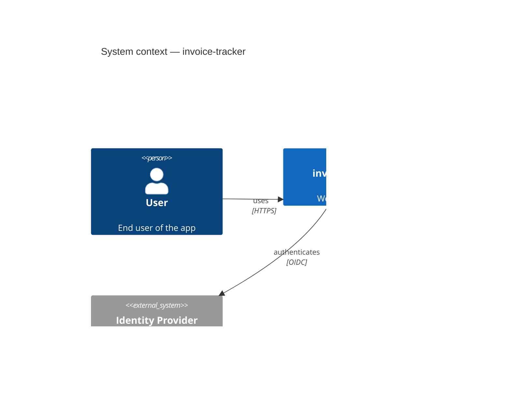
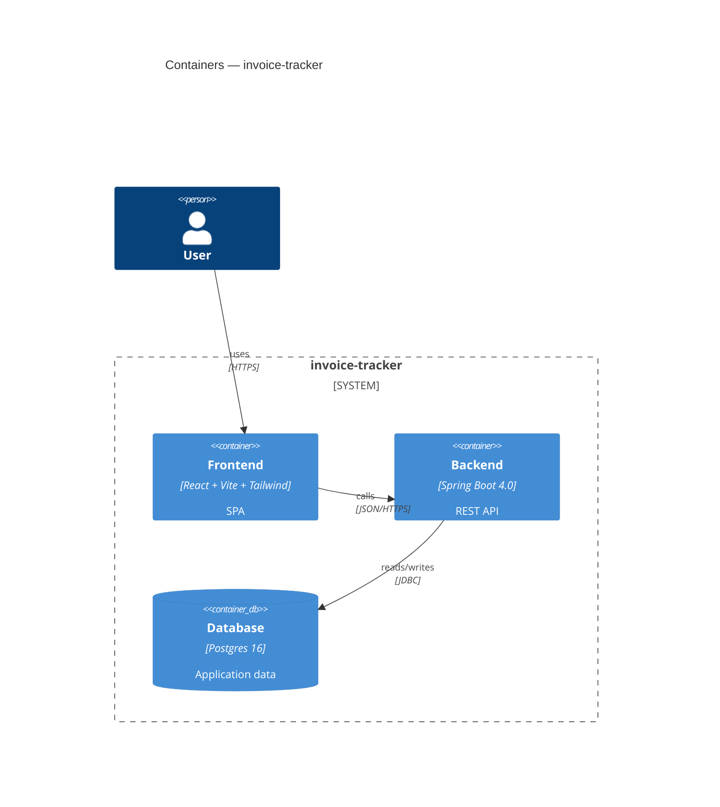
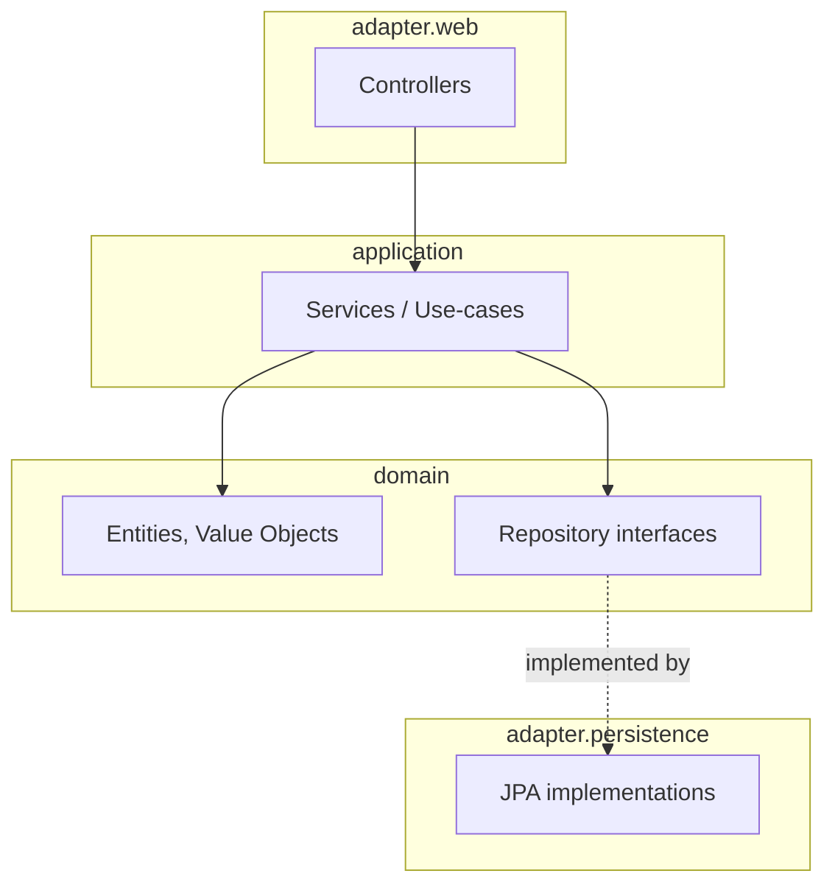
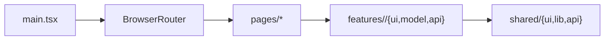

# Architecture

Maintained by the **documentation** subagent. Edit by hand only when refactoring beyond what a single feature does.

## System context (C4 — level 1)

## Containers (C4 — level 2)

## Components — Backend (C4 — level 3)

## Components — Frontend

## Decisions log

### ADR-000 — Scaffolded with agenticai

- **Date**: 2026-05-11
- **Decision**: Use Spring Boot 4.0.6 backend (Maven, Java 21) + Vite/React/Tailwind v4 frontend, per the framework default.
- **Why**: latest stable LTS combo; agentic toolchain optimised for these.
- **Trade-offs**: locks into JVM + Node toolchains; mitigations not needed at this stage.
