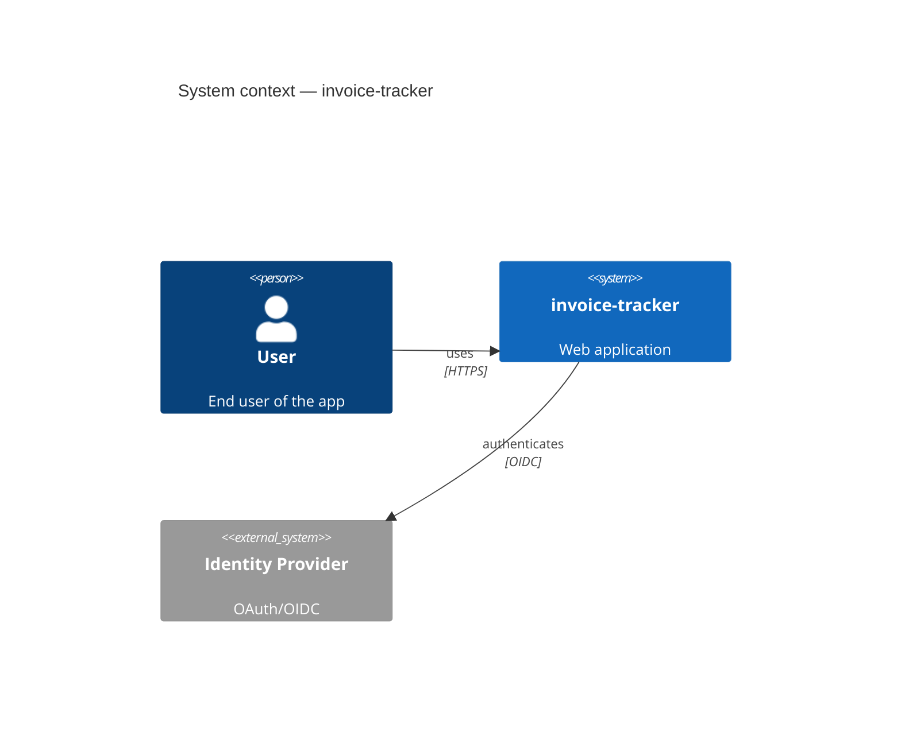
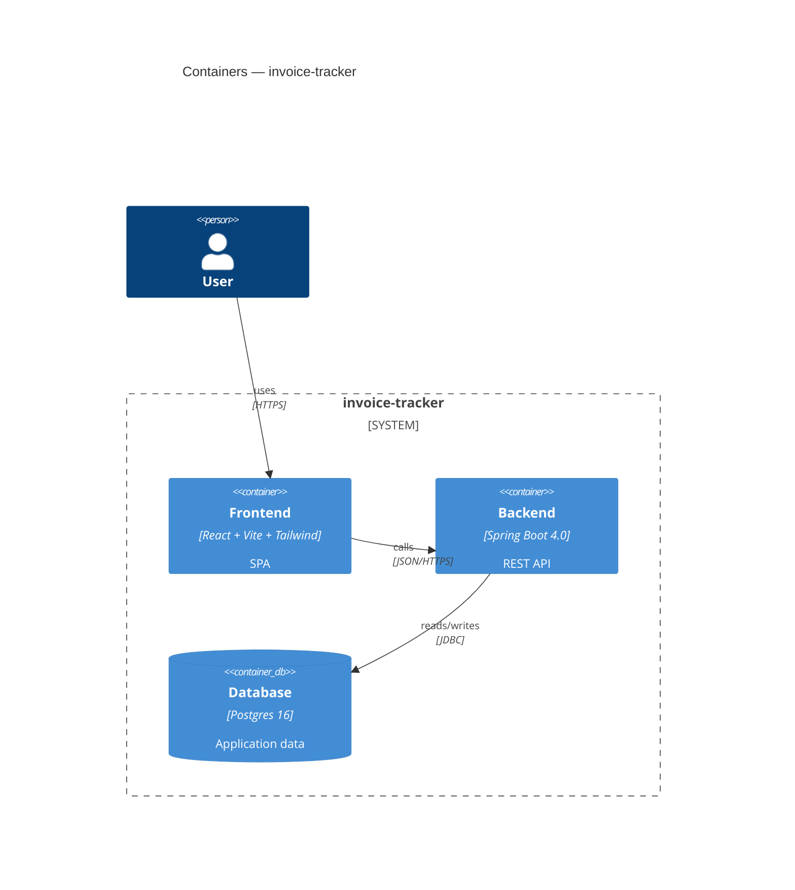
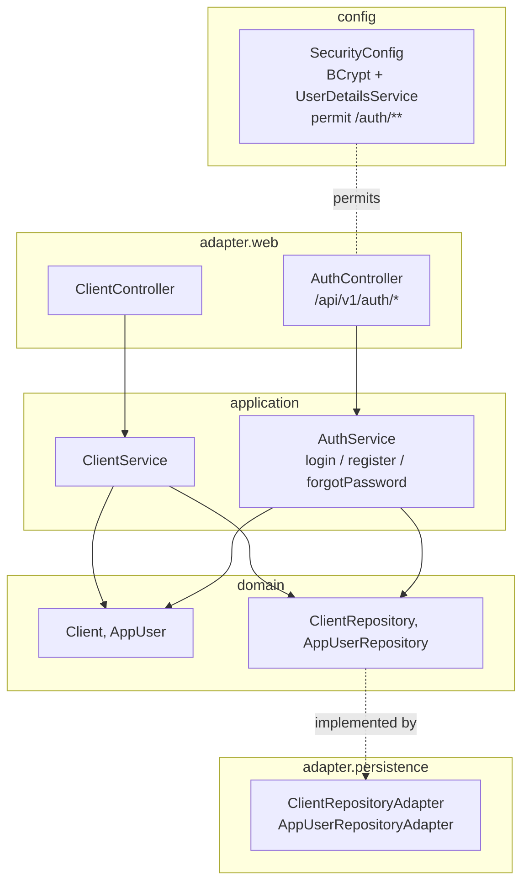
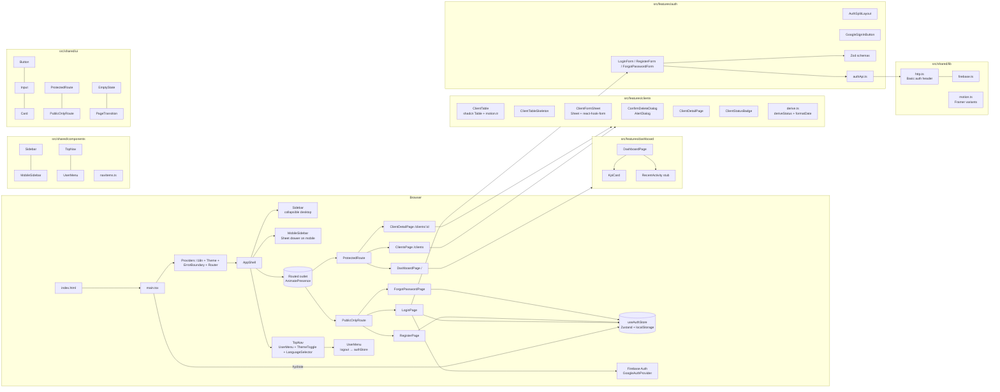

# Architecture

Maintained by the **documentation** subagent. Edit by hand only when refactoring beyond what a single feature does.

## System context (C4 — level 1)

## Containers (C4 — level 2)

## Components — Backend (C4 — level 3)

Updated by FEAT-20260512-02 (authentication modernization).

## Components — Frontend

Updated by FEAT-20260513-01 (Design system, dark-mode fixes, responsive layout, form alignment). Previous update: FEAT-20260512-03 (Dashboard and core UI modernization).

**Design system** — see [`docs/DESIGN_SYSTEM.md`](DESIGN_SYSTEM.md) for the full token reference, primitive component API, dark-mode guide, breakpoint contract, and ESLint enforcement rule.

## Decisions log

### ADR-000 — Scaffolded with agenticai

- **Date**: 2026-05-11
- **Decision**: Use Spring Boot 3.5.3 backend (Maven, Java 21) + Vite/React/Tailwind v4 frontend, per the framework default.
- **Why**: Spring Boot 3.5.3 is the current stable release. Boot 4.x removed `@WebMvcTest` / `@DataJpaTest` from `spring-boot-test-autoconfigure`, making slice-test strategies impossible without significant rework. 3.5.3 is used until Boot 4 stabilises the test infrastructure.
- **Trade-offs**: locks into JVM + Node toolchains; mitigations not needed at this stage.

### ADR-001 — FEAT-20260511-01: Soft-delete pattern for clients

- **Date**: 2026-05-11
- **Decision**: Clients are never hard-deleted. A `deleted_at TIMESTAMPTZ` column is set by the service; all repository queries carry an explicit `deleted_at IS NULL` predicate.
- **Why**: Invoices will reference clients by UUID. Hard-deleting a client would orphan existing invoices. Soft-delete preserves referential integrity and allows recovery. Using explicit predicates (not Hibernate `@SQLDelete`/`@Where`) keeps query intent visible in JPQL.
- **Trade-offs**: Deleted rows accumulate; periodic archival or purge job will be needed at scale. Unique-email constraint requires the partial index workaround (see ADR-002).

### ADR-002 — FEAT-20260511-01: Partial unique index on email for active clients

- **Date**: 2026-05-11
- **Decision**: Email uniqueness is enforced by a Postgres partial unique index `ux_clients_email_active ON clients (lower(email)) WHERE deleted_at IS NULL` rather than a plain `UNIQUE` constraint.
- **Why**: A plain unique constraint would block re-registration of an email belonging to a soft-deleted client, which is undesirable. The partial index only enforces uniqueness among active (non-deleted) rows.
- **Trade-offs**: Non-standard Postgres feature; not portable to all databases. H2 (used in `test` Spring profile) does not enforce partial unique indexes, so the uniqueness guard is validated by the application layer in the service and by Testcontainers integration tests only.

### ADR-003 — FEAT-20260511-01: Pagination size capped at 100

- **Date**: 2026-05-11
- **Decision**: `ClientService.list()` clamps the requested `size` to the range `[1, 100]` server-side before passing to the repository.
- **Why**: An unbounded `size` parameter is a denial-of-service vector; a client could request millions of rows in a single call. The cap is enforced in code (not just OpenAPI documentation) so it cannot be bypassed by crafted requests.
- **Trade-offs**: Bulk-export use cases require multiple paginated calls; acceptable at this scale.

### ADR-004 — FEAT-20260511-01: CSRF disabled for `/api/v1/**`

- **Date**: 2026-05-11
- **Decision**: `SecurityConfig` disables Spring Security CSRF protection for all `/api/v1/**` paths.
- **Why**: The SPA authenticates with HTTP Basic (stateless); there are no session cookies that an attacker could hijack via cross-site form submission. CSRF protection is meaningful only for cookie-based sessions.
- **Trade-offs**: If authentication is upgraded to OIDC/session cookies in a future feature, CSRF must be re-enabled or replaced with the `SameSite=Strict` cookie attribute. This is tracked as a migration item in the auth-upgrade feature.

### ADR-005 — FEAT-20260511-01: Spring Boot 3.5.3 pinned over 4.x

- **Date**: 2026-05-11
- **Decision**: `pom.xml` pins `spring-boot.version` to `3.5.3`. References to `4.0.6` in earlier scaffolding have been corrected.
- **Why**: Spring Boot 4.0 dropped `@WebMvcTest` and `@DataJpaTest` slice-test support. The project uses 13 `@WebMvcTest` and `@DataJpaTest` test classes; migrating to Boot 4 would require restructuring the entire test pyramid. Boot 3.5.3 is the current stable LTS release and fully supports Java 21.
- **Trade-offs**: Will require a planned migration to Boot 4 once slice-test support stabilises upstream.

### ADR-006 — FEAT-20260512-01: Shadcn/ui primitives vendored under src/shared/ui/

- **Date**: 2026-05-12
- **Decision**: shadcn/ui components are hand-vendored into `src/shared/ui/` rather than runtime-loaded. The CLI's `components.json` config targets the same directory for future `shadcn add` runs.
- **Why**: Vendoring keeps the component source editable, removes a runtime network dependency, and avoids a CDN privacy leak. Tailwind v4's CSS-first mode (no `tailwind.config.ts`) requires a small hand-migration for components generated by older shadcn CLI templates.
- **Trade-offs**: Updates to upstream shadcn components require manual re-vendoring. CI does not automatically detect drift. Vendored files are excluded from Vitest coverage to avoid inflating the metric with boilerplate Radix wrappers.

### ADR-007 — FEAT-20260512-01: Zustand for theme state; no React context

- **Date**: 2026-05-12
- **Decision**: Theme state (`light | dark | system`) is managed by a Zustand store (`useThemeStore`) with the `persist` middleware writing to `localStorage` key `it.theme`. A thin `ThemeProvider` component handles the `matchMedia` side-effect and `document.documentElement.classList` updates; no React context is used.
- **Why**: Zustand's module-level subscribe/getState API lets the theme apply before the first paint without a context provider wrapping the entire tree. The `persist` middleware handles serialisation and rehydration with one line of config.
- **Trade-offs**: Theme state is global singleton state; tests must reset `localStorage` and the Zustand store between runs (`vi.stubGlobal`, `useThemeStore.setState`).

### ADR-009 — FEAT-20260512-02: localStorage Basic token accepted for v1

- **Date**: 2026-05-12
- **Decision**: The email/password session is stored in `localStorage` as `auth.session` (JSON containing the base64 Basic token). HttpOnly cookies are deferred to a follow-up feature.
- **Why**: The backend is stateless HTTP Basic. Wiring a proper session cookie mechanism (Set-Cookie, CSRF re-enable, SameSite) is a larger change tracked as `FEAT-auth-cookies`. For v1 the token is XSS-readable but the attack surface is limited to authenticated users with no elevated privileges beyond their own data.
- **Trade-offs**: XSS vulnerability. Mitigated for v1 by React's JSX escaping (no dangerouslySetInnerHTML in auth components) and a content-security-policy follow-up. See risk R-1 in FEATURES.md.

### ADR-010 — FEAT-20260512-02: Google OAuth is client-side only in v1

- **Date**: 2026-05-12
- **Decision**: Firebase `signInWithPopup` issues a Google ID token that is stored client-side but is never verified by the backend. The backend has no OIDC verifier in v1. Google users cannot call protected backend endpoints.
- **Why**: Full OIDC token verification requires a Firebase Admin SDK or equivalent; this is a significant new dependency. For v1 Google login provides UI gating (protects the SPA shell) while the backend remains HTTP-Basic-only.
- **Trade-offs**: Google-only users will receive 401 on any backend call. Documented as risk R-2. Follow-up feature adds a Spring Security `JwtDecoder` pointed at Firebase's JWKS endpoint.

### ADR-011 — FEAT-20260512-02: Anti-enumeration on /forgot-password and /login

- **Date**: 2026-05-12
- **Decision**: `POST /api/v1/auth/forgot-password` always returns `204 No Content` regardless of whether the email exists. `POST /api/v1/auth/login` returns a uniform `401` for both unknown-email and wrong-password cases.
- **Why**: Distinguishing "email not found" from "wrong password" lets an attacker enumerate registered users. OWASP A04 (Insecure Design) explicitly flags this pattern.
- **Trade-offs**: Slightly less helpful error messages for legitimate users; acceptable trade-off for security.

### ADR-012 — FEAT-20260512-03: Client status derived client-side, never sent to the API

- **Date**: 2026-05-13
- **Decision**: `Client.status` does not exist on the backend DTO. A `deriveStatus(client)` helper in `src/features/clients/model/derive.ts` returns `'ACTIVE' | 'INACTIVE'` (defaulting to `'ACTIVE'` for all current records) for UI display. This derived value is never included in `POST` or `PUT` request bodies.
- **Why**: The backend `clients` table has no `status` column in v1. Deriving locally lets the UI ship the status filter and badge without a backend migration. Adding a real field later requires only a one-line change in `derive.ts`.
- **Trade-offs**: "Inactive" filter always returns 0 results until the backend exposes the field. UI state and API state can diverge if the backend adds a field and the frontend is not updated in sync.

### ADR-013 — FEAT-20260512-03: Layout components in src/shared/components/ not src/shared/layout/

- **Date**: 2026-05-13
- **Decision**: `AppShell`, `Sidebar`, `MobileSidebar`, `TopNav`, `UserMenu`, and `navItems.ts` are placed in `src/shared/components/` rather than `src/shared/layout/` as specified in the plan.
- **Why**: The project's existing convention (established by FEAT-20260512-01) groups all shared non-domain components under `src/shared/components/`. Deviating would create an inconsistency. The dev agent followed the project convention over the plan's path suggestion.
- **Trade-offs**: Minor divergence from the plan's file list; no functional impact.

### ADR-008 — FEAT-20260512-01: Dual toast system during transition (sonner + legacy)

- **Date**: 2026-05-12
- **Decision**: Both the legacy `ToastProvider`/`useToast` system and the new `sonner` `<Toaster />` are mounted simultaneously in `App.tsx` during this feature. Existing callers of `useToast` are not migrated. New components (design system primitives) use sonner. The legacy `Toast.tsx` is marked `// @deprecated`.
- **Why**: Migrating all `useToast` callers in the same PR would expand the change set and risk introducing regressions in existing client tests. Isolating the migration to FEAT-20260512-03 keeps the blast radius bounded.
- **Trade-offs**: Two toast systems run in parallel until FEAT-20260512-03 ships. Mounting both is cosmetically harmless (only one is visible at a time given the current call sites).
