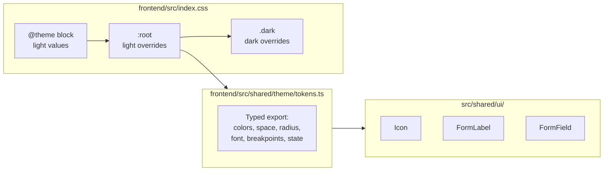

# Design System

Added by **FEAT-20260513-01** (Design system, dark-mode fixes, responsive layout, form alignment).

---

## 1. Token system

All colour values are declared in `frontend/src/index.css` using CSS custom properties. Components consume tokens via Tailwind's arbitrary-value syntax (`text-[var(--color-foreground)]`). Never use a raw Tailwind colour utility (e.g. `text-red-600`) — use the token equivalents documented below.

### Token map



### Colour tokens (light / dark)

| Token | Light value | Dark value | Tailwind usage |
|-------|-------------|------------|----------------|
| `--color-background` | `hsl(0 0% 100%)` | `hsl(222 47% 11%)` | `bg-[var(--color-background)]` |
| `--color-foreground` | `hsl(222 47% 11%)` | `hsl(210 40% 98%)` | `text-[var(--color-foreground)]` |
| `--color-card` | `hsl(0 0% 100%)` | `hsl(222 47% 14%)` | `bg-[var(--color-card)]` |
| `--color-card-foreground` | `hsl(222 47% 11%)` | `hsl(210 40% 98%)` | `text-[var(--color-card-foreground)]` |
| `--color-primary` | `hsl(222 47% 11%)` | `hsl(210 40% 98%)` | `bg-[var(--color-primary)]` |
| `--color-primary-foreground` | `hsl(210 40% 98%)` | `hsl(222 47% 11%)` | `text-[var(--color-primary-foreground)]` |
| `--color-secondary` | `hsl(210 40% 96%)` | `hsl(217 33% 17%)` | `bg-[var(--color-secondary)]` |
| `--color-secondary-foreground` | `hsl(222 47% 11%)` | `hsl(210 40% 98%)` | `text-[var(--color-secondary-foreground)]` |
| `--color-muted` | `hsl(210 40% 96%)` | `hsl(217 33% 17%)` | `bg-[var(--color-muted)]` |
| `--color-muted-foreground` | `hsl(215 16% 47%)` | `hsl(215 20% 65%)` | `text-[var(--color-muted-foreground)]` |
| `--color-accent` | `hsl(210 40% 96%)` | `hsl(217 33% 17%)` | `bg-[var(--color-accent)]` |
| `--color-accent-foreground` | `hsl(222 47% 11%)` | `hsl(210 40% 98%)` | `text-[var(--color-accent-foreground)]` |
| `--color-destructive` | `hsl(0 84% 60%)` | `hsl(0 62% 30%)` | `text-[var(--color-destructive)]` |
| `--color-destructive-foreground` | `hsl(210 40% 98%)` | `hsl(210 40% 98%)` | `text-[var(--color-destructive-foreground)]` |
| `--color-border` | `hsl(214 32% 91%)` | `hsl(217 33% 17%)` | `border-[var(--color-border)]` |
| `--color-input` | `hsl(214 32% 91%)` | `hsl(217 33% 17%)` | `border-[var(--color-input)]` |
| `--color-ring` | `hsl(222 47% 11%)` | `hsl(212 95% 68%)` | `ring-[var(--color-ring)]` |

### Shadow tokens

| Token | Value |
|-------|-------|
| `--shadow-sm` | `0 1px 2px 0 rgb(0 0 0 / 0.05)` |
| `--shadow-md` | `0 4px 6px -1px rgb(0 0 0 / 0.1), 0 2px 4px -2px rgb(0 0 0 / 0.1)` |
| `--shadow-lg` | `0 10px 15px -3px rgb(0 0 0 / 0.1), 0 4px 6px -4px rgb(0 0 0 / 0.1)` |

---

## 2. Typed token map (`tokens.ts`)

`frontend/src/shared/theme/tokens.ts` exports a typed map of all design tokens:

```ts
import { tokens } from '@/shared/theme/tokens';

// Access typed token values
tokens.colors.foreground;    // '--color-foreground'
tokens.breakpoints.lg;       // 1024
tokens.font.size.sm;         // '0.875rem'
tokens.state.error;          // '--color-destructive'
```

Use `tokens.ts` in non-JSX contexts (e.g. Playwright `getComputedStyle` assertions, chart libraries). In JSX always prefer Tailwind arbitrary-value syntax.

---

## 3. New primitives

### `Icon` (`src/shared/ui/Icon.tsx`)

Thin wrapper around Lucide icons that forces `currentColor` inheritance, sets `aria-hidden` by default, and provides a consistent size scale.

**Props**

| Prop | Type | Default | Description |
|------|------|---------|-------------|
| `as` | `ComponentType<LucideProps>` | required | Lucide icon component |
| `size` | `'xs' \| 'sm' \| 'md' \| 'lg'` | `'sm'` | Maps to Tailwind h/w classes |
| `ariaHidden` | `boolean` | `true` | Set `false` for meaningful standalone icons |
| `className` | `string` | — | Merged after size class |

**Size map**

| Size | Classes |
|------|---------|
| `xs` | `h-3 w-3` |
| `sm` | `h-4 w-4` (default) |
| `md` | `h-5 w-5` |
| `lg` | `h-6 w-6` |

**Usage**

```tsx
import { Icon } from '@/shared/ui/Icon';
import { Eye, Trash2 } from 'lucide-react';

// Decorative (aria-hidden by default)
<Icon as={Eye} size="sm" />

// Meaningful standalone icon
<Icon as={Trash2} size="md" ariaHidden={false} aria-label="Delete client" />
```

---

### `FormLabel` (`src/shared/ui/FormLabel.tsx`)

`<label>` primitive using `text-[var(--color-foreground)]`. Renders correctly in both light and dark modes without additional style overrides.

**Props**

| Prop | Type | Default | Description |
|------|------|---------|-------------|
| `required` | `boolean` | `false` | Shows a `*` asterisk in destructive colour |
| `htmlFor` | `string` | — | Standard label association |
| `className` | `string` | — | Merged after base classes |

**Usage**

```tsx
import { FormLabel } from '@/shared/ui/FormLabel';

<FormLabel htmlFor="client-name" required>
  Name
</FormLabel>
```

---

### `FormField` (`src/shared/ui/FormField.tsx`)

Vertical wrapper: `FormLabel` → control → error paragraph. Enforces consistent `space-y-1.5` spacing. Wires `aria-describedby` on the error paragraph so screen readers associate the message with the control.

**Props**

| Prop | Type | Default | Description |
|------|------|---------|-------------|
| `id` | `string` | required | Wired to `label[htmlFor]` and error `[id]` |
| `label` | `string` | required | Label text |
| `required` | `boolean` | `false` | Passed to `FormLabel` |
| `children` | `ReactNode` | required | The form control |
| `error` | `string` | — | Validation / server error |
| `className` | `string` | — | Applied to wrapper `<div>` |

**Usage**

```tsx
import { FormField } from '@/shared/ui/FormField';
import { Input } from '@/shared/ui/input';

<FormField id="client-name" label="Name" required error={fieldErrors.name}>
  <Input
    id="client-name"
    aria-describedby={fieldErrors.name ? 'client-name-error' : undefined}
    aria-invalid={!!fieldErrors.name}
  />
</FormField>
```

---

## 4. Dark mode

Dark mode is applied by toggling the `.dark` class on `<html>` via `useThemeStore` (Zustand). Three modes are supported: `light`, `dark`, and `system` (follows `prefers-color-scheme`).

**To toggle from a component:**

```tsx
import { useThemeStore } from '@/shared/theme/themeStore';

const { theme, setTheme } = useThemeStore();
setTheme('dark');
```

**CSS custom properties under `.dark`** are declared in `frontend/src/index.css`. The `@custom-variant dark` directive (`&:where(.dark, .dark *)`) ensures all Tailwind `dark:` variants respond to the class rather than `prefers-color-scheme`.

**Contrast requirements**: all text colours must meet WCAG AA (≥ 4.5:1 against their surface). The `--color-muted-foreground` dark value (`hsl(215 20% 65%)`) was widened to meet AA on the `--color-background` dark surface.

---

## 5. ESLint no-restricted-syntax rule

`frontend/eslint.config.mjs` enforces token usage via `no-restricted-syntax`:

| Banned pattern | Replacement |
|----------------|-------------|
| `text-red-*` in `className` | `text-[var(--color-destructive)]` |
| `bg-red-*` in `className` | `bg-[var(--color-destructive)]/10` |
| `text-black` in `className` | `text-[var(--color-foreground)]` |
| `text-gray-*` in `className` | `text-[var(--color-muted-foreground)]` |
| `text-white` in `className` | token-driven colour |
| `text-foreground` literal in `className` | `text-[var(--color-foreground)]` |
| `text-muted-foreground` literal in `className` | `text-[var(--color-muted-foreground)]` |

**Rationale**: Hard-coded Tailwind colour utilities produce the wrong colour in dark mode because they reference the Tailwind palette (absolute values) rather than the CSS custom property that switches between light and dark values. The ESLint rule prevents future regressions at code-review time, before they reach staging.

---

## 6. Breakpoints

| Name | Width | Usage |
|------|-------|-------|
| `sm` | 640 px | Stack → row transitions (filter bar, auth layout) |
| `md` | 768 px | Sidebar transitions, form max-width |
| `lg` | 1024 px | Full sidebar visible, desktop layout |
| `xl` | 1280 px | Max content width (`max-w-7xl`) |

Touch targets must be ≥ 44 × 44 px on all interactive controls (WCAG 2.5.5 / Apple HIG).

---

## 7. Component states

| State | Tailwind pattern |
|-------|-----------------|
| Default | base token classes |
| Hover | `hover:bg-[var(--color-accent)]` |
| Focus-visible | `focus-visible:ring-2 focus-visible:ring-[var(--color-ring)]` |
| Disabled | `disabled:opacity-50 disabled:pointer-events-none` |
| Error | `text-[var(--color-destructive)]`, `border-[var(--color-destructive)]` |
