# Sequence diagrams

Append-only. The documentation subagent adds a new `###` section per feature with the diagram copied from its PLAN.md.

## Conventions

- One section per **feature id**: `### FEAT-YYYYMMDD-NN — <title>`.
- Show actors with `actor`, components with `participant`.
- Include error paths when non-trivial.

---

### FEAT-20260511-01 — Client management (CRUD)

#### Happy path — create client

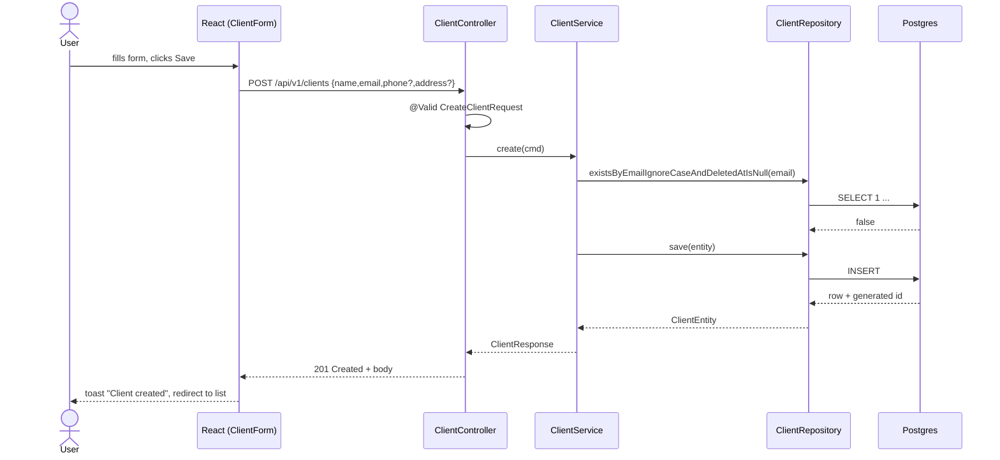

#### Error path — duplicate email (409)

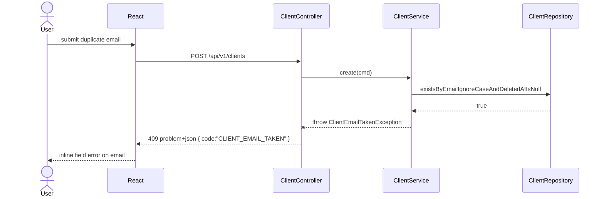

---

### FEAT-20260512-01 — Frontend design system foundation

#### Happy path — theme toggle and i18n hydration on app boot

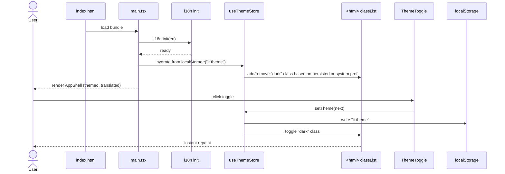

#### Edge case — OS colour-scheme changes while in system mode

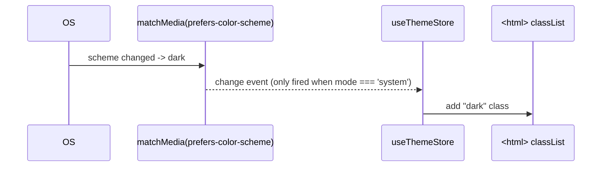

---

### FEAT-20260512-02 — Authentication modernization

#### 4a — Email/password login (happy path)

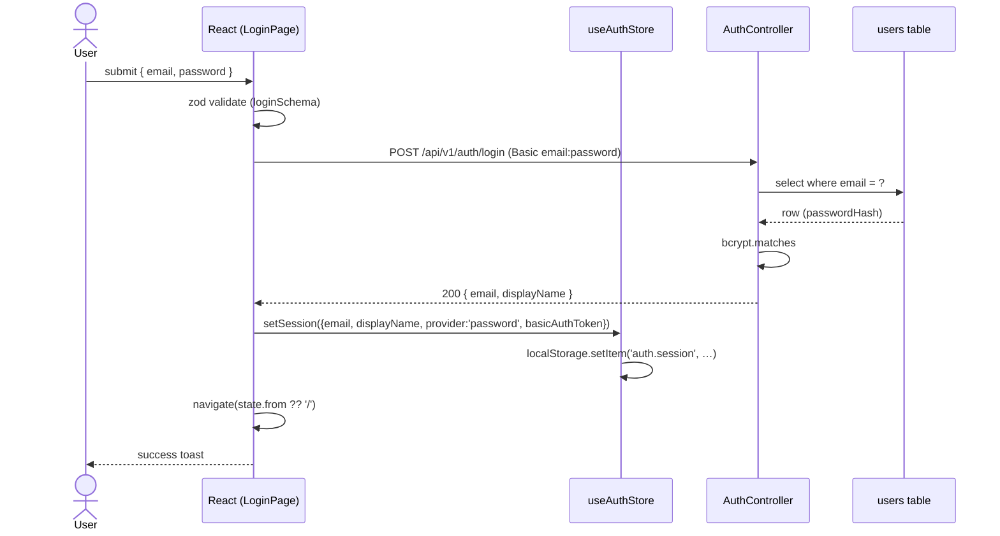

#### 4b — Google OAuth (edge case: popup blocked)


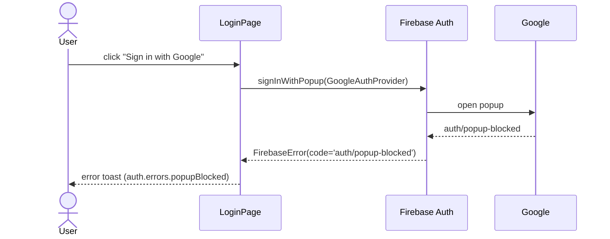

---

### FEAT-20260512-03 — Dashboard and core UI modernization

#### 4a — Edit a client (happy path)

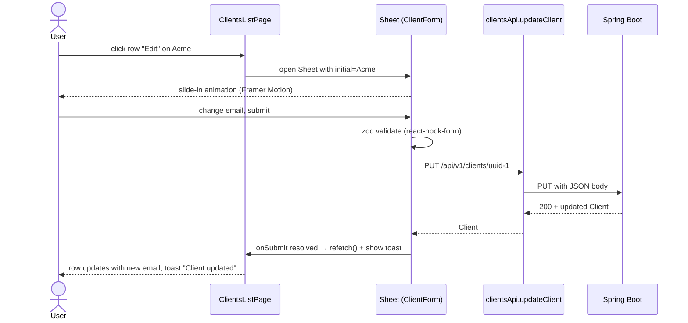

#### 4b — Delete confirmation cancel (edge case)

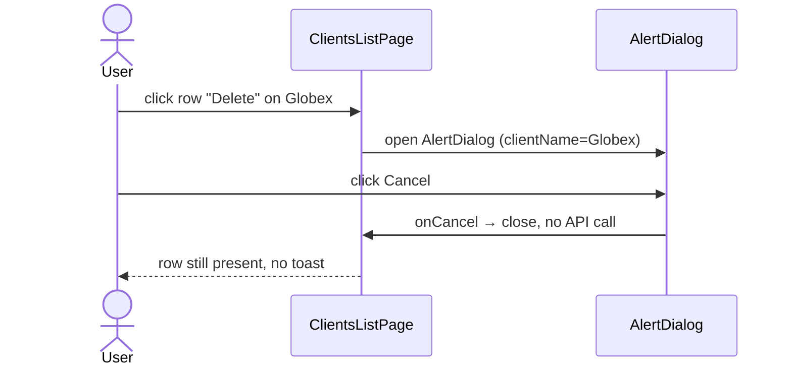
<<<<<<< HEAD

---

### FEAT-20260513-02 — Invoice PDF generation and email delivery to clients

#### 4a Happy path: render PDF + send email

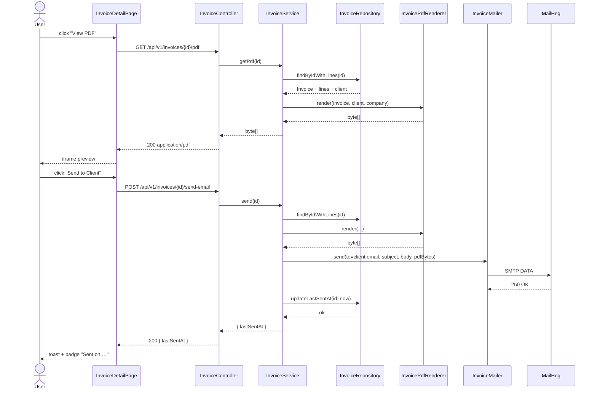

#### 4b Edge case: SMTP failure does not persist `last_sent_at`

```mermaid
sequenceDiagram
    actor U as User
    participant FE as InvoiceDetailPage
    participant BE as InvoiceController
    participant SVC as InvoiceService
    participant MAIL as InvoiceMailer
    participant SMTP as MailHog (down)
    U->>FE: click "Send to Client"
    FE->>BE: POST /send-email
    BE->>SVC: send(id)
    SVC->>MAIL: send(...)
    MAIL->>SMTP: SMTP connect
    SMTP-->>MAIL: connection refused
    MAIL-->>SVC: throws MailSendException
    Note over SVC: NO writes to invoices table<br/>last_sent_at unchanged
    SVC-->>BE: throws EmailDeliveryFailedException
    BE-->>FE: 502 problem+json { code: EMAIL_DELIVERY_FAILED }
    FE-->>U: error toast; lastSentAt badge unchanged
```

---

### FEAT-20260513-03 — Invoice Sharing (DOCX template rendering, PDF conversion, email delivery)

#### Happy path: render PDF and email it

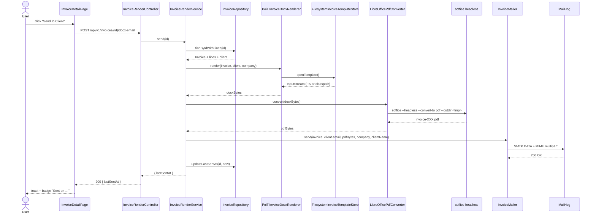

#### Edge case: LibreOffice conversion fails — no last_sent_at write

```mermaid
sequenceDiagram
    actor U as User
    participant FE as InvoiceDetailPage
    participant BE as InvoiceRenderController
    participant SVC as InvoiceRenderService
    participant PDF as LibreOfficePdfConverter
    participant LO as soffice (crashes or 20 s timeout)
    U->>FE: click "Send to Client"
    FE->>BE: POST /api/v1/invoices/{id}/docx-email
    BE->>SVC: send(id)
    SVC->>PDF: convert(docxBytes)
    PDF->>LO: soffice --headless --convert-to pdf
    LO-->>PDF: exit 1 / SIGKILL after timeout
    PDF-->>SVC: throws PdfConversionFailedException
    Note over SVC: NO call to mailer<br/>NO write to last_sent_at
    SVC-->>BE: throws PdfConversionFailedException
    BE-->>FE: 502 problem+json { code: PDF_CONVERSION_FAILED }
    FE-->>U: error toast; lastSentAt unchanged
```

---

### FEAT-20260513-01 — Design System & UI Standards

#### Dark mode — Register form (happy path)

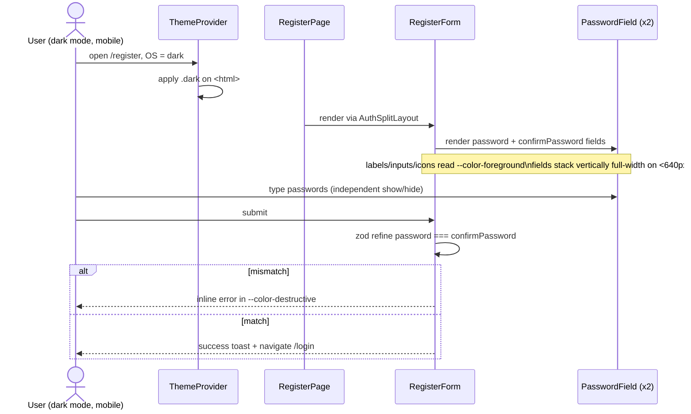

#### Search clear (happy path + edge cases)

```mermaid
sequenceDiagram
    actor U as User
    participant CP as ClientsPage
    participant API as useClients hook
    U->>CP: type "acme" in search
    CP->>API: refetch with query=acme
    U->>CP: press Escape (or click Clear)
    CP->>CP: setSearch(""); setPage(0)
    CP->>API: refetch without query param
    API-->>CP: full unfiltered page
    CP-->>U: input is empty, table re-renders
```

---

### FEAT-20260514-01 — Dashboard upgrade (stats, charts, palette, invoice status)

#### 4.1 Happy path — load dashboard

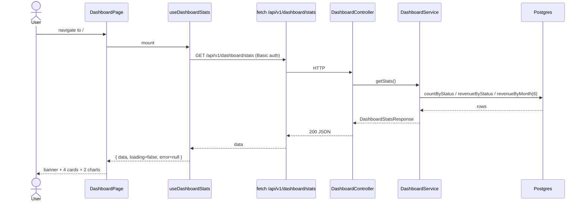

#### 4.2 Edge case — mark as paid

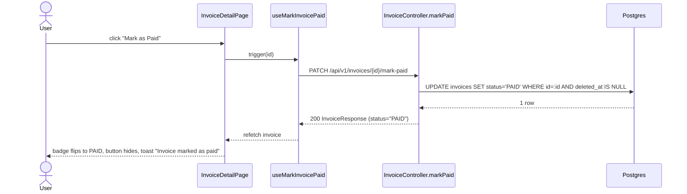

---

### FEAT-20260514-02 — Invoice template editor and full lifecycle

#### 4a. Happy path — preview, generate, download

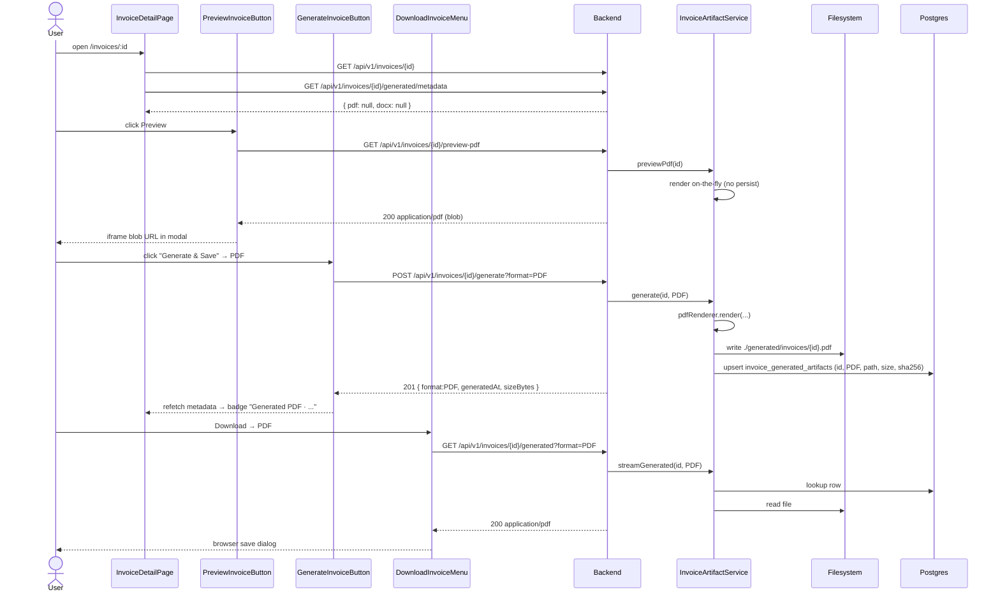

#### 4b. Send email with saved PDF

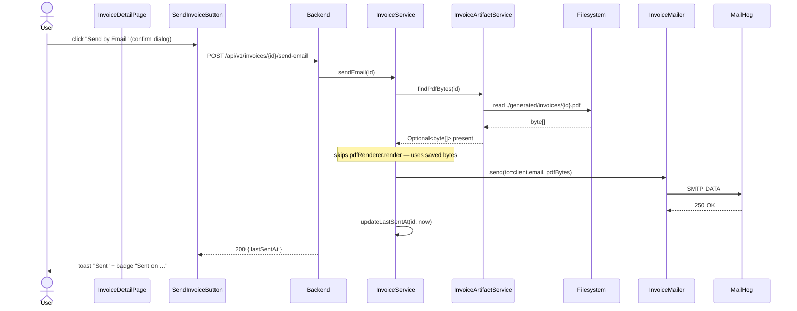

#### 4c. Edge case — regenerate after template change

```mermaid
sequenceDiagram
    actor U as User
    participant Tpl as InvoiceTemplateManagerPage
    participant FE as InvoiceDetailPage
    participant API as Backend
    participant SVC as InvoiceArtifactService
    U->>Tpl: upload new template.docx
    Tpl->>API: POST /api/v1/settings/invoice-template
    API-->>Tpl: 200 (template replaced)
    Note over Tpl,API: existing artefacts are NOT auto-invalidated
    U->>FE: open /invoices/:id
    FE-->>U: badge still shows old "Generated PDF · 12 May"
    U->>FE: click "Regenerate" in DownloadMenu
    FE->>API: POST /api/v1/invoices/{id}/generate?format=PDF&overwrite=true
    API->>SVC: generate(id, PDF, overwrite=true)
    SVC->>SVC: render with new template
    SVC->>API: persist; bump generated_at
    API-->>FE: 200 { format:PDF, generatedAt: now, sha256 changed }
    FE-->>U: badge updated, toast "Regenerated"
```

---

### FEAT-20260516-01 — Expense tracking with category dashboard

#### 4a. Create expense — dashboard refresh (happy path)

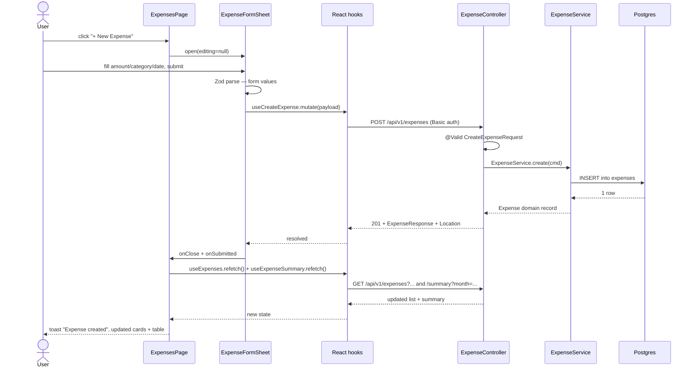

#### 4b. Edge case — change month (no expenses present)

```mermaid
sequenceDiagram
    actor U as User
    participant FE as ExpensesPage
    participant Dash as ExpenseDashboard
    participant API as useExpenseSummary
    participant BE as ExpenseController
    U->>Dash: select month=2025-12
    Dash->>FE: onMonthChange("2025-12")
    FE->>API: refetch with month=2025-12
    API->>BE: GET /api/v1/expenses/summary?month=2025-12
    BE-->>API: {grandTotal:"0.00", totalCount:0, byCategory:[]}
    API-->>FE: empty summary
    FE-->>U: render EmptyState "No expenses for December 2025" inside dashboard area; expense table also filtered to that month shows empty row
```

#### 4c. Auth rate-limit — brute-force protection

```mermaid
sequenceDiagram
    actor A as Attacker
    participant Filter as AuthRateLimitFilter
    participant BE as AuthController
    participant Bucket as Bucket4j (in-memory)
    loop First 5 requests in 1-minute window
        A->>Filter: POST /api/v1/auth/login
        Filter->>Bucket: tryConsume(1) for IP
        Bucket-->>Filter: true (tokens remain)
        Filter->>BE: pass through
        BE-->>A: 401 Unauthorized
    end
    A->>Filter: POST /api/v1/auth/login (6th attempt)
    Filter->>Bucket: tryConsume(1) for IP
    Bucket-->>Filter: false (bucket empty)
    Filter-->>A: 429 Too Many Requests {code:"RATE_LIMIT_EXCEEDED"}
    Note over Filter: BE is never reached
```

---

### FEAT-20260518-01 — True E2E smoke + regression suite

#### E2E per-test reset flow

This diagram shows what happens before each Playwright spec. The `resetBackend()` call is wired into `beforeEach` in `tests/e2e/fixtures/test.ts`; `purgeMailhog()` runs from the same hook. The schema-level clean/migrate happens once per container start (not shown here — see `FlywayCleanMigrateInitializer`).

```mermaid
sequenceDiagram
    actor PW as Playwright<br/>(beforeEach fixture)
    participant Fix as fixtures/test.ts
    participant API as E2eResetController<br/>POST /api/v1/test-support/reset
    participant SVC as reset() method
    participant DB as Postgres (e2e DB)
    participant MH as MailHog REST API<br/>DELETE /api/v1/messages

    PW->>Fix: beforeEach hook fires
    Fix->>API: POST /api/v1/test-support/reset<br/>Authorization: Basic <e2e credentials>
    API->>API: @Profile("e2e") guard — bean present
    API->>API: SecurityConfig.anyRequest().authenticated()<br/>→ 401 if no valid Basic header
    API->>SVC: reset()
    SVC->>DB: TRUNCATE invoice_generated_artifacts CASCADE
    SVC->>DB: TRUNCATE invoice_lines CASCADE
    SVC->>DB: TRUNCATE invoices CASCADE
    SVC->>DB: TRUNCATE expenses CASCADE
    SVC->>DB: TRUNCATE clients CASCADE
    SVC->>DB: TRUNCATE app_users CASCADE
    SVC->>DB: DELETE FROM company_profile WHERE id = 1<br/>INSERT blank seed row
    DB-->>SVC: OK
    SVC-->>API: void
    API-->>Fix: HTTP 204 No Content
    Fix->>MH: DELETE http://localhost:8026/api/v1/messages
    MH-->>Fix: HTTP 200 (inbox cleared)
    Fix-->>PW: beforeEach complete — clean state for spec
```

#### E2E reset — error paths

```mermaid
sequenceDiagram
    actor PW as Playwright
    participant API as E2eResetController

    note over PW,API: Scenario A — reset endpoint called in non-e2e profile (production guard)
    PW->>API: POST /api/v1/test-support/reset
    API-->>PW: HTTP 404 Not Found<br/>(bean absent — @Profile("e2e") excluded)

    note over PW,API: Scenario B — missing credentials
    PW->>API: POST /api/v1/test-support/reset<br/>(no Authorization header)
    API-->>PW: HTTP 401 Unauthorized<br/>(SecurityConfig HttpStatusEntryPoint)
```

#### Smoke vs. regression CI flow

```mermaid
sequenceDiagram
    participant GH as GitHub Actions
    participant BS as e2e-smoke job<br/>(every PR + push)
    participant BR as e2e-regression job<br/>(nightly + push to main)
    participant DC as docker-compose.e2e.yml
    participant PW as Playwright

    GH->>BS: PR opened / push event
    BS->>DC: docker compose up -d --build --wait
    DC-->>BS: all 4 services healthy<br/>(postgres, mailhog, backend, frontend)
    BS->>PW: pnpm e2e:smoke (Chrome only)
    PW-->>BS: smoke results
    alt smoke PASS
        BS-->>GH: check green — merge allowed
    else smoke FAIL
        BS->>GH: upload Playwright HTML report + backend logs
        BS-->>GH: check red — merge blocked
    end
    BS->>DC: docker compose down -v

    GH->>BR: schedule 0 2 * * * / push to main
    BR->>DC: docker compose up -d --build --wait
    BR->>PW: pnpm e2e:regression (Chrome + Firefox)
    PW-->>BR: regression results
    alt regression FAIL
        BR->>GH: upload full Playwright trace
    end
    BR->>DC: docker compose down -v
```
