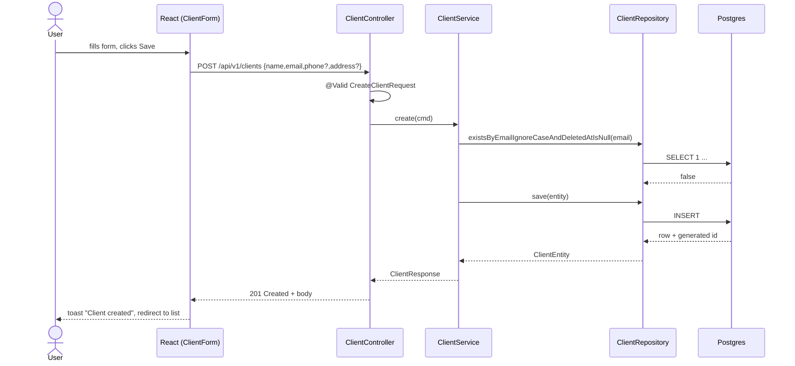
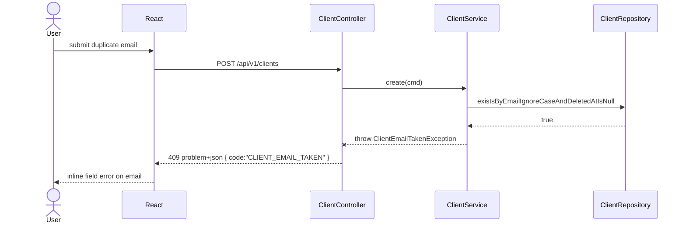
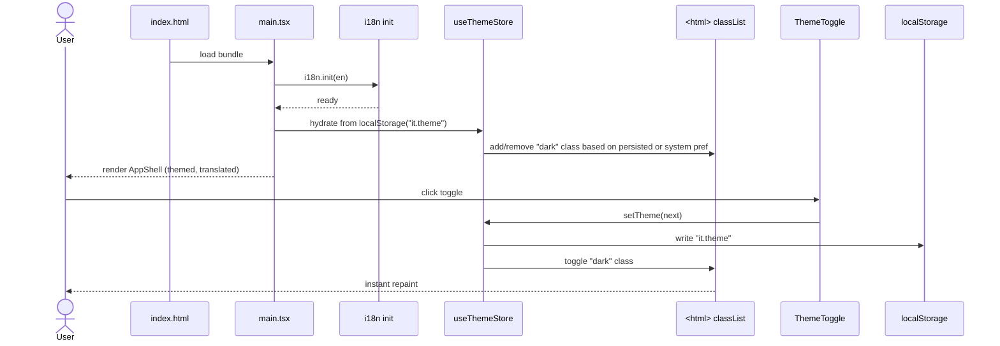
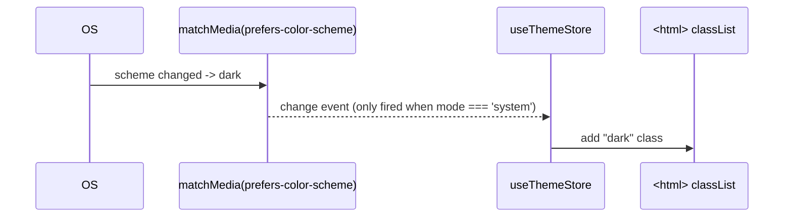

# Sequence diagrams

Append-only. The documentation subagent adds a new `###` section per feature with the diagram copied from its PLAN.md.

## Conventions

- One section per **feature id**: `### FEAT-YYYYMMDD-NN — <title>`.
- Show actors with `actor`, components with `participant`.
- Include error paths when non-trivial.

---

### FEAT-20260511-01 — Client management (CRUD)

#### Happy path — create client

#### Error path — duplicate email (409)

---

### FEAT-20260512-01 — Frontend design system foundation

#### Happy path — theme toggle and i18n hydration on app boot

#### Edge case — OS colour-scheme changes while in system mode

