# Sequence diagrams

Append-only. The documentation subagent adds a new `###` section per feature with the diagram copied from its PLAN.md.

## Conventions

- One section per **feature id**: `### FEAT-YYYYMMDD-NN — <title>`.
- Show actors with `actor`, components with `participant`.
- Include error paths when non-trivial.

---

### FEAT-20260511-01 — Client management (CRUD)

#### Happy path — create client

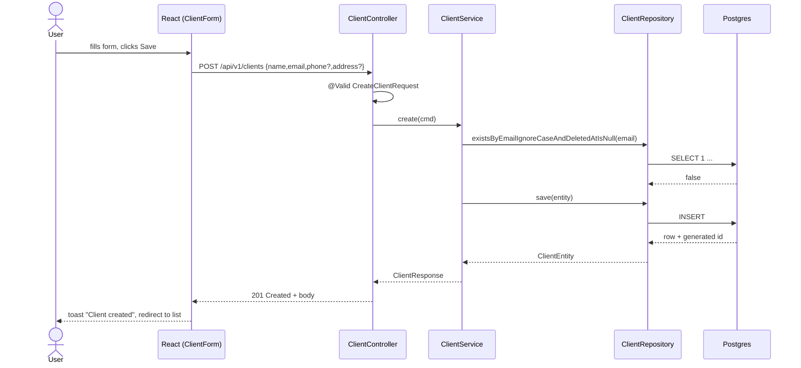

#### Error path — duplicate email (409)

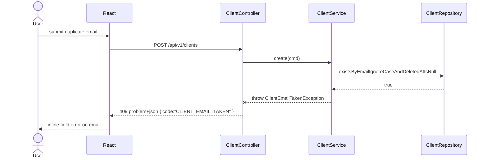

---

### FEAT-20260512-01 — Frontend design system foundation

#### Happy path — theme toggle and i18n hydration on app boot

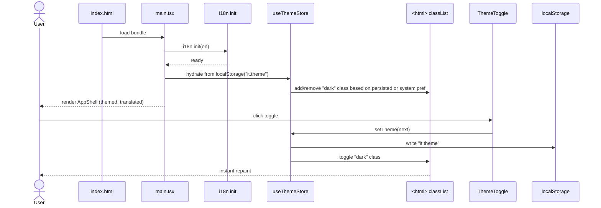

#### Edge case — OS colour-scheme changes while in system mode

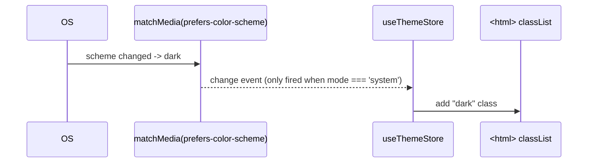

---

### FEAT-20260512-02 — Authentication modernization

#### 4a — Email/password login (happy path)

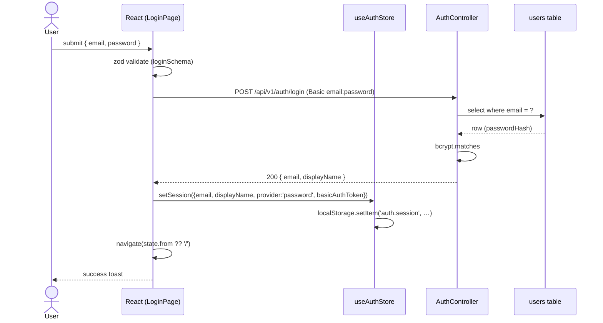

#### 4b — Google OAuth (edge case: popup blocked)


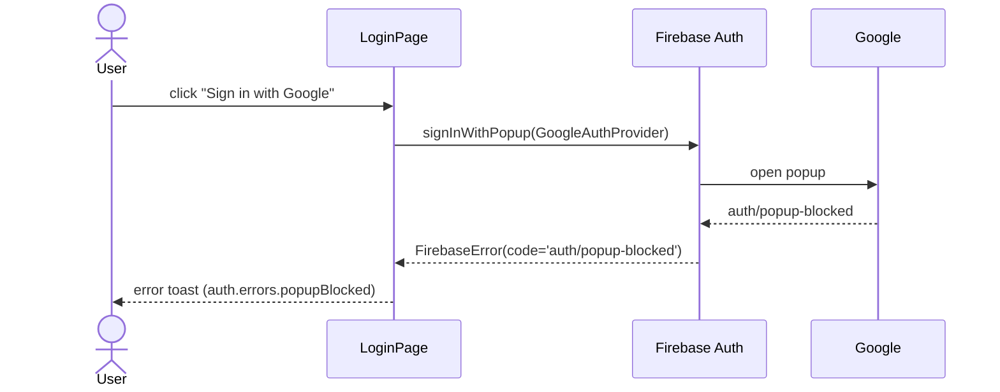

---

### FEAT-20260512-03 — Dashboard and core UI modernization

#### 4a — Edit a client (happy path)

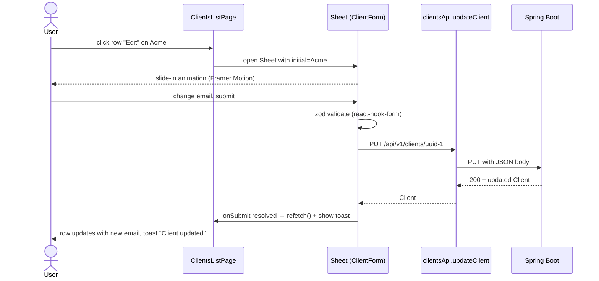

#### 4b — Delete confirmation cancel (edge case)

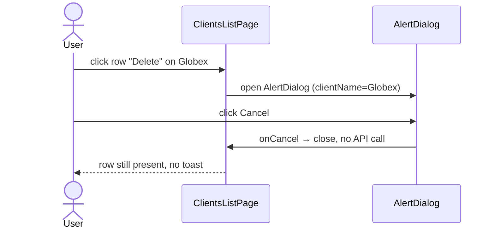

---

### FEAT-20260513-02 — Invoice PDF generation and email delivery to clients

#### 4a Happy path: render PDF + send email

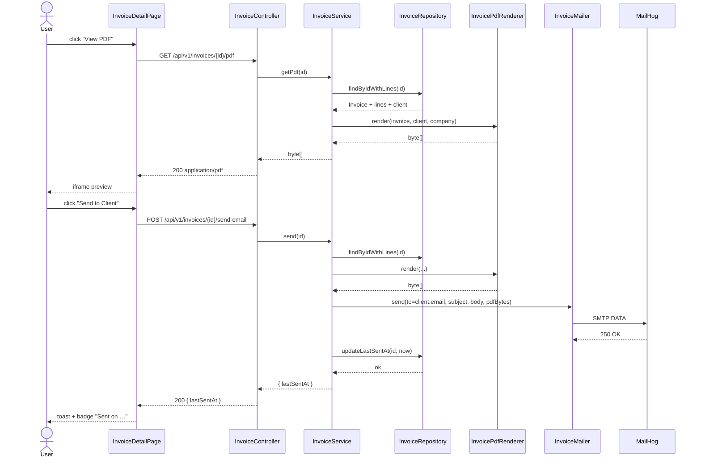

#### 4b Edge case: SMTP failure does not persist `last_sent_at`

```mermaid
sequenceDiagram
    actor U as User
    participant FE as InvoiceDetailPage
    participant BE as InvoiceController
    participant SVC as InvoiceService
    participant MAIL as InvoiceMailer
    participant SMTP as MailHog (down)
    U->>FE: click "Send to Client"
    FE->>BE: POST /send-email
    BE->>SVC: send(id)
    SVC->>MAIL: send(...)
    MAIL->>SMTP: SMTP connect
    SMTP-->>MAIL: connection refused
    MAIL-->>SVC: throws MailSendException
    Note over SVC: NO writes to invoices table<br/>last_sent_at unchanged
    SVC-->>BE: throws EmailDeliveryFailedException
    BE-->>FE: 502 problem+json { code: EMAIL_DELIVERY_FAILED }
    FE-->>U: error toast; lastSentAt badge unchanged
```

---

### FEAT-20260513-03 — Invoice Sharing (DOCX template rendering, PDF conversion, email delivery)

#### Happy path: render PDF and email it

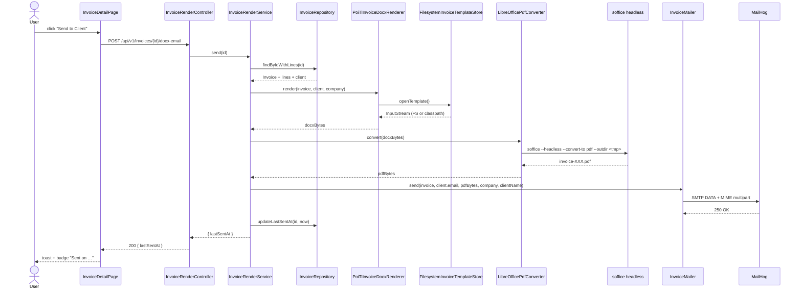

#### Edge case: LibreOffice conversion fails — no last_sent_at write

```mermaid
sequenceDiagram
    actor U as User
    participant FE as InvoiceDetailPage
    participant BE as InvoiceRenderController
    participant SVC as InvoiceRenderService
    participant PDF as LibreOfficePdfConverter
    participant LO as soffice (crashes or 20 s timeout)
    U->>FE: click "Send to Client"
    FE->>BE: POST /api/v1/invoices/{id}/docx-email
    BE->>SVC: send(id)
    SVC->>PDF: convert(docxBytes)
    PDF->>LO: soffice --headless --convert-to pdf
    LO-->>PDF: exit 1 / SIGKILL after timeout
    PDF-->>SVC: throws PdfConversionFailedException
    Note over SVC: NO call to mailer<br/>NO write to last_sent_at
    SVC-->>BE: throws PdfConversionFailedException
    BE-->>FE: 502 problem+json { code: PDF_CONVERSION_FAILED }
    FE-->>U: error toast; lastSentAt unchanged
```

---

### FEAT-20260513-01 — Design System & UI Standards

#### Dark mode — Register form (happy path)

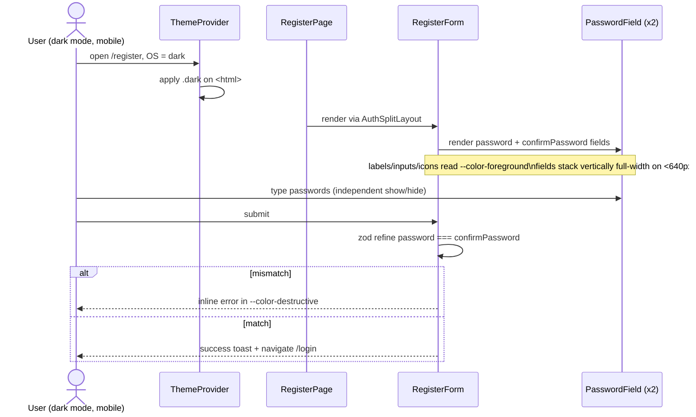

#### Search clear (happy path + edge cases)

```mermaid
sequenceDiagram
    actor U as User
    participant CP as ClientsPage
    participant API as useClients hook
    U->>CP: type "acme" in search
    CP->>API: refetch with query=acme
    U->>CP: press Escape (or click Clear)
    CP->>CP: setSearch(""); setPage(0)
    CP->>API: refetch without query param
    API-->>CP: full unfiltered page
    CP-->>U: input is empty, table re-renders
```
